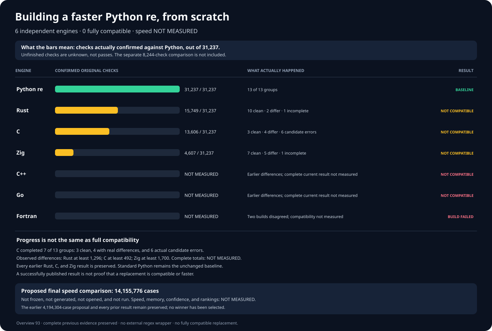

# rebar: a faster Python `re` experiment

Build a faster, fully compatible, from-scratch replacement for
[Python 3.14.6](https://www.python.org/downloads/release/python-3146/)'s
regular-expression module:

```python
import rebar as re
```

Each engine must be independently written. Wrapping Python, an external
regular-expression package, or another candidate does not count.

## Results

**Six** from-scratch engines. **Zero** fully compatible replacements.
Speed versus Python: **NOT MEASURED**. There is no winner.



Every engine is compared against the same **31,237** Python checks.
Passing some checks does not mean an engine can replace Python `re`.

| Engine | Compatibility with Python | Speed versus Python |
| --- | --- | --- |
| Python `re` | Baseline; reference checks pass | Not timed |
| Public `rebar` import | FAIL; still selects an unqualified Zig prototype | NOT MEASURED |
| Rust | FAIL; 12/13 groups completed; 15,749 passed; at least 1,296 differences | NOT MEASURED |
| C | FAIL; 7/13 groups completed; 13,606 passed; at least 492 differences | NOT MEASURED |
| Zig | FAIL; 12/13 groups completed; 4,607 passed; at least 1,700 differences | NOT MEASURED |
| C++ | FAIL; 2,308 differences and five worker failures | NOT MEASURED |
| Go | FAIL; 4,518 differences and four worker failures | NOT MEASURED |
| Fortran | FAIL; independent builds disagree; matching not tested | NOT MEASURED |

The frozen original Python suite contains **31,237** checks in **13**
groups. A separate **8,244**-case collection covers additional real-world
behavior; two independent Python reference runs each pass all **8,244**.
These are separate test sets and are never combined or counted twice.

C, Rust, and Zig were built independently from project-owned source.
Building an engine or passing some checks does not prove full Python
compatibility. Complete mismatch totals are **NOT MEASURED** while
test groups remain incomplete; runtime independence is
**NOT ESTABLISHED**.

## Detailed correctness

These historical charts show particular compatibility checks; none claims
a passing replacement or a speed measurement.


## Final speed comparison

The latest proposed final test covers **14,155,776** unseen cases across
**36** Python operations, **24** kinds of regular expressions, and both
text and byte-oriented inputs. All four participants would run every case
in **24** balanced rounds. The earlier **4,194,304**-case proposal is
preserved.

The larger test is **NOT FROZEN**, **NOT GENERATED**, and **NOT OPENED**.
Speed, memory, and statistical confidence are **NOT MEASURED**.

Do not start this test until three independent engines pass both test
sets, the original two-billion-character checks, public API checks,
and the no-delegation audit. A winner must be at least **1.5×** faster
overall, faster on at least **60%** of measured cases, and explain every
slowdown over **20%**.

## Evidence

- [Reproduce the current chart](docs/REPRODUCING.md) and inspect its [independently verified comparison renderer](tools/render_candidate_current_overview_v93.py).
- [Full experiment log, build evidence, failures, and rejected designs](docs/EXPERIMENT-LOG.md).
- [Complete Python correctness reference](oracle/phase1/P0-COMPLETENESS-V4.md).
- [Independent reference for the 8,244 additional checks](oracle/phase1/P0-DIFFERENTIAL-FUZZ-REFERENCE-V3.md).
- [Six independently written engine families](oracle/phase2/SIX-FAMILY-P0-PRODUCER-V5.md) and [no-wrapping audit](oracle/phase2/CANDIDATE-INDEPENDENCE-V2.md).
- [Genuine CPython interpreter and no-delegation checks](oracle/phase2/CANDIDATE-RUNTIME-INDEPENDENCE-V3.md). The corrected checks are independently verified; no candidate has yet run under them.
- [Next from-scratch Zig compatibility run](oracle/phase2/REPAIRED-ZIG-ORIGINAL-CAMPAIGN-V13.md). Its corrected cleanup and genuine-interpreter checks are frozen; the new candidate test has **NOT RUN**.
- [Next from-scratch Rust compatibility run](oracle/phase2/REPAIRED-RUST-ORIGINAL-CAMPAIGN-V21.md). Its dependency-free native engine and complete isolation checks are verified; the new candidate test has **NOT RUN**.
- [Next from-scratch C compatibility run](oracle/phase2/REPAIRED-C-ORIGINAL-CAMPAIGN-V10.md). Its native engine, genuine-interpreter checks, and original-code verification are frozen; the new candidate test has **NOT RUN**.
- Latest independently preserved results: [C](oracle/phase2/evidence/repaired-c-original-campaign-v9-c-phase2-v21-c-original-match-semantics-original-p0-v9-failures-publication-receipt.json), [Zig](oracle/phase2/evidence/repaired-zig-original-campaign-v12-phase2-v13-zig-guard-clean-v1-original-p0-v12-failures-publication-receipt.json), and [Rust](oracle/phase2/evidence/repaired-rust-original-campaign-v16-rust-phase2-v21-rust-captured-findall-root-provenance-original-p0-v20-failures-publication-receipt.json). The complete procedures, build records, fixes, and earlier failures are in the experiment log.
- [Larger, unopened 14,155,776-case speed-test proposal](oracle/phase3/EXPANDED-SEALED-HOLDOUT-V1.md) and [preserved earlier proposal](docs/EXPANDED-HOLDOUT-PROTOCOL-V1.md).
- [Original objective](GOAL.md), SHA-256
  `e5935060b44fe5f6b4e19ac2d01f3ce63182cf6a1d3b416502a4441cde345b62`;
  [later clarifications](AMENDMENTS.md).
