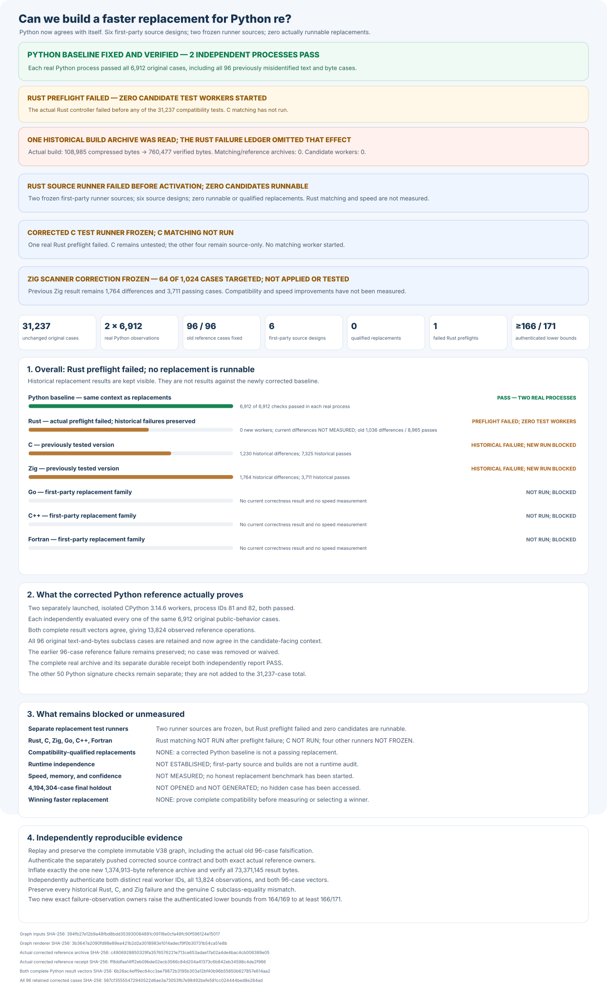

# rebar: a faster Python `re` experiment

Build a faster, fully compatible replacement for Python 3.14.6's
regular-expression module:

```python
import rebar as re
```

Every candidate must use its own matching engine built from scratch. Wrapping
Python, another regular-expression package, or another candidate does not count.

## Headline results

The original **31,237** Python compatibility checks exposed **96** cases
where the saved Python reference and replacement tests used different
execution contexts. Two independent Python processes have now agreed on
all **6,912** affected checks, including all **96** cases, in the correct
context. No case has been removed. There is no compatible replacement,
measured speedup, or winner.

Separate test-runner sources are frozen for **C and Rust**. The first
real Rust attempt failed before any matching worker started: it checked
the wrong historical helper. C has **NOT RUN** because its rebuilt
native library must first be safely activated. Neither engine has a
completed compatibility result. Zig, C++, Go, and Fortran remain
independent source designs, not runnable or passing replacements. The
separately frozen Zig scanner correction has **NOT BEEN APPLIED**.



The source and build checks reject outside matching packages and shared
candidate engines. A complete execution-time proof that no candidate
delegates matching to Python remains **NOT ESTABLISHED**. An earlier
Zig build reduced its differences from **2,172** to **1,764** across
all **13** original test groups, but did not qualify.

The corrected Rust engine builds identically in two independent offline
source trees, but its first test stopped before activating or matching.
The Rust results below therefore describe the previous tested build.

Overall speed relative to Python: **NOT MEASURED**. Fair speed and memory
measurements start only when three independent engines pass every check.

| Engine | Current build | Complete compatibility | Speed against Python |
| --- | --- | --- | --- |
| Python `re` | Corrected reference agrees in two independent processes | Original suite unchanged; corrected reference: 6,912 / 6,912 | Reference; not timed |
| Rust | First corrected attempt failed before any matching worker | Previous build: 8,965 verified; 1,036 differences | NOT MEASURED |
| C | Corrected C-only test runner frozen; new test has NOT RUN | Previous build: 7,325 verified; 1,230 differences; all 13 groups completed | NOT MEASURED |
| Zig | Independently written and built | 3,711 verified; 1,764 differences; all 13 groups completed | NOT MEASURED |
| C++ | Independently written and built | 128 verified; 2,308 differences; five worker failures | NOT MEASURED |
| Go | New build paused; failure recorder needs correction | 128 verified; 4,518 differences; four worker failures | NOT MEASURED |
| Fortran | Independently written | NOT TESTED | NOT MEASURED |

Verified passes and reported differences do not always add up to 31,237:
a failed test group does not prove that its remaining cases pass. All
failures and worker errors remain in the published evidence.

An additional **50** checks of Python's public function and method
signatures are frozen separately. Two independently isolated Python
reference processes passed all **50** and produced identical results.
Candidate results for these additional checks remain **NOT MEASURED**;
the checks are not added to the original **31,237**.

## Detailed compatibility

These charts show preserved, earlier development builds and particular
categories of Python behavior. They are not current passing results.
Complete results, test-group histories, and rejected approaches remain
in the [experiment log](docs/EXPERIMENT-LOG.md).


## Final comparison

The final comparison is planned to use **4,194,304** unseen examples,
four times the preceding one-million-example proposal, and **24**
balanced measurement rounds. Its cases remain **NOT FROZEN**,
**NOT GENERATED**, and **NOT OPENED**. Current speed and memory are
**NOT MEASURED**.

First, three independently built engines must pass all **31,237**
compatibility checks. To win, an engine must be at least **1.5×** faster
overall, measurably faster in at least **60%** of cases, and explain every
slowdown greater than **20%**. There is no winner.

## Evidence and reproduction

- [Reproduce the results and verify every graph](docs/REPRODUCING.md).
- [Experiment log, original reports, failures, and rejected designs](docs/EXPERIMENT-LOG.md).
- [Frozen Python compatibility checks](oracle/phase1/P0-COMPLETENESS-V1.md).
- [Frozen correction for the Python reference](oracle/phase1/P0-PUBLIC-TYPE-REFERENCE-CONTEXT-V1.md).
- [Corrected six-engine test producer](oracle/phase2/SIX-FAMILY-P0-PRODUCER-V4.md).
- [Corrected C-only original-suite runner](oracle/phase2/P0-CANDIDATE-PROTOCOL-V10.md).
- [Independently corrected Rust-only original-suite runner](oracle/phase2/REPAIRED-RUST-ORIGINAL-CAMPAIGN-V6.md).
- [Actual first Rust controller failure](oracle/phase2/evidence/repaired-rust-original-campaign-v6-rust-phase2-v13-rust-pattern-repr-original-p0-entry-failure.json).
- [Independently recorded Rust failure and build-record access](oracle/phase2/evidence/repaired-rust-original-campaign-v6-rust-phase2-v13-rust-pattern-repr-original-p0-entry-failure-observation.json).
- [Unapplied from-scratch Zig scanner correction](oracle/phase2/ZIG-SCANNER-PHRASE-SOURCE-REPAIR-V3.md).
- [Separately frozen public-signature checks](oracle/phase1/P0-CALLABLE-INTROSPECTION-V1.md).
- [Frozen two-process Python signature reference](oracle/phase1/CALLABLE-INTROSPECTION-REFERENCE-V2.md).
- [Independent, from-scratch engine and no-wrapping audit](oracle/phase2/CANDIDATE-INDEPENDENCE-V2.md).
- [Expanded, still-unopened final comparison](docs/EXPANDED-HOLDOUT-PROTOCOL-V1.md).
- [Original objective](GOAL.md), SHA-256
  `e5935060b44fe5f6b4e19ac2d01f3ce63182cf6a1d3b416502a4441cde345b62`;
  [later clarifications](AMENDMENTS.md).
