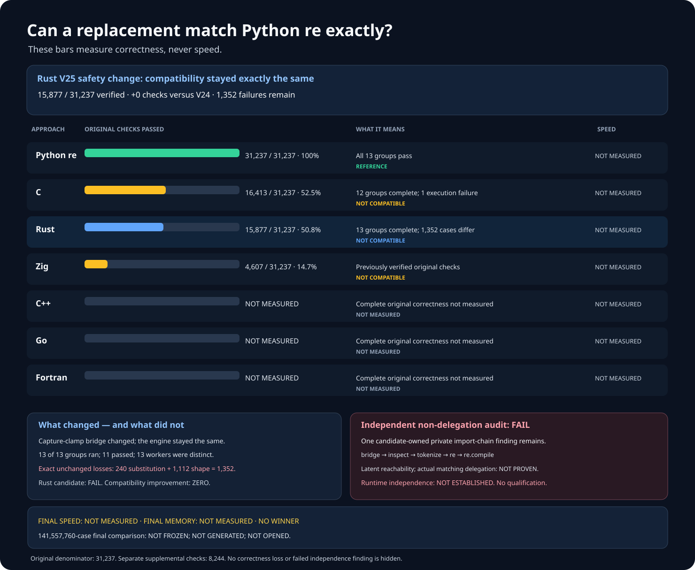
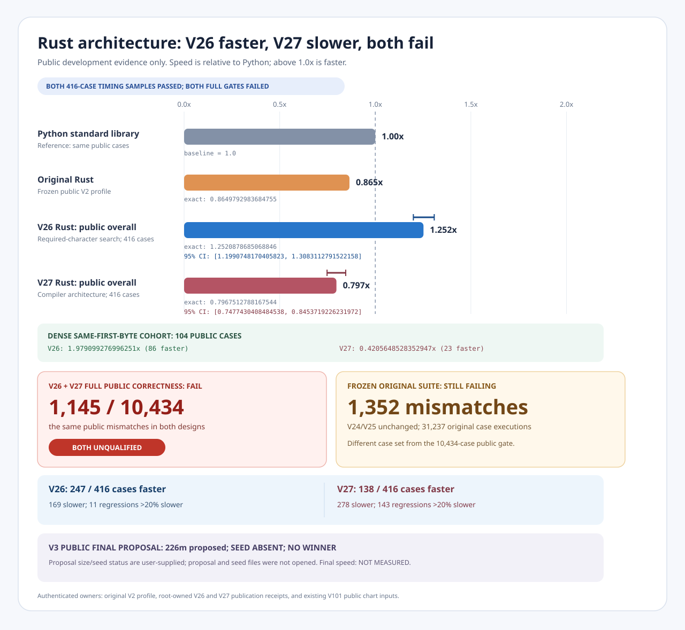

# rebar: a faster Python `re` experiment

Build a faster, fully compatible, from-scratch replacement for
[Python 3.14.6](https://www.python.org/downloads/release/python-3146/)'s
regular-expression module:

```python
import rebar as re
```

Wrapping Python, an existing regular-expression package, or another
project engine does not count. Each candidate must implement its own
regular-expression engine. Dependency files, native links, import
paths, and Python-facing wrappers are independently checked. The latest
audit distinguishes an engine's verified first-party language bindings
from forbidden external engines. Its complete inspection now isolates one
remaining Rust-only cleanup issue; a separate first-party source variant
removes it, and no external package supplies matching.

## Results at a glance

**Six independently written approaches. Zero compatible
replacements. Final speed: NOT MEASURED. No winner.**



Every percentage uses the same **31,237** original Python checks.
These results measure compatibility, **not speed**. Checks in an
unfinished group are never counted as passing.




In this separate **416-case public practice test**, Rust matched Python's
answer every time. Its typical-case speed was **0.865× Python**; across all
recorded time it was **0.60× Python**. Six kinds of work were faster, but
one repeated-character search was much slower. All **1,664** paired
observations and every slower result are preserved. This is exploratory
practice, not the hidden final test; statistical confidence and final speed
are **NOT MEASURED**.

An independently optimized Rust search engine subsequently reached
**1.25× Python** on the same **416** public timing cases (**95% interval:
1.20–1.31×**), including **1.98×** on difficult repeated-character searches.
It was faster on **247 of 416** cases. However, the wider **10,434-case**
test found **1,145** compatibility differences; the engine remains
**unqualified**, and this improvement is not a final result.

The separate low-allocation compiler architecture scored only **0.80×
Python** (**95% interval: 0.75–0.85×**) and was faster on **138 of 416**
cases. Its difficult-search workload reached only **0.42×** Python and it
shared the same **1,145** wider compatibility differences. This unsuccessful
design and all **143** substantial slowdowns remain fully visible.

Combining the fast search and low-allocation compiler with clean first-party
bindings achieved **1.23× Python** (**95% interval: 1.18–1.28×**), with
only **eight** substantial slowdowns. It still shares all **1,145** wider
compatibility differences and remains **unqualified**.

A second complete practice run confirms **0.60× Python** across all recorded
time. Its native allocation totals were **104.2 MB** for Rust and **100.5 MB**
for Python. Whole-process memory and Python-only memory are recorded
separately; per-function CPU time is **NOT MEASURED** because the profiler
could not start its sampling timer.


| Engine | Verified Python checks | Current result |
| --- | --- | --- |
| Python `re` | 31,237 / 31,237; 100% | Reference baseline. |
| C | 16,413 / 31,237; 52.5% | FAIL; all 606 observed differences are preserved; interpreter isolation did not finish. |
| Rust | 15,877 / 31,237; 50.8% | FAIL; exactly 1,352 differences; all 13 test groups completed without worker failures. |
| Zig | 4,607 / 31,237; 14.7% | FAIL; at least 1,700 differences; cleanup errors in all 13 workers; the corrected rerun stopped before matching. |
| C++ | NOT MEASURED | FAIL; 2,308 observed differences and five worker failures. |
| Go | NOT MEASURED | FAIL; 4,518 observed differences and four worker failures. |
| Fortran | NOT MEASURED | FAIL; independent builds disagree; matching was not tested. |

The current public `rebar` import still selects an unqualified Zig
prototype; **it is not a working replacement**. Complete difference
counts are **NOT MEASURED** for unfinished runs. No failed candidate
has established the required runtime no-delegation. The current C
run preserves all **606** observed failing examples. Its older run
saved only **92**; those **514** missing historical examples remain
**NOT RECORDED**.

The latest C run correctly passes all **151** executable original
Python tests while preserving all **152** test records and their
one genuine skipped case. Interpreter isolation still fails.

The corrected, from-scratch Rust engine has been built twice from
its own source with **zero external packages**. Its full run passed
**11 of 13** groups, including all memory-lifetime and interpreter
checks. The remaining **240** replacement and **1,112** changing-
buffer differences mean it is not yet compatible. Speed is
**NOT MEASURED**. A separately frozen changing-buffer safety correction
was built identically twice with no external packages and retested against
all **31,237** checks. It removes a potential unsafe buffer access but does
not reduce the **1,352** remaining compatibility differences.

A corrected interpreter-isolation guard now recognizes real Python
child interpreters while blocking borrowed regular-expression engines.
An isolated proof created and safely destroyed one real interpreter.

## What a replacement must pass

The frozen reference includes **31,237** original Python checks in
**13** groups. Another **8,244** independently verified cases cover
additional real-world behavior. They are a separate test set, not
extra points added to the original denominator. Candidates must also
pass large-input, public-interface, cleanup, interpreter-isolation,
and no-delegation checks.

A further **48,416** real-world cases cover memory-mapped inputs,
typed arrays, replacement callbacks, scanners, and buffer lifetimes.
Two independent Python processes each passed all **48,416** and
recorded exactly the same answers. This confirms the larger test,
not any replacement. The original **31,237**-case scores do not
change. Candidate results on the additional cases are **NOT MEASURED**.

## More detailed correctness graphs


These historical graphs show individual correctness checks. They do
not report speed or a qualified replacement.


## The larger speed test

The replacement final-test proposal covers **226,492,416** possible cases
across **128** Python operations, **64** kinds of regular expressions,
**12** input representations, and eight usage lifecycles. Its practical
comparison uses two balanced, separate **4,096-case** samples; a complete
stress sweep is available separately in bounded batches.

Its secret seed **does not exist yet**. It cannot be created until three
independently implemented candidates pass every compatibility and
no-delegation requirement. No final case has been generated, opened, or
run. The previous **141,557,760-case** proposal remains permanently
**INVALIDATED** after a delegated read-only search may have exposed its
configuration; all earlier proposals remain preserved as history.

No final test may run until at least three independently written engines
pass every required correctness and no-delegation test.

A separate public development suite covers **10,434** equally weighted
cases across **111** Python operations, with **5,217** text and
**5,217** byte-oriented cases. It is not the hidden final test;
expanded-suite Rust compatibility and speed are **NOT MEASURED**.

A winner must be at least **1.5×** faster overall, faster on at least
**60%** of measured cases, and explain every slowdown over **20%**.

## Evidence and reproduction

- [Reproduce and audit the headline graph](docs/REPRODUCING.md).
- [Detailed experiment log, rejected designs, and full evidence](docs/EXPERIMENT-LOG.md).
- [Frozen original Python correctness checks](oracle/phase1/P0-COMPLETENESS-V4.md) and [8,244 independent additional checks](oracle/phase1/P0-DIFFERENTIAL-FUZZ-REFERENCE-V3.md).
- [48,416 additional real-world buffer and memory-mapping questions](oracle/phase1/P0-PUBLIC-BUFFER-CARRIERS-SUPPLEMENT-V1.md).
- [Frozen two-process Python reference for those 48,416 cases](oracle/phase1/P0-PUBLIC-BUFFER-CARRIERS-REFERENCE-V1.md).
- [Actual two-process Python results for all 48,416 cases](oracle/phase1/evidence/public-buffer-carriers-reference-v1-cpython-3.14.6-publication-receipt.json).
- [Six independently authored engines](oracle/phase2/SIX-FAMILY-P0-PRODUCER-V5.md) and the [no-wrapping audit](oracle/phase2/CANDIDATE-INDEPENDENCE-V2.md).
- [Strict first-party dependency, wrapper, and no-delegation policy](oracle/phase2/RUNTIME-NON-DELEGATION-V2.md).
- [Preserved strict-audit failure on valid Rust lifetime syntax](oracle/phase2/evidence/runtime-non-delegation-v2-actual-source-lexer-failure.json).
- [Corrected strict from-scratch and no-wrapping source audit](oracle/phase2/RUNTIME-NON-DELEGATION-V3.md).
- [Actual seven-finding audit result, including first-party binding policy errors](oracle/phase2/evidence/runtime-non-delegation-v3-actual-source-audit-failure.json).
- [Corrected from-scratch audit permitting verified first-party Zig bindings](oracle/phase2/RUNTIME-NON-DELEGATION-V4.md).
- [Actual corrected audit: one remaining Rust-only introspection finding](oracle/phase2/evidence/runtime-non-delegation-v4-actual-source-audit-failure.json).
- [Frozen first-party correction removing Rust's unused external-introspection path](oracle/phase2/RUST-NO-EXTERNAL-INTROSPECTION-V1.md).
- [Actual first-party bridge source with no indirect Python-regex import](oracle/phase2/evidence/rust-no-external-introspection-v1-application.json).
- [Latest C run, 16,413 verified checks, and all 606 preserved failures](oracle/phase2/evidence/repaired-c-original-campaign-v12-c-phase2-v21-c-original-match-semantics-original-p0-v12-failures-publication-receipt.json).
- [Frozen C test and complete failure-preservation rules](oracle/phase2/REPAIRED-C-ORIGINAL-CAMPAIGN-V11.md).
- [Corrected C test preserving all real records and the genuine skipped case](oracle/phase2/REPAIRED-C-ORIGINAL-CAMPAIGN-V12.md).
- [Previous C run and its original 606 preserved failures](oracle/phase2/evidence/repaired-c-original-campaign-v11-c-phase2-v21-c-original-match-semantics-original-p0-v11-failures-publication-receipt.json).
- [Historical C run with 514 missing individual examples](oracle/phase2/evidence/repaired-c-original-campaign-v10-c-phase2-v21-c-original-match-semantics-original-p0-v10-failures-publication-receipt.json).
- [Latest full Rust run: 15,877 verified checks and all 1,352 preserved differences](oracle/phase2/evidence/repaired-rust-original-campaign-v16-rust-phase2-v24-rust-capture-shape-v2-root-provenance-original-p0-v24-failures-publication-receipt.json).
- [Previous Rust regression and its preserved failure](oracle/phase2/evidence/repaired-rust-original-campaign-v16-rust-phase2-v22-rust-capture-shape-root-provenance-original-p0-v22-failures-publication-receipt.json).
- [Latest real Zig run and complete observed failure](oracle/phase2/evidence/repaired-zig-original-campaign-v13-phase2-v13-zig-guard-clean-lifetime-v1-original-p0-v13-failures-publication-receipt.json).
- [Frozen first-party Zig cleanup correction](oracle/phase2/ZIG-DEALLOCATOR-SETATTR-SOURCE-REPAIR-V2.md) and [preserved Zig rerun that stopped before matching](oracle/phase2/evidence/zig-original-campaign-v14-setter-safe-prepublication-controller-failure.json).
- [Next Zig test, correcting the stopped rerun; not yet run](oracle/phase2/REPAIRED-ZIG-ORIGINAL-CAMPAIGN-V15.md).
- [Frozen Rust correctness procedure](oracle/phase2/REPAIRED-RUST-ORIGINAL-CAMPAIGN-V22.md) and [next targeted Rust buffer correction; not yet run](oracle/phase2/RUST-CAPTURE-SHAPE-SEMANTICS-V2.md).
- [Next Rust test, preserving the previous regression; not yet run](oracle/phase2/REPAIRED-RUST-ORIGINAL-CAMPAIGN-V23.md).
- [Reproducible first-party Rust build with no external packages](oracle/phase2/RUST-CAPTURE-SHAPE-SEMANTICS-V2-SOURCE-BUILD-V24.md).
- [Frozen from-scratch Rust changing-buffer capture safety correction](oracle/phase2/RUST-CAPTURE-CLAMP-SEMANTICS-V1.md).
- [Actual immutable Rust changing-buffer source-variant creation](oracle/phase2/evidence/rust-capture-clamp-semantics-v1-application.json).
- [Frozen offline first-party build for the corrected Rust engine](oracle/phase2/RUST-CAPTURE-CLAMP-SOURCE-BUILD-V25.md).
- [Actual successful corrected Rust build: 28 offline processes and identical native binaries](oracle/phase2/evidence/native-source-build-v25-rust-phase2-v25-rust-capture-clamp-v1-root-provenance-publication-receipt.json).
- [Frozen full 31,237-case retest of the safety-corrected Rust candidate](oracle/phase2/REPAIRED-RUST-ORIGINAL-CAMPAIGN-V25.md).
- [Actual complete corrected Rust retest: all 13 workers, all 1,352 remaining failures](oracle/phase2/evidence/repaired-rust-original-campaign-v16-rust-phase2-v25-rust-capture-clamp-v1-root-provenance-original-p0-v25-failures-publication-receipt.json).
- [Frozen first-party correction targeting 1,264 observed Rust replacement and changing-buffer compatibility failures](oracle/phase2/RUST-SUBSTITUTION-EVENT-ORDER-V1.md).
- [Preserved first replacement-order correction rejection before any source variant or candidate was created](oracle/phase2/evidence/rust-substitution-event-order-v1-preapplication-failure.json).
- [Corrected first-party replacement-order experiment preserving the original rejected source freeze](oracle/phase2/RUST-SUBSTITUTION-EVENT-ORDER-V2.md).
- [Actual Rust bridge correction preserving input lifetimes and targeting 1,264 known compatibility differences](oracle/phase2/evidence/rust-substitution-event-order-v2-application.json).
- [Frozen first-party Rust scanner serialization correction targeting 470 public compatibility failures](oracle/phase2/RUST-SCANNER-PICKLE-SEMANTICS-V1.md).
- [Preserved Rust scanner-correction rejection before any bridge variant was created](oracle/phase2/evidence/rust-scanner-pickle-semantics-v1-preapplication-failure.json).
- [Corrected first-party Rust scanner source freeze preserving all 470 targeted cases](oracle/phase2/RUST-SCANNER-PICKLE-SEMANTICS-V2.md).
- [Actual independently written Rust scanner bridge correcting serialization protocol behavior](oracle/phase2/evidence/rust-scanner-pickle-semantics-v2-application.json).
- [Frozen first-party Rust Unicode-prefix correction for the final two known public matching differences](oracle/phase2/RUST-SCOPED-UNICODE-STARTSET-V1.md).
- [Frozen first-party Python adapter correction for 324 ignored-comment regular-expression cases](oracle/phase2/RUST-VERBOSE-NAMED-ESCAPE-SEMANTICS-V1.md).
- [Actual independently written Python adapter with correct inline and verbose regular-expression comments](oracle/phase2/evidence/rust-verbose-named-escape-semantics-v1-application.json).
- [Frozen independent first-party correction for 88 remaining Rust template-expansion and buffer-probe differences](oracle/phase2/RUST-EXPAND-PROBE-SEMANTICS-V1.md).
- [Actual isolated Rust bridge source correcting template expansion and outer buffer checks](oracle/phase2/evidence/rust-expand-probe-semantics-v1-application.json).
- [Frozen combined first-party Rust correction covering all 1,352 known original compatibility failures](oracle/phase2/RUST-COMPLETE-SEMANTIC-CORRECTION-V1.md).
- [Preserved complete-correction rejection before any candidate source or matching run](oracle/phase2/evidence/rust-complete-semantic-correction-v1-preapplication-failure.json).
- [Corrected complete Rust bridge freeze with deferred root-only access and all 1,352 known failures modeled](oracle/phase2/RUST-COMPLETE-SEMANTIC-CORRECTION-V2.md).
- [Actual complete first-party Rust bridge correction covering all 1,352 known original failures](oracle/phase2/evidence/rust-complete-semantic-correction-v2-application.json).
- [Preserved first corrected-Rust retest rejection before any candidate execution](oracle/phase2/evidence/rust-original-campaign-v25-preactivation-locale-failure.json).
- [Preserved second corrected-Rust retest rejection of excess authority](oracle/phase2/evidence/rust-original-campaign-v25-preactivation-authority-failure.json).
- [Frozen from-scratch Rust parsing and allocation improvements](oracle/phase2/RUST-COMPILER-ALLOCATION-FASTPATH-V1.md).
- [Actual isolated Rust source variant removing unnecessary compiler allocations](oracle/phase2/evidence/rust-compiler-allocation-fastpath-v1-application.json).
- [Frozen reproducible first-party native build of the allocation-optimized Rust parser](oracle/phase2/RUST-COMPILER-FASTPATH-SOURCE-BUILD-V27.md).
- [Actual successful allocation-optimized Rust build: two identical offline builds and 28 verified processes](oracle/phase2/evidence/native-source-build-v27-rust-phase2-v27-rust-compiler-fast-v1-root-provenance-publication-receipt.json).
- [Frozen first-party search improvement targeting the measured repeated-character slowdown](oracle/phase2/RUST-MANDATORY-ANCHOR-SEARCH-V1.md).
- [Actual isolated Rust search-engine and vectorized-filter source variants](oracle/phase2/evidence/rust-mandatory-anchor-search-v1-application.json).
- [Frozen reproducible native build of the first-party accelerated Rust search engine](oracle/phase2/RUST-ANCHOR-SOURCE-BUILD-V26.md).
- [Actual successful accelerated Rust search build: two identical offline builds and 28 verified processes](oracle/phase2/evidence/native-source-build-v26-rust-phase2-v26-rust-mandatory-anchor-root-provenance-publication-receipt.json).
- [Frozen identical 10,434-case correctness and 1,664-pair public timing comparison for both optimized Rust designs](oracle/phase2/RUST-NATIVE-ARCHITECTURE-PUBLIC-GATE-V2.md).
- [Preserved first architecture-comparison failure before any candidate or timing ran](oracle/phase2/evidence/rust-native-architecture-public-gate-v1-v26-anchor-public-run-001-preexecution-failure.json).
- [Actual accelerated Rust search result: 1.25× Python on 416 gated cases; 1,145 differences across 10,434 wider checks](oracle/phase2/evidence/rust-native-architecture-public-gate-v2-v26-anchor-public-run-001-publication-receipt.json).
- [Actual low-allocation Rust compiler result: 0.80× Python, all 143 substantial slowdowns preserved](oracle/phase2/evidence/rust-native-architecture-public-gate-v2-v27-compiler-public-run-001-publication-receipt.json).
- [Reproducible plain-language speed, confidence, correctness, and regression comparison across both Rust designs](docs/evidence/rust-architecture-comparison-v1.json).
- [Frozen combined first-party Rust search and compilation improvements](oracle/phase2/RUST-COMBINED-SEARCH-COMPILER-FASTPATH-V1.md).
- [Preserved combined-optimization source-creation failure before any candidate was built](oracle/phase2/evidence/rust-combined-search-compiler-fastpath-v1-application-failure.json).
- [Corrected combined Rust search and compilation experiment, independently verified against 111,552 modeled cases](oracle/phase2/RUST-COMBINED-SEARCH-COMPILER-FASTPATH-V2.md).
- [Actual isolated Rust source combining faster searching and lower-allocation compilation](oracle/phase2/evidence/rust-combined-search-compiler-fastpath-v2-application.json).
- [Frozen offline build combining accelerated Rust search, allocation improvements, and no-external-introspection bindings](oracle/phase2/RUST-COMBINED-SOURCE-BUILD-V28.md).
- [Actual combined Rust engine and clean bridge, each reproduced identically in two offline zero-dependency builds](oracle/phase2/evidence/native-source-build-v28-rust-phase2-v28-rust-combined-source-root-provenance-publication-receipt.json).
- [Frozen identical public correctness and timing comparison for the combined Rust engine with clean native bindings](oracle/phase2/RUST-NATIVE-ARCHITECTURE-PUBLIC-GATE-V3.md).
- [Actual combined Rust result: 1.23× Python with eight substantial regressions and all compatibility failures preserved](oracle/phase2/evidence/rust-native-architecture-public-gate-v3-v28-combined-public-run-001-publication-receipt.json).
- [Frozen independent Rust matching-workspace reuse experiment targeting 408 measured allocations](oracle/phase2/RUST-VM-WORKSPACE-REUSE-V1.md).
- [Actual independently written Rust matching engine with reusable matching workspace](oracle/phase2/evidence/rust-vm-workspace-reuse-v1-application.json).
- [Frozen reproducible offline build of the standalone Rust reusable-workspace architecture](oracle/phase2/RUST-WORKSPACE-SOURCE-BUILD-V29.md).
- [Preserved reusable-workspace native-build rejection during private artifact authentication](oracle/phase2/evidence/native-source-build-v29-rust-workspace-prepublication-failure.json).
- [Frozen combined Rust architecture joining fast search, lower-allocation parsing, and reusable matching workspace](oracle/phase2/RUST-COMBINED-VM-WORKSPACE-V1.md).
- [Actual independently written Rust source combining accelerated search with reusable matching allocations](oracle/phase2/evidence/rust-combined-vm-workspace-v1-application.json).
- [Actual successful first-party Rust build; matching not yet tested](oracle/phase2/evidence/native-source-build-v24-rust-phase2-v24-rust-capture-shape-v2-root-provenance-publication-receipt.json).
- [Corrected interpreter isolation and strict no-external-engine guard](oracle/phase2/CANDIDATE-RUNTIME-INDEPENDENCE-V4.md).
- [Actual successful child-interpreter proof; no candidate or external engine](oracle/phase2/evidence/candidate-runtime-independence-v4-explicit-provider-proof.json).
- [Executable full Rust compatibility procedure](oracle/phase2/REPAIRED-RUST-ORIGINAL-CAMPAIGN-V24.md).
- [Preserved Rust activation failure](oracle/phase2/evidence/rust-original-campaign-v21-v3-preactivation-contract-failure.json).
- [Permanently invalidated earlier 141,557,760-case final-speed-test proposal](oracle/phase3/EXPANDED-SEALED-HOLDOUT-V2.md).
- [Replacement 226,492,416-case rekeyed final-test proposal with two practical 4,096-case samples](oracle/phase3/EXPANDED-SEALED-HOLDOUT-V3.md).
- [Preserved previous 14,155,776-case speed-test proposal](oracle/phase3/EXPANDED-SEALED-HOLDOUT-V1.md).
- [10,434-case public development and correctness-gated timing suite](oracle/phase3/RUST-PUBLIC-PRACTICE-BENCHMARK-V2.md).
- [Lossless full public-case Rust correctness recorder](oracle/phase3/RUST-PUBLIC-CORRECTNESS-EVIDENCE-V2.md).
- [Public-only Rust CPU, allocation, memory, and Python-boundary profiling](oracle/phase3/RUST-PUBLIC-PROFILE-V1.md).
- [Complete first public-profile interruption and all 1,664 practice measurements](oracle/phase3/evidence/rust-public-profile-v1-run-001-prepublication-failure.json).
- [Corrected public profiler preserving the real profiler output and all raw measurements](oracle/phase3/RUST-PUBLIC-PROFILE-V2.md).
- [Actual complete public Rust/Python timing, native allocation, and memory result](oracle/phase3/evidence/rust-public-profile-v2-run-001-publication-receipt.json).
- [Complete verified practice comparisons, every slowdown, and exact memory categories](oracle/phase3/evidence/rust-public-profile-v2-complete-summary-v1.json).
- [Original objective](GOAL.md), SHA-256
  `e5935060b44fe5f6b4e19ac2d01f3ce63182cf6a1d3b416502a4441cde345b62`;
  [later clarifications](AMENDMENTS.md).
