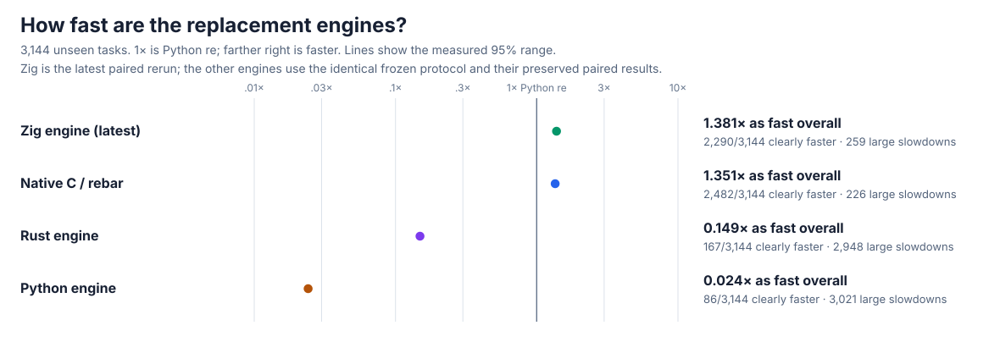
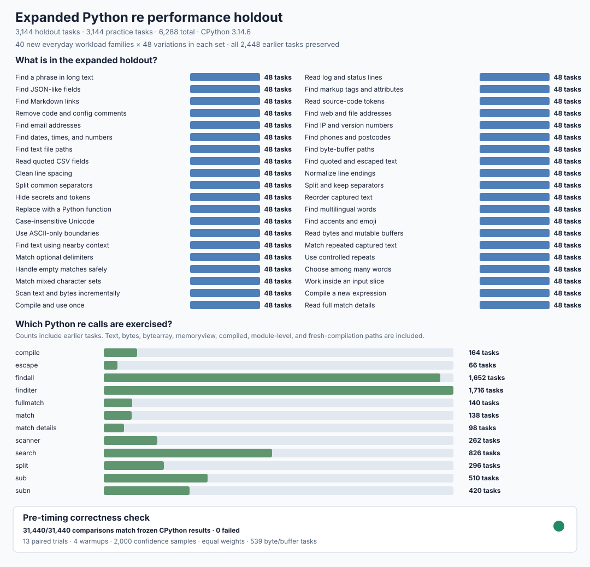
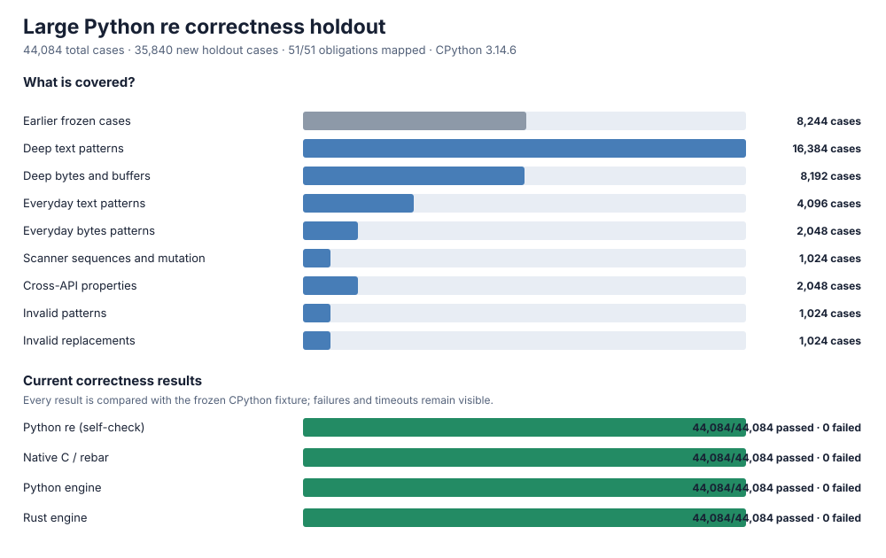
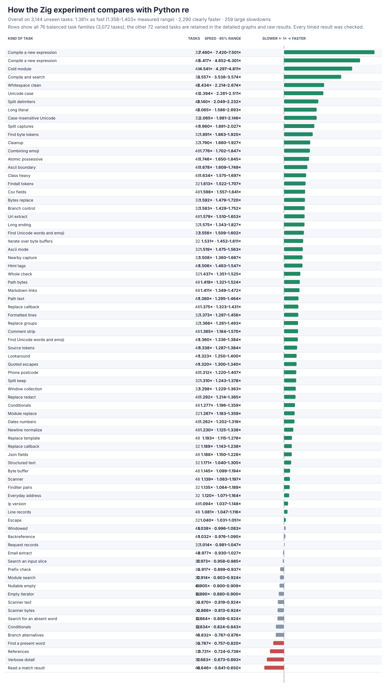
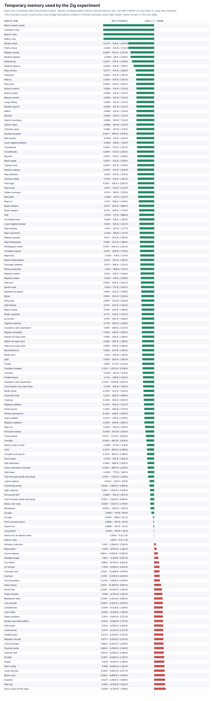
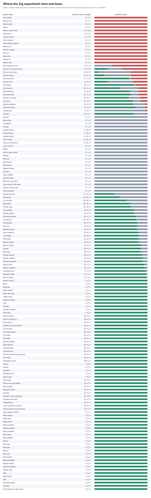

# rebar: building a faster Python `re`

`rebar` is an experiment to build a compatible, faster replacement for Python's regular-expression module. Use it with `import rebar as re`. Four independent engines were written from scratch and checked against the latest stable CPython; none wraps or delegates matching to an external package or Python's regex engine.

The immutable objective is [GOAL.md](GOAL.md), SHA-256 `e5935060b44fe5f6b4e19ac2d01f3ce63182cf6a1d3b416502a4441cde345b62`. Scope notes are in [AMENDMENTS.md](AMENDMENTS.md), and the complete chronological record is in the [experiment log](docs/EXPERIMENT-LOG.md).

## Headline results

The expanded holdout contains **3,144 separate, unseen tasks** spanning everyday text and byte processing, every common API, compilation, Unicode, captures, replacements, scanners, windows, structured data, source/config parsing, addresses, cleanup, hits, misses, and short/long inputs. **1× means the same speed as Python `re`; higher is faster.**

The latest Zig engine reaches **1.381× as fast overall** (1.358–1.403× measured range) and is clearly faster on **2,290/3,144** tasks (**73%**). The native C engine reaches **1.351×** and is clearly faster on **2,482/3,144** (**79%**). Both remain below the 1.5× target. Short calls, many alternatives, references, scanners, quoted/CSV data, and repeated or lazy matching explain the remaining losses; every affected task is retained.



| Engine | Overall speed | Clearly faster | Large slowdowns |
| --- | ---: | ---: | ---: |
| Zig (latest) | **1.381×** | **2,290/3,144** | **259/3,144** |
| Native C / `rebar` | **1.351×** | **2,482/3,144** | **226/3,144** |
| Rust | 0.149× | 167/3,144 | 2,948/3,144 |
| Python | 0.024× | 86/3,144 | 3,021/3,144 |

The [initial four-engine results](performance/v5/evidence/INITIAL.md) retain all **408,720** paired timing rows. The [latest Zig results](candidates/evidence/ZIG-OPTIMIZED.md) add **163,488** paired rows, all memory observations, measured ranges, rejected designs, and [every large Zig slowdown](candidates/evidence/zig-opt-regressions.md). Every timed batch is checked against frozen CPython output both before and after timing.



All four engines pass the frozen **44,084-case** correctness matrix, including **35,840** previously unused cases across deeper patterns, everyday inputs, Unicode/bytes/buffers, scanner sequences, properties, and invalid inputs, and all **144** runnable official CPython `re` tests. The three established engines pass **155,313** focused checks; Zig passes **109,848** additional focused checks. There are zero unexplained failures, crashes, or release-build timeouts. The [qualification report](oracle/v3/evidence/QUALIFIED.md) preserves the compatibility gaps the larger suite found and their fixes.



The separate from-scratch Zig engine is correctness-qualified: it passes **all 44,084 frozen cases**, **all 6,288 expanded performance tasks**, and **144/144** runnable official CPython methods with zero crashes or timeouts. Its latest paired rerun improves **0.462→1.381×**. Compiled memory falls to **23 KB median**, and replacement, splitting, compilation, Unicode, and long searches often win; short calls, references, many alternatives, and some scanners remain costly. The [latest Zig report](candidates/evidence/ZIG-OPTIMIZED.md) preserves the complete result and every loss.




## Detailed graphs

The family view makes the expanded benchmark readable: each row combines the matching variations of one kind of task. The all-case plots then show every individual holdout result and its measured range or memory use. Green indicates clearly faster, red indicates a slowdown greater than 20%, and grey indicates close or uncertain.


The Zig experiment's detailed memory and win/loss views retain every legacy and generated holdout task family:






## Current status

The baseline is [CPython 3.14.6](oracle/v1/BASELINE.md), the current stable release. The public import selects the correctness-qualified native C engine. The independently written [Zig engine](candidates/evidence/ZIG-OPTIMIZED.md) passes the same frozen and official checks, supports large programs/repeats/sets, Unicode, captures/references, and the complete public surface, and uses about **23 KB** median compiled-program memory instead of a fixed **424 KB**. Earlier language/FFI experiments, optimizations, rejections, and raw evidence are linked from the [experiment log](docs/EXPERIMENT-LOG.md).

| Check | Status |
| --- | --- |
| Large correctness matrix | **PASS** — stdlib, native C, Python, Rust, and Zig each pass all 44,084 cases |
| Focused checks | **PASS** — 155,313 replacement, buffer, long-input, lookaround, collection, separator, newline, and locale checks |
| Official CPython tests | **PASS** — all four engines pass 144/144 runnable methods; zero failures, crashes, or timeouts |
| Earlier large holdout | **PASS / HISTORICAL** — native C reaches 1.56× on the preserved 1,224 tasks; its 10 remeasured large slowdowns are explained |
| Expanded performance holdout | **BELOW TARGET** — native C reaches 1.351× on 3,144 unseen tasks, clearly faster on 79%; all 226 large slowdowns are profiled/explained |
| Zig engine | **CORRECTNESS PASS / BELOW TARGET** — all 44,084 frozen cases, 6,288 performance tasks, and 144/144 official methods pass; 1.381× latest holdout speed, clearly faster on 73%; every loss retained |
| Public import | **AVAILABLE / WINNER** — `import rebar as re` uses the independent native C engine |

The [expanded performance protocol](performance/v5/PROTOCOL.md) preserves every earlier task and records the larger unseen set, fixed seeds, weights, timing rules, correctness gate, and complete result. The [earlier v4 protocol/result](performance/v4/PROTOCOL.md) remains available for comparison.

## Try it or reproduce the checks

```sh
PY=/tmp/rebar-cpython/cpython-3.14.6-linux-x86_64-gnu/bin/python3.14
PYTHON="$PY" sh tools/build_vm.sh
PYTHON="$PY" RUSTFLAGS='-D warnings' sh tools/build_rust.sh
PYTHON="$PY" sh tools/build_zig_probe.sh

PYTHONPATH=. "$PY" -c 'import rebar as re; print(re.findall(r"[A-Za-z]+", "a faster python re"))'
PYTHONPATH=. "$PY" tools/oracle_v3.py verify --module rebar
PYTHONPATH=. "$PY" tools/cpython_re_oracle.py verify --module rebar
PYTHONPATH=. "$PY" tools/holdout_regression_controls.py --output /tmp/holdout-regression.json
PYTHONPATH=. "$PY" tools/perf_v5.py verify
PYTHONPATH=. "$PY" tools/perf_v5.py measure --output /tmp/rebar-performance.jsonl
PYTHONPATH=. "$PY" tools/perf_v5.py analyze --input /tmp/rebar-performance.jsonl --output /tmp/rebar-summary.json
```
