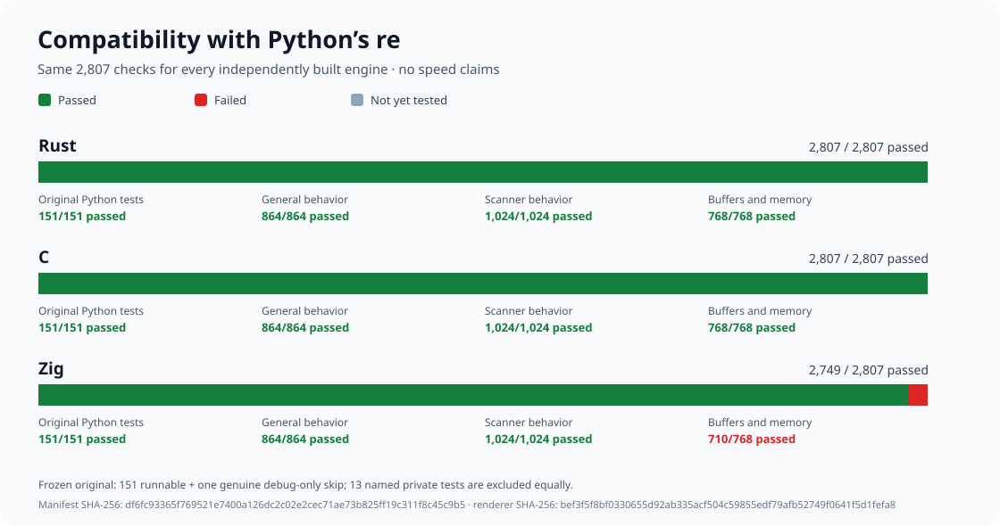
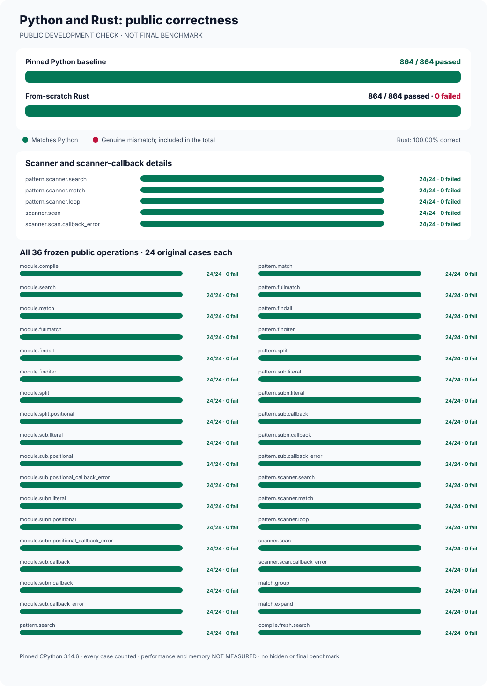
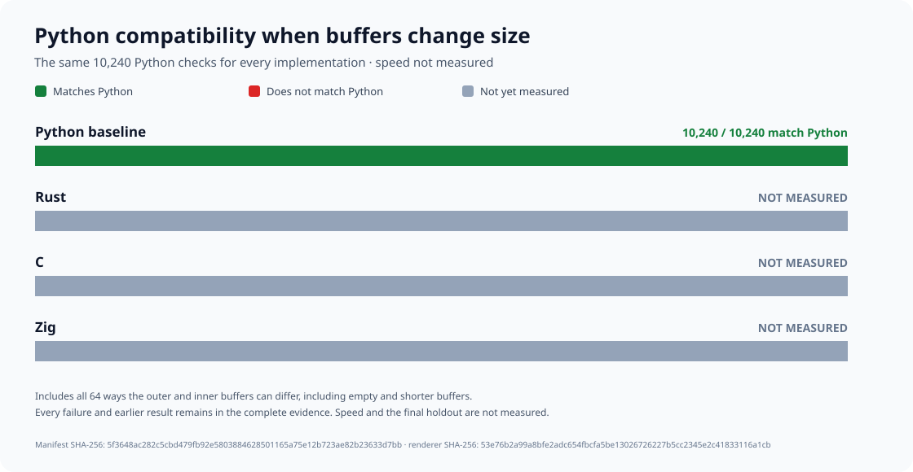
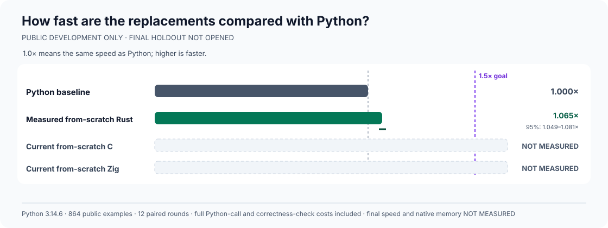
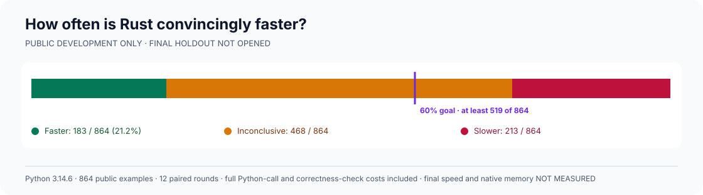
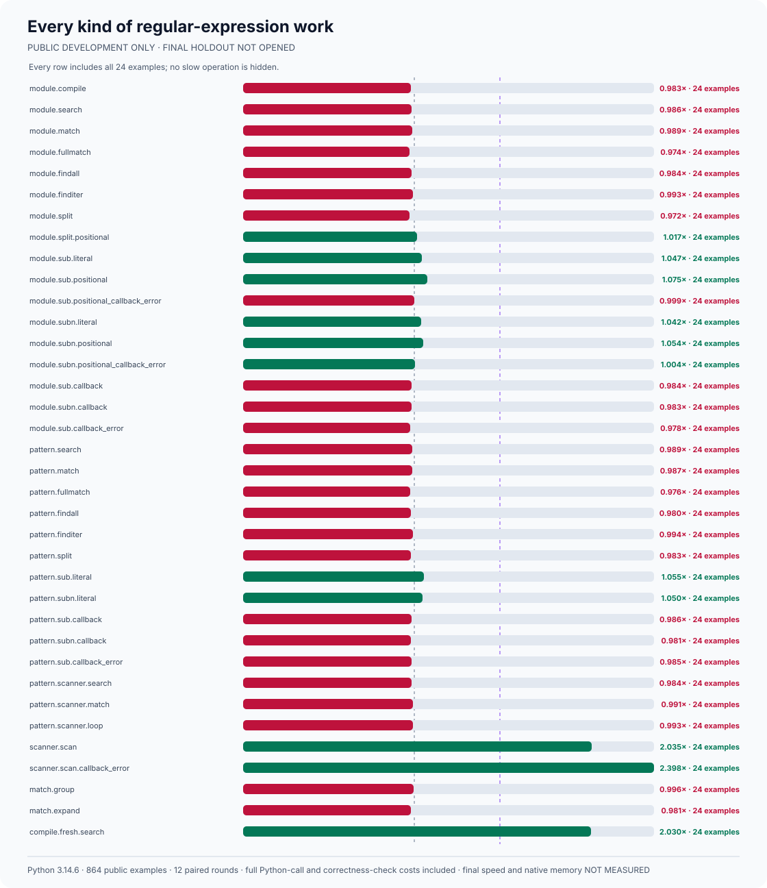
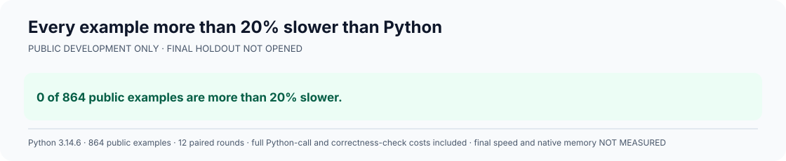

# rebar: a faster Python `re` experiment

Build a faster, fully compatible replacement for Python 3.14.6's
regular-expression module:

```python
import rebar as re
```

Every candidate must use its own matching engine built from scratch. Wrapping
Python, another regular-expression package, or another candidate does not count.

## Headline results

Python passes all **31,237** frozen compatibility checks. No replacement
has yet passed them. Rust, C, and Zig now each have two independently
matching, from-scratch builds. Rust passes **7,461** verified cases in
eight test groups; C passes **7,197** in seven. Both still have genuine
Python-compatibility failures, and both encounter separately documented
interpreter-test setup failures. Neither is a compatible replacement.
Zig's original non-reproducible build remains preserved alongside its
successful corrected build.
C++ and Go have independently written source but have not been built.
Every replacement's speed is **NOT MEASURED**; the final comparison
remains **NOT OPENED**.


| Engine | Current build | Complete compatibility | Speed against Python |
| --- | --- | --- | --- |
| Python `re` | Reference | 31,237 / 31,237 | Reference; not timed |
| Rust | Two matching builds | 7,461 verified; five groups failed; not qualified | NOT MEASURED |
| C | Two matching builds | 7,197 verified; six groups failed; not qualified | NOT MEASURED |
| Zig | Two matching builds; original failure preserved | NOT MEASURED | NOT MEASURED |
| C++ | Source only | NOT MEASURED | NOT MEASURED |
| Go | Source only | NOT MEASURED | NOT MEASURED |

Historical graphs below describe earlier binaries. They do not qualify
the current implementations. The complete history and rejected
experiments are preserved in the [experiment log](docs/EXPERIMENT-LOG.md).

## Detailed compatibility

| Python behavior | Cases | Rust | C | Zig |
| --- | ---: | ---: | ---: | ---: |
| Python's original runnable public tests | 151 | 151 | 151 | 151 |
| General public behavior | 864 | 864 | 864 | 864 |
| Scanners and callbacks | 1,024 | 1,024 | 1,024 | 1,024 |
| Memory views and buffers | 768 | 768 | 768 | 768 |
| Total matching checks | 2,807 | 2,807 | 2,807 | 2,807 |
| Additional memory-lifetime safety, counted separately | 1,024 | 1,024 | 1,024 | 1,024 |
| Historical scanner and pattern-comment checks, counted separately | 2,854 | 2,738; 116 failures | 2,738; 116 failures | 1,490; 1,364 failures |
| Additional public types, copying, and serialization | 6,912 | 248 failures | 248 failures | NOT MEASURED |
| Corrected replacement and buffer checks; original test preserved | 5,120 | 336 failures | 336 failures | NOT MEASURED |
| Corrected changing-size buffer checks; original test preserved | 10,240 | 1,392 failures | 1,392 failures | NOT MEASURED |
| Broad public behavior and real locales | 1,376 | 66 failures | 114 failures | NOT MEASURED |
| Python buffer exporters and retained scanners | 264 | 264 | 4 failures | NOT MEASURED |
| Simultaneous isolated Python interpreters | 128 | Test setup failed; zero cases verified | Test setup failed; zero cases verified | NOT MEASURED |
| Patterns shared across simultaneous Python threads | 512 | 512 | 512 | NOT MEASURED |
| Full frozen compatibility gate | 31,237 | Failed; 7,461 verified; five groups failed | Failed; 7,197 verified; six groups failed | NOT MEASURED |

Python's genuine debug-only test is skipped equally and is not included in the denominator.
Passing examples inside a failed group do not qualify that group or the replacement.








This historical graph contains a known test-harness error; its red bar is
**NOT QUALIFIED**. Complete failures, corrections, and raw reports remain in
the [experiment log](docs/EXPERIMENT-LOG.md).

## Detailed development speed









These graphs measure an earlier Rust development build, not a current
candidate. Among all **864** historical cases, **183** were faster, **213**
were slower, and **468** were inconclusive. Current speed and memory remain
**NOT MEASURED**.

## Final comparison

The proposed final comparison will use **4,194,304** unseen examples and
**24** balanced measurement rounds. It will cover ordinary and unusual
patterns, text and bytes, compilation, repeated use, native-code overhead,
and memory.

Those final examples are **NOT FROZEN**, **NOT GENERATED**, and
**NOT OPENED**. Three independently built candidates must first pass every
compatibility and ownership check. Success requires at least **1.5×**
overall speedup, statistically faster results on at least **60%** of cases,
and an explanation of every slowdown greater than **20%**. There is no winner.

## Evidence and reproduction

- [Complete 31,237-check compatibility standard](oracle/phase1/P0-COMPLETENESS-V1.md), [machine-readable test inventory](oracle/phase1/p0-completeness-v1.json), and [independent fail-closed verifier](tools/verify_p0_completeness_v1.py).
- [Independently corrected complete compatibility protocol](oracle/phase2/P0-CANDIDATE-PROTOCOL-V5.md), [frozen machine-readable test inventory](oracle/phase2/p0-candidate-protocol-v5.json), [corrected full-test worker](tools/run_frozen_p0_candidate_worker_v3.py), and [complete candidate test runner](tools/run_frozen_p0_candidate_v5.py); both independently authenticate the unchanged 31,237-check freeze without running a candidate.
- [Complete actual C compatibility failure](oracle/phase2/evidence/frozen-p0-candidate-v5-c-phase2-v5-failures.json.gz), [verified publication receipt](oracle/phase2/evidence/frozen-p0-candidate-v5-c-phase2-v5-failures-publication-receipt.json), [complete 13-group worker evidence](oracle/phase2/evidence/frozen-p0-candidate-worker-v3-c-phase2-v5-failures.json.gz), and [independent worker receipt](oracle/phase2/evidence/frozen-p0-candidate-worker-v3-c-phase2-v5-failures-publication-receipt.json); all six failed groups are preserved.
- [Byte-identical preserved C restoration receipt](oracle/phase2/evidence/frozen-p0-candidate-v5-c-phase2-v5-restoration-receipt.json); the original native library was verified and restored.
- [Complete actual Rust compatibility failure](oracle/phase2/evidence/frozen-p0-candidate-v5-rust-phase2-v5-failures.json.gz), [verified Rust publication receipt](oracle/phase2/evidence/frozen-p0-candidate-v5-rust-phase2-v5-failures-publication-receipt.json), [complete 13-group Rust worker evidence](oracle/phase2/evidence/frozen-p0-candidate-worker-v3-rust-phase2-v5-failures.json.gz), and [independent Rust worker receipt](oracle/phase2/evidence/frozen-p0-candidate-worker-v3-rust-phase2-v5-failures-publication-receipt.json); all five failed groups are preserved.
- [Byte-identical preserved Rust restoration receipt](oracle/phase2/evidence/frozen-p0-candidate-v5-rust-phase2-v5-restoration-receipt.json); both original native Rust libraries were verified and restored.
- [Corrected complete 31,237-check candidate protocol](oracle/phase2/P0-CANDIDATE-PROTOCOL-V4.md), [exact version-four candidate inventory](oracle/phase2/p0-candidate-protocol-v4.json), and [recovery-verified full candidate runner](tools/run_frozen_p0_candidate_v4.py); no candidate has completed the gate.
- [Preserved C full-gate worker failure](oracle/phase2/evidence/frozen-p0-candidate-v4-c-phase2-v4-failures.json.gz) and [verified version-four C failure receipt](oracle/phase2/evidence/frozen-p0-candidate-v4-c-phase2-v4-failures-publication-receipt.json); the inherited worker stopped before any compatibility case.
- [Final source-verified 31,237-check candidate protocol](oracle/phase2/P0-CANDIDATE-PROTOCOL-V3.md), [exact version-three candidate inventory](oracle/phase2/p0-candidate-protocol-v3.json), and [crash-verified full candidate runner](tools/run_frozen_p0_candidate_v3.py).
- [Preserved C full-gate preflight failure](oracle/phase2/evidence/frozen-p0-candidate-v3-c-phase2-v3-failures.json.gz) and [independently verified C preflight failure receipt](oracle/phase2/evidence/frozen-p0-candidate-v3-c-phase2-v3-failures-publication-receipt.json); zero compatibility cases ran.
- [Complete shared candidate correctness protocol](oracle/phase2/P0-CANDIDATE-PROTOCOL-V2.md), [exact version-two candidate inventory](oracle/phase2/p0-candidate-protocol-v2.json), and [full 31,237-check candidate runner](tools/run_frozen_p0_candidate_v2.py).
- [Shared 31,237-check candidate test](oracle/phase2/P0-CANDIDATE-PROTOCOL-V1.md), [frozen candidate test inventory](oracle/phase2/p0-candidate-protocol-v1.json), and [fail-closed candidate test runner](tools/run_frozen_p0_candidate_v1.py).
- [Corrected real-interpreter compatibility protocol](oracle/phase2/CANDIDATE-SUBINTERPRETERS-V3.md), [frozen exact-size interpreter inventory](oracle/phase2/candidate-subinterpreters-v3.json), and [source-verified isolated-interpreter runner](tools/run_owned_candidate_subinterpreters_v3.py); preserves both actual C and Rust setup failures without claiming any new matching result.
- [Crash-verified real-interpreter correctness protocol](oracle/phase2/CANDIDATE-SUBINTERPRETERS-V2.md), [corrected interpreter test inventory](oracle/phase2/candidate-subinterpreters-v2.json), and [corrected real-interpreter candidate runner](tools/run_owned_candidate_subinterpreters_v2.py).
- [Real isolated-interpreter compatibility protocol](oracle/phase2/CANDIDATE-SUBINTERPRETERS-V1.md), [exact interpreter test inventory](oracle/phase2/candidate-subinterpreters-v1.json), and [independently checked interpreter test runner](tools/run_owned_candidate_subinterpreters_v1.py).
- [Corrected C, Rust, and Zig source-build protocol](oracle/phase2/NATIVE-SOURCE-BUILDS-V2.md), [version-safe offline native-build verifier](tools/reproduce_phase2_native_builds_v2.py), and [preserved original build protocol](oracle/phase2/NATIVE-SOURCE-BUILDS-V1.md).
- [Deterministic, failure-preserving version-three native-build protocol](oracle/phase2/NATIVE-SOURCE-BUILDS-V3.md) and [independently verified native build recorder](tools/reproduce_phase2_native_builds_v3.py); the corrected Zig engine has two matching source builds.
- [Version-aware crash-safe native activation](oracle/phase2/VERIFIED-NATIVE-ACTIVATION-V2.md) and [independently verified reversible native loader](tools/activate_verified_native_candidate_v2.py); accepts only the recorded, source-built C, Rust, and Zig binaries, preserves the original Zig failure, and does not run compatibility tests.
- [Crash-safe verified native activation protocol](oracle/phase2/VERIFIED-NATIVE-ACTIVATION-V1.md) and [reversible, source-authenticated native activation and recovery](tools/activate_verified_native_candidate_v1.py).
- [Complete reproducible Zig source-build record](oracle/phase2/evidence/native-source-build-v3-zig-phase2-v3.json.gz) and [independently verified Zig build receipt](oracle/phase2/evidence/native-source-build-v3-zig-phase2-v3-publication-receipt.json).
- [Complete preserved Zig reproducibility failure](oracle/phase2/evidence/native-source-build-v2-zig-phase2-v2-failures.json.gz) and [independently verified Zig failure receipt](oracle/phase2/evidence/native-source-build-v2-zig-phase2-v2-failures-publication-receipt.json).
- [Complete corrected Rust source-build record](oracle/phase2/evidence/native-source-build-v2-rust-phase2-v2.json.gz) and [independently verified corrected Rust build receipt](oracle/phase2/evidence/native-source-build-v2-rust-phase2-v2-publication-receipt.json).
- [Complete corrected C source-build record](oracle/phase2/evidence/native-source-build-v2-c-phase2-v2.json.gz) and [independently verified corrected C build receipt](oracle/phase2/evidence/native-source-build-v2-c-phase2-v2-publication-receipt.json).
- [Both reproducible C source builds and complete process records](oracle/phase2/evidence/native-source-build-v1-c-phase2-v1.json.gz), with the [source-built C publication receipt](oracle/phase2/evidence/native-source-build-v1-c-phase2-v1-publication-receipt.json).
- [Accounting for all 165 original Python tests](oracle/cpython-3.14.6/UPSTREAM-ACCOUNTING-V5.md), [exact upstream manifest](oracle/cpython-3.14.6/manifest-v5.json), and [independent original-test verifier](tools/verify_original_cpython_accounting_v1.py).
- [Independent general, scanner, and buffer reference protocol](oracle/cpython-3.14.6/PUBLIC-CONTRACT-BASELINES-V1.md) and [Python-only reference recorder](tools/record_independent_public_contract_baselines_v1.py).
- [Real simultaneous-thread reference protocol](oracle/cpython-3.14.6/PUBLIC-THREADED-PATTERN-V1.md), [complete thread reference](oracle/cpython-3.14.6/evidence/public-threaded-pattern-v1-self-oracle.json.gz), and [original publication receipt](oracle/cpython-3.14.6/evidence/public-threaded-pattern-v1-self-oracle-publication-receipt.json).
- [From-scratch engine ownership and no-delegation protocol](oracle/phase2/CANDIDATE-INDEPENDENCE-V1.md) and [independently tested static ownership audit](tools/audit_candidate_independence_v1.py).
- [Dependency-free Rust matching engine](candidates/rust/src/lib.rs), [native Rust Python bridge](candidates/rust/py_bridge.c), [frozen Rust lockfile](candidates/rust/Cargo.lock), and [Rust-backed Python interface](candidates/rust_candidate.py); full compatibility fails four behavioral groups and one interpreter-test setup check.
- [Independently written Zig matching engine](candidates/zig/mini_regex.zig), [owned interpreter-safe Zig Python bridge](candidates/zig/py_bridge.c), and [experimental Zig-backed Python interface](candidates/zig_candidate.py); full compatibility is not yet measured.
- [Independently written C++ matching engine](candidates/cpp/engine.cpp), [native Python bridge](candidates/cpp/py_bridge.cpp), and [experimental Python interface](candidates/cpp_candidate.py); source checks only.
- [Independently written Go matching engine](candidates/go/engine.go), [strictly portable Unicode-aware Python bridge](candidates/go/py_bridge.c), and [experimental Python interface](candidates/go_candidate.py); source checks only, not an executed compatibility result.
- [Current source-pinned headline graph inputs](docs/evidence/candidate-current-overview-v6.inputs.json), [complete current graph summary](docs/evidence/candidate-current-overview-v6.json), and [reproducible current-results graph generator](tools/render_candidate_current_overview_v6.py); the graph independently verifies the complete Rust and C evidence and both restoration receipts.
- [Preserved earlier Rust-unmeasured headline graph inputs](docs/evidence/candidate-current-overview-v5.inputs.json), [earlier C-only headline summary](docs/evidence/candidate-current-overview-v5.json), and [earlier headline graph generator](tools/render_candidate_current_overview_v5.py).
- [Preserved earlier source-pinned headline graph inputs](docs/evidence/candidate-current-overview-v4.inputs.json), [earlier headline summary](docs/evidence/candidate-current-overview-v4.json), and [earlier headline graph generator](tools/render_candidate_current_overview_v4.py).
- [Preserved earlier source-pinned headline graph inputs](docs/evidence/candidate-current-overview-v3.inputs.json), [earlier headline summary](docs/evidence/candidate-current-overview-v3.json), and [earlier headline graph generator](tools/render_candidate_current_overview_v3.py).
- [Preserved historical development-graph inputs](docs/evidence/candidate-correctness-overview-v2.inputs.json) and [historical graph generator](tools/render_candidate_correctness_overview_v2.py).
- [Complete experiment log, raw evidence, rejected approaches, and preserved failures](docs/EXPERIMENT-LOG.md).
- [Proposed expanded final comparison](docs/EXPANDED-HOLDOUT-PROTOCOL-V1.md); the final cases remain **NOT GENERATED** and **NOT OPENED**.
- [Original objective](GOAL.md), SHA-256 `e5935060b44fe5f6b4e19ac2d01f3ce63182cf6a1d3b416502a4441cde345b62`; [later clarifications](AMENDMENTS.md).

Run the source-only safety checks without opening the final comparison:

```sh
PY=/tmp/rebar-cpython/cpython-3.14.6-linux-x86_64-gnu/bin/python3.14

"$PY" -I -B tools/verify_p0_completeness_v1.py --self-test
"$PY" -I -B tools/run_frozen_p0_candidate_v1.py --self-test
"$PY" -I -B tools/run_frozen_p0_candidate_v2.py --self-test
"$PY" -I -B tools/run_frozen_p0_candidate_v3.py --self-test
"$PY" -I -B tools/run_frozen_p0_candidate_v4.py --self-test
"$PY" -I -B tools/run_frozen_p0_candidate_worker_v3.py --self-test
"$PY" -I -B tools/run_frozen_p0_candidate_v5.py --self-test
"$PY" -I -B tools/run_owned_candidate_subinterpreters_v1.py --self-test
"$PY" -I -B tools/run_owned_candidate_subinterpreters_v2.py --self-test
"$PY" -I -B tools/run_owned_candidate_subinterpreters_v3.py --self-test
"$PY" -I -B tools/reproduce_phase2_native_builds_v1.py --self-test
"$PY" -I -B tools/reproduce_phase2_native_builds_v2.py --self-test
"$PY" -I -B tools/reproduce_phase2_native_builds_v3.py --self-test
"$PY" -I -B tools/activate_verified_native_candidate_v1.py --self-test
"$PY" -I -B tools/activate_verified_native_candidate_v2.py --self-test
"$PY" -I -B tools/audit_candidate_independence_v1.py --self-test
"$PY" -I -B tools/record_independent_public_contract_baselines_v1.py --self-test
"$PY" -I -B tools/python_re_threaded_pattern_oracle_v1.py --self-test
"$PY" -I -B tools/render_candidate_correctness_overview_v2.py --self-test
"$PY" -I -B tools/render_candidate_current_overview_v3.py --self-test
"$PY" -I -B tools/render_candidate_current_overview_v4.py --self-test
"$PY" -I -B tools/render_candidate_current_overview_v5.py --self-test
"$PY" -I -B tools/render_candidate_current_overview_v6.py --self-test
```

Verify the current headline graph without rerunning a candidate or
opening a benchmark:

```sh
"$PY" -I -B tools/render_candidate_current_overview_v6.py --verify \
  --source-sha256 d7e70cb56809781b11e869a4537ff02ab84ee88a29111a5e7002f2c9d24b16fb \
  --go-bridge-sha256 52101f0afe29a568e3c2e22a06d47c89c051e08a0e2024ad4891c5ae2d60fb6a \
  --manifest-sha256 f05a05d55ebd8cad6cc62c15756d1254c680c20a3ed76d4bf3862905e91f0b52
```

The [complete compatibility standard](oracle/phase1/P0-COMPLETENESS-V1.md)
contains the source-pinned, read-only full-verification command.
