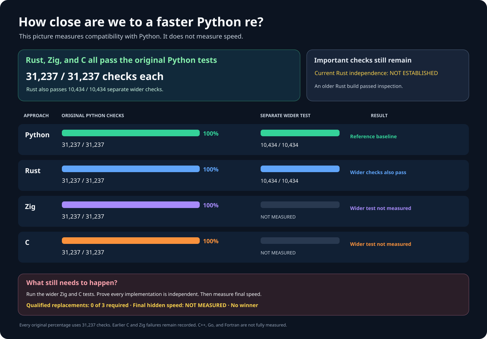

# rebar: a faster Python `re`

Build a faster, fully compatible replacement for Python 3.14.6's
regular-expression module:

```python
import rebar as re
```

Every contender must implement its own regular-expression engine from scratch.
Wrapping Python's `re`, another regex package, or another contender does not
count.

## Results at a glance

Three independently written engines—C, Rust, and Zig—each pass all
**31,237** original Python checks with **zero differences**. An earlier Rust
version also passed **10,434** broader checks and was **1.24× faster than
Python** across **416** public workloads. Zig passes **10,120 of 10,434**
broader checks, exposing **314** real compatibility differences. Broader
checks for the newer, safer Rust version and C are **NOT MEASURED**.



This older graph predates Zig's newly measured **314** broader differences;
the current results are shown in the table below.

| Implementation | Original Python checks | Broader checks | Public speed |
| --- | --- | --- | --- |
| Python `re` | 31,237 / 31,237 | 10,434 / 10,434 | 1.00× baseline |
| Current Rust | 31,237 / 31,237 | NOT MEASURED | NOT MEASURED |
| Earlier Rust | 31,237 / 31,237 | 10,434 / 10,434 | 1.24× |
| Zig | 31,237 / 31,237 | 10,120 / 10,434; 314 differences | NOT MEASURED |
| C | 31,237 / 31,237 | NOT MEASURED | NOT MEASURED |
| C++, Go, Fortran | NOT MEASURED | NOT MEASURED | NOT MEASURED |

The earlier Rust speed estimate spans **1.19–1.30×** at 95% confidence. It
is faster on **252 of 416** workloads, slower on **164**, and more than 20%
slower on **14**. Every timing and slowdown is retained. Peak process memory is
**44,032 KiB** for both implementations; peak Python-tracked memory is
**111,026 bytes** for Rust and **181,952 bytes** for Python.

No replacement is qualified yet. The available external-engine audit covers
an older Rust build, not the current build: complete static and live
independence are **NOT ESTABLISHED**. The newer Rust version includes safer
native-object ownership and passes all **31,237** original checks. The public
`rebar` import still selects an unqualified Zig prototype and is **not ready
for use**.

## Compatibility coverage

The fixed original suite contains **31,237** Python checks in **13** groups.
Another **10,434** broader cases cover **111** Python operations. A further
**48,416** input-buffer and memory-lifetime cases have been confirmed against
Python itself; contender results for those additional cases are **NOT
MEASURED**. These separate suites never change the original denominator.

The final performance comparison will use two separately balanced hidden
samples of **27,648 cases each**. The currently published **4,096-case**
proposal is too small and will be replaced before any seed is created. No
final case has been opened. It may run only after at least three independently
implemented engines pass every correctness and independence check.

A successful replacement must be at least **1.5× faster overall**, faster on
at least **60%** of cases, and explain every slowdown greater than **20%**.
Final hidden-test speed: **NOT MEASURED**. Winner: **NOT SELECTED**.

## More detailed graphs


## Evidence and reproduction

- [Complete experiment history and rejected approaches](docs/EXPERIMENT-LOG.md).
- [Reproduce generated charts and results](docs/REPRODUCING.md).
- [Frozen original Python compatibility suite](oracle/phase1/P0-COMPLETENESS-V4.md).
- [Current Rust: all 31,237 original checks](oracle/phase2/evidence/repaired-rust-original-campaign-v16-rust-phase2-v35-rust-optimized-safe-source-root-provenance-original-p0-v29-publication-receipt.json).
- [Earlier Rust: all 10,434 broader checks](oracle/phase2/evidence/rust-full-public-correctness-v5-v33-full-public-v5-run-001-publication-receipt.json).
- [Earlier Rust: public speed and every slowdown](oracle/phase2/evidence/rust-corrected-public-performance-v4-v33-corrected-performance-run-001-publication-receipt.json).
- [Zig: all 31,237 original checks](oracle/phase2/evidence/repaired-zig-original-campaign-v18-phase2-v18-zig-final-original-p0-v18-success-publication-receipt.json).
- [Zig: all 10,434 broader checks and 314 differences](oracle/phase2/evidence/zig-full-public-correctness-v4-v17-zig-public-v4-run-001-publication-receipt.json).
- [C: all 31,237 original checks](oracle/phase2/evidence/repaired-c-original-campaign-v16-c-phase2-v24-c-final-public-semantics-original-p0-v16-results-publication-receipt.json).
- [Expanded, unopened final-test proposal](oracle/phase3/EXPANDED-SEALED-HOLDOUT-V3.md).
- [Immutable original objective](GOAL.md), SHA-256
  `e5935060b44fe5f6b4e19ac2d01f3ce63182cf6a1d3b416502a4441cde345b62`;
  [subsequent clarifications](AMENDMENTS.md).
