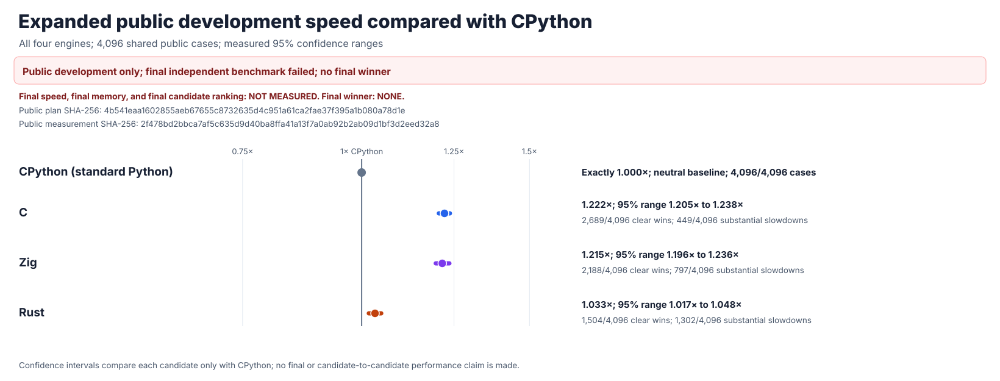
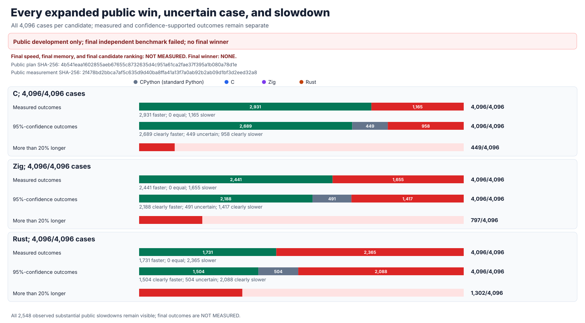
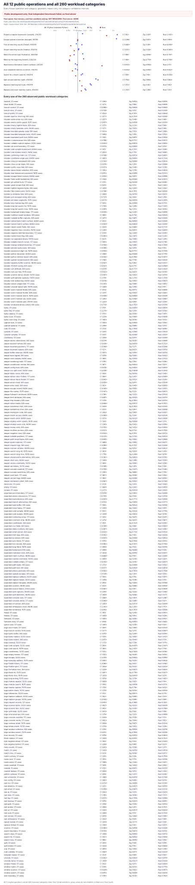
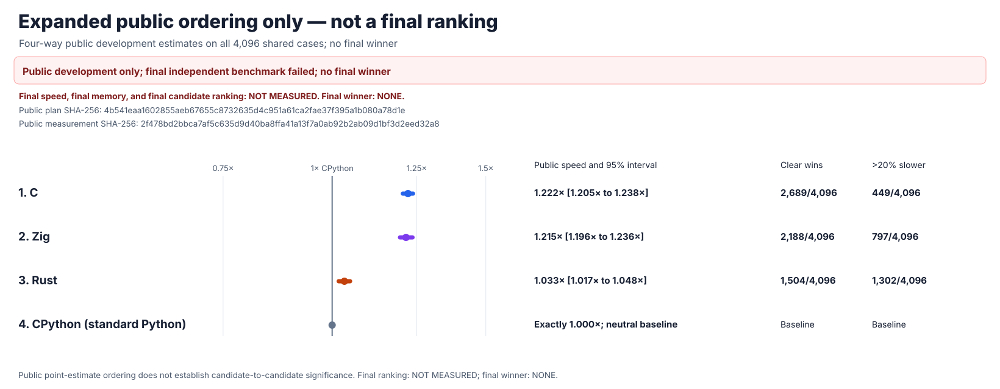

# rebar: a faster Python `re` experiment

`rebar` asks whether an independently written regular-expression engine can
replace Python 3.14.6's `re` module and run faster. The intended interface is
`import rebar as re`. Its C, Rust, and Zig candidates have separate parsers,
compilers, and matching engines. None wraps another regex package, calls
Python's regex engine, or delegates matching to another candidate.

## Final result: the original experiment failed

The one-time hidden test found a real difference between Zig's `split` and
Python's answer. It stopped after **14,342 of 24,576 cases** and **1,778,408
of 3,047,424 observations**. Its seal was consumed; it cannot be retried.


**There is no final winner. Final speed, confidence ranges, memory use,
rankings, and the 1.5× goal are NOT MEASURED.** The source-checkout `rebar`
import is not a proven drop-in replacement. The original
[failure report](performance/v9/evidence/FINAL-HOLDOUT-FAILURE.md),
[independent verification](performance/v9/evidence/V9-FINAL-HOLDOUT-24576-FAILURE.json),
and [pre-test candidate freeze](performance/v9/evidence/FINAL-CANDIDATE-FREEZE.md)
remain unchanged.

## Overall public performance

The latest Rust experiment is a **new, from-scratch quote-aware matching
architecture**. It has passed the complete original correctness campaign, and
its [next 4,096-case comparison](performance/postfinal-public-v2/PROTOCOL.md)
is frozen before measurement. Its speed is **NOT MEASURED**.

The graphs and figures below are the complete **earlier version-1 public
experiment**, not results for the changed Rust engine and not a rerun of the
failed final. Python and all three independently built engines received the
same **4,096 public cases**, **13 paired runs**, and **638,976** correctness
checks. **1× means the same speed as standard Python; higher is faster.**



| Engine | Public speed | 95% uncertainty range | Clearly faster cases | More than 20% slower |
| --- | ---: | ---: | ---: | ---: |
| C | 1.222× | 1.205–1.238× | 2,689/4,096 | 449/4,096 |
| Zig | 1.215× | 1.196–1.236× | 2,188/4,096 | 797/4,096 |
| Rust | 1.033× | 1.017–1.048× | 1,504/4,096 | 1,302/4,096 |

That measured Rust version batches up to 16 split matches in its own native
engine. The public results show that batching alone is not a meaningful
overall speedup. **No version-1 engine reaches the 1.5× target.** All
**2,548** substantial slowdowns are included. The newer quote-aware Rust
engine has not yet been timed and is not included in those numbers.



## Detailed public results




The memory chart measures Python-visible temporary allocations only. Native
engine memory and isolated whole-process memory are **NOT MEASURED**.



## What is actually verified

The current from-scratch quote-aware Rust passes **223,198** matching checks,
**393** public-object
checks, **479** tracing and unusual-argument checks, and the original complete
**22-stage** Python-compatibility campaign, including **4,494,555** Unicode
comparisons. The original
[from-scratch audit](candidates/audits/FROM-SCRATCH-AUDIT.json) verifies all
four implementation families, all five loaded native libraries, and **76**
controls against external packages, Python's regex engine, and hidden engine
sharing. Public correctness does not repair the historical hidden Zig failure.

The [complete 4,096-case results](performance/postfinal-public-v1/RESULTS.md)
preserve all observations, confidence ranges, slowdowns, and the independent
replay. Its [protocol and complete case list](performance/postfinal-public-v1/PROTOCOL.md)
were frozen and pushed before timing. The earlier
[rejected Rust experiment](performance/v7/evidence/POSTFINAL-RUST-BATCHED-SPLIT-01.md)
and [experiment log](docs/EXPERIMENT-LOG.md) remain preserved. None of these
public results repairs or reruns the failed hidden final.

## Reproduce and inspect

The objective in [GOAL.md](GOAL.md) has immutable SHA-256
`e5935060b44fe5f6b4e19ac2d01f3ce63182cf6a1d3b416502a4441cde345b62`.
[AMENDMENTS.md](AMENDMENTS.md) records later clarifications separately.

```sh
PY=/tmp/rebar-cpython/cpython-3.14.6-linux-x86_64-gnu/bin/python3.14

PYTHONDONTWRITEBYTECODE=1 PYTHONPATH=. "$PY" -B \
  -m tools.audit_from_scratch --self-test
PYTHONDONTWRITEBYTECODE=1 PYTHONPATH=. "$PY" -B \
  -m tools.rust_postfinal_split_audit --self-test
PYTHONDONTWRITEBYTECODE=1 PYTHONPATH=. "$PY" -B \
  -m tools.postfinal_public_practice_v1 self-test
PYTHONDONTWRITEBYTECODE=1 PYTHONPATH=. "$PY" -B \
  tools/postfinal_public_practice_charts_v1.py --self-test
PYTHONDONTWRITEBYTECODE=1 PYTHONPATH=. "$PY" -B \
  tools/postfinal_public_practice_charts_v1.py \
  --summary performance/postfinal-public-v1/evidence/postfinal-public-practice-v1-summary.json \
  --integrity performance/postfinal-public-v1/evidence/postfinal-public-practice-v1-integrity.json \
  --manifest performance/postfinal-public-v1/manifest.json \
  --output-dir performance/postfinal-public-v1/evidence
```
