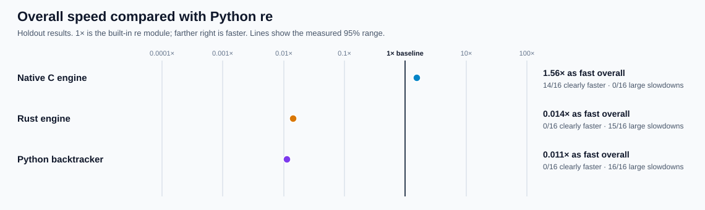
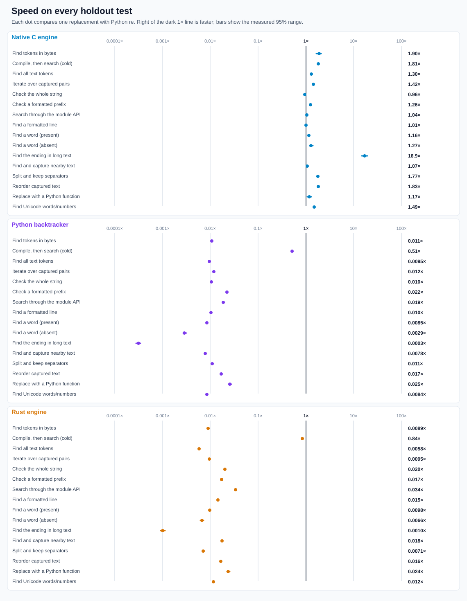
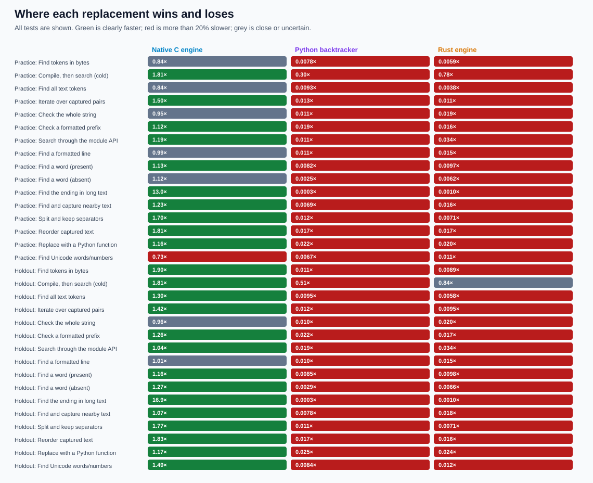
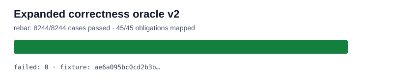

# rebar: building a faster Python `re`

`rebar` is an experiment to build a drop-in, faster replacement for Python's regular-expression module. The public import is `import rebar as re`. Three independently written engines are checked against the latest stable CPython and compared on the same tasks; incorrect results are never timed.

The immutable objective is [GOAL.md](GOAL.md), SHA-256 `e5935060b44fe5f6b4e19ac2d01f3ce63182cf6a1d3b416502a4441cde345b62`. Scope notes are in [AMENDMENTS.md](AMENDMENTS.md), and the complete chronological record is in the [experiment log](docs/EXPERIMENT-LOG.md).

## Headline results

The latest completed holdout contains 16 tasks kept separate from tuning. **1× means the same speed as Python `re`; higher is faster.** The native C engine is **1.56× as fast overall**, clearly faster on **14/16** tasks, with **no** large holdout slowdown. Python and Rust are much slower on these short calls.



| Engine | Overall speed | Clearly faster | Large slowdowns |
| --- | ---: | ---: | ---: |
| Native C | **1.56×** | **14/16** | **0/16** |
| Rust | 0.014× | 0/16 | 15/16 |
| Python | 0.011× | 0/16 | 16/16 |

An expanded 56-task performance check is now frozen and correctness-gated; its timings are **NOT MEASURED** yet. It will provide the next headline comparison using 28 new holdout tasks and clearer, compact charts.

## Detailed graphs

These show the latest completed holdout task by task. Green means clearly faster, red means more than 20% slower, and grey means close or uncertain. The lines on the speed chart show the measured range.







## Correctness and current status

The baseline is [CPython 3.14.6](oracle/v1/BASELINE.md). All three independent engines and stdlib pass the [expanded correctness matrix](oracle/v2/P0.md): **8,244/8,244 cases**, **45/45 obligations**, zero unexplained failures. Both native engines pass sanitizer checks and all three pass a no-delegation audit. The original 2,048-case suite also remains green.



| Check | Status |
| --- | --- |
| Correctness | **PASS** — stdlib, native C, Python, and Rust each pass all 8,244 expanded cases |
| Original performance | **PASS** — native C meets the 1.5× overall and breadth targets |
| Expanded performance | **FROZEN / NOT MEASURED** — 28 practice + 28 holdout tasks, all correctness-gated |
| Public import | **PASS** — `import rebar as re` uses the qualified native C engine |

The [expanded performance protocol](performance/v2/PROTOCOL.md) explains exactly what is timed, how comparisons are made, and how slowdowns are reported. Full results, raw data, rejected experiments, and older charts are linked from the [experiment log](docs/EXPERIMENT-LOG.md).

## Try it or reproduce the checks

```sh
PY=/tmp/rebar-cpython/cpython-3.14.6-linux-x86_64-gnu/bin/python3.14
PYTHON="$PY" sh tools/build_vm.sh
RUSTFLAGS='-D warnings' sh tools/build_rust.sh

PYTHONPATH=. "$PY" -c 'import rebar as re; print(re.findall(r"[A-Za-z]+", "a faster python re"))'
PYTHONPATH=. "$PY" tools/oracle_v2.py verify --module rebar
PYTHONPATH=. "$PY" tools/perf_v2.py verify
```
