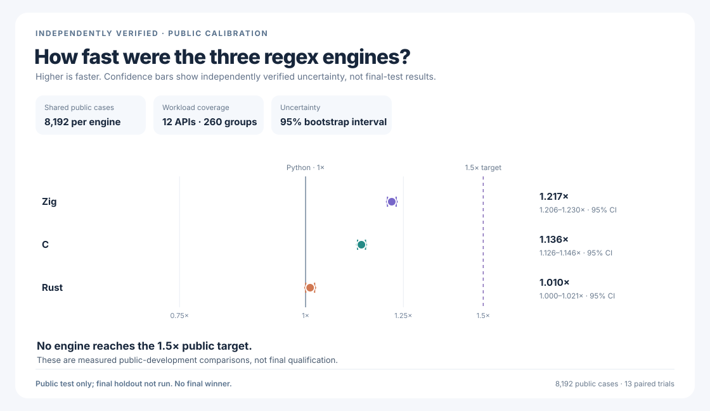
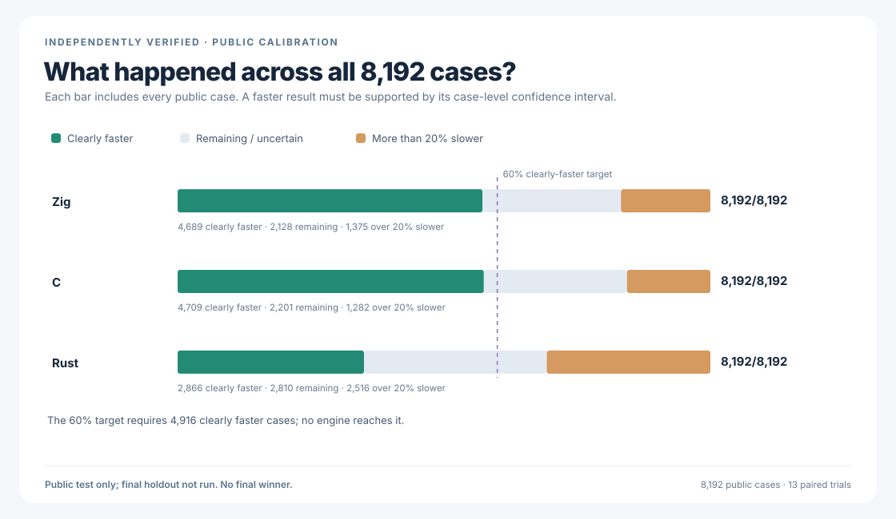
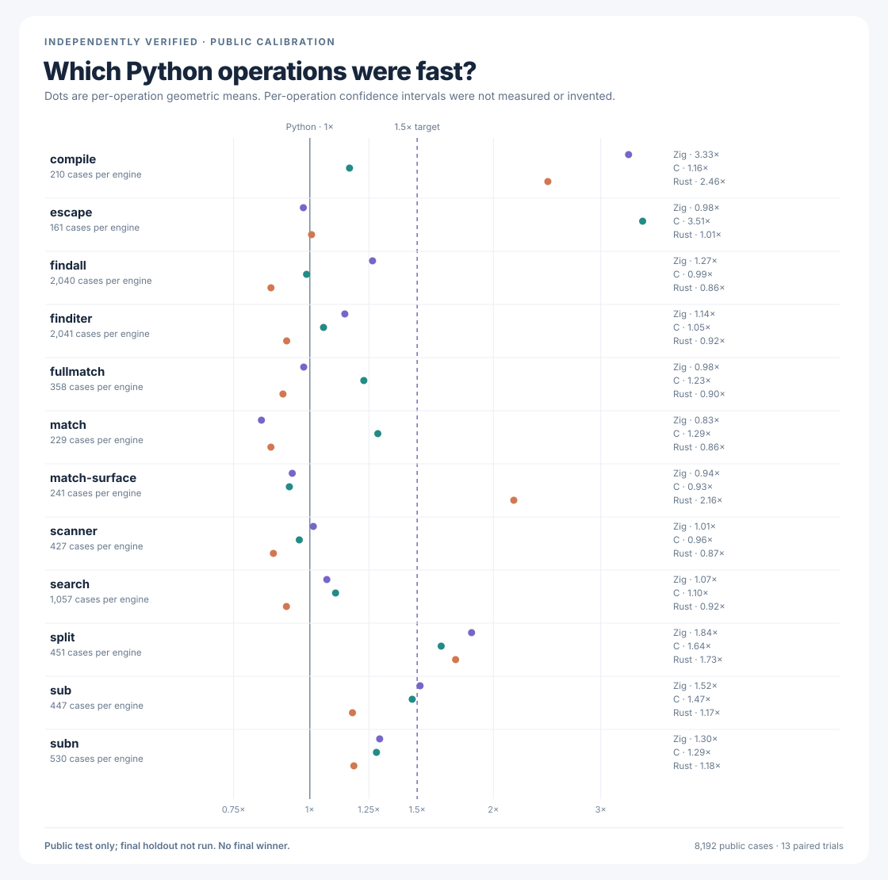
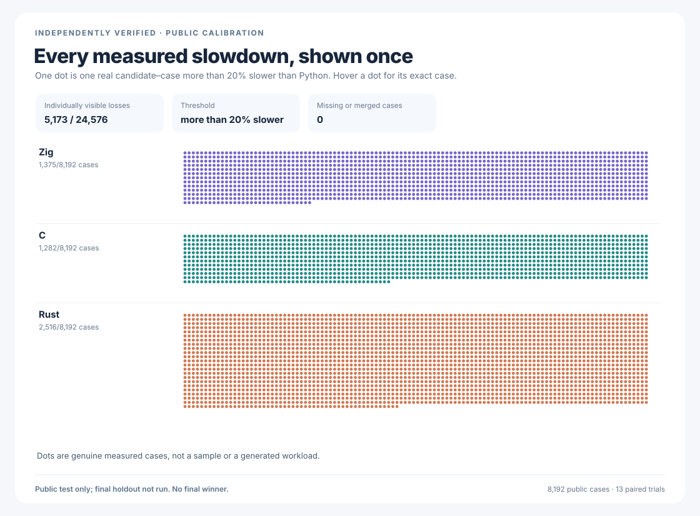
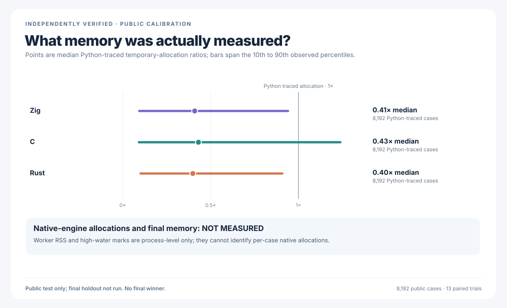
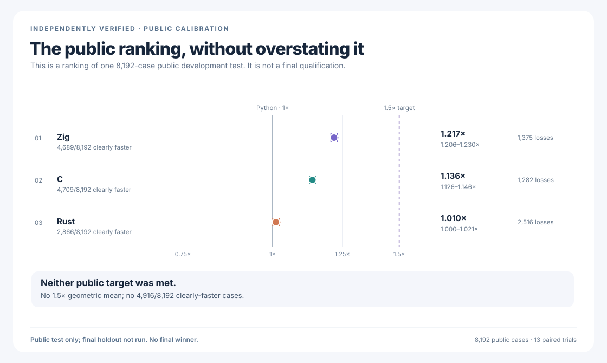

# rebar: a faster Python `re` experiment

`rebar` asks whether an independently written regular-expression engine can
replace Python 3.14.6's `re` module and run faster. The intended interface is
`import rebar as re`. Its C, Rust, and Zig candidates have separate parsers,
compilers, and matching engines. None wraps another regex package, calls
Python's regex engine, or delegates matching to another candidate.

The original one-time hidden compatibility test failed and cannot be retried.
**There is no proven drop-in replacement or final winner.** The results below
come from a separate, completely recorded public comparison.

All three independently written engines now pass a new **8,192-pattern**
compatibility test: **1,179,648** comparisons with Python and **zero**
differences. Each repaired engine also passes the original **223,198-check**
matching and parser suite, a separate **393-check** object test, and a
**479-check** callback, buffer, and scanner test. All three also pass the
complete **22-stage** campaign, including **4,494,555** Unicode comparisons
per engine. The public measurements below test these exact repaired engines;
their one-time final performance remains **NOT MEASURED**.

## Overall public performance

Python 3.14.6 and the current independently written Zig, C, and Rust engines
ran the same **8,192** public workloads. The comparison records **425,984**
paired observations, **1,277,952** exact-answer checks, and **24,579**
independently verified uncertainty ranges. **1× means the same speed as
standard Python; higher is faster. The target is 1.5×.**



| Engine | Public speed | 95% uncertainty range | Clearly faster cases | More than 20% slower |
| --- | ---: | ---: | ---: | ---: |
| Python baseline | 1.000× | Baseline | — | — |
| Zig | 1.217× | 1.2055–1.2295× | 4,689/8,192 (57.2%) | 1,375/8,192 |
| C | 1.136× | 1.1260–1.1464× | 4,709/8,192 (57.5%) | 1,282/8,192 |
| Rust | 1.010× | 1.0004–1.0208× | 2,866/8,192 (35.0%) | 2,516/8,192 |

**No candidate reaches the required 1.5× overall speed or the requirement to
be clearly faster on at least 60% of cases. There is no winner.** All
**5,173** slowdowns of more than 20% remain visible. The complete
[public results](performance/postfinal-public-v5/RESULTS.md) and
[predeclared protocol](performance/postfinal-public-v5/PROTOCOL.md) preserve
the original observations, exact comparisons, and independently replayed
uncertainty ranges.



## Detailed public results







The memory chart reports Python-visible temporary allocations. Separate
whole-process worker readings cannot identify allocations inside a native
engine; exact native memory remains **NOT MEASURED**.



## Final-test status

The original one-time hidden test found a genuine Zig `split` mismatch and
cannot be rerun. Its [unchanged failure report](performance/v9/evidence/FINAL-HOLDOUT-FAILURE.md)
remains part of the experiment. The separate, newly planned
[65,536-case final test](performance/postfinal-fresh-holdout-v1/PROTOCOL.md)
is **NOT OPENED**. Its
[independently audited four-engine adapter](performance/postfinal-fresh-holdout-v1/ADAPTER-AUDIT.md)
passes **2,176** public cases and **26,112** separate compatibility checks;
the one-use production executor is **NOT YET INTEGRATED**. Final speed,
final memory, and a qualified winner remain **NOT MEASURED**.

## What is actually verified

The [full compatibility evidence](candidates/evidence/POSTFINAL-UNIVERSAL-STAGE05-EDGE.md)
records the original matching suite, observable Python object behavior,
callbacks, scanners, and complete Unicode campaign for all three engines.
The expanded [8,192-pattern Python comparison](candidates/evidence/PYTHON-RE-UNIVERSAL-PUBLIC-ORACLE-STAGE03.md)
preserves every original failure as well as all **1,179,648** passing checks.

The [76-control from-scratch audit](candidates/audits/FROM-SCRATCH-AUDIT.json)
and [32-control isolated-engine audit](candidates/audits/POSTFINAL-NO-DELEGATION-AUDIT-V1.json)
confirm that production matching does not use Python's regex engine, another
candidate, or an external regex package. Neither audit claims reproducible
compiler builds. [Fresh, append-only checks](candidates/audits/POSTFINAL-REQUALIFICATION-V2.md)
are required before any changed engine can reuse the same comparison. The
[experiment log](docs/EXPERIMENT-LOG.md) preserves
earlier measurements, rejected designs, and the unchanged
[interrupted Unicode-sensitive comparison](performance/postfinal-public-v4/RESULTS.md).

## Reproduce and inspect

The objective in [GOAL.md](GOAL.md) has immutable SHA-256
`e5935060b44fe5f6b4e19ac2d01f3ce63182cf6a1d3b416502a4441cde345b62`.
[AMENDMENTS.md](AMENDMENTS.md) records later clarifications separately.

```sh
PY=/tmp/rebar-cpython/cpython-3.14.6-linux-x86_64-gnu/bin/python3.14

PYTHONDONTWRITEBYTECODE=1 PYTHONPATH=. "$PY" -B \
  -m tools.audit_from_scratch --self-test
PYTHONDONTWRITEBYTECODE=1 PYTHONPATH=. "$PY" -u -B -c \
  'from tools import postfinal_no_delegation_audit_v1 as audit; raise SystemExit(audit.main(["--self-test"]))'
PYTHONDONTWRITEBYTECODE=1 PYTHONPATH=. "$PY" -B \
  tools/python_re_universal_public_oracle_v1.py --self-test
"$PY" -I -B tools/python_re_universal_public_oracle_stage03.py --self-test
PYTHONDONTWRITEBYTECODE=1 "$PY" -I -B \
  tools/python_re_universal_public_oracle_stage04.py --self-test
PYTHONDONTWRITEBYTECODE=1 "$PY" -I -B \
  tools/postfinal_from_scratch_audit_v2.py --self-test
PYTHONDONTWRITEBYTECODE=1 "$PY" -I -B \
  tools/postfinal_no_delegation_audit_v2.py --self-test
jq '{status, cases, total_comparisons, mismatches, comparison_complete}' \
  candidates/evidence/python-re-universal-public-oracle-v3-all.json
PYTHONDONTWRITEBYTECODE=1 PYTHONPATH=. "$PY" -B \
  -m tools.postfinal_public_practice_v5 self-test
PYTHONDONTWRITEBYTECODE=1 PYTHONPATH=. "$PY" -B \
  tools/postfinal_public_practice_charts_v5.py --self-test
PYTHONDONTWRITEBYTECODE=1 PYTHONPATH=. "$PY" -B \
  tools/postfinal_public_practice_presentation_v1.py --self-test
PYTHONDONTWRITEBYTECODE=1 "$PY" -I -B \
  tools/postfinal_fresh_holdout_adapter_v1.py --self-test
PYTHONDONTWRITEBYTECODE=1 "$PY" -I -B \
  tools/postfinal_fresh_holdout_adapter_smoke_v1.py --self-test
PYTHONDONTWRITEBYTECODE=1 PYTHONPATH=. "$PY" -I -B -c \
  'import resource,runpy,sys; n=192*1024*1024; resource.setrlimit(resource.RLIMIT_AS,(n,n)); sys.argv=["tools/postfinal_fresh_holdout_adapter_audit_v1.py","--validate"]; runpy.run_path(sys.argv[0],run_name="__main__")'

sha256sum \
  performance/postfinal-public-v5/manifest.json \
  performance/postfinal-public-v5/evidence/postfinal-public-practice-v5-summary.json \
  performance/postfinal-public-v5/evidence/postfinal-public-practice-v5-integrity.json \
  performance/postfinal-public-v5/evidence/postfinal-public-practice-v5-raw.jsonl.gz
gzip -dc \
  performance/postfinal-public-v5/evidence/postfinal-public-practice-v5-raw.jsonl.gz \
  | sha256sum

PYTHONDONTWRITEBYTECODE=1 PYTHONPATH=. "$PY" -B \
  tools/postfinal_public_practice_charts_v5.py \
  --summary performance/postfinal-public-v5/evidence/postfinal-public-practice-v5-summary.json \
  --integrity performance/postfinal-public-v5/evidence/postfinal-public-practice-v5-integrity.json \
  --manifest performance/postfinal-public-v5/manifest.json \
  --manifest-sha256 c9950c87079ccc1909ba4470ed573b08afe1f275b85a8932cbfe83b547b24f96 \
  --runner-sha256 f4294a3b5434f43a92970635a958cf3b39db0eb926adef50e242ac0f6b9a1d22 \
  --output-dir performance/postfinal-public-v5/evidence

PYTHONDONTWRITEBYTECODE=1 PYTHONPATH=. "$PY" -B \
  tools/postfinal_public_practice_presentation_v1.py \
  --summary performance/postfinal-public-v5/evidence/postfinal-public-practice-v5-summary.json \
  --integrity performance/postfinal-public-v5/evidence/postfinal-public-practice-v5-integrity.json \
  --manifest performance/postfinal-public-v5/manifest.json \
  --manifest-sha256 c9950c87079ccc1909ba4470ed573b08afe1f275b85a8932cbfe83b547b24f96 \
  --runner-sha256 f4294a3b5434f43a92970635a958cf3b39db0eb926adef50e242ac0f6b9a1d22 \
  --output-dir performance/postfinal-public-v5/evidence
```
