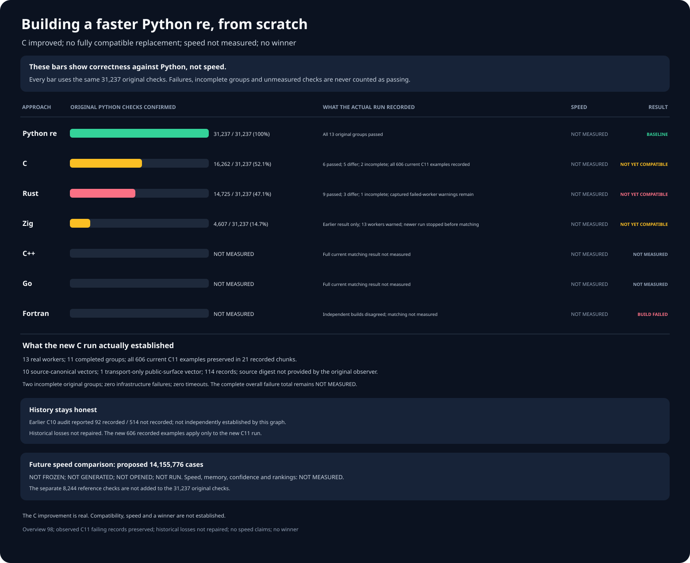

# rebar: a faster Python `re` experiment

Build a faster, fully compatible, from-scratch replacement for
[Python 3.14.6](https://www.python.org/downloads/release/python-3146/)'s
regular-expression module:

```python
import rebar as re
```

Wrapping Python, an existing regular-expression package, or another
project engine does not count. Each candidate must implement its own
regular-expression engine.

## Results at a glance

**Six independently written approaches. Zero compatible
replacements. Speed: NOT MEASURED. No winner.**



The graph is the previous saved snapshot. The latest C run improved
to **16,413** checks; the current results are in the table below.

Every percentage uses the same **31,237** original Python checks.
These results measure compatibility, **not speed**. Checks in an
unfinished group are never counted as passing.

| Engine | Verified Python checks | Current result |
| --- | --- | --- |
| Python `re` | 31,237 / 31,237; 100% | Reference baseline. |
| C | 16,413 / 31,237; 52.5% | FAIL; all 606 observed differences are preserved; interpreter isolation did not finish. |
| Rust | 14,725 / 31,237; 47.1% | FAIL; at least 2,018 differences; 1,024 fewer verified checks; 16 cleanup errors in its failed worker. |
| Zig | 4,607 / 31,237; 14.7% | FAIL; at least 1,700 differences; cleanup errors in all 13 workers; the corrected rerun stopped before matching. |
| C++ | NOT MEASURED | FAIL; 2,308 observed differences and five worker failures. |
| Go | NOT MEASURED | FAIL; 4,518 observed differences and four worker failures. |
| Fortran | NOT MEASURED | FAIL; independent builds disagree; matching was not tested. |

The current public `rebar` import still selects an unqualified Zig
prototype; **it is not a working replacement**. Complete difference
counts are **NOT MEASURED** for unfinished runs. No failed candidate
has established the required runtime no-delegation. The current C
run preserves all **606** observed failing examples. Its older run
saved only **92**; those **514** missing historical examples remain
**NOT RECORDED**.

The latest C run correctly passes all **151** executable original
Python tests while preserving all **152** test records and their
one genuine skipped case. Interpreter isolation still fails.

A corrected, independently written Rust source now exists. Its
native build, complete compatibility, and speed are **NOT MEASURED**.

## What a replacement must pass

The frozen reference includes **31,237** original Python checks in
**13** groups. Another **8,244** independently verified cases cover
additional real-world behavior. They are a separate test set, not
extra points added to the original denominator. Candidates must also
pass large-input, public-interface, cleanup, interpreter-isolation,
and no-delegation checks.

A further **48,416** real-world cases cover memory-mapped inputs,
typed arrays, replacement callbacks, scanners, and buffer lifetimes.
Two independent Python processes each passed all **48,416** and
recorded exactly the same answers. This confirms the larger test,
not any replacement. The original **31,237**-case scores do not
change. Candidate results on the additional cases are **NOT MEASURED**.

## More detailed correctness graphs


These historical graphs show individual correctness checks. They do
not report speed or a qualified replacement.


## The larger speed test

The proposed final comparison has **14,155,776** cases covering
**36** Python operations, **24** types of regular expressions, text,
and byte-oriented inputs. The previous **4,194,304**-case proposal
is preserved. Neither proposal has been opened.

The larger test is **NOT FROZEN**, **NOT GENERATED**, and **NOT OPENED**.
Speed, memory, and statistical confidence are **NOT MEASURED**. It may
run only after at least three independently written engines pass every
required correctness and no-delegation test.

A winner must be at least **1.5×** faster overall, faster on at least
**60%** of measured cases, and explain every slowdown over **20%**.

## Evidence and reproduction

- [Reproduce and audit the headline graph](docs/REPRODUCING.md).
- [Detailed experiment log, rejected designs, and full evidence](docs/EXPERIMENT-LOG.md).
- [Frozen original Python correctness checks](oracle/phase1/P0-COMPLETENESS-V4.md) and [8,244 independent additional checks](oracle/phase1/P0-DIFFERENTIAL-FUZZ-REFERENCE-V3.md).
- [48,416 additional real-world buffer and memory-mapping questions](oracle/phase1/P0-PUBLIC-BUFFER-CARRIERS-SUPPLEMENT-V1.md).
- [Frozen two-process Python reference for those 48,416 cases](oracle/phase1/P0-PUBLIC-BUFFER-CARRIERS-REFERENCE-V1.md).
- [Actual two-process Python results for all 48,416 cases](oracle/phase1/evidence/public-buffer-carriers-reference-v1-cpython-3.14.6-publication-receipt.json).
- [Six independently authored engines](oracle/phase2/SIX-FAMILY-P0-PRODUCER-V5.md) and the [no-wrapping audit](oracle/phase2/CANDIDATE-INDEPENDENCE-V2.md).
- [Latest C run, 16,413 verified checks, and all 606 preserved failures](oracle/phase2/evidence/repaired-c-original-campaign-v12-c-phase2-v21-c-original-match-semantics-original-p0-v12-failures-publication-receipt.json).
- [Frozen C test and complete failure-preservation rules](oracle/phase2/REPAIRED-C-ORIGINAL-CAMPAIGN-V11.md).
- [Corrected C test preserving all real records and the genuine skipped case](oracle/phase2/REPAIRED-C-ORIGINAL-CAMPAIGN-V12.md).
- [Previous C run and its original 606 preserved failures](oracle/phase2/evidence/repaired-c-original-campaign-v11-c-phase2-v21-c-original-match-semantics-original-p0-v11-failures-publication-receipt.json).
- [Historical C run with 514 missing individual examples](oracle/phase2/evidence/repaired-c-original-campaign-v10-c-phase2-v21-c-original-match-semantics-original-p0-v10-failures-publication-receipt.json).
- [Latest real Rust run, regression, and complete preserved failure](oracle/phase2/evidence/repaired-rust-original-campaign-v16-rust-phase2-v22-rust-capture-shape-root-provenance-original-p0-v22-failures-publication-receipt.json).
- [Latest real Zig run and complete observed failure](oracle/phase2/evidence/repaired-zig-original-campaign-v13-phase2-v13-zig-guard-clean-lifetime-v1-original-p0-v13-failures-publication-receipt.json).
- [Frozen first-party Zig cleanup correction](oracle/phase2/ZIG-DEALLOCATOR-SETATTR-SOURCE-REPAIR-V2.md) and [preserved Zig rerun that stopped before matching](oracle/phase2/evidence/zig-original-campaign-v14-setter-safe-prepublication-controller-failure.json).
- [Next Zig test, correcting the stopped rerun; not yet run](oracle/phase2/REPAIRED-ZIG-ORIGINAL-CAMPAIGN-V15.md).
- [Frozen Rust correctness procedure](oracle/phase2/REPAIRED-RUST-ORIGINAL-CAMPAIGN-V22.md) and [next targeted Rust buffer correction; not yet run](oracle/phase2/RUST-CAPTURE-SHAPE-SEMANTICS-V2.md).
- [Next Rust test, preserving the previous regression; not yet run](oracle/phase2/REPAIRED-RUST-ORIGINAL-CAMPAIGN-V23.md).
- [Complete from-scratch Rust correction and offline build plan; not yet built](oracle/phase2/RUST-CAPTURE-SHAPE-SEMANTICS-V2-SOURCE-BUILD-V23.md).
- [Preserved Rust activation failure](oracle/phase2/evidence/rust-original-campaign-v21-v3-preactivation-contract-failure.json).
- [Expanded, unopened speed-test proposal](oracle/phase3/EXPANDED-SEALED-HOLDOUT-V1.md).
- [Original objective](GOAL.md), SHA-256
  `e5935060b44fe5f6b4e19ac2d01f3ce63182cf6a1d3b416502a4441cde345b62`;
  [later clarifications](AMENDMENTS.md).
