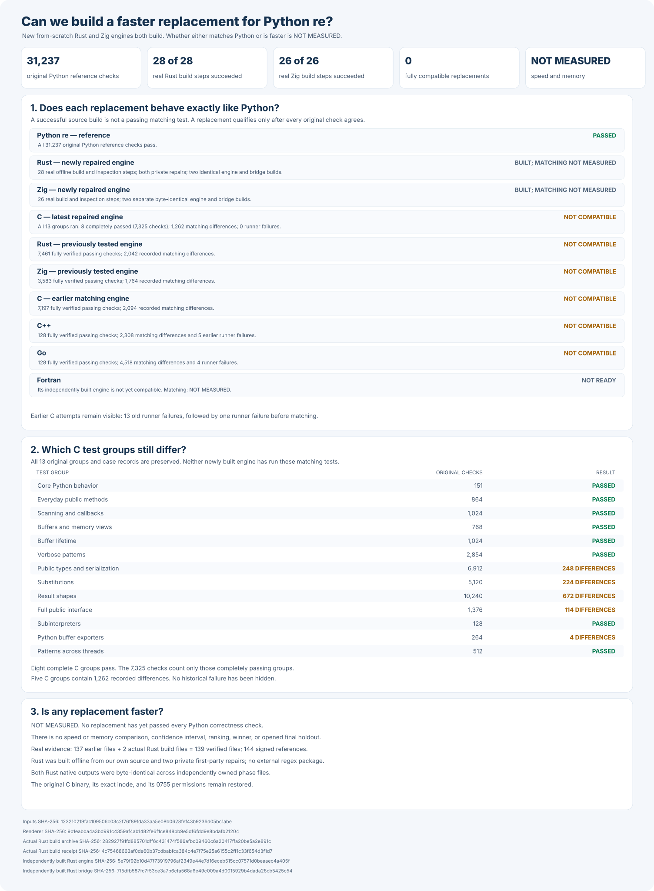

# rebar: a faster Python `re` experiment

Build a faster, fully compatible replacement for Python 3.14.6's
regular-expression module:

```python
import rebar as re
```

Every candidate must use its own matching engine built from scratch. Wrapping
Python, another regular-expression package, or another candidate does not count.

## Headline results

Python passes all **31,237** frozen compatibility checks. No replacement
has passed them, so there is not yet a drop-in alternative or a speed winner.



Rust, C, Zig, C++, and Go each use an independently written engine.
Both repaired Rust and repaired Zig now produce two identical builds
without an external regular-expression package. Neither repaired
engine has yet taken the full compatibility test.

The repaired C engine completed all **13** test groups: **8** groups
passed, **5** contained **1,262** differences, and no test worker
crashed. Its **7,325** passing checks are not a passing full suite.

Overall speed relative to Python: **NOT MEASURED**. Benchmarking starts
only after three independent engines pass all compatibility checks.

| Engine | Current build | Complete compatibility | Speed against Python |
| --- | --- | --- | --- |
| Python `re` | Reference | 31,237 / 31,237 | Reference; not timed |
| Rust | Two identical repaired first-party builds | Repair: NOT MEASURED. Original: 7,461 verified; five groups failed | NOT MEASURED |
| C | Independently repeated repaired native build | 7,325 verified; 1,262 differences; five groups failed; not qualified | NOT MEASURED |
| Zig | Two identical independently repaired builds | Original: 3,583 verified; seven groups failed. Repair: matching not measured | NOT MEASURED |
| C++ | Two matching source builds | 128 verified; 12 groups failed; not qualified | NOT MEASURED |
| Go | Two matching first-party builds | 128 verified; 4,518 differences; four worker failures | NOT MEASURED |
| Fortran | Three attempts; engines differ | NOT TESTED | NOT MEASURED |

## Detailed compatibility

The table shows the last completed matching results for each engine. The C
column uses its latest repair. The Rust and Zig columns show their original
engines; neither newly built repair has taken the matching tests.

| Python behavior | Cases | Rust | C | Zig | C++ | Go |
| --- | ---: | ---: | ---: | ---: | ---: | ---: |
| Python's original runnable public tests | 151 | 151 | 151 | 151 | 43 failures | 38 failures |
| General public behavior | 864 | 864 | 864 | 864 | 40 failures | 153 failures |
| Scanners and callbacks | 1,024 | 1,024 | 1,024 | 960; 64 failures | 992 failures | 960 failures |
| Memory views and buffers | 768 | 768 | 768 | 768 | 181 failures | 197 failures |
| Total initial matching checks | 2,807 | 2,807 | 2,807 | 2,743; 64 failures | 1,256 failures | 1,348 failures |
| Additional memory-lifetime safety, counted separately | 1,024 | 1,024 | 1,024 | 1,024 | 600 failures | 668 failures |
| Verbose scanners and pattern comments | 2,854 | 2,854 | 2,854 | 2,234; 620 failures | Test worker failed | Test worker failed |
| Additional public types, copying, and serialization | 6,912 | 248 failures | 248 failures | 248 failures | Test worker failed | Test worker failed |
| Replacement and buffer behavior | 5,120 | 336 failures | 224 failures | 64 failures | Test worker failed | 2,058 failures |
| Changing-size buffer behavior | 10,240 | 1,392 failures | 672 failures | 672 failures | Test worker failed | Test output exceeded worker limit |
| Broad public behavior and real locales | 1,376 | 66 failures | 114 failures | 96 failures | 336 failures | 324 failures |
| Python buffer exporters and retained scanners | 264 | 264 | 4 failures | 264 | 116 failures | 120 failures |
| Simultaneous isolated Python interpreters | 128 | Setup failed; matching not established | 128 | Cleanup and report verification failed; no complete suite | 128 | 128 |
| Patterns shared across simultaneous Python threads | 512 | 512 | 512 | 512 | Test worker failed | Test worker failed |
| Full frozen compatibility gate | 31,237 | Failed; 7,461 verified; five groups failed | Failed; 7,325 verified; 1,262 mismatches; five groups failed | Failed; 3,583 verified; seven groups failed | Failed; 128 verified; 2,308 mismatches; five worker failures | Failed; 128 verified; 4,518 mismatches; four worker failures |

A passed example inside a failed group does not qualify an engine. Python's
debug-only check is excluded equally for every candidate.

The detailed charts below are from earlier, clearly labeled development
builds. They are not passing results for the current implementations.


## Final comparison

The final comparison is planned to use **4,194,304** unseen examples and
**24** balanced measurement rounds. Its cases remain **NOT FROZEN**,
**NOT GENERATED**, and **NOT OPENED**. Current speed and memory are
**NOT MEASURED**.

First, three independently built engines must pass all **31,237**
compatibility checks. To win, an engine must be at least **1.5×** faster
overall, measurably faster in at least **60%** of cases, and explain every
slowdown greater than **20%**. There is no winner.

## Evidence and reproduction

- [How to reproduce every result and verify the current graph](docs/REPRODUCING.md).
- [Full experiment log, raw reports, past results, and rejected designs](docs/EXPERIMENT-LOG.md).
- [Frozen Python compatibility tests](oracle/phase1/P0-COMPLETENESS-V1.md).
- [Proof the candidate engines are independently built](oracle/phase2/CANDIDATE-INDEPENDENCE-V2.md).
- [Evidence-backed C match-pickling compatibility repair](oracle/phase2/FIRST-PARTY-SOURCE-REPAIR-V2.md).
- [Reproducible offline build rules for the corrected C engine](oracle/phase2/C-PICKLE-SOURCE-BUILD-V12.md).
- [Safe recovery rules for both existing Zig engine files](oracle/phase2/VERIFIED-NATIVE-ACTIVATION-V6.md).
- [Expanded, still-unopened final comparison](docs/EXPANDED-HOLDOUT-PROTOCOL-V1.md).
- [Original objective](GOAL.md), SHA-256
  `e5935060b44fe5f6b4e19ac2d01f3ce63182cf6a1d3b416502a4441cde345b62`;
  [later clarifications](AMENDMENTS.md).
