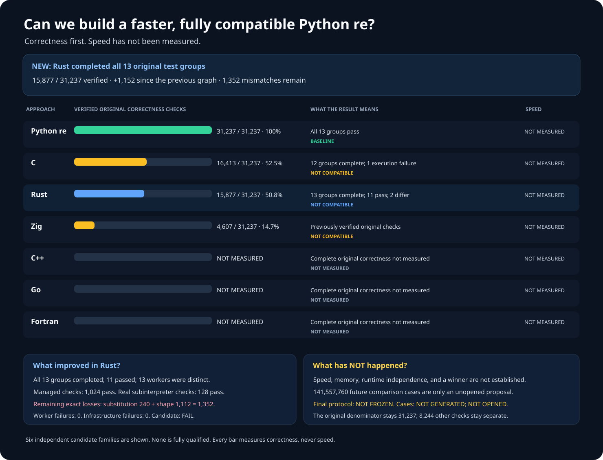
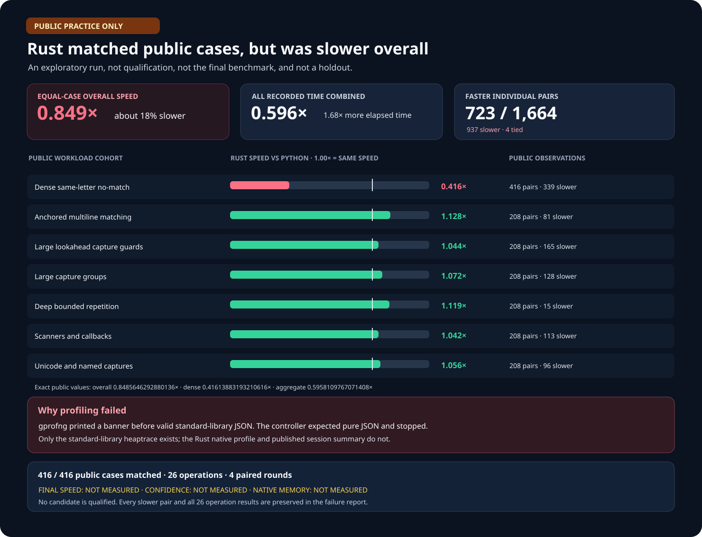

# rebar: a faster Python `re` experiment

Build a faster, fully compatible, from-scratch replacement for
[Python 3.14.6](https://www.python.org/downloads/release/python-3146/)'s
regular-expression module:

```python
import rebar as re
```

Wrapping Python, an existing regular-expression package, or another
project engine does not count. Each candidate must implement its own
regular-expression engine. Dependency files, native links, import
paths, and Python-facing wrappers are independently checked. The latest
audit found real first-party cleanup work and also needs to distinguish
an engine's own language bindings from a borrowed external engine.

## Results at a glance

**Six independently written approaches. Zero compatible
replacements. Final speed: NOT MEASURED. No winner.**



Every percentage uses the same **31,237** original Python checks.
These results measure compatibility, **not speed**. Checks in an
unfinished group are never counted as passing.



In this separate **416-case public practice test**, Rust matched Python's
answer every time. Its typical-case speed was **0.85× Python**; across all
recorded time it was **0.60× Python**. Six kinds of work were faster, but
one repeated-character search was much slower. All **1,664** paired
observations and every slower result are preserved. This is exploratory
practice, not the hidden final test; statistical confidence and final speed
are **NOT MEASURED**.

| Engine | Verified Python checks | Current result |
| --- | --- | --- |
| Python `re` | 31,237 / 31,237; 100% | Reference baseline. |
| C | 16,413 / 31,237; 52.5% | FAIL; all 606 observed differences are preserved; interpreter isolation did not finish. |
| Rust | 15,877 / 31,237; 50.8% | FAIL; exactly 1,352 differences; all 13 test groups completed without worker failures. |
| Zig | 4,607 / 31,237; 14.7% | FAIL; at least 1,700 differences; cleanup errors in all 13 workers; the corrected rerun stopped before matching. |
| C++ | NOT MEASURED | FAIL; 2,308 observed differences and five worker failures. |
| Go | NOT MEASURED | FAIL; 4,518 observed differences and four worker failures. |
| Fortran | NOT MEASURED | FAIL; independent builds disagree; matching was not tested. |

The current public `rebar` import still selects an unqualified Zig
prototype; **it is not a working replacement**. Complete difference
counts are **NOT MEASURED** for unfinished runs. No failed candidate
has established the required runtime no-delegation. The current C
run preserves all **606** observed failing examples. Its older run
saved only **92**; those **514** missing historical examples remain
**NOT RECORDED**.

The latest C run correctly passes all **151** executable original
Python tests while preserving all **152** test records and their
one genuine skipped case. Interpreter isolation still fails.

The corrected, from-scratch Rust engine has been built twice from
its own source with **zero external packages**. Its full run passed
**11 of 13** groups, including all memory-lifetime and interpreter
checks. The remaining **240** replacement and **1,112** changing-
buffer differences mean it is not yet compatible. Speed is
**NOT MEASURED**. A separately frozen changing-buffer safety correction
has produced its own verified first-party source variant; that candidate
has now been built identically twice with no external packages. Its
corrected behavior has not yet been tested.

A corrected interpreter-isolation guard now recognizes real Python
child interpreters while blocking borrowed regular-expression engines.
An isolated proof created and safely destroyed one real interpreter.

## What a replacement must pass

The frozen reference includes **31,237** original Python checks in
**13** groups. Another **8,244** independently verified cases cover
additional real-world behavior. They are a separate test set, not
extra points added to the original denominator. Candidates must also
pass large-input, public-interface, cleanup, interpreter-isolation,
and no-delegation checks.

A further **48,416** real-world cases cover memory-mapped inputs,
typed arrays, replacement callbacks, scanners, and buffer lifetimes.
Two independent Python processes each passed all **48,416** and
recorded exactly the same answers. This confirms the larger test,
not any replacement. The original **31,237**-case scores do not
change. Candidate results on the additional cases are **NOT MEASURED**.

## More detailed correctness graphs


These historical graphs show individual correctness checks. They do
not report speed or a qualified replacement.


## The larger speed test

The proposed final comparison now covers **141,557,760** cases across
**96** Python operations, **48** types of regular expressions, ten
input representations, and realistic short-to-large workloads. It is
ten times larger than the previous **14,155,776**-case proposal. That
proposal and the original **4,194,304**-case proposal are preserved.

The larger test is **NOT FROZEN**, **NOT GENERATED**, and **NOT OPENED**.
Speed, memory, and statistical confidence are **NOT MEASURED**. It may
run only after at least three independently written engines pass every
required correctness and no-delegation test.

A separate public development suite covers **10,434** equally weighted
cases across **111** Python operations, with **5,217** text and
**5,217** byte-oriented cases. It is not the hidden final test;
expanded-suite Rust compatibility and speed are **NOT MEASURED**.

A winner must be at least **1.5×** faster overall, faster on at least
**60%** of measured cases, and explain every slowdown over **20%**.

## Evidence and reproduction

- [Reproduce and audit the headline graph](docs/REPRODUCING.md).
- [Detailed experiment log, rejected designs, and full evidence](docs/EXPERIMENT-LOG.md).
- [Frozen original Python correctness checks](oracle/phase1/P0-COMPLETENESS-V4.md) and [8,244 independent additional checks](oracle/phase1/P0-DIFFERENTIAL-FUZZ-REFERENCE-V3.md).
- [48,416 additional real-world buffer and memory-mapping questions](oracle/phase1/P0-PUBLIC-BUFFER-CARRIERS-SUPPLEMENT-V1.md).
- [Frozen two-process Python reference for those 48,416 cases](oracle/phase1/P0-PUBLIC-BUFFER-CARRIERS-REFERENCE-V1.md).
- [Actual two-process Python results for all 48,416 cases](oracle/phase1/evidence/public-buffer-carriers-reference-v1-cpython-3.14.6-publication-receipt.json).
- [Six independently authored engines](oracle/phase2/SIX-FAMILY-P0-PRODUCER-V5.md) and the [no-wrapping audit](oracle/phase2/CANDIDATE-INDEPENDENCE-V2.md).
- [Strict first-party dependency, wrapper, and no-delegation policy](oracle/phase2/RUNTIME-NON-DELEGATION-V2.md).
- [Preserved strict-audit failure on valid Rust lifetime syntax](oracle/phase2/evidence/runtime-non-delegation-v2-actual-source-lexer-failure.json).
- [Corrected strict from-scratch and no-wrapping source audit](oracle/phase2/RUNTIME-NON-DELEGATION-V3.md).
- [Actual seven-finding audit result, including first-party binding policy errors](oracle/phase2/evidence/runtime-non-delegation-v3-actual-source-audit-failure.json).
- [Latest C run, 16,413 verified checks, and all 606 preserved failures](oracle/phase2/evidence/repaired-c-original-campaign-v12-c-phase2-v21-c-original-match-semantics-original-p0-v12-failures-publication-receipt.json).
- [Frozen C test and complete failure-preservation rules](oracle/phase2/REPAIRED-C-ORIGINAL-CAMPAIGN-V11.md).
- [Corrected C test preserving all real records and the genuine skipped case](oracle/phase2/REPAIRED-C-ORIGINAL-CAMPAIGN-V12.md).
- [Previous C run and its original 606 preserved failures](oracle/phase2/evidence/repaired-c-original-campaign-v11-c-phase2-v21-c-original-match-semantics-original-p0-v11-failures-publication-receipt.json).
- [Historical C run with 514 missing individual examples](oracle/phase2/evidence/repaired-c-original-campaign-v10-c-phase2-v21-c-original-match-semantics-original-p0-v10-failures-publication-receipt.json).
- [Latest full Rust run: 15,877 verified checks and all 1,352 preserved differences](oracle/phase2/evidence/repaired-rust-original-campaign-v16-rust-phase2-v24-rust-capture-shape-v2-root-provenance-original-p0-v24-failures-publication-receipt.json).
- [Previous Rust regression and its preserved failure](oracle/phase2/evidence/repaired-rust-original-campaign-v16-rust-phase2-v22-rust-capture-shape-root-provenance-original-p0-v22-failures-publication-receipt.json).
- [Latest real Zig run and complete observed failure](oracle/phase2/evidence/repaired-zig-original-campaign-v13-phase2-v13-zig-guard-clean-lifetime-v1-original-p0-v13-failures-publication-receipt.json).
- [Frozen first-party Zig cleanup correction](oracle/phase2/ZIG-DEALLOCATOR-SETATTR-SOURCE-REPAIR-V2.md) and [preserved Zig rerun that stopped before matching](oracle/phase2/evidence/zig-original-campaign-v14-setter-safe-prepublication-controller-failure.json).
- [Next Zig test, correcting the stopped rerun; not yet run](oracle/phase2/REPAIRED-ZIG-ORIGINAL-CAMPAIGN-V15.md).
- [Frozen Rust correctness procedure](oracle/phase2/REPAIRED-RUST-ORIGINAL-CAMPAIGN-V22.md) and [next targeted Rust buffer correction; not yet run](oracle/phase2/RUST-CAPTURE-SHAPE-SEMANTICS-V2.md).
- [Next Rust test, preserving the previous regression; not yet run](oracle/phase2/REPAIRED-RUST-ORIGINAL-CAMPAIGN-V23.md).
- [Reproducible first-party Rust build with no external packages](oracle/phase2/RUST-CAPTURE-SHAPE-SEMANTICS-V2-SOURCE-BUILD-V24.md).
- [Frozen from-scratch Rust changing-buffer capture safety correction](oracle/phase2/RUST-CAPTURE-CLAMP-SEMANTICS-V1.md).
- [Actual immutable Rust changing-buffer source-variant creation](oracle/phase2/evidence/rust-capture-clamp-semantics-v1-application.json).
- [Frozen offline first-party build for the corrected Rust engine](oracle/phase2/RUST-CAPTURE-CLAMP-SOURCE-BUILD-V25.md).
- [Actual successful corrected Rust build: 28 offline processes and identical native binaries](oracle/phase2/evidence/native-source-build-v25-rust-phase2-v25-rust-capture-clamp-v1-root-provenance-publication-receipt.json).
- [Actual successful first-party Rust build; matching not yet tested](oracle/phase2/evidence/native-source-build-v24-rust-phase2-v24-rust-capture-shape-v2-root-provenance-publication-receipt.json).
- [Corrected interpreter isolation and strict no-external-engine guard](oracle/phase2/CANDIDATE-RUNTIME-INDEPENDENCE-V4.md).
- [Actual successful child-interpreter proof; no candidate or external engine](oracle/phase2/evidence/candidate-runtime-independence-v4-explicit-provider-proof.json).
- [Executable full Rust compatibility procedure](oracle/phase2/REPAIRED-RUST-ORIGINAL-CAMPAIGN-V24.md).
- [Preserved Rust activation failure](oracle/phase2/evidence/rust-original-campaign-v21-v3-preactivation-contract-failure.json).
- [141,557,760-case unopened final-speed-test proposal](oracle/phase3/EXPANDED-SEALED-HOLDOUT-V2.md).
- [Preserved previous 14,155,776-case speed-test proposal](oracle/phase3/EXPANDED-SEALED-HOLDOUT-V1.md).
- [10,434-case public development and correctness-gated timing suite](oracle/phase3/RUST-PUBLIC-PRACTICE-BENCHMARK-V2.md).
- [Public-only Rust CPU, allocation, memory, and Python-boundary profiling](oracle/phase3/RUST-PUBLIC-PROFILE-V1.md).
- [Complete first public-profile interruption and all 1,664 practice measurements](oracle/phase3/evidence/rust-public-profile-v1-run-001-prepublication-failure.json).
- [Original objective](GOAL.md), SHA-256
  `e5935060b44fe5f6b4e19ac2d01f3ce63182cf6a1d3b416502a4441cde345b62`;
  [later clarifications](AMENDMENTS.md).
