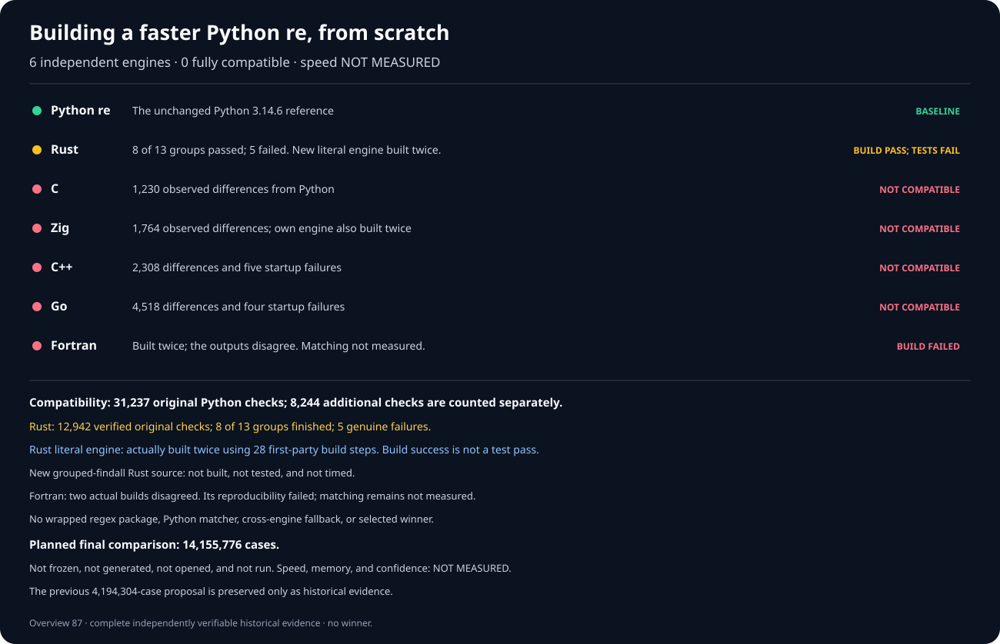
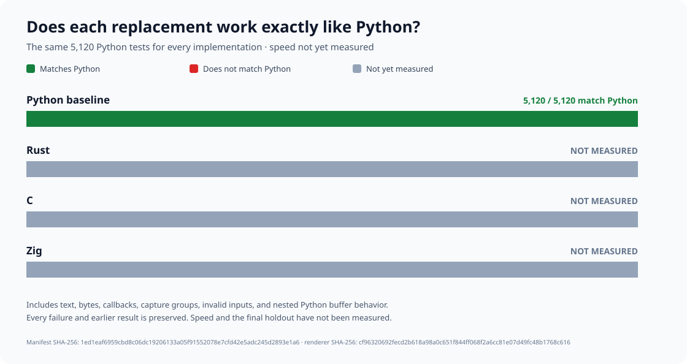

# rebar: a faster Python `re` experiment

Build a faster, fully compatible, from-scratch replacement for
[Python 3.14.6](https://www.python.org/downloads/release/python-3146/)'s
regular-expression module:

```python
import rebar as re
```

Each engine must be independently written. Wrapping Python, an external
regular-expression package, or another candidate does not count.

## Results

**Six** from-scratch engines. **Zero** fully compatible replacements.
Speed versus Python: **NOT MEASURED**. There is no winner.



This reproducible chart predates the newer C and captured-result Rust
builds. The C engine and both Rust variants now build successfully;
none has passed all compatibility checks or been timed.

| Engine | Compatibility with Python | Speed versus Python |
| --- | --- | --- |
| Python `re` | Baseline; reference checks pass | Not timed |
| Public `rebar` import | FAIL; still selects an unqualified Zig prototype | NOT MEASURED |
| Rust | FAIL; 8/13 groups; 12,942/31,237 verified | NOT MEASURED |
| C | FAIL; 1,230 differences; native build passes | NOT MEASURED |
| Zig | FAIL; 1,764 differences; native build passes | NOT MEASURED |
| C++ | FAIL; 2,308 differences and five worker failures | NOT MEASURED |
| Go | FAIL; 4,518 differences and four worker failures | NOT MEASURED |
| Fortran | FAIL; independent builds disagree; matching not tested | NOT MEASURED |

The frozen original Python suite contains **31,237** checks in **13**
groups. A separate **8,244**-case collection covers additional real-world
behavior; two independent Python reference runs each pass all **8,244**.
These are separate test sets and are never combined or counted twice.

First-party native source builds recorded **14** C, **28** Rust, and
**26** Zig compiler and binary-inspection steps. The corrected C engine
and both the literal-search and captured-result Rust engines each
passed their own two independent build phases. No successful build
proves compatibility.
Rust finished **8** of **13** groups and verified **12,942** cases;
**5** workers failed. The corrected Zig matching test is **NOT RUN**.
Zig's earlier **1,764** differences remain; no candidate qualifies.
Full-suite matching is **NOT MEASURED**.
Runtime independence is **NOT ESTABLISHED**.

## Detailed correctness

These historical charts show particular compatibility checks; none claims
a passing replacement or a speed measurement.




## Final speed comparison

The latest proposed final test covers **14,155,776** unseen cases across
**36** Python operations, **24** kinds of regular expressions, and both
text and byte-oriented inputs. All four participants would run every case
in **24** balanced rounds. The earlier **4,194,304**-case proposal is
preserved.

The larger test is **NOT FROZEN**, **NOT GENERATED**, and **NOT OPENED**.
Speed, memory, and statistical confidence are **NOT MEASURED**.

Do not start this test until three independent engines pass both test
sets, the original two-billion-character checks, public API checks,
and the no-delegation audit. A winner must be at least **1.5×** faster
overall, faster on at least **60%** of measured cases, and explain every
slowdown over **20%**.

## Evidence

- [Reproduce the results](docs/REPRODUCING.md) and [headline comparison chart](tools/render_candidate_current_overview_v87.py).
- [Full experiment log, build evidence, failures, and rejected designs](docs/EXPERIMENT-LOG.md).
- [Complete Python correctness reference](oracle/phase1/P0-COMPLETENESS-V4.md).
- [Independent reference for the 8,244 additional checks](oracle/phase1/P0-DIFFERENTIAL-FUZZ-REFERENCE-V3.md).
- [Six independently written engine families](oracle/phase2/SIX-FAMILY-P0-PRODUCER-V5.md) and [no-wrapping audit](oracle/phase2/CANDIDATE-INDEPENDENCE-V2.md).
- [Guarded first-party C correctness](oracle/phase2/REPAIRED-C-ORIGINAL-CAMPAIGN-V5.md), [reproducible native source-build procedure](oracle/phase2/C-SUBJECT-BUFFER-SOURCE-BUILD-V18.md), and [independently authenticated C build](oracle/phase2/evidence/native-source-build-v18-c-phase2-v18-c-subject-buffer-root-provenance-publication-receipt.json); corrected-engine compatibility not yet established.
- [Guard-clean, from-scratch Zig candidate and correctness procedure](oracle/phase2/REPAIRED-ZIG-ORIGINAL-CAMPAIGN-V5.md); full-suite rerun not yet performed.
- [Reproducible Rust compatibility-failure diagnostics](oracle/phase2/REPAIRED-RUST-ORIGINAL-CAMPAIGN-V16.md); new full-suite run not yet performed.
- [From-scratch Rust literal-search](oracle/phase2/RUST-LITERAL-FINDALL-ONE-PASS-V1.md) and [captured-result experiments](oracle/phase2/RUST-CAPTURED-FINDALL-ONE-PASS-V1.md), with reproduced [literal](oracle/phase2/RUST-LITERAL-FINDALL-SOURCE-BUILD-V20.md) and [captured-result](oracle/phase2/RUST-CAPTURED-FINDALL-SOURCE-BUILD-V21.md) native builds; compatibility and speed not yet established.
- [Larger, unopened 14,155,776-case speed-test proposal](oracle/phase3/EXPANDED-SEALED-HOLDOUT-V1.md) and [preserved earlier proposal](docs/EXPANDED-HOLDOUT-PROTOCOL-V1.md).
- [Original objective](GOAL.md), SHA-256
  `e5935060b44fe5f6b4e19ac2d01f3ce63182cf6a1d3b416502a4441cde345b62`;
  [later clarifications](AMENDMENTS.md).
