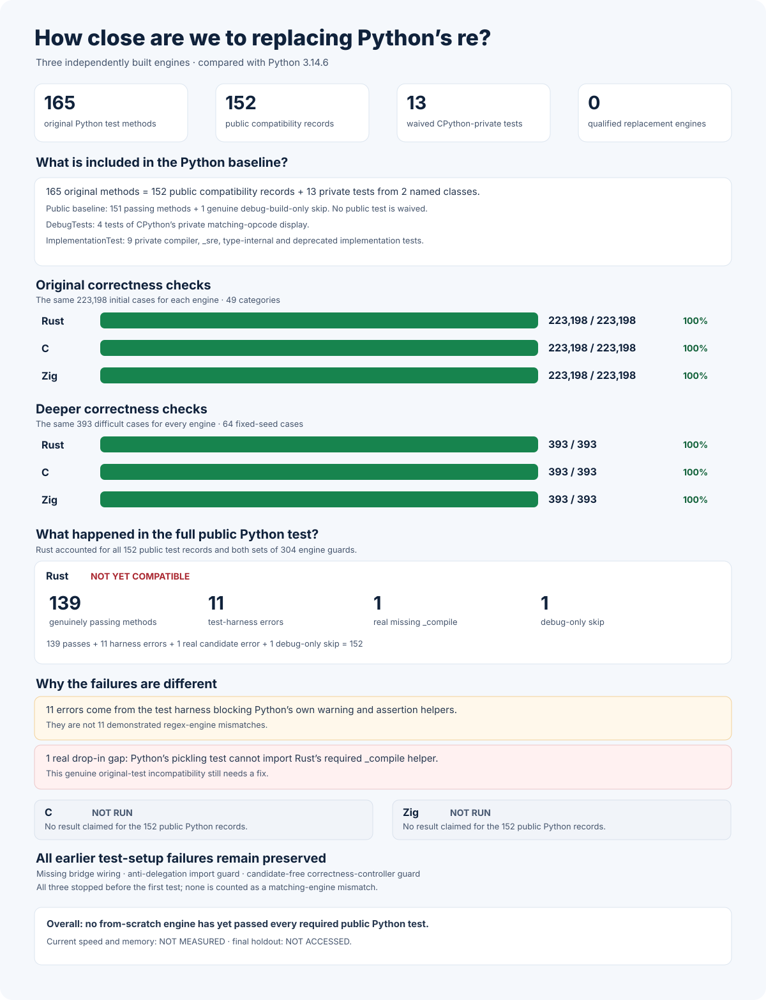

# rebar: a faster Python `re` experiment

Can a regular-expression engine built from scratch replace
[Python 3.14.6's](https://www.python.org/downloads/release/python-3146/)
`re` and run faster? The intended interface is `import rebar as re`.
Every candidate must use its own matching engine, not Python's engine,
an external regular-expression package, or another candidate.

**Current result:** the independently built C, Rust, and Zig engines each
pass **223,198** initial cases and **393** harder cases. Rust is the only
engine tested against Python's **152** applicable original public-test
records: **139 passed, 11 exposed test-harness problems, one exposed a
real missing pickling feature, and one genuinely requires a Python debug
build**. C and Zig have **NOT RUN** those tests. Current speed and memory
are **NOT MEASURED**. There is no winner.

## Current results



Python's original test file contains **165** tests. **152** test the
public replacement interface; the other **13** test CPython's private
implementation and are explicitly excluded in two named classes:
`DebugTests` (**4**) and `ImplementationTest` (**9**). No public test is
waived. Both actual Python reference runs pass **151** public tests;
the remaining test genuinely requires a Python debug build.

Rust ran the same **152** public-test records. Its **11** test-harness
errors and its real missing `_compile` pickling feature remain visible;
none is counted as a pass. C and Zig are **NOT RUN**. The graph is
[generated from 40 independently verified, preserved evidence records](docs/evidence/current-native-correctness-v5.json).

## Headline results from the last completed comparison

The archived C, Rust, and Zig builds each ran the same 8,192 public examples
as unmodified Python. In these graphs, **1× is Python's speed, higher is
faster, and 1.5× is the target**.


| Archived engine | Speed compared with Python | Clearly faster examples | More than 20% slower |
| --- | ---: | ---: | ---: |
| Python baseline | 1.000× | — | — |
| Zig | 1.214× | 4,680 / 8,192 (57.1%) | 1,401 / 8,192 |
| C | 1.124× | 4,511 / 8,192 (55.1%) | 1,433 / 8,192 |
| Previous Rust | 0.957× | 2,444 / 8,192 (29.8%) | 3,106 / 8,192 |

No archived engine achieved both the 1.5× speed target and a clear speed
improvement on at least 60% of examples. The numbers do not predict how the
current builds will perform.


## More detail from that archived comparison


The memory graph shows temporary allocations visible to Python; memory
allocated privately by the native engines remains **NOT MEASURED**.


The [published comparison](performance/postfinal-public-v6/RESULTS.md),
[preserved exact builds](performance/postfinal-public-v6/NATIVE-ARCHIVE-V1.md),
and [predeclared measurement rules](performance/postfinal-public-v6/PROTOCOL.md)
retain the complete results, uncertainty ranges, and all regressions.

## Current engine details

Each engine uses its own implementation. The frozen source and native-binary
[ownership check](candidates/audits/POSTFINAL-FROM-SCRATCH-AUDIT-V21.json)
and independent
[no-delegation check](candidates/audits/POSTFINAL-NO-DELEGATION-AUDIT-V21.json)
verify that none uses Python's matcher, an external regex package, or another
candidate. Those checks do not establish full compatibility or speed.

| From-scratch engine | Initial correctness cases | Harder correctness cases | 152 original public-test records |
| --- | --- | --- | --- |
| Rust | [223,198 / 223,198](candidates/evidence/rust-v7-edge-oracle-rust-postfinal-current-build-v24-qualified-pass-proof.json) | [393 / 393](candidates/audits/RUST-V8-DEEP-CONTRACT-RUST-POSTFINAL-CURRENT-BUILD-V24-PASS-PROOF.json) | [139 passes, 11 harness errors, 1 incompatibility, 1 debug skip](oracle/cpython-3.14.6/evidence/postfinal-locale-v15-rust-failures-production-summary.json) |
| C | [223,198 / 223,198](candidates/evidence/rust-v7-edge-oracle-vm-postfinal-current-build-v24-qualified-pass-proof.json) | [393 / 393](candidates/audits/RUST-V8-DEEP-CONTRACT-C-POSTFINAL-CURRENT-BUILD-V24-PASS-PROOF.json) | NOT RUN |
| Zig | [223,198 / 223,198](candidates/evidence/rust-v7-edge-oracle-zig-postfinal-current-build-v24-qualified-pass-proof.json) | [393 / 393](candidates/audits/RUST-V8-DEEP-CONTRACT-ZIG-POSTFINAL-CURRENT-BUILD-V24-PASS-PROOF.json) | NOT RUN |

The [original Python baseline](oracle/cpython-3.14.6/evidence/postfinal-locale-v6-self-oracle.json),
[complete Rust failure](oracle/cpython-3.14.6/evidence/postfinal-locale-v15-rust-failures.json),
and [independent failure verification](oracle/cpython-3.14.6/evidence/postfinal-locale-v15-rust-readonly-failure-forensic.json)
are preserved without removing any failure. The separately
[frozen expanded public-interface tests](oracle/cpython-3.14.6/PUBLIC-SURFACE-V27.md)
cover **1,376** examples across **43** categories. Python's two reference
runs pass them; the current candidates have **NOT RUN** those tests.

The [corrected original-test protocol](oracle/cpython-3.14.6/POSTFINAL-LOCALE-V16.md)
keeps every public test and removes only the test harness's own interference.
An [independent read-only check](oracle/cpython-3.14.6/evidence/postfinal-locale-v16-readonly-native-bridge-integration-pass.json)
verifies the two Python baselines, all three from-scratch engines, and their
preserved evidence without importing or running an engine. Candidate results
under this corrected protocol are **NOT RUN**.

The [independent-language inventory](experiments/FROM-SCRATCH-LANGUAGE-LANDSCAPE-V1.md)
also covers separately authored
[C++](experiments/cpp_from_scratch_v1/STATIC-GAPS-V1.md) and
[Go](experiments/go_from_scratch_v1/STATIC-GAPS-V1.md) designs. They are
**NOT BUILT, NOT RUN, and NOT QUALIFIED**. The
[pinned official Zig compiler](toolchains/zig-0.16.0.lock.json) makes the
existing Zig engine reproducible from its own source. Different bindings
to the same matching engine never count as independent candidates.

Detailed experiments, rejected approaches, setup failures, commands, and
complete evidence belong in the [experiment log](docs/EXPERIMENT-LOG.md),
not in this overview.

## Larger fair speed comparison

A larger, **33,280-example** public comparison and a separate,
independently generated **33,280-example** final test are planned.
Neither has been frozen or used to measure the current engines. The
final test is **NOT OPENED**. Current speed, memory use, uncertainty,
slowdowns, and rankings are **NOT MEASURED**.

## Evidence and reproduction

The [experiment log](docs/EXPERIMENT-LOG.md) records the detailed
experiments, rejected designs, genuine failures, and their resolutions.
The original objective in [GOAL.md](GOAL.md) remains unchanged, with
SHA-256
`e5935060b44fe5f6b4e19ac2d01f3ce63182cf6a1d3b416502a4441cde345b62`.
[AMENDMENTS.md](AMENDMENTS.md) records later clarifications separately.

Recheck the frozen current-engine audits, original public-test runner,
expanded public tests, and the exact generated headline chart without
benchmarking a candidate:

```sh
PY=/tmp/rebar-cpython/cpython-3.14.6-linux-x86_64-gnu/bin/python3.14

"$PY" -I -B tools/postfinal_independent_engine_audit_v21.py --self-test
"$PY" -I -B tools/postfinal_current_build_proofs_v24.py --self-test
"$PY" -I -B tools/postfinal_cpython_locale_oracle_v15.py --self-test
"$PY" -I -B tools/postfinal_cpython_locale_oracle_v16.py --self-test
"$PY" -I -B tools/python_re_public_surface_oracle_stage27.py --self-test
"$PY" -I -B tools/render_current_correctness_v5.py --self-test
"$PY" -I -B tools/render_current_correctness_v5.py --check
```
