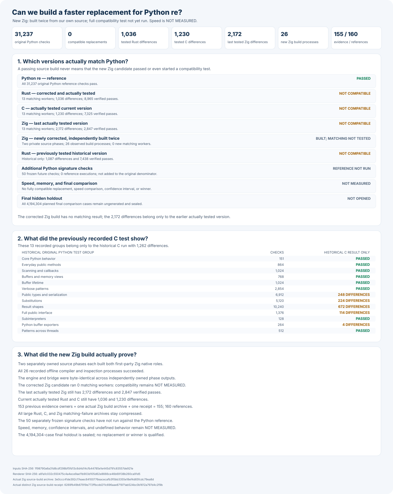

# rebar: a faster Python `re` experiment

Build a faster, fully compatible replacement for Python 3.14.6's
regular-expression module:

```python
import rebar as re
```

Every candidate must use its own matching engine built from scratch. Wrapping
Python, another regular-expression package, or another candidate does not count.

## Headline results

Python passes all **31,237** frozen compatibility checks. No replacement
has passed them, so there is not yet a drop-in alternative or a speed winner.

An additional **50** public function and method signature checks are now
frozen separately. Neither Python's new reference run nor a candidate's
result for those extra checks has been measured.



Rust, C, Zig, C++, Go, and Fortran each use a separately written engine.
The newly rebuilt Rust engine completed all **13** Python test groups and
has **1,036** differences, down from **1,087**. Its verified passing
checks increased from **7,438** to **8,965**. It is still not a drop-in
replacement.

The corrected from-scratch Zig engine has now been independently built
twice; both native builds are identical. Its complete Python compatibility
test has **NOT RUN**. Further evidence-backed Rust, Go, and C++ corrections
are frozen; their rebuilt compatibility is **NOT MEASURED**.

Both Rust source builds agree, use no outside regular-expression engine,
and were compiled and inspected in **28** offline steps. The full test
restored all four original source and engine files.

The latest from-scratch C engine was built independently twice and tested
against all **13** original Python groups. It has **1,230** matching
differences, down from **1,262** in the previous C engine. All workers
completed, none crashed, and the original native file was restored. Its
**7,325** verified passing checks still do not make it a replacement.

Overall speed relative to Python: **NOT MEASURED**. Benchmarking starts
only after three independent engines pass all compatibility checks.

| Engine | Current build | Complete compatibility | Speed against Python |
| --- | --- | --- | --- |
| Python `re` | Reference | 31,237 / 31,237 | Reference; not timed |
| Rust | Two first-party builds; next representation fix not yet built | 8,965 verified; 1,036 differences; no worker failures; not qualified | NOT MEASURED |
| C | Two identical first-party builds; all 13 groups tested | 7,325 verified; 1,230 differences; no worker failures; not qualified | NOT MEASURED |
| Zig | Corrected engine built independently twice; not yet retested | Earlier build: all 13 groups; 2,172 differences; not qualified | NOT MEASURED |
| C++ | Earlier first-party builds; argument correction not yet built | 128 verified; 2,308 differences; five worker failures | NOT MEASURED |
| Go | Earlier first-party builds; Unicode correction not yet built | 128 verified; 4,518 differences; four worker failures | NOT MEASURED |
| Fortran | Three attempts; engines differ | NOT TESTED | NOT MEASURED |

## Detailed compatibility

The per-group columns preserve earlier development results. The latest
complete results are **1,036** Rust differences, **1,230** C differences,
and **2,172** Zig differences. Their durable matching receipts do not
contain a new per-group breakdown, so none is invented below.

| Python behavior | Cases | Rust (earlier) | C (previous) | Zig (earlier) | C++ | Go |
| --- | ---: | ---: | ---: | ---: | ---: | ---: |
| Python's original runnable public tests | 151 | 151 | 151 | 151 | 43 failures | 38 failures |
| General public behavior | 864 | 864 | 864 | 864 | 40 failures | 153 failures |
| Scanners and callbacks | 1,024 | 1,024 | 1,024 | 960; 64 failures | 992 failures | 960 failures |
| Memory views and buffers | 768 | 768 | 768 | 768 | 181 failures | 197 failures |
| Total initial matching checks | 2,807 | 2,807 | 2,807 | 2,743; 64 failures | 1,256 failures | 1,348 failures |
| Additional memory-lifetime safety, counted separately | 1,024 | 1,024 | 1,024 | 1,024 | 600 failures | 668 failures |
| Verbose scanners and pattern comments | 2,854 | 2,854 | 2,854 | 2,234; 620 failures | Test worker failed | Test worker failed |
| Additional public types, copying, and serialization | 6,912 | 248 failures | 248 failures | 248 failures | Test worker failed | Test worker failed |
| Replacement and buffer behavior | 5,120 | 336 failures | 224 failures | 64 failures | Test worker failed | 2,058 failures |
| Changing-size buffer behavior | 10,240 | 1,392 failures | 672 failures | 672 failures | Test worker failed | Test output exceeded worker limit |
| Broad public behavior and real locales | 1,376 | 66 failures | 114 failures | 96 failures | 336 failures | 324 failures |
| Python buffer exporters and retained scanners | 264 | 264 | 4 failures | 264 | 116 failures | 120 failures |
| Simultaneous isolated Python interpreters | 128 | Setup failed; matching not established | 128 | Cleanup and report verification failed; no complete suite | 128 | 128 |
| Patterns shared across simultaneous Python threads | 512 | 512 | 512 | 512 | Test worker failed | Test worker failed |
| Full frozen compatibility gate | 31,237 | Failed; 7,461 verified; five groups failed | Failed; 7,325 verified; 1,262 mismatches; five groups failed | Failed; 3,583 verified; seven groups failed | Failed; 128 verified; 2,308 mismatches; five worker failures | Failed; 128 verified; 4,518 mismatches; four worker failures |

A passed example inside a failed group does not qualify an engine. Python's
debug-only check is excluded equally for every candidate.

The detailed charts below are from earlier, clearly labeled development
builds. They are not passing results for the current implementations.


## Final comparison

The final comparison is planned to use **4,194,304** unseen examples and
**24** balanced measurement rounds. Its cases remain **NOT FROZEN**,
**NOT GENERATED**, and **NOT OPENED**. Current speed and memory are
**NOT MEASURED**.

First, three independently built engines must pass all **31,237**
compatibility checks. To win, an engine must be at least **1.5×** faster
overall, measurably faster in at least **60%** of cases, and explain every
slowdown greater than **20%**. There is no winner.

## Evidence and reproduction

- [How to reproduce every result and verify the current graph](docs/REPRODUCING.md).
- [Full experiment log, raw reports, past results, and rejected designs](docs/EXPERIMENT-LOG.md).
- [Frozen Python compatibility tests](oracle/phase1/P0-COMPLETENESS-V1.md).
- [Separately frozen public function and method signature checks](oracle/phase1/P0-CALLABLE-INTROSPECTION-V1.md).
- [Proof the candidate engines are independently built](oracle/phase2/CANDIDATE-INDEPENDENCE-V2.md).
- [Evidence-backed correction of C++ public function arguments](oracle/phase2/CPP-PUBLIC-ARGUMENT-SOURCE-REPAIR-V1.md).
- [Evidence-backed correction of Unicode names in the first-party Go engine](oracle/phase2/GO-UNICODE-NAME-SOURCE-REPAIR-V1.md).
- [Source-only correction of the observed Zig scanner failure](oracle/phase2/ZIG-SCANNER-CAPTURE-SOURCE-REPAIR-V2.md).
- [Frozen independent build rules for the corrected from-scratch Zig engine](oracle/phase2/ZIG-SCANNER-SOURCE-BUILD-V12.md).
- [Actual corrected Zig builds and their independent publication receipt](oracle/phase2/evidence/native-source-build-v12-zig-phase2-v12-zig-scanner-v2-publication-receipt.json).
- [Recoverable original Python compatibility tests for repaired Rust](oracle/phase2/REPAIRED-RUST-ORIGINAL-CAMPAIGN-V3.md).
- [Frozen full Python test for the newly rebuilt Rust engine](oracle/phase2/REPAIRED-RUST-ORIGINAL-CAMPAIGN-V4.md).
- [Actual complete corrected Rust test and recovery receipt](oracle/phase2/evidence/repaired-rust-original-campaign-v4-rust-phase2-v12-rust-flag-original-p0-failures-publication-receipt.json).
- [Source-only correction of the observed Rust flag-display failure](oracle/phase2/RUST-PUBLIC-CONTRACT-SOURCE-REPAIR-V2.md).
- [Evidence-backed correction of the next actual Rust compiled-pattern failure](oracle/phase2/RUST-PUBLIC-CONTRACT-SOURCE-REPAIR-V3.md).
- [Frozen first-party build rules for the corrected Rust engine](oracle/phase2/RUST-FLAG-SOURCE-BUILD-V12.md).
- [Actual corrected Rust build evidence and durable receipt](oracle/phase2/evidence/native-source-build-v12-rust-phase2-v12-rust-flag-original-p0-publication-receipt.json).
- [Evidence-backed C match-pickling compatibility repair](oracle/phase2/FIRST-PARTY-SOURCE-REPAIR-V2.md).
- [Reproducible offline build rules for the corrected C engine](oracle/phase2/C-PICKLE-SOURCE-BUILD-V15.md).
- [Recovery-safe complete Python tests for the rebuilt C engine](oracle/phase2/REPAIRED-C-ORIGINAL-CAMPAIGN-V4.md).
- [Corrected safe recovery rules for both existing Zig engine files](oracle/phase2/VERIFIED-NATIVE-ACTIVATION-V7.md).
- [Corrected complete Python compatibility tests for repaired Zig](oracle/phase2/REPAIRED-ZIG-ORIGINAL-CAMPAIGN-V2.md).
- [Why the first repaired-Zig test stopped before any matching began](oracle/phase2/ZIG-CAMPAIGN-PREFLIGHT-FAILURE-V1.md).
- [Expanded, still-unopened final comparison](docs/EXPANDED-HOLDOUT-PROTOCOL-V1.md).
- [Original objective](GOAL.md), SHA-256
  `e5935060b44fe5f6b4e19ac2d01f3ce63182cf6a1d3b416502a4441cde345b62`;
  [later clarifications](AMENDMENTS.md).
