# rebar

This repository is a phase-gated experiment to find a compatible, materially faster replacement for Python's `re` module.

The immutable objective is [GOAL.md](GOAL.md), SHA-256 `e5935060b44fe5f6b4e19ac2d01f3ce63182cf6a1d3b416502a4441cde345b62`. Scope clarifications are in [AMENDMENTS.md](AMENDMENTS.md).

## Status

| Gate | Result |
| --- | --- |
| Correctness oracle | PASS v1.1 — 2,048/2,048, 38/38 obligations, zero invalid successes or false properties |
| Qualified candidates | 3/3 — independent AST, native bytecode VM, and Rust/FFI families each pass 2,048/2,048 |
| Performance oracle | PASS — 1,152 paired, correctness-gated rows per experiment; native C meets the holdout speed and breadth targets |
| Winner | Native C candidate qualifies; `rebar` exposure NOT MEASURED |

The baseline is [CPython 3.14.6](oracle/v1/BASELINE.md). The [P0 matrix](oracle/v1/P0.md) covers the complete public API, documented syntax, errors, warnings, seeded differential/property/fuzz cases, and two explicitly named private waivers. The v1.1 fixture SHA-256 is `983885ee6411fd806edf3d72efbcc989f9b9f7775a6d127dc7c865673eeb0fed`; the denominator and all seeds are unchanged. Two isolated stdlib runs agree, and the committed failure list is empty. The pre-candidate strengthening is recorded in [AMENDMENTS.md](AMENDMENTS.md).

## How the replacements compare with Python `re`

The latest holdout contains 16 different tasks that were kept separate from tuning. “Overall speed” combines all 16 fairly: **1× means the same speed as Python `re`; higher is faster**. “Clearly faster” counts only results whose measured range stays above 1×. A large slowdown means more than 20% slower.

| Replacement | Overall speed | Clearly faster | Large slowdowns | Plain-language result |
| --- | ---: | ---: | ---: | --- |
| Native C engine | **1.56×** | **14/16** | **0/16** | Meets both targets: faster overall, clearly faster on almost every task, and no large holdout slowdown. |
| Rust engine | **0.014×** | **0/16** | **15/16** | Much slower; crossing between Python and Rust costs too much on these short calls. |
| Python backtracker | **0.011×** | **0/16** | **16/16** | Much slower; doing the matching work in Python costs too much. |


The target is at least **1.5× overall** and clearly faster on at least **10/16** holdout tasks. The native C engine reaches **1.5597×** overall (95% range **1.5363–1.5840×**) and is clearly faster on **14/16**. The [full measured report](performance/v1/evidence/FINAL-CANDIDATE.md) includes every result and explains the one practice-test slowdown.

The [candidate discovery experiment](candidates/evidence/DISCOVERY.md) and all raw losses are preserved as rejected binding experiments. Three independent, dependency-free families are correctness-qualified: the [recursive AST backtracker](candidates/AST.md), the [iterative parser/native bytecode VM](candidates/VM.md), and the [Rust continuation arena/FFI](candidates/RUST.md). Native gates include sanitizer runs and zero-delegation audits. No performance claim has been made.

The [performance protocol](performance/v1/PROTOCOL.md) freezes 16 calibration and 16 holdout cases with equal weights, paired trials, seeds, lifecycle/boundary coverage, memory observations, confidence intervals, and regression rules. Its expected-result SHA-256 is `35d016d9f6f02f917a3c86df221a4b1fed3ede689c85646dd08aab34ec673344`. The [first pilot](performance/v1/evidence/PILOT.md) exposed severe repeated FFI boundary cost; the [native-search experiment](performance/v1/evidence/PILOT-NATIVE-SEARCH.md) removes it for all inputs and reruns both correctness oracles.

The [initial paired report](performance/v1/evidence/INITIAL-RESULTS.md) retains all 1,152 raw rows, all 96 case/candidate results, and all 92 regressions. Initial holdout geomeans are AST **0.0111x**, native VM **0.1141x**, and Rust/FFI **0.0140x**; only the VM's cold case is statistically faster (1/16).

The [native batching experiment](performance/v1/evidence/NATIVE-BATCH.md) moves repeated `findall`, `finditer`, and `split` searches across the C boundary once, reduces VM state allocation, and adds general prefix/suffix rejection. It passes both correctness oracles and preserves all 1,152 paired rows and 90 regressions. VM holdout improves to **0.3291x** with 2/16 statistically faster cases (long-boundary and cold); AST is **0.0112x** and Rust is **0.0141x**. The result still falsifies a speed win and points to public-result construction and execution-state cost as the next boundary. Winner remains NOT MEASURED.

The [stack-state executor experiment](performance/v1/evidence/STACK-STATE-REJECTED.md) is correctness-clean but rejected: copying a large fixed frame on every branch lowers VM holdout to **0.2435x** (2/16 faster) and preserves 90 regressions. All 1,152 paired rows and generated charts remain committed; the slower executor is removed. This isolates compact choice points and public result construction as the next useful experiments.

The [native public API experiment](performance/v1/evidence/NATIVE-PUBLIC.md) removes repeated Python/C conversions, keeps match results in C, handles common repeats with compact choices, and batches replacement work. It passes all correctness gates and retains all 1,152 paired rows. Native C reaches **1.1178×** overall on holdout (95% range **1.1016–1.1355×**), is clearly faster on **8/16**, and has **4** large slowdowns. The results remain below the success target, so winner is NOT MEASURED.

The [compact native path experiment](performance/v1/evidence/COMPACT-PATH.md) adds general fast paths for simple words, fixed nearby-text checks, repeated scans, and small branches. It passes all correctness gates and retains all 1,152 paired rows. Native C reaches **1.3067×** overall on holdout (95% range **1.2897–1.3242×**), is clearly faster on **10/16**, and has **zero** large holdout slowdowns. This meets the faster-task requirement but not the **1.5×** overall target, so winner remains NOT MEASURED.

The [final native candidate result](performance/v1/evidence/FINAL-CANDIDATE.md) adds one-pass token and separator scanning, direct fixed nearby-text search, compact structured loops, and streaming replacement output. Two earlier near-miss runs are preserved in [one-pass](performance/v1/evidence/ONE-PASS.md) and [structured-loop](performance/v1/evidence/ONE-PASS-LOOP.md). The final run keeps all 1,152 paired rows and passes the target: native C reaches **1.5597×** holdout speed, is clearly faster on **14/16**, and has **zero** large holdout slowdowns. Its single large practice-test slowdown is Unicode word-boundary scanning, explained in the report.


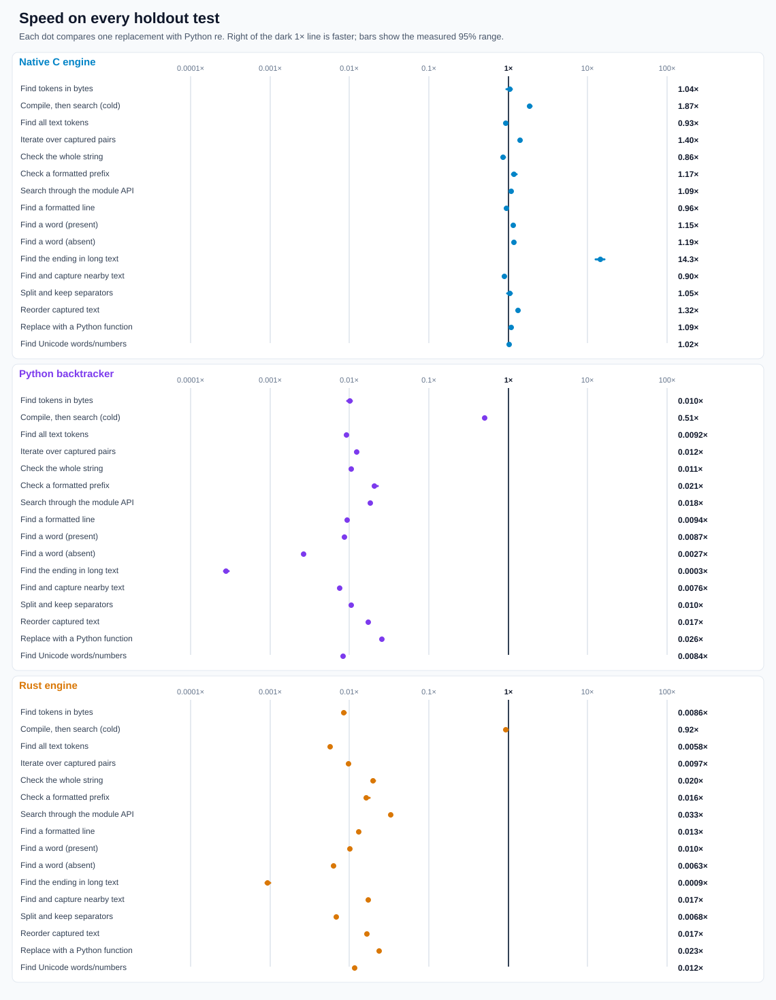

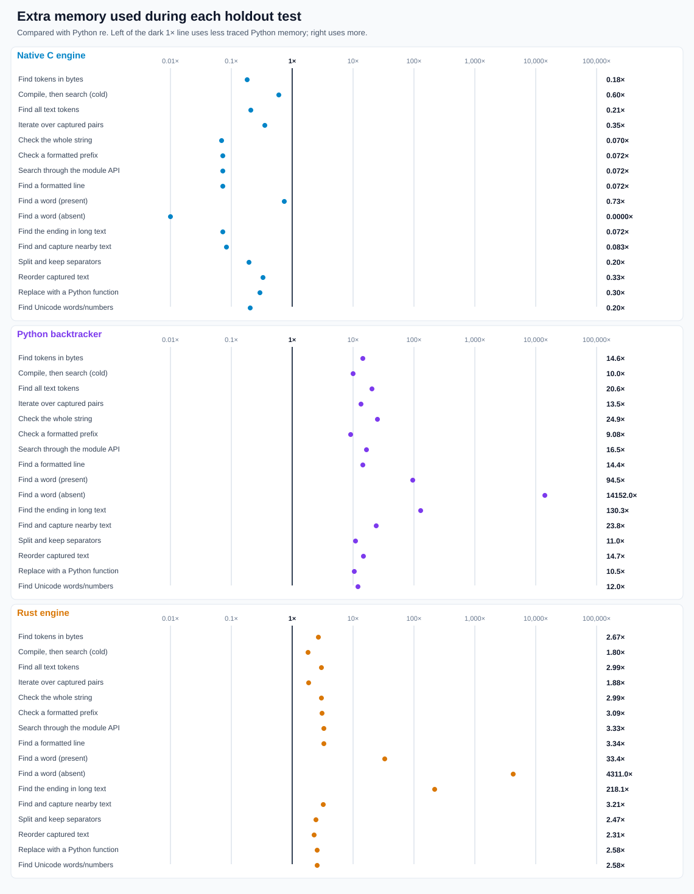

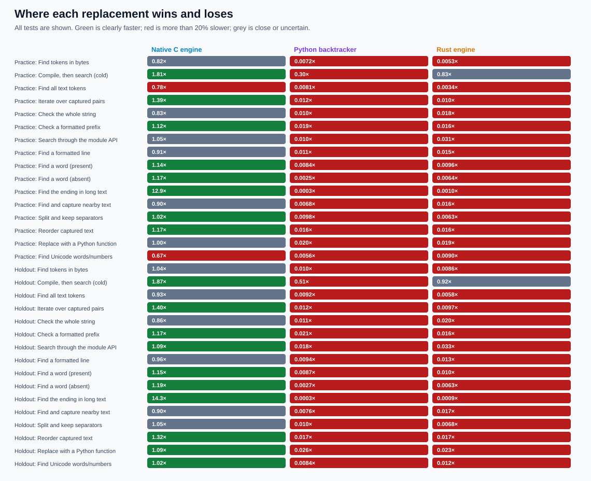

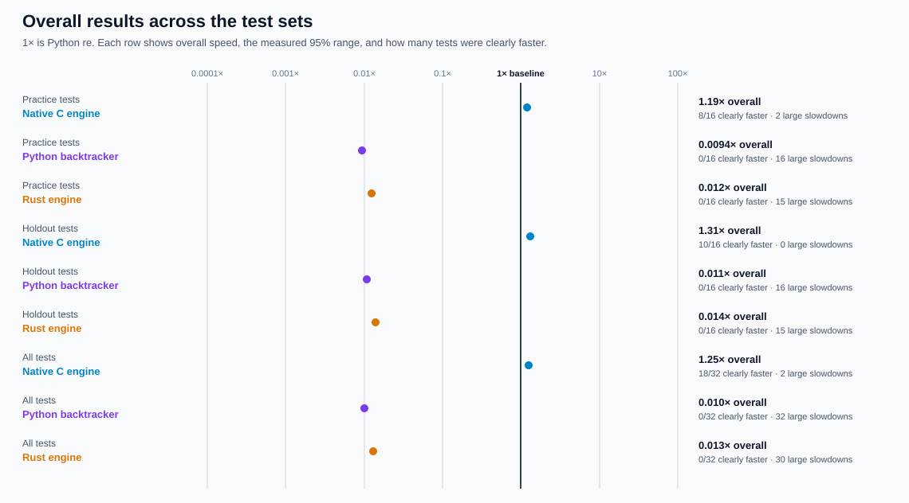

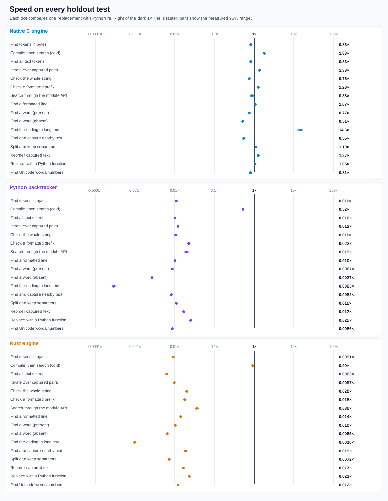

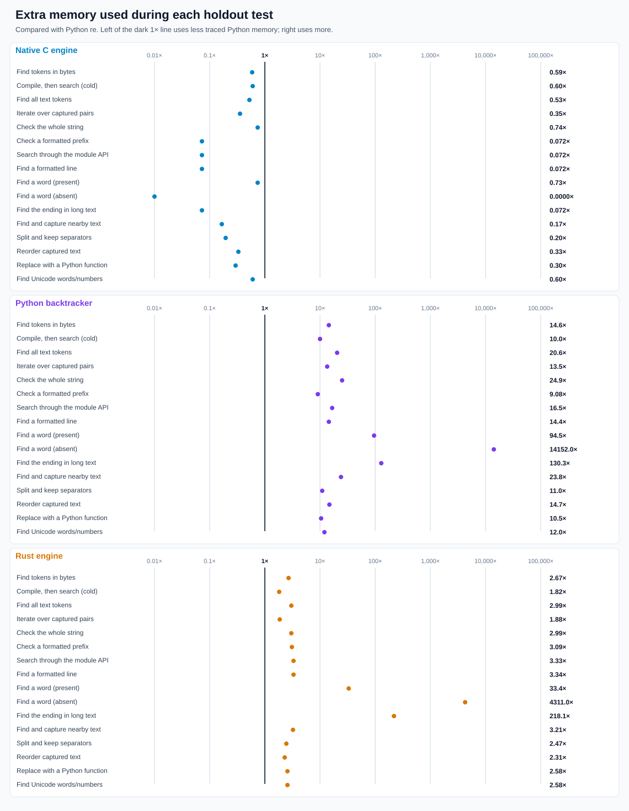

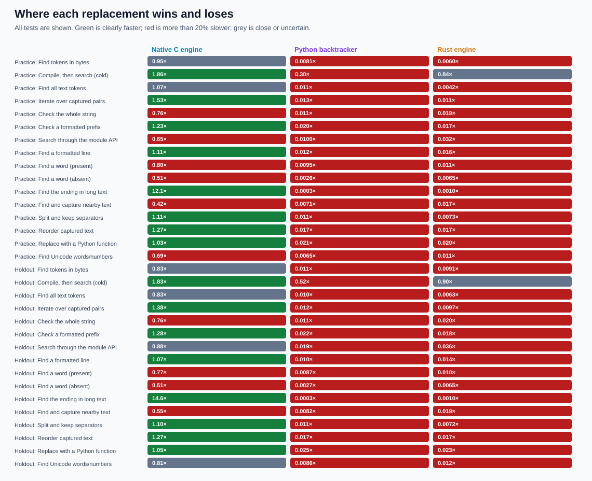

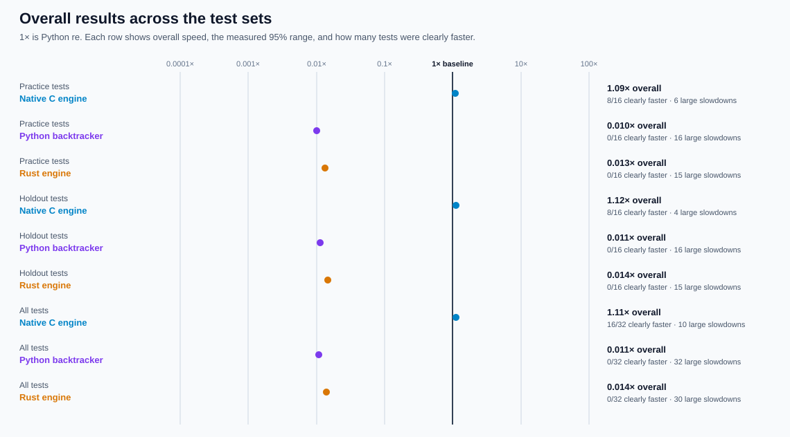

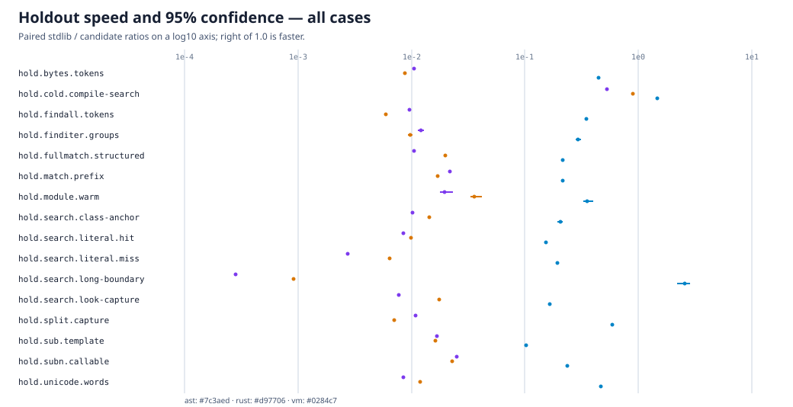


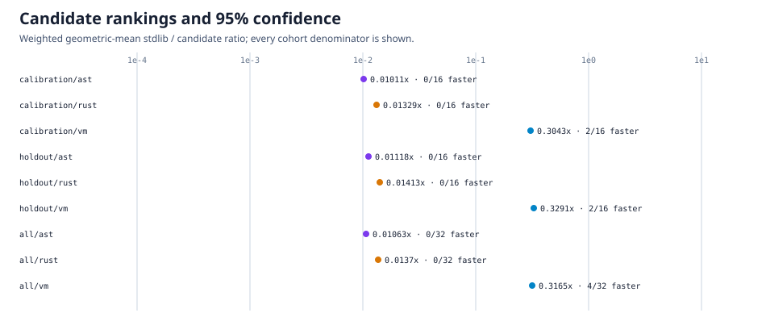

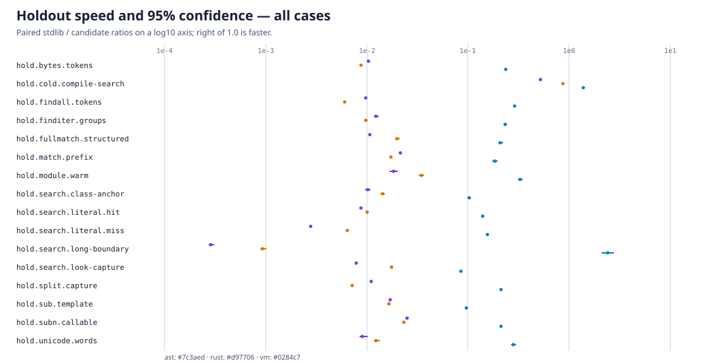

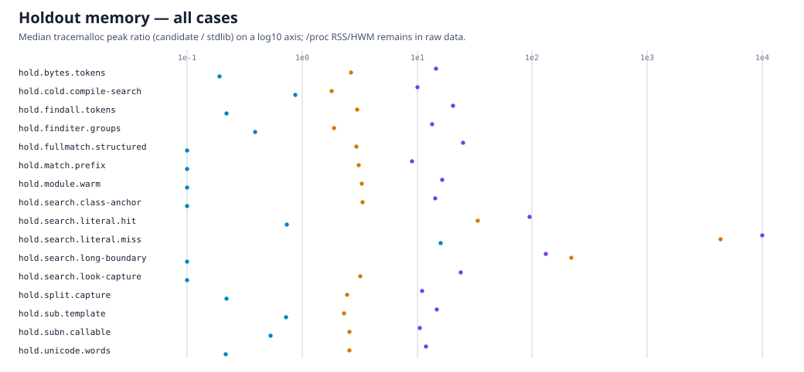


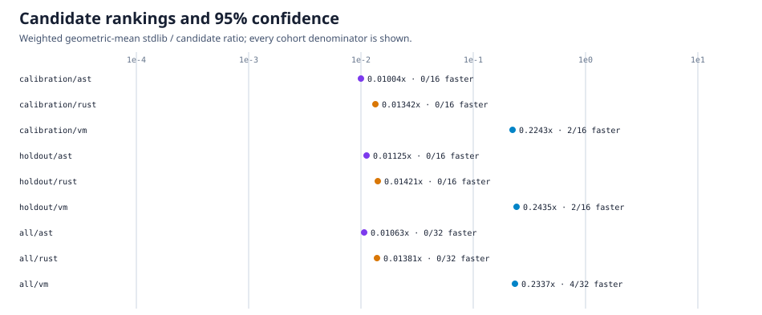


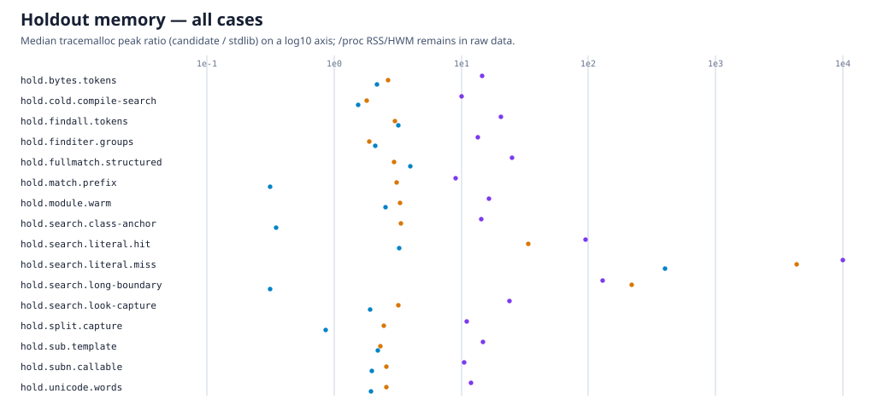


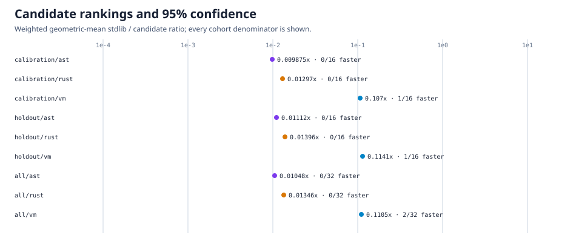


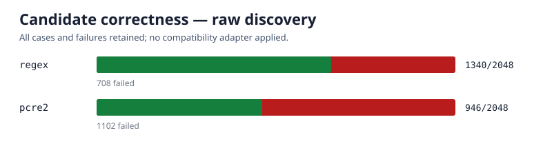

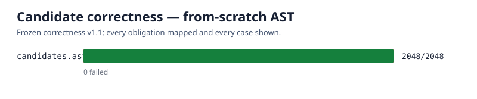

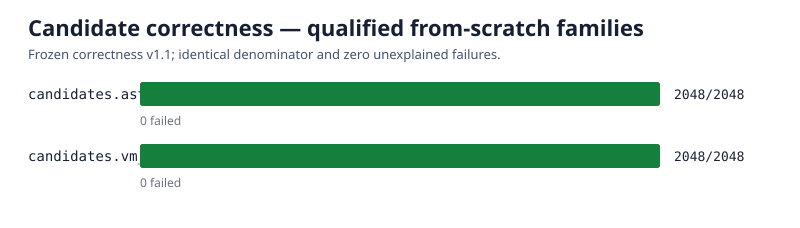

To regenerate and self-check the current oracle using the pinned runtime:

```sh
PY=/tmp/rebar-cpython/cpython-3.14.6-linux-x86_64-gnu/bin/python3.14
"$PY" tools/oracle.py freeze
"$PY" tools/oracle.py verify --module re --output oracle/v1/evidence/correctness-self.json
"$PY" tools/oracle.py chart --input oracle/v1/evidence/correctness-self.json --output oracle/v1/evidence/correctness.svg
# Reproduce a single stable case ID, including fuzz/property cases:
"$PY" tools/oracle.py verify --module re --case fuzz.str.0377

# Verify the frozen performance cases before collecting timing data:
PYTHONPATH=. "$PY" tools/perf.py verify --output performance/v1/evidence/performance-correctness.json
```
