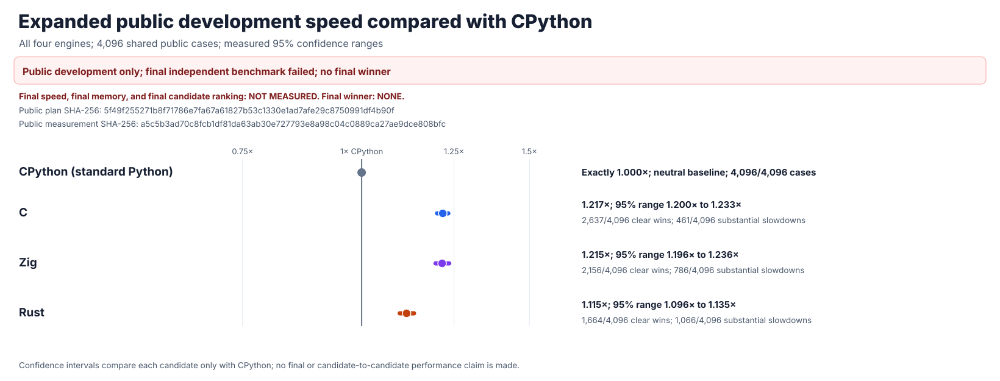
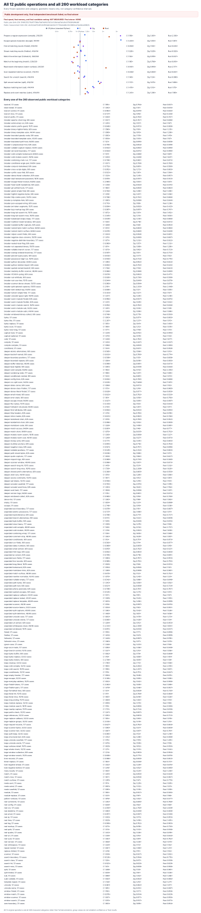
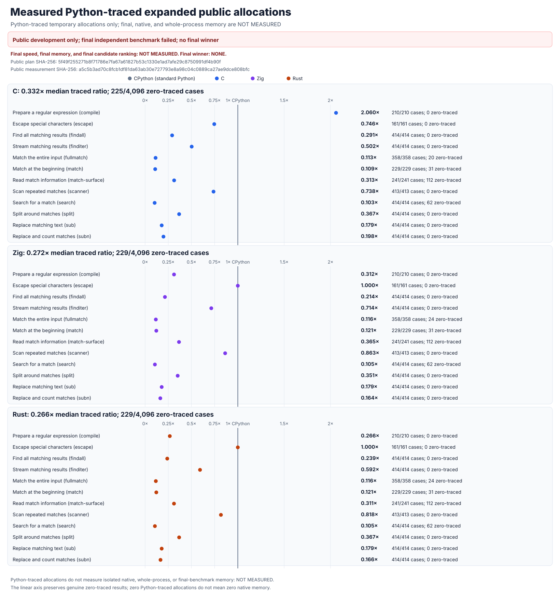
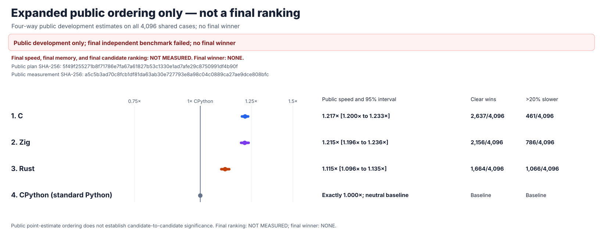

# rebar: a faster Python `re` experiment

`rebar` asks whether an independently written regular-expression engine can
replace Python 3.14.6's `re` module and run faster. The intended interface is
`import rebar as re`. Its C, Rust, and Zig candidates have separate parsers,
compilers, and matching engines. None wraps another regex package, calls
Python's regex engine, or delegates matching to another candidate.

The original one-time hidden compatibility test failed and cannot be retried.
**There is no proven drop-in replacement or final winner.** The results below
are a separate, fully disclosed public development experiment.

All three independently written engines now pass a new **8,192-pattern**
compatibility test: **1,179,648** comparisons with Python and **zero**
differences. Each repaired engine also passes the original **223,198-check**
matching and parser suite, a separate **393-check** object test, and a
**479-check** callback, buffer, and scanner test. All three also pass the
complete **22-stage** campaign, including **4,494,555** Unicode comparisons
per engine. Their performance after these repairs is **NOT MEASURED**.

## Overall public performance

The most recent completed speed test used the previous versions of Python, C,
Rust, and Zig on the same **4,096** public cases and **13** paired trials.
All **638,976** exact-answer checks passed, and an independent replay verified
every measurement and confidence interval. **1× means the same speed as
standard Python; higher is faster. The target is 1.5×.** These historical
timings do not measure the newly repaired engines.



| Engine | Public speed | 95% uncertainty range | Clearly faster cases | More than 20% slower |
| --- | ---: | ---: | ---: | ---: |
| C | 1.217× | 1.200–1.233× | 2,637/4,096 | 461/4,096 |
| Zig | 1.215× | 1.196–1.236× | 2,156/4,096 | 786/4,096 |
| Rust | 1.115× | 1.096–1.135× | 1,664/4,096 | 1,066/4,096 |

**No candidate reaches 1.5×. There is no proven replacement or winner.**
Rust's independently written matcher does fix all **54** previously slow
quote-aware splitting cases: it is clearly faster than Python on **54/54**,
with an **11.81×** average for that category. That targeted result is not an
overall win.

The expanded correctness test first found Rust **693**, C **368**, and Zig
**355** differences. A complete intermediate run exposed **306** remaining
Rust errors. Every failed result was preserved. After independently repairing
argument handling, newline matching, and error reporting, all three engines
pass **393,216/393,216** comparisons each. The
[complete correctness history and final passing evidence](candidates/evidence/PYTHON-RE-UNIVERSAL-PUBLIC-ORACLE-STAGE03.md)
include the exact sources, seeds, failures, and reports.

The frozen
[8,192-case public speed comparison](performance/postfinal-public-v4/RESULTS.md)
stopped after **5,975** cases because its text transport could not encode a
Unicode surrogate; Python and all three engines failed identically. All
**310,700** completed timing rows are preserved, but the comparison has no
complete ranking or winner. A separately versioned Unicode-safe comparison
is **NOT MEASURED**. The separate
[65,536-case one-time final](performance/postfinal-fresh-holdout-v1/PROTOCOL.md)
remains unopened; its full isolated executor is **NOT IMPLEMENTED**. The
older hidden failure remains final, and the new correctness result does not
reverse it.


## Detailed public results






The memory chart measures Python-visible temporary allocations only. Native
engine memory and isolated whole-process memory are **NOT MEASURED**.



## Why there is no final winner

The original one-time hidden test found a real difference between Zig's
`split` and Python's result. It stopped after **14,342 of 24,576 cases** and
**1,778,408 of 3,047,424 observations**. Its seal was consumed; it cannot be
retried.


Final speed, final confidence ranges, final memory, and final rankings are
**NOT MEASURED**. The original
[failure report](performance/v9/evidence/FINAL-HOLDOUT-FAILURE.md),
[independent verification](performance/v9/evidence/V9-FINAL-HOLDOUT-24576-FAILURE.json),
and [pre-test candidate freeze](performance/v9/evidence/FINAL-CANDIDATE-FREEZE.md)
remain unchanged.

## What is actually verified

The current Rust, C, and Zig sources each pass the same
[223,198 matching, parser, Unicode, and object checks](candidates/evidence/POSTFINAL-UNIVERSAL-STAGE05-EDGE.md),
and all three independently pass the separate **393-check** pattern and match
object contract and **479-check** callback, argument, buffer, and scanner
suite, with **zero failures**. Each current-source engine also passes the
complete **22-stage** Python-compatibility campaign, including **4,494,555**
full-Unicode comparisons per candidate. The earlier Rust stage's
[additional 83,968 quote-specific checks](candidates/evidence/rust-postfinal-quote-parity-stage-04-deterministic-oracle.json)
also match standard Python exactly, including escaped punctuation, text,
bytes, captures, newlines, scanners, and Unicode. The original
[from-scratch audit](candidates/audits/FROM-SCRATCH-AUDIT.json) verifies all
four implementation families, all five loaded native libraries, and **76**
controls against external packages, Python's regex engine, and hidden engine
sharing. A stronger
[32-control isolated-engine audit](candidates/audits/POSTFINAL-NO-DELEGATION-AUDIT-V1.json)
also checks that Python, another candidate, and third-party engines cannot
be reached through cached modules or disguised imports. It verifies each
engine in its own guarded process. Both audits have been rerun against the
current repaired sources and native libraries. Neither claims to prove
reproducible compiler builds. These public correctness results do not repair
the historical hidden Zig failure or establish a speed advantage.

The [complete 4,096-case results](performance/postfinal-public-v3/RESULTS.md)
preserve every observation, confidence range, slowdown, and independent
verification. Their [protocol and complete case list](performance/postfinal-public-v3/PROTOCOL.md)
were frozen and pushed before timing. The
[previous](performance/postfinal-public-v2/RESULTS.md) and
[original](performance/postfinal-public-v1/RESULTS.md) 4,096-case comparisons,
the earlier
[rejected Rust experiment](performance/v7/evidence/POSTFINAL-RUST-BATCHED-SPLIT-01.md)
and [experiment log](docs/EXPERIMENT-LOG.md) remain preserved. The
[direct-matching Rust evidence](candidates/evidence/POSTFINAL-RUST-DETERMINISTIC-04.md)
includes unsuccessful controls as well as every passing gate. None of these
public results repairs or reruns the failed hidden final.

## Reproduce and inspect

The objective in [GOAL.md](GOAL.md) has immutable SHA-256
`e5935060b44fe5f6b4e19ac2d01f3ce63182cf6a1d3b416502a4441cde345b62`.
[AMENDMENTS.md](AMENDMENTS.md) records later clarifications separately.

```sh
PY=/tmp/rebar-cpython/cpython-3.14.6-linux-x86_64-gnu/bin/python3.14

PYTHONDONTWRITEBYTECODE=1 PYTHONPATH=. "$PY" -B \
  -m tools.audit_from_scratch --self-test
PYTHONDONTWRITEBYTECODE=1 PYTHONPATH=. "$PY" -u -B -c \
  'from tools import postfinal_no_delegation_audit_v1 as audit; raise SystemExit(audit.main(["--self-test"]))'
PYTHONDONTWRITEBYTECODE=1 PYTHONPATH=. "$PY" -B \
  tools/python_re_universal_public_oracle_v1.py --self-test
"$PY" -I -B tools/python_re_universal_public_oracle_stage03.py --self-test
jq '{status, cases, total_comparisons, mismatches, comparison_complete}' \
  candidates/evidence/python-re-universal-public-oracle-v3-all.json
PYTHONDONTWRITEBYTECODE=1 PYTHONPATH=. "$PY" -B \
  tools/rust_postfinal_quote_parity_stage04_oracle.py --self-test
PYTHONDONTWRITEBYTECODE=1 PYTHONPATH=. "$PY" -B \
  -m tools.postfinal_public_practice_v3 self-test
PYTHONDONTWRITEBYTECODE=1 PYTHONPATH=. "$PY" -B \
  tools/postfinal_public_practice_charts_v3.py --self-test

PYTHONDONTWRITEBYTECODE=1 PYTHONPATH=. "$PY" -B \
  tools/postfinal_public_practice_charts_v3.py \
  --summary performance/postfinal-public-v3/evidence/postfinal-public-practice-v3-summary.json \
  --integrity performance/postfinal-public-v3/evidence/postfinal-public-practice-v3-integrity.json \
  --manifest performance/postfinal-public-v3/manifest.json \
  --output-dir performance/postfinal-public-v3/evidence
```
