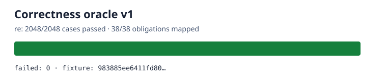

# rebar

This repository is a phase-gated experiment to find a compatible, materially faster replacement for Python's `re` module.

The immutable objective is [GOAL.md](GOAL.md), SHA-256 `e5935060b44fe5f6b4e19ac2d01f3ce63182cf6a1d3b416502a4441cde345b62`. Scope clarifications are in [AMENDMENTS.md](AMENDMENTS.md).

## Status

| Gate | Result |
| --- | --- |
| Correctness oracle | PASS — 2,048/2,048, 38/38 obligations, zero unexplained self-oracle failures |
| Qualified candidates | NOT MEASURED |
| Performance oracle | NOT MEASURED |
| Winner | NOT MEASURED |

The baseline is [CPython 3.14.6](oracle/v1/BASELINE.md). The [P0 matrix](oracle/v1/P0.md) covers the complete public API, documented syntax, errors, warnings, seeded differential/property/fuzz cases, and two explicitly named private waivers. The fixture SHA-256 is `68daa831d0579a07585727216346db0841a26036d12e0311acba85a54d696709`; two isolated stdlib runs agree, and the committed failure list is empty. Candidate code and performance claims do not exist yet.



To regenerate and self-check the current oracle using the pinned runtime:

```sh
PY=/tmp/rebar-cpython/cpython-3.14.6-linux-x86_64-gnu/bin/python3.14
"$PY" tools/oracle.py freeze
"$PY" tools/oracle.py verify --module re --output oracle/v1/evidence/correctness-self.json
"$PY" tools/oracle.py chart --input oracle/v1/evidence/correctness-self.json --output oracle/v1/evidence/correctness.svg
# Reproduce a single stable case ID, including fuzz/property cases:
"$PY" tools/oracle.py verify --module re --case fuzz.str.0377
```
