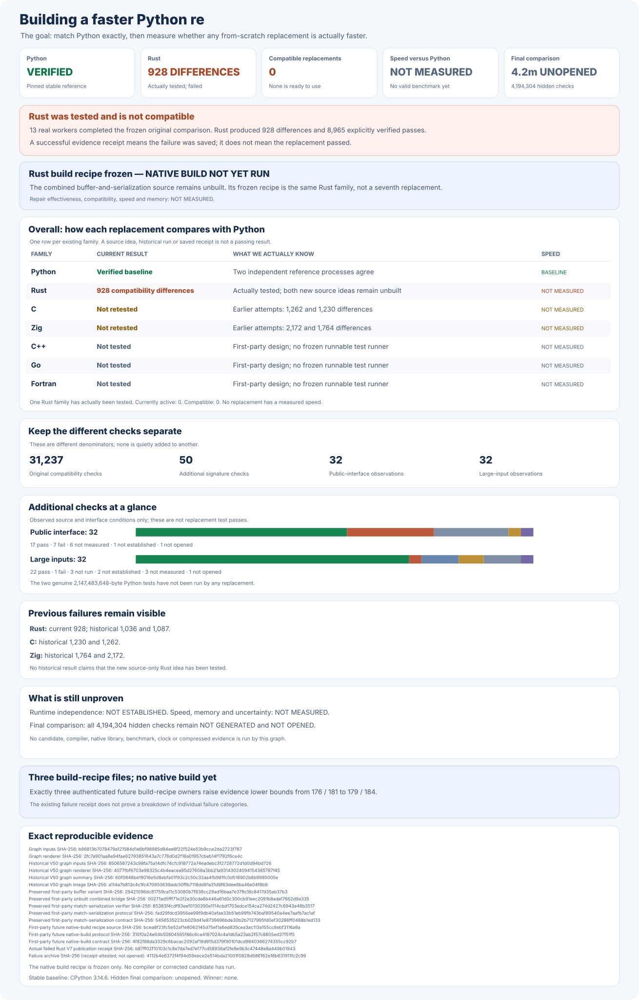

# rebar: a faster Python `re` experiment

Build a faster, fully compatible replacement for Python 3.14.6's
regular-expression module:

```python
import rebar as re
```

Every candidate must use its own matching engine built from scratch. Wrapping
Python, another regular-expression package, or another candidate does not count.

## Headline results

Six independently written engine designs; **one** fully tested Rust design;
**zero** compatible replacements. Overall speed against Python:
**NOT MEASURED**. The **4,194,304**-case final comparison is unopened.

The original **31,237** Python compatibility checks exposed **96** cases
where the saved Python answer and the candidate tests ran differently.
Two independent Python processes now agree on all **6,912** affected
checks, including all **96** cases. No original case has been removed.
There is no compatible replacement, measured speedup, or winner.

Separate original-suite test runners are frozen for **C, Rust, and Zig**. The
first Rust attempt failed before matching; its failure remains recorded.
The repaired Rust engine has now genuinely completed all **13** test
groups, exposing **928** compatibility differences with no test-runner
failures; all four original engine files were safely restored. Rust
does **not** pass. The corrected C and Zig runs have **NOT RUN**.
C++, Go, and Fortran remain independently written designs, not passing
replacements.

Two targeted, from-scratch Rust repairs are frozen as independently
inspectable source: Python-compatible buffer and replacement behavior,
and exact match serialization. The combined engine has **NOT BEEN
BUILT** and has **NOT RUN**; the latest actual result remains **928**
differences.

Its reproducible, completely offline native-build recipe is also frozen;
the actual native build has **NOT RUN**.



Python's own test suite also requires searching and replacing text with
**2,147,483,648** characters. The original Python results are recorded,
but no replacement has run either full-size test: current candidate
tests stop at **5,147** characters. These two original requirements
are tracked separately; they do not change the **31,237**-check total.

The existing `rebar.py` prematurely selects the Zig prototype, which
has **1,764** recorded compatibility differences and does not export
Python's `__version__`. It is **not** a compatible public import and is
**not** a winner. Installation has **NOT BEEN TESTED**.

A separately frozen **32**-check public-import audit records **17**
passing observations, **7** failures, **6** unmeasured items, **1**
unestablished guarantee, and **1** unopened final holdout. It does not
import a candidate or add a case to the original **31,237** checks.

The six engines use first-party matching code; they are not wrappers
around an outside regular-expression package. A complete runtime proof
against delegation to Python or another engine is **NOT ESTABLISHED**.
Rust's result below is the actual corrected-reference test. C and Zig
results describe earlier observed builds, not new passing replacements.

Overall speed relative to Python: **NOT MEASURED**. Fair speed and memory
measurements start only when three independent engines pass every check.

| Engine | Current build | Complete compatibility | Speed against Python |
| --- | --- | --- | --- |
| Python `re` | Corrected reference agrees in two independent processes | Original suite unchanged; corrected reference: 6,912 / 6,912 | Reference; not timed |
| Public `rebar` import | Incorrectly selects an unqualified Zig prototype | FAIL; `__version__` missing | NOT MEASURED |
| Rust | Combined repairs and offline build recipe frozen; build not run | 8,965 verified; 928 differences; zero worker failures | NOT MEASURED |
| C | Corrected C-only test runner frozen; new test has NOT RUN | Previous build: 7,325 verified; 1,230 differences; all 13 groups completed | NOT MEASURED |
| Zig | Dedicated Zig-only runner frozen; new test has NOT RUN | Previous build: 3,711 verified; 1,764 differences; all 13 groups completed | NOT MEASURED |
| C++ | Independently written and built | 128 verified; 2,308 differences; five worker failures | NOT MEASURED |
| Go | New build paused; failure recorder needs correction | 128 verified; 4,518 differences; four worker failures | NOT MEASURED |
| Fortran | Independently written | NOT TESTED | NOT MEASURED |

Verified passes and reported differences do not always add up to 31,237:
a failed test group does not prove that its remaining cases pass. All
failures and worker errors remain in the published evidence.

An additional **50** checks of Python's public function and method
signatures are frozen separately. Two independently isolated Python
reference processes passed all **50** and produced identical results.
Candidate results for these additional checks remain **NOT MEASURED**;
the checks are not added to the original **31,237**.

The baseline is pinned to a Linux x86-64 Python 3.14.6 release build.
Full-size candidate inputs, debug-build memory and interrupt behavior,
other platforms, and sanitizer results remain **NOT MEASURED**; none
is counted as a passing check.

## Detailed compatibility

These charts show preserved, earlier development builds and particular
categories of Python behavior. They are not current passing results.
Complete results, test-group histories, and rejected approaches remain
in the [experiment log](docs/EXPERIMENT-LOG.md).


## Final comparison

The final comparison is planned to use **4,194,304** unseen examples,
four times the preceding one-million-example proposal, and **24**
balanced measurement rounds. Its cases remain **NOT FROZEN**,
**NOT GENERATED**, and **NOT OPENED**. Current speed and memory are
**NOT MEASURED**.

First, three independently built engines must pass all **31,237**
original checks, the genuine full-size Python tests, and the separate
public-import, signature, and runtime independence gates. To win, an
engine must be at least **1.5×** faster overall, measurably faster in
at least **60%** of cases, and explain every slowdown greater than
**20%**. There is no winner.

## Evidence and reproduction

- [Reproduce the results and verify every graph](docs/REPRODUCING.md).
- [Experiment log, original reports, failures, and rejected designs](docs/EXPERIMENT-LOG.md).
- [Frozen Python compatibility checks](oracle/phase1/P0-COMPLETENESS-V1.md).
- [Python's original two-billion-character compatibility requirements](oracle/phase1/P0-LARGE-INPUT-INDEXING-V1.md).
- [Frozen 32-check public-import and no-premature-winner audit](oracle/phase1/P0-PUBLIC-ENTRYPOINT-IMPORT-V1.md).
- [Frozen correction for the Python reference](oracle/phase1/P0-PUBLIC-TYPE-REFERENCE-CONTEXT-V1.md).
- [Corrected six-engine test producer](oracle/phase2/SIX-FAMILY-P0-PRODUCER-V4.md).
- [Corrected C-only original-suite runner](oracle/phase2/P0-CANDIDATE-PROTOCOL-V10.md).
- [Repaired, recovery-safe Rust-only original-suite runner](oracle/phase2/REPAIRED-RUST-ORIGINAL-CAMPAIGN-V7.md).
- [From-scratch Rust buffer and replacement source repair](oracle/phase2/RUST-BUFFER-SHAPE-SOURCE-REPAIR-V1.md).
- [From-scratch Rust match-serialization source repair](oracle/phase2/RUST-MATCH-PICKLE-SOURCE-REPAIR-V1.md).
- [Reproducible first-party offline Rust build recipe](oracle/phase2/RUST-BUFFER-SHAPE-SOURCE-BUILD-V16.md).
- [Actual complete corrected Rust compatibility failures](oracle/phase2/evidence/repaired-rust-original-campaign-v7-rust-phase2-v13-rust-pattern-repr-original-p0-failures.json.gz).
- [Independent durable Rust result and original-file restoration](oracle/phase2/evidence/repaired-rust-original-campaign-v7-rust-phase2-v13-rust-pattern-repr-original-p0-failures-publication-receipt.json).
- [Independent Zig-only original-suite runner and native bridge](oracle/phase2/ZIG-ORIGINAL-P0-CANDIDATE-PROTOCOL-V1.md).
- [Preserved first Rust-only runner](oracle/phase2/REPAIRED-RUST-ORIGINAL-CAMPAIGN-V6.md).
- [Actual first Rust controller failure](oracle/phase2/evidence/repaired-rust-original-campaign-v6-rust-phase2-v13-rust-pattern-repr-original-p0-entry-failure.json).
- [Independently recorded Rust failure and build-record access](oracle/phase2/evidence/repaired-rust-original-campaign-v6-rust-phase2-v13-rust-pattern-repr-original-p0-entry-failure-observation.json).
- [Unapplied from-scratch Zig scanner correction](oracle/phase2/ZIG-SCANNER-PHRASE-SOURCE-REPAIR-V3.md).
- [Separately frozen public-signature checks](oracle/phase1/P0-CALLABLE-INTROSPECTION-V1.md).
- [Frozen two-process Python signature reference](oracle/phase1/CALLABLE-INTROSPECTION-REFERENCE-V2.md).
- [Independent, from-scratch engine and no-wrapping audit](oracle/phase2/CANDIDATE-INDEPENDENCE-V2.md).
- [Expanded, still-unopened final comparison](docs/EXPANDED-HOLDOUT-PROTOCOL-V1.md).
- [Original objective](GOAL.md), SHA-256
  `e5935060b44fe5f6b4e19ac2d01f3ce63182cf6a1d3b416502a4441cde345b62`;
  [later clarifications](AMENDMENTS.md).
