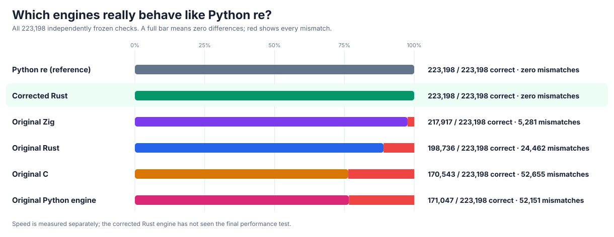
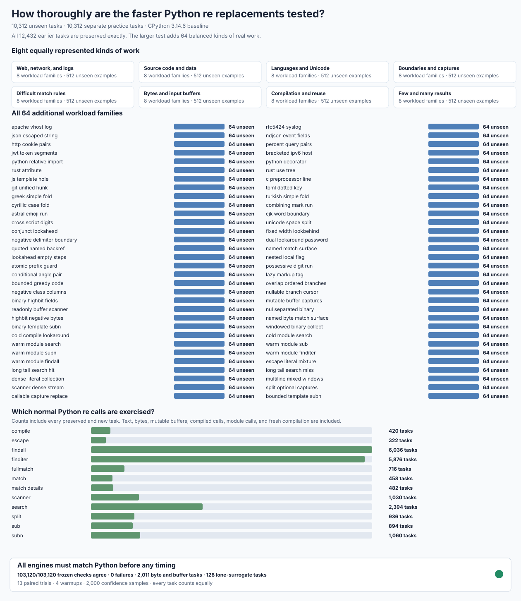

# rebar: a faster Python `re`

`rebar` is an experiment in building Python regular-expression replacements from scratch. It compares independent Zig, C, Rust, and Python engines against [stable CPython 3.14.6](https://www.python.org/downloads/release/python-3146/). An [independent source and machine-code audit](candidates/audits/FROM-SCRATCH-AUDIT.json) checks that no candidate delegates matching to Python `re`, `_sre`, a third-party regular-expression package, or another candidate. The current public import is `import rebar as re`.

**Current status:** no implementation can yet be recommended as a completely compatible replacement. Rust passes the original **223,198** compatibility checks, but a newly frozen, more demanding **393-check** test exposes **104** remaining differences in iterator lifetimes, buffers, object copying, and public method information. The final speed of a fully compatible engine is **NOT MEASURED**.

## Overall results

The larger frozen test contains **20,624 cases**, including **10,312 independently held-back cases**. Every original engine was run against the same inputs for **13 paired trials**, producing **1,340,560 recorded measurements**. In every graph, **1× means the speed of Python `re`; higher is faster**.


| From-scratch engine | Speed on unseen cases | 95% confidence interval | Clearly faster cases | Cases more than 20% slower |
| --- | ---: | ---: | ---: | ---: |
| Zig, the current `rebar` import | **1.609×** | 1.608–1.610× | **8,868/10,312** | **105/10,312** |
| C | **1.271×** | 1.270–1.272× | 7,369/10,312 | 1,116/10,312 |
| Original Rust, before compatibility fixes | **0.925×** | 0.925–0.926× | 3,623/10,312 | 3,905/10,312 |
| Independent Python engine | **0.022×** | 0.022–0.022× | 271/10,312 | 9,884/10,312 |

The original Zig engine has the best measured speed, but none of these original engines passes the complete compatibility tests. The corrected Rust engine passes the original test but still fails the newer object-and-lifetime test; its speed on the **10,312 unseen cases is NOT MEASURED**.

A separate [223,198-check compatibility test](candidates/evidence/RUST-V7-EDGE-ORACLE.md) was frozen before changing any engine. Standard Python passes all **223,198** checks. The original Zig engine has **5,281** differences, Rust **24,462**, C **52,655**, and the independent Python engine **52,151**. **No original candidate is a drop-in replacement for every Python `re` user.** The original failures, inputs, expected answers, and seeds are preserved; a replacement must pass every check before it can be selected.

The [corrected, from-scratch Rust engine](candidates/evidence/RUST-V7-CORRECTED-V4.md) passes **223,198/223,198** original compatibility checks, **20,480/20,480** independent parser tests, **14,783/14,783** original object checks, and **4,494,555/4,494,555** full-Unicode checks. It also passes Python's upstream test suite, apart from two explicitly recorded unavailable-locale skips, and uses **zero external Rust packages**. However, the stronger [393-check object-and-lifetime test](candidates/audits/RUST-V8-DEEP-CONTRACT.json.gz) still finds **104** user-visible differences. Rust is not yet a universal replacement. The unseen performance test remains sealed.



The [corrected-Rust practice comparison](performance/v7/evidence/RUST-CALIBRATION-BASELINE.md) measures **624** separate practice cases, not the unseen test. Rust runs at **0.994×** Python's speed, with a **0.956–1.034×** confidence interval. Because that interval includes **1×**, a speedup has **not** been established. The complete results preserve all **175/624** cases taking more than 20% longer. All unsuccessful changes and their measurements remain in the [experiment log](docs/EXPERIMENT-LOG.md).


The [independent 20,480-pattern grammar audit](candidates/evidence/RUST-V7-GRAMMAR-ORACLE.md) additionally retains all **5,662 invalid patterns**, their exact Python error messages and positions, and every original candidate failure.

The [14,783-check object and API audit](candidates/evidence/RUST-V7-OBJECT-ORACLE.md) separately verifies Python's match objects, exact byte identity, search windows, buffer lifetimes, signatures, hashing, warnings, and errors.

The [independent tracing and callback audit](candidates/evidence/RUST-V7-OBSERVABILITY-ORACLE.md) adds **479** Python-visible checks, **34** malformed-native-call controls, and **13** tests preventing fallback to Python's regex engine.

The [newer lifetime and iterator audit](candidates/audits/RUST-V8-DEEP-CONTRACT.json.gz) preserves every one of Rust's **104** remaining public failures. Python agrees with itself on all **393** cases. Another **64** implementation-private garbage-collector differences are recorded separately and are not counted as public failures.

Rust improvements are compared using a [sealed practice-only test](candidates/evidence/RUST-V7-CALIBRATION-ISOLATION.md). It keeps all **10,312** unseen final cases inaccessible while testing **624** representative practice cases; improved Rust speed remains **NOT MEASURED**.


The [complete slowdown audit](performance/v7/evidence/REGRESSION-AUDIT.md) lists all **105** unseen Zig slowdowns and preserves all **29,771** slowdowns across all four engines and both cohorts. A slowdown means a task actually took more than 20% longer than Python: `Python time / candidate time < 5/6`. No case, candidate, unfavorable result, or confidence interval has been removed.

## What was tested

The test covers text, bytes and buffers; Unicode; short and long inputs; captures; replacements; search, match, split, scanners, and iteration; compilation and repeated calls; source code, configuration, structured data, and logs; lookarounds, boundaries, and backreferences; matching, nonmatching, and zero-length results. All **64 added workload families** contain distinct practice and unseen examples.



All five original engines agreed with Python on the **20,624 frozen benchmark answers**. The independent **223,198-check** compatibility test separately covers parser behavior, object identity, whitespace, buffers, errors, flags, windows, and the full Python API. The [frozen benchmark protocol](performance/v7/PROTOCOL.md) fixes the inputs, weights, seeds, trial counts, correctness gates, confidence calculations, and memory measurements. The original [delegation audit](performance/v7/evidence/delegation-audit.jsonl) and the stronger [source and native-code audit](candidates/audits/FROM-SCRATCH-AUDIT.json) verify all **four** distinct engine implementations, all **five** actually loaded C, Rust, and Zig native libraries, **73** disguised-engine and tampering controls, and Rust's **zero external dependencies**.

## Detailed graphs

The first two graphs are explicitly **practice-only** and include all **624** corrected-Rust cases; they are not final unseen results.


The remaining historical graphs show the complete original unseen results, not selected examples. Each new workload row represents all **64** independently held-back cases.


Python-traced temporary memory on the unseen cases has a median ratio of **0.503×** for Zig, **0.442×** for C, **0.676×** for Rust, and **9.687×** for the independent Python engine. Process memory was also recorded for every trial, but all engines shared one measurement process, so those observations **cannot establish engine-specific process-memory usage**.

## Reproduce

The [complete experiment log](docs/EXPERIMENT-LOG.md) keeps previous designs, measurements, rejected experiments, correctness failures, and isolation incidents out of the headline results. The immutable objective is [GOAL.md](GOAL.md), SHA-256 `e5935060b44fe5f6b4e19ac2d01f3ce63182cf6a1d3b416502a4441cde345b62`; scope amendments are recorded in [AMENDMENTS.md](AMENDMENTS.md).

```sh
PY=/tmp/rebar-cpython/cpython-3.14.6-linux-x86_64-gnu/bin/python3.14

PYTHONDONTWRITEBYTECODE=1 PYTHONPATH=. "$PY" -B \
  -m tools.audit_from_scratch --self-test
PYTHONDONTWRITEBYTECODE=1 PYTHONPATH=. "$PY" -B \
  -m tools.audit_from_scratch
PYTHONPATH=. "$PY" tools/perf_v7.py self-test
PYTHONPATH=. "$PY" tools/perf_v7.py verify --output /tmp/rebar-v7-correctness.json
PYTHONPATH=. "$PY" tools/perf_v7_delegation_audit.py
PYTHONPATH=. "$PY" tools/perf_v7_regression_audit.py --self-test
PYTHONPATH=. "$PY" tools/rust_v7_edge_oracle.py \
  --module re --output /tmp/rebar-v7-edge-self.json.gz
PYTHONPATH=. "$PY" tools/rust_v7_edge_oracle.py \
  --module candidates.rust_candidate --output /tmp/rebar-v7-edge-rust.json.gz
PYTHONPATH=. "$PY" tools/rust_v7_correctness_chart.py --self-test
PYTHONPATH=. "$PY" tools/rust_v7_grammar_oracle.py verify
PYTHONPATH=. "$PY" tools/rust_v7_grammar_oracle.py gate \
  --module candidates.rust_candidate --require-pass
gzip -dc candidates/evidence/rust-v7-corrected-v4/rust-v7-object-rust.json.gz \
  | jq -e '.checks == 14783 and .failed == 0'
PYTHONPATH=. "$PY" tools/rust_campaign_gate.py --sealed-practice-self-test
PYTHONPATH=. "$PY" tools/rust_campaign_gate.py --sealed-practice-only \
  --output /tmp/rebar-rust-sealed-correctness.json
PYTHONPATH=. "$PY" tools/rust_v7_observability_oracle.py --self-test
PYTHONPATH=. "$PY" tools/rust_v7_observability_oracle.py verify
PYTHONPATH=. "$PY" tools/rust_v8_deep_contract_oracle.py --self-test
PYTHONPATH=. "$PY" tools/rust_v8_deep_contract_variant.py --self-test
# Currently exits nonzero and preserves all 104 real compatibility failures:
PYTHONPATH=. "$PY" tools/rust_v8_deep_contract_oracle.py --gate
PYTHONPATH=. "$PY" tools/rust_v7_calibration_pilot.py self-test
PYTHONPATH=. "$PY" tools/rust_v7_calibration_pilot.py plan --verify
PYTHONPATH=. "$PY" tools/rust_v7_calibration_priorities.py --self-test
PYTHONPATH=. "$PY" tools/rust_v7_calibration_result_audit.py --self-test
PYTHONPATH=. "$PY" tools/rust_v7_calibration_variant_audit.py --self-test
PYTHONPATH=. "$PY" tools/rust_v7_calibration_charts.py --self-test

gzip -dc performance/v7/evidence/initial-raw.jsonl.gz > /tmp/rebar-v7-raw.jsonl
gzip -dc performance/v7/evidence/initial-summary.json.gz > /tmp/rebar-v7-summary.json

PYTHONPATH=. "$PY" tools/perf_v7_result_audit.py \
  --raw /tmp/rebar-v7-raw.jsonl \
  --summary /tmp/rebar-v7-summary.json \
  --output /tmp/rebar-v7-integrity.json

PYTHONPATH=. "$PY" tools/performance_v7_charts.py \
  --summary /tmp/rebar-v7-summary.json --prefix /tmp/rebar-v7

PYTHONPATH=. "$PY" tools/perf_v7_regression_audit.py \
  --integrity performance/v7/evidence/initial-integrity.json \
  --summary performance/v7/evidence/initial-summary.json.gz \
  --output /tmp/rebar-v7-regressions.md \
  --json-output /tmp/rebar-v7-regressions.json.gz
```
