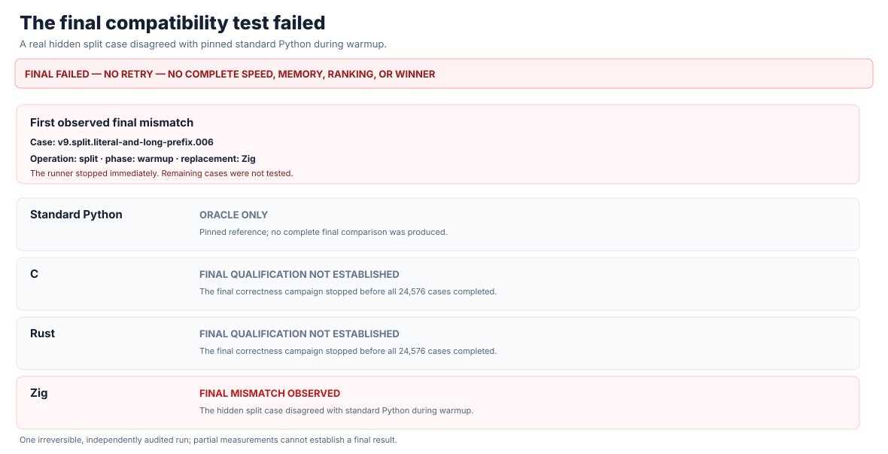
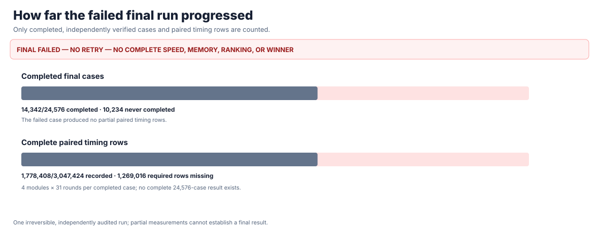
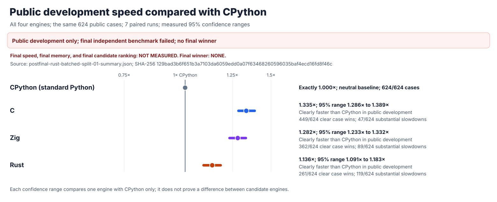
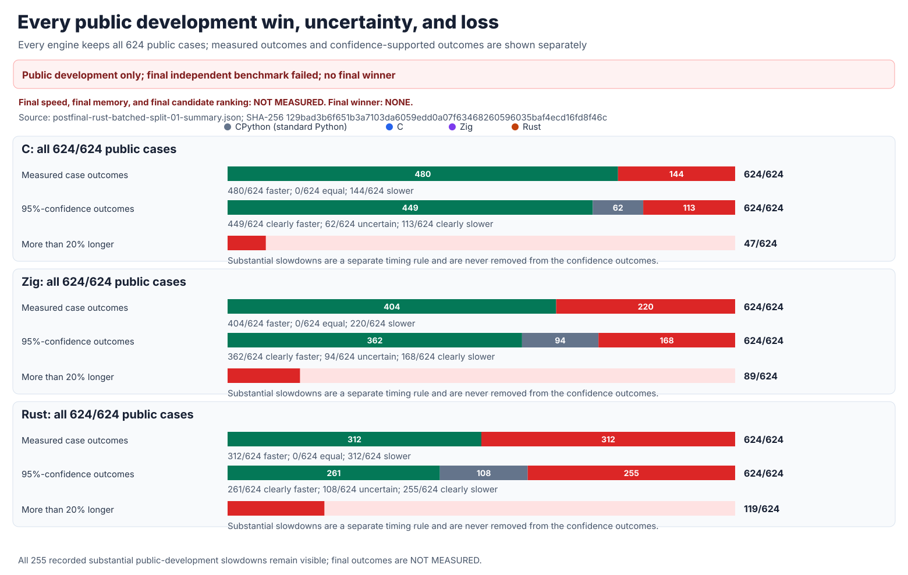
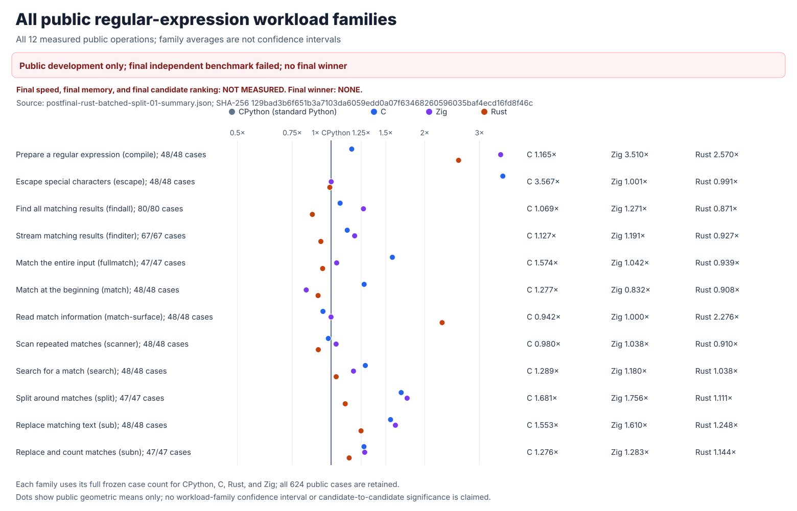
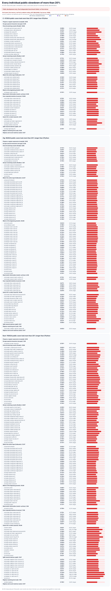
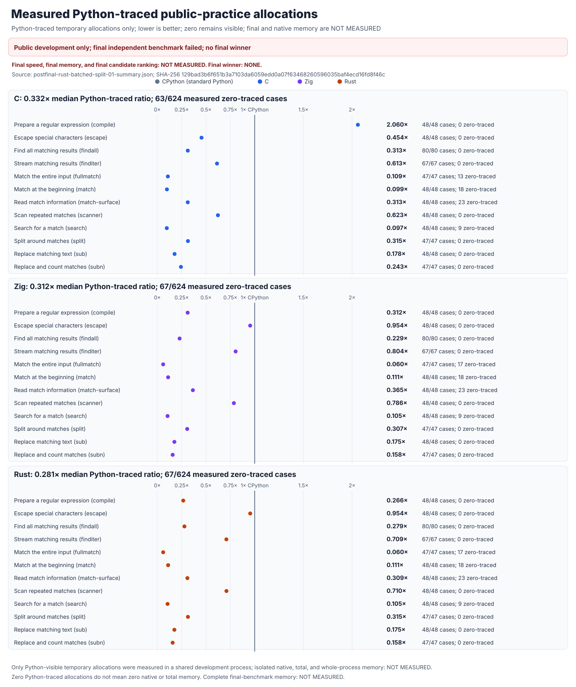
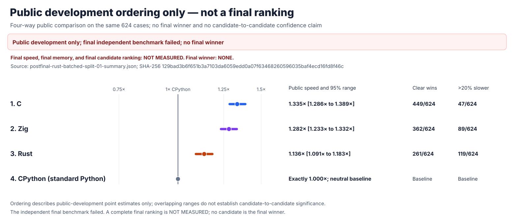

# rebar: a faster Python `re` experiment

`rebar` asks whether an independently written regular-expression engine can
replace Python 3.14.6's `re` module and run faster. The intended interface is
`import rebar as re`. Its C, Rust, and Zig candidates have separate parsers,
compilers, and matching engines. None wraps another regex package, calls
Python's regex engine, or delegates matching to another candidate.

## Final result: the original experiment failed

The one-time hidden test found a real difference between Zig's `split` and
Python's answer. It stopped after **14,342 of 24,576 cases** and **1,778,408
of 3,047,424 observations**. Its seal was consumed; it cannot be retried.





**There is no final winner. Final speed, confidence ranges, memory use,
rankings, and the 1.5× goal are NOT MEASURED.** The source-checkout `rebar`
import is not a proven drop-in replacement. The original
[failure report](performance/v9/evidence/FINAL-HOLDOUT-FAILURE.md),
[independent verification](performance/v9/evidence/V9-FINAL-HOLDOUT-24576-FAILURE.json),
and [pre-test candidate freeze](performance/v9/evidence/FINAL-CANDIDATE-FREEZE.md)
remain unchanged.

## Overall public performance

Later Rust development is a **separate public experiment**, not a rerun of the
failed final. Python and all three independently built engines received the
same **624 public cases** and **seven paired runs**. **1× means the same speed
as standard Python; higher is faster.**



| Engine | Public speed | 95% uncertainty range | Clearly faster cases | More than 20% slower |
| --- | ---: | ---: | ---: | ---: |
| C | 1.335× | 1.286–1.389× | 449/624 | 47/624 |
| Zig | 1.282× | 1.233–1.332× | 362/624 | 89/624 |
| Rust | 1.136× | 1.091–1.183× | 261/624 | 119/624 |

The new Rust design batches up to 16 split matches in its own native engine.
It remains fully compatible with the public tests, but it does not establish
the required speedup; **the optimization is rejected as a performance win**.
All **255** substantial slowdowns are included.



## Detailed public results







The memory chart measures Python-visible temporary allocations only. Native
engine memory and isolated whole-process memory are **NOT MEASURED**.



## What is actually verified

Post-final Rust passes **223,198** matching checks, **393** public-object
checks, **479** tracing and unusual-argument checks, and the original complete
**22-stage** Python-compatibility campaign, including **4,494,555** Unicode
comparisons. The original
[from-scratch audit](candidates/audits/FROM-SCRATCH-AUDIT.json) verifies all
four implementation families, all five loaded native libraries, and **76**
controls against external packages, Python's regex engine, and hidden engine
sharing. Public correctness does not repair the historical hidden Zig failure.

The [full Rust experiment](performance/v7/evidence/POSTFINAL-RUST-BATCHED-SPLIT-01.md)
preserves all results, regressions, raw data, and rejected conclusions. The
[experiment log](docs/EXPERIMENT-LOG.md) preserves earlier and subsequent
designs. A separate **4,096-case** public benchmark is in preparation;
its results are **NOT MEASURED**.

## Reproduce and inspect

The objective in [GOAL.md](GOAL.md) has immutable SHA-256
`e5935060b44fe5f6b4e19ac2d01f3ce63182cf6a1d3b416502a4441cde345b62`.
[AMENDMENTS.md](AMENDMENTS.md) records later clarifications separately.

```sh
PY=/tmp/rebar-cpython/cpython-3.14.6-linux-x86_64-gnu/bin/python3.14

PYTHONDONTWRITEBYTECODE=1 PYTHONPATH=. "$PY" -B \
  -m tools.audit_from_scratch --self-test
PYTHONDONTWRITEBYTECODE=1 PYTHONPATH=. "$PY" -B \
  -m tools.rust_postfinal_split_audit --self-test
PYTHONDONTWRITEBYTECODE=1 PYTHONPATH=. "$PY" -B \
  tools/render_postfinal_rust_split.py --self-test
PYTHONDONTWRITEBYTECODE=1 PYTHONPATH=. "$PY" -B \
  tools/render_postfinal_rust_split.py \
  --summary performance/v7/evidence/postfinal-rust-batched-split-01-summary.json \
  --integrity performance/v7/evidence/postfinal-rust-batched-split-01-integrity.json \
  --output-dir performance/v7/evidence
```
