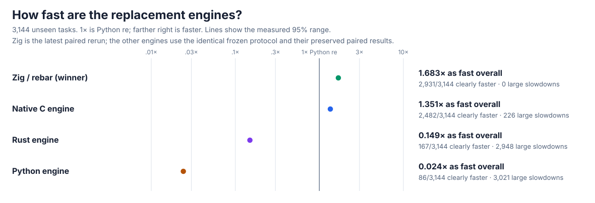
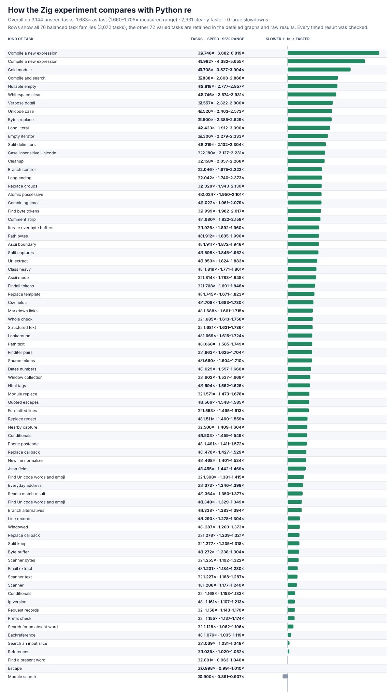
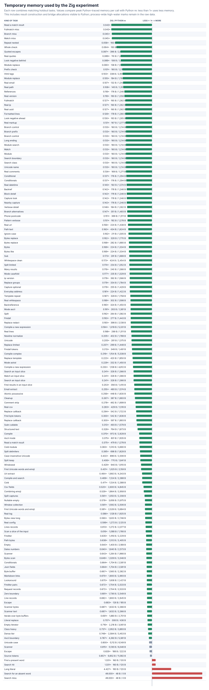
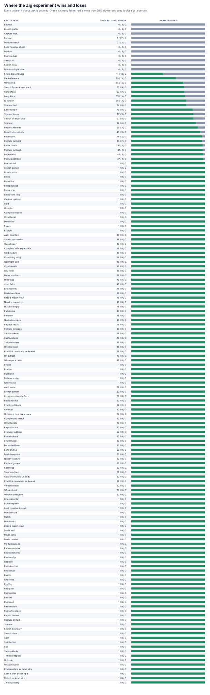

# rebar: a faster Python `re`

`rebar` is a from-scratch replacement for Python's regular-expression module. Use it with `import rebar as re`. Four independent engines were built and checked against stable CPython 3.14.6; the fastest compatible one is public. Matching never delegates to Python `re`, `_sre`, or an external regular-expression package.

## Current results

On **3,144 separate, unseen tasks**, `rebar` is **1.683× as fast overall** (95% range **1.660–1.705×**) and clearly faster on **2,931/3,144 tasks (93.2%)**. There are **zero** tasks more than 20% slower. The holdout covers everyday text and bytes, common calls, compilation, Unicode, captures, replacements, scanners, input slices, structured data, hits, misses, and short and long inputs. **1× means the same speed as Python `re`; higher is faster.**



| Engine | Overall speed | Clearly faster | Large slowdowns |
| --- | ---: | ---: | ---: |
| Zig / `rebar` | **1.683×** | **2,931/3,144** | **0/3,144** |
| Native C | 1.351× | 2,482/3,144 | 226/3,144 |
| Rust | 0.149× | 167/3,144 | 2,948/3,144 |
| Python | 0.024× | 86/3,144 | 3,021/3,144 |



The final paired run retains all **163,488** timing rows and **176,064** before/after correctness checks. A separate successful-match control is also faster (**1.061×**, 42/48 clearly faster), and the capture-returning core reaches **3.45×** overall. Full results, confidence ranges, memory, raw data, and rejected designs are in the [current Zig report](candidates/evidence/ZIG-EXECUTOR.md).

## Compatibility

`rebar` passes the frozen **44,084-case** correctness suite, including **35,840** unseen text, bytes, Unicode, buffer, scanner, property, and invalid-input cases, all **144** runnable official CPython `re` tests, **109,848** established focused checks, **163,960** alternative/run/delimiter/API checks, and **156,484** new direct-scan checks. Debug, address, and undefined-behavior checks and the zero-delegation audit are clean.


| Check | Current result |
| --- | --- |
| Frozen correctness | **PASS** — stdlib and all four engines pass all 44,084 cases |
| Official CPython tests | **PASS** — 144/144 runnable methods; zero failures, crashes, or timeouts |
| Focused Zig/API/safety | **PASS** — Unicode, large patterns, groups, repeats, flags, errors, spans, captures, buffers, and public calls |
| Performance holdout | **PASS** — 1.683× overall, 93.2% clearly faster, zero large slowdowns |
| Public import | **AVAILABLE** — `import rebar as re` selects the independent Zig engine |

## Detailed current graphs

Temporary memory is at or below Python `re` on **3,014/3,144** holdout tasks (median **864 B** versus **2,046 B**). Compiled Zig programs use **18,608–47,588 B**, with a **23,316 B** median. Green points below are clearly faster and grey points are close or uncertain; there are no large slowdowns.






The complete loss check is in [every large slowdown](candidates/evidence/zig-exec-regressions.md); the final run has none.

## Reproduce

The frozen [performance protocol](performance/v5/PROTOCOL.md) records coverage, weights, seeds, timing rules, and the correctness gate. The immutable objective is [GOAL.md](GOAL.md), SHA-256 `e5935060b44fe5f6b4e19ac2d01f3ce63182cf6a1d3b416502a4441cde345b62`; scope notes are in [AMENDMENTS.md](AMENDMENTS.md), and the chronological record is in the [experiment log](docs/EXPERIMENT-LOG.md).

```sh
PY=/tmp/rebar-cpython/cpython-3.14.6-linux-x86_64-gnu/bin/python3.14
PYTHON="$PY" sh tools/build_zig_probe.sh

PYTHONPATH=. "$PY" -c 'import rebar as re; print(re.findall(r"[A-Za-z]+", "a faster python re"))'
PYTHONPATH=. "$PY" tools/oracle_v3.py verify --module rebar --cohort holdout --output /tmp/rebar-correctness.json
PYTHONPATH=. "$PY" tools/cpython_re_oracle.py verify --module rebar --output /tmp/rebar-official.json
PYTHONPATH=. "$PY" tools/zig_dispatch_probe.py --module rebar --seeded-cases 16384 --output /tmp/rebar-dispatch.json
PYTHONPATH=. "$PY" tools/zig_executor_probe.py --module rebar --seeded-cases 8192 --output /tmp/rebar-executor.json
PYTHONPATH=. "$PY" tools/perf_v5.py verify --module rebar --output /tmp/rebar-performance-check.json
PYTHONPATH=. "$PY" tools/zig_perf_v5_pilot.py --raw /tmp/rebar-timing.jsonl --output /tmp/rebar-summary.json --chart /tmp/rebar-speed.svg --memory-chart /tmp/rebar-memory.svg --regression-chart /tmp/rebar-regressions.svg --trials 13 --bootstraps 2000
```
