# rebar: a faster Python `re`

`rebar` is an experiment to build a faster, fully compatible replacement for Python’s regular-expression module. The intended public interface is `import rebar as re`. The comparison uses stable Python 3.14.6 and four separately written Rust, Zig, C, and Python implementations.

No implementation may call Python’s existing regex engine, wrap an external regex package, or delegate matching to another implementation.

## Headline results

The first graph shows whether each independently written engine gives Python's answers on the same **223,198** frozen matching checks. Matching correctness is not a claim of complete compatibility or speed.


The second graph compares each measured Rust design directly with Python on the same **624** practice cases. **1× means the same speed as Python; higher is faster.** The latest fully checked Rust design is **0.970×**, up from **0.929×** and **0.754×** in previous fully checked designs. It is not yet reliably faster than Python. The fourth bar is an earlier, less completely checked design. All cases, slowdowns, and uncertainty ranges are included.

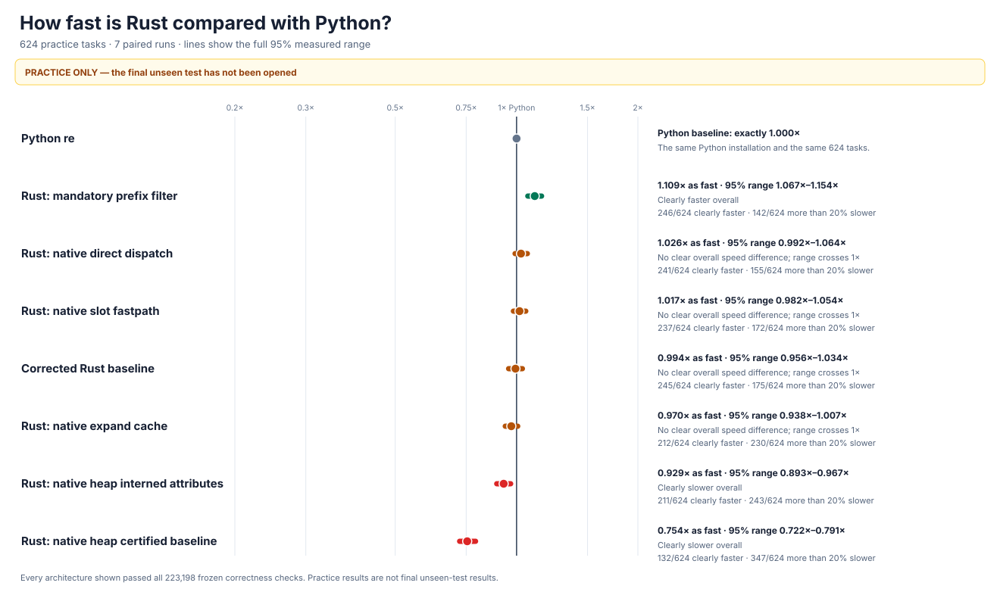

The independently reviewed [**24,576-case final benchmark**](performance/v9/HOLDOUT-PROTOCOL.md) has passed its synthetic-only checks. Its secret test cases have not been created or opened. Final results for Rust, Zig, and C are **NOT MEASURED**.

## Compatibility at a glance

Every result below uses the same frozen Python answers. “Differences” means observable behavior that does not match Python.

| Built-from-scratch engine | Matching checks | Parser checks | Object and lifetime checks | Tracing and unusual-argument checks |
| --- | ---: | ---: | ---: | ---: |
| Rust | [223,198/223,198](candidates/evidence/rust-v7-edge-oracle-rust-native-expand-cache.json.gz) | [20,480/20,480](candidates/evidence/rust-v8-rust-native-expand-cache-sealed-campaign.json) | [0/393 differences](candidates/audits/RUST-V8-DEEP-CONTRACT-RUST-NATIVE-EXPAND-CACHE.json.gz) | [0/479 differences](candidates/evidence/rust-v8-observability-rust-qualified-native-expand-cache.json.gz) |
| Zig | [223,198/223,198](candidates/evidence/rust-v8-edge-oracle-zig-deep-stage-06.json.gz) | [20,480/20,480](candidates/evidence/rust-v7-grammar-zig-v8-deep-stage-06.json.gz) | [0/393 differences](candidates/audits/RUST-V8-DEEP-CONTRACT-ZIG-STAGE-06.json.gz) | [0/479 differences](candidates/evidence/rust-v8-observability-zig-qualified-stage-06.json.gz) |
| C | [223,198/223,198](candidates/evidence/rust-v8-edge-oracle-vm-deep-stage-09.json.gz) | [20,480/20,480](candidates/evidence/rust-v7-grammar-vm-v8-deep-stage-09.json.gz) | [0/393 differences](candidates/audits/RUST-V8-DEEP-CONTRACT-C-STAGE-09.json.gz) | [0/479 differences](candidates/evidence/rust-v8-observability-vm-qualified-stage-09.json.gz) |
| Independent Python | [223,198/223,198](candidates/evidence/rust-v8-edge-oracle-ast-deep-stage-01.json.gz) | [20,480/20,480](candidates/evidence/rust-v7-grammar-ast-deep-stage-01.json.gz) | [93/393 differences](candidates/audits/RUST-V8-DEEP-CONTRACT-AST-STAGE-01.json.gz) | NOT MEASURED |

Rust, Zig, and C additionally pass the object and tracing checks in the table. All [75 original C argument failures](candidates/evidence/rust-v8-observability-vm-qualified.json.gz) remain recorded; the independent Python engine still has 93 object-behavior differences.

The larger frozen replacement-and-callback suites expose further real differences:

| Engine | Replacement and callback checks | Deep replacement and callback checks |
| --- | ---: | ---: |
| Rust | [0/8,862 differences](candidates/evidence/rust-v8-replacement-rust-native-expand-cache.json.gz) | [0/11,266 differences](candidates/evidence/rust-v8-replacement-rust-native-expand-cache-deep.json.gz) |
| Zig | [0/8,862 differences](candidates/evidence/rust-v8-replacement-zig-stage-06-from-scratch-failures.json.gz) | [0/11,266 differences](candidates/evidence/rust-v8-replacement-zig-stage-06-from-scratch-deep-failures.json.gz) |
| C | [0/8,862 differences](candidates/evidence/rust-v8-replacement-vm-stage-09.json.gz) | [0/11,266 differences](candidates/evidence/rust-v8-replacement-vm-deep-stage-09.json.gz) |

Rust also passes its entire [22-stage compatibility campaign](candidates/evidence/rust-v8-rust-native-expand-cache-sealed-campaign.json), including Python's own tests, **4,494,555** full-Unicode comparisons, and an additional [13,000-case direct replacement test](candidates/evidence/rust-v8-rust-native-expand-direct-replacement-controls-repaired.json). The C engine now passes [Python's official tests](candidates/evidence/rust-v8-vm-stage-09-official-cpython-tests.json) and [all 8,244 additional checks](candidates/evidence/rust-v8-vm-stage-09-frozen-correctness-v2.json), but a stronger public-interface suite still exposes [six differences in 190 checks](candidates/evidence/rust-v8-vm-stage-09-sealed-campaign-failure.json). An [independent Zig diagnostic](candidates/evidence/rust-v8-zig-stage-06-extended-path-first-mismatch.json) shows its engine rejects a large repetition Python accepts. Neither engine is called fully compatible. All results remain in the [experiment log](docs/EXPERIMENT-LOG.md).

The [latest published four-engine from-scratch audit](candidates/audits/FROM-SCRATCH-AUDIT.json) verifies the exact source and five loaded native libraries recorded in that report, with **76** checks against external packages and hidden engine-sharing. The newer C and Rust versions must pass a refreshed all-engine audit before release. The [previous Rust-specific audit](candidates/audits/RUST-V8-INTERNED-ATTRIBUTES-FROM-SCRATCH.json) preserves **134** checks for its exact earlier Rust design. The [audit immediately before the final C and Zig repairs](candidates/audits/FROM-SCRATCH-AUDIT-BEFORE-FINAL-REPLACEMENT-REPAIRS.json), [original audit](candidates/audits/FROM-SCRATCH-AUDIT-HISTORICAL-BEFORE-V8-FINAL.json), and [earlier C audit](candidates/audits/FROM-SCRATCH-AUDIT-BEFORE-C-BINDER-REPAIR.json) remain unchanged.

## Overall speed compared with Python

**Final, unseen speed: NOT MEASURED.** On the separate practice data, the fully compatibility-qualified Rust implementation currently measures **0.970×** Python's speed, up from **0.929×** and **0.754×** in its two previous native designs. Its confidence interval includes **1×**, so it is not claimed to be faster than Python. No practice result is a final-test score or a speed claim about Zig or C.

The prospective [24,576-case final benchmark](performance/v9/HOLDOUT-PROTOCOL.md) specifies **31** paired rounds, **9,999** confidence draws, secret-dependent real patterns and inputs, genuinely precompiled patterns, and **16** real calls per timed sample. Its [75-check synthetic-only validation](performance/v9/evidence/HOLDOUT-PUBLIC-SYNTHETIC-SELF-TEST.json) passes without importing a candidate, opening a secret, creating final cases, or recording speed. The [earlier 12,288-case protocol](performance/v8/HOLDOUT-PROTOCOL.md) remains preserved and unopened. No final speed, ranking, or confidence interval is invented.

The [final graph generator](tools/performance_v9_charts.py) separately passes [95 synthetic anti-tampering checks](performance/v9/evidence/PERFORMANCE-CHARTS-PUBLIC-SYNTHETIC-SELF-TEST.json). It will graph overall Python-relative speed, every candidate, all slowdowns, and separately measured memory only after genuine complete final results exist.

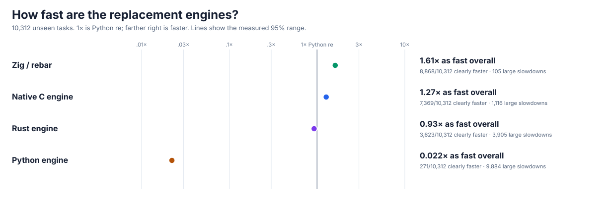

The graph immediately above is **historical context only**. It measures older, not fully compatible engines on the original **10,312-case** unseen test. A value above **1×** was faster than Python.

| Original engine, before complete compatibility fixes | Historical speed | 95% confidence interval | Clearly faster cases | More than 20% slower |
| --- | ---: | ---: | ---: | ---: |
| Zig | 1.609× | 1.608–1.610× | 8,868/10,312 | 105/10,312 |
| C | 1.271× | 1.270–1.272× | 7,369/10,312 | 1,116/10,312 |
| Rust | 0.925× | 0.925–0.926× | 3,623/10,312 | 3,905/10,312 |
| Independent Python | 0.022× | 0.022–0.022× | 271/10,312 | 9,884/10,312 |

These measurements cannot establish the speed of any corrected engine or select a winner.

## Detailed practice results

Rust improvements use a separate, frozen **624-case practice test**; no case from the **24,576-case** final benchmark is created or opened to choose an optimization. [Native match expansion](performance/v7/evidence/RUST-NATIVE-EXPAND-CACHE.md) measures **0.970×**, with a **0.938–1.007×** confidence interval and **230/624** substantial slowdowns. [Interned native calls](performance/v7/evidence/RUST-NATIVE-INTERNED-ATTRIBUTES.md) measured **0.929×**, with **243/624** slowdowns; the [fully compatible starting point](performance/v7/evidence/RUST-NATIVE-HEAP-BASELINE.md) measured **0.754×**, with **347/624**. The [earlier, less completely qualified baseline](performance/v7/evidence/RUST-CALIBRATION-BASELINE.md) measured **0.994×**, with **175/624**. All four results and every slowdown remain in the graphs.

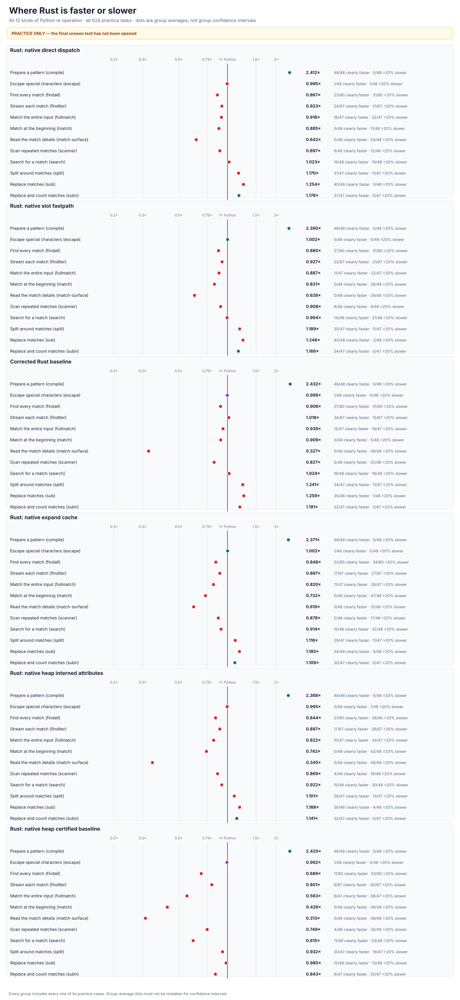

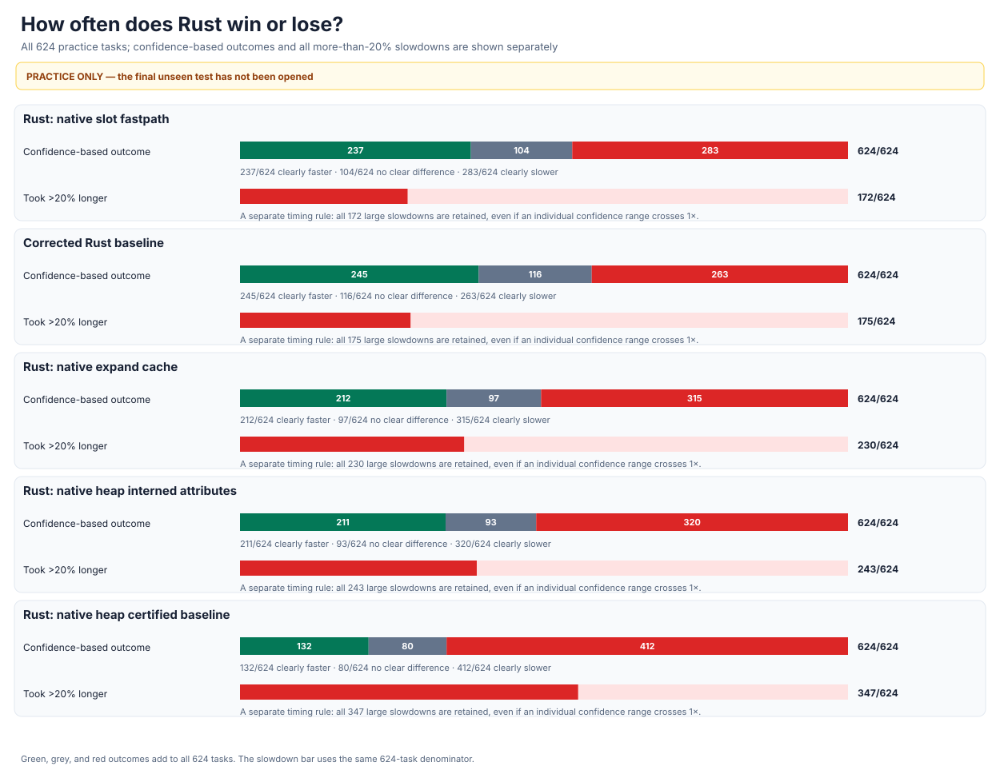

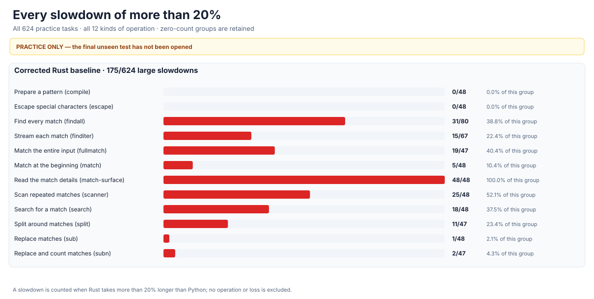

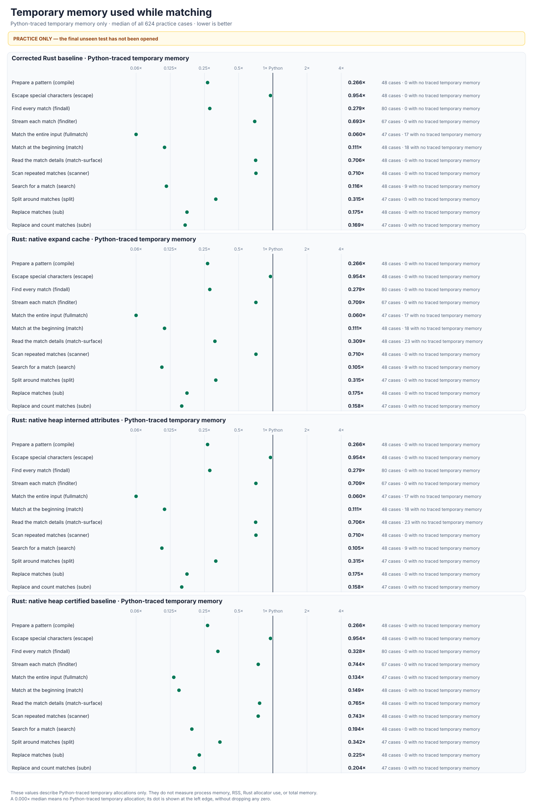

This memory graph measures allocations visible to Python. It does not establish native Rust memory use or engine-specific process memory.

## Detailed historical results

The following graphs retain every original workload and loss. They describe the **older, not fully compatible engines**, not the expanded sealed final test.


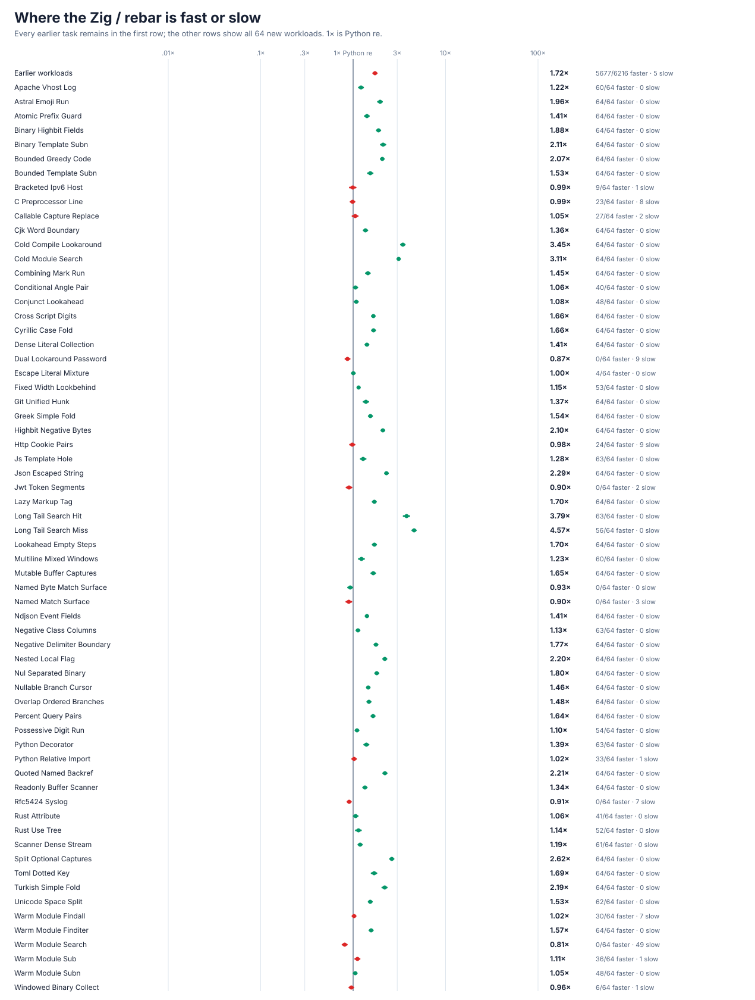

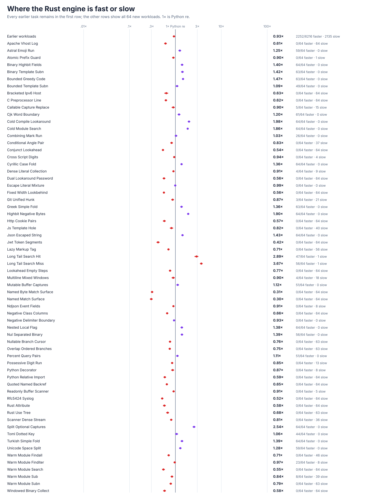

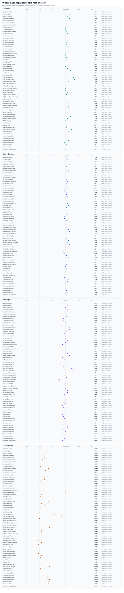

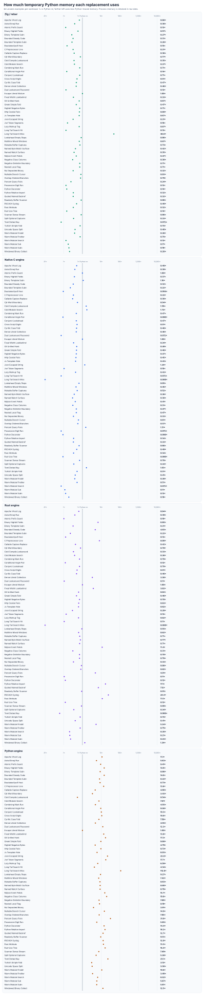

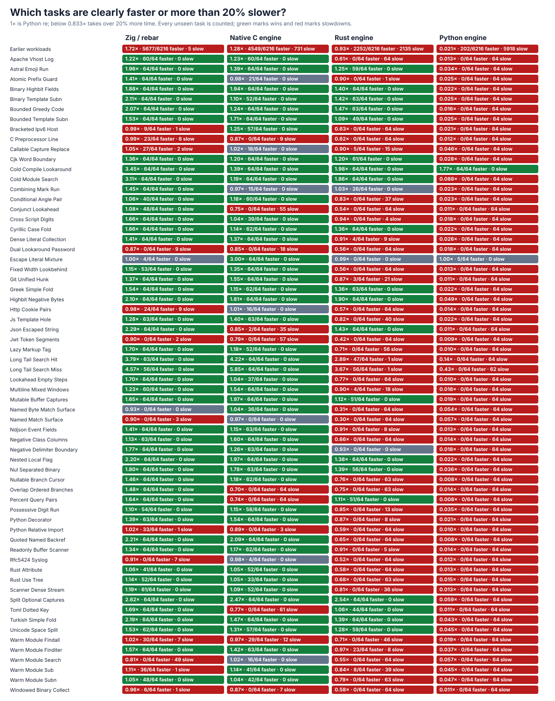

## Reproduce and inspect the experiment

The [experiment log](docs/EXPERIMENT-LOG.md) contains intermediate designs, complete failed tests, rejected optimizations, previous measurements, and isolation incidents. The [expanded 24,576-case benchmark](performance/v9/HOLDOUT-PROTOCOL.md) prospectively fixes its genuinely hidden test inputs, real-operation timing, memory checks, confidence calculation, and passing rules before any final measurement.

The objective in [GOAL.md](GOAL.md) is immutable. Its SHA-256 is `e5935060b44fe5f6b4e19ac2d01f3ce63182cf6a1d3b416502a4441cde345b62`; later clarifications are kept in [AMENDMENTS.md](AMENDMENTS.md).

```sh
PY=/tmp/rebar-cpython/cpython-3.14.6-linux-x86_64-gnu/bin/python3.14

PYTHONDONTWRITEBYTECODE=1 PYTHONPATH=. "$PY" -B \
  -m tools.audit_from_scratch --self-test
PYTHONDONTWRITEBYTECODE=1 PYTHONPATH=. "$PY" -B \
  -m tools.audit_from_scratch
PYTHONDONTWRITEBYTECODE=1 PYTHONPATH=. "$PY" -B \
  tools/audit_rust_interned_attributes_from_scratch.py --self-test
PYTHONDONTWRITEBYTECODE=1 PYTHONPATH=. "$PY" -B \
  tools/rust_v8_multi_candidate_observability.py --self-test
PYTHONDONTWRITEBYTECODE=1 PYTHONPATH=. "$PY" -B \
  tools/rust_v8_multi_candidate_campaign.py --self-test
PYTHONDONTWRITEBYTECODE=1 PYTHONPATH=. "$PY" -B \
  -m tools.rust_v9_holdout_protocol self-test --public-synthetic-only
PYTHONDONTWRITEBYTECODE=1 PYTHONPATH=. "$PY" -B \
  tools/performance_v9_charts.py --self-test
PYTHONDONTWRITEBYTECODE=1 PYTHONPATH=. "$PY" -B \
  -m tools.rust_v8_holdout_protocol verify --evidence
PYTHONDONTWRITEBYTECODE=1 PYTHONPATH=. "$PY" -B \
  tools/performance_v8_charts.py --self-test
```
