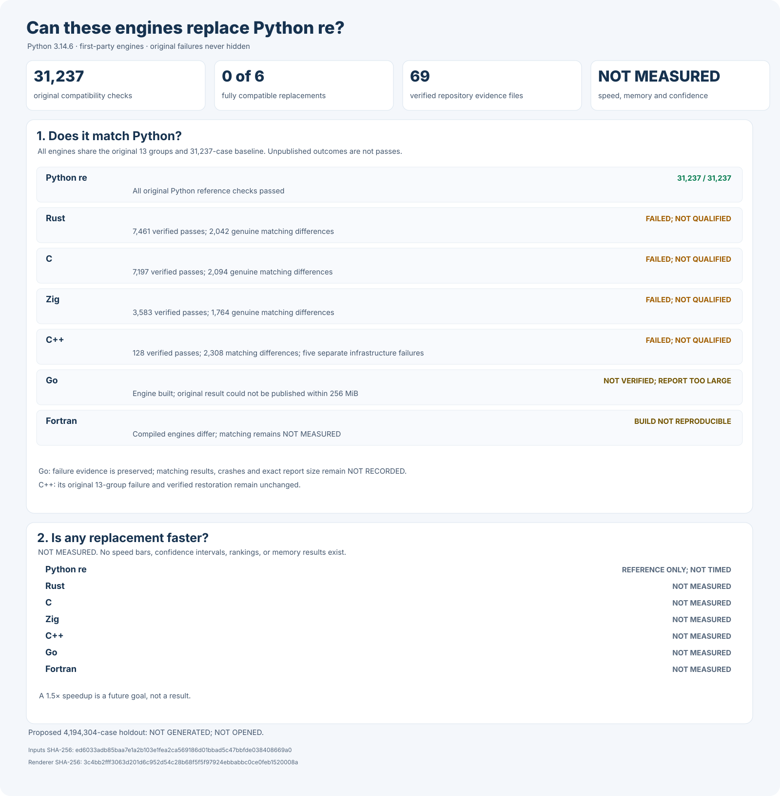

# rebar: a faster Python `re` experiment

Build a faster, fully compatible replacement for Python 3.14.6's
regular-expression module:

```python
import rebar as re
```

Every candidate must use its own matching engine built from scratch. Wrapping
Python, another regular-expression package, or another candidate does not count.

## Headline results

Python passes all **31,237** frozen compatibility checks. No replacement
has passed them. Five independently written engines—Rust, C, Zig, C++,
and Go—build reproducibly. Rust, C, Zig, and C++ have now been tested
and are still incompatible. Go was attempted, but the original test
recorder rejected its complete result above **256 MiB** before saving
it. Go is therefore **NOT VERIFIED**. All **13** C++ test groups were
attempted; only **128** cases belong to a passing group. All **2,308**
C++ behavior differences and **5** separate test-worker failures are
preserved. Fortran compiles, but its two builds still differ. No
candidate wraps an external regular-expression engine. Speed and
memory are **NOT MEASURED**; the final comparison is **NOT OPENED**.



| Engine | Current build | Complete compatibility | Speed against Python |
| --- | --- | --- | --- |
| Python `re` | Reference | 31,237 / 31,237 | Reference; not timed |
| Rust | Two matching builds | 7,461 verified; five groups failed; not qualified | NOT MEASURED |
| C | Two matching builds | 7,197 verified; six groups failed; not qualified | NOT MEASURED |
| Zig | Two matching builds; original failure preserved | 3,583 verified; seven groups failed; not qualified | NOT MEASURED |
| C++ | Two matching source builds | 128 verified; 12 groups failed; not qualified | NOT MEASURED |
| Go | Two matching first-party builds | Result recording failed; NOT VERIFIED | NOT MEASURED |
| Fortran | Three attempts; engines differ | NOT TESTED | NOT MEASURED |

Historical graphs below describe earlier binaries. They do not qualify
the current implementations. The complete history and rejected
experiments are preserved in the [experiment log](docs/EXPERIMENT-LOG.md).

## Detailed compatibility

| Python behavior | Cases | Rust | C | Zig | C++ |
| --- | ---: | ---: | ---: | ---: | ---: |
| Python's original runnable public tests | 151 | 151 | 151 | 151 | 43 failures |
| General public behavior | 864 | 864 | 864 | 864 | 40 failures |
| Scanners and callbacks | 1,024 | 1,024 | 1,024 | 960; 64 failures | 992 failures |
| Memory views and buffers | 768 | 768 | 768 | 768 | 181 failures |
| Total initial matching checks | 2,807 | 2,807 | 2,807 | 2,743; 64 failures | 1,256 failures |
| Additional memory-lifetime safety, counted separately | 1,024 | 1,024 | 1,024 | 1,024 | 600 failures |
| Verbose scanners and pattern comments | 2,854 | 2,854 | 2,854 | 2,234; 620 failures | Test worker failed |
| Additional public types, copying, and serialization | 6,912 | 248 failures | 248 failures | 248 failures | Test worker failed |
| Replacement and buffer behavior | 5,120 | 336 failures | 336 failures | 64 failures | Test worker failed |
| Changing-size buffer behavior | 10,240 | 1,392 failures | 1,392 failures | 672 failures | Test worker failed |
| Broad public behavior and real locales | 1,376 | 66 failures | 114 failures | 96 failures | 336 failures |
| Python buffer exporters and retained scanners | 264 | 264 | 4 failures | 264 | 116 failures |
| Simultaneous isolated Python interpreters | 128 | Setup failed; matching not established | Setup failed; no cases verified | Cleanup and report verification failed; no complete suite | 128 |
| Patterns shared across simultaneous Python threads | 512 | 512 | 512 | 512 | Test worker failed |
| Full frozen compatibility gate | 31,237 | Failed; 7,461 verified; five groups failed | Failed; 7,197 verified; six groups failed | Failed; 3,583 verified; seven groups failed | Failed; 128 verified; 2,308 mismatches; five worker failures |

Python's genuine debug-only test is skipped equally and is not included in the denominator.
Passing examples inside a failed group do not qualify that group or the replacement.
Zig's interpreter worker completed **385** matching calls before failing to
restore the original Python matcher; this cleanup failure is preserved but
is not counted as a regex mismatch. The outer test runner also rejects the
interpreter report because the two recorders name its verified file-sync
field differently. Both failures are recorded separately.


These detailed graphs describe older development builds, not the current
compatibility results. The [experiment log](docs/EXPERIMENT-LOG.md)
preserves the remaining historical graphs, including rejected results.

## Detailed development speed


These graphs measure an earlier Rust development build, not a current
candidate. Among all **864** historical cases, **183** were faster, **213**
were slower, and **468** were inconclusive. Current speed and memory remain
**NOT MEASURED**.

## Final comparison

The proposed final comparison will use **4,194,304** unseen examples and
**24** balanced measurement rounds. It will cover ordinary and unusual
patterns, text and bytes, compilation, repeated use, native-code overhead,
and memory.

Those final examples are **NOT FROZEN**, **NOT GENERATED**, and
**NOT OPENED**. Three independently built candidates must first pass every
compatibility and ownership check. Success requires at least **1.5×**
overall speedup, statistically faster results on at least **60%** of cases,
and an explanation of every slowdown greater than **20%**. There is no winner.

## Evidence and reproduction

- [Frozen Python compatibility tests](oracle/phase1/P0-COMPLETENESS-V1.md), [all 31,237 test cases](oracle/phase1/p0-completeness-v1.json), and [independent test verifier](tools/verify_p0_completeness_v1.py).
- [First-party engine ownership and no-wrapping audit](oracle/phase2/CANDIDATE-INDEPENDENCE-V2.md), [exact source inventory](oracle/phase2/candidate-independence-v2.json), and [source verifier](tools/audit_candidate_independence_v2.py).
- [Complete original-test rules](oracle/phase2/SIX-FAMILY-P0-CAMPAIGN-V1.md), [frozen test inventory](oracle/phase2/six-family-p0-campaign-v1.json), and [reproducible candidate test runner](tools/run_owned_six_family_original_p0_campaign_v1.py).
- [Lossless original-test recording rules](oracle/phase2/SIX-FAMILY-P0-CAMPAIGN-V2.md), [frozen streaming-test inventory](oracle/phase2/six-family-p0-campaign-v2.json), and [complete streaming test recorder](tools/run_owned_six_family_original_p0_campaign_v2.py); the original tests, first-party engines, and preserved Go failure remain unchanged.
- [Complete first-party C++ failure](oracle/phase2/evidence/owned-six-family-original-p0-campaign-v1-cpp-phase2-v1-failures.json.gz) and [independent publication and recovery receipt](oracle/phase2/evidence/owned-six-family-original-p0-campaign-v1-cpp-phase2-v1-failures-publication-receipt.json).
- [Complete Go result-recording failure](oracle/phase2/evidence/owned-six-family-original-p0-campaign-v1-go-phase2-v1-publication-failure-evidence.json.gz), [independent evidence receipt](oracle/phase2/evidence/owned-six-family-original-p0-campaign-v1-go-phase2-v1-publication-failure-evidence-publication-receipt.json), and [reproducible failure-preservation tool](tools/preserve_owned_go_campaign_publication_failure_v1.py). This is not a Go compatibility result.
- [Headline graph inputs](docs/evidence/candidate-current-overview-v18.inputs.json), [complete machine-readable results](docs/evidence/candidate-current-overview-v18.json), and [reproducible graph generator](tools/render_candidate_current_overview_v18.py).
- [Full experiment log, build reports, previous graphs, failures, and rejected designs](docs/EXPERIMENT-LOG.md).
- [Proposed 4,194,304-case final comparison](docs/EXPANDED-HOLDOUT-PROTOCOL-V1.md); examples remain **NOT GENERATED** and **NOT OPENED**.
- [Original objective](GOAL.md), SHA-256 `e5935060b44fe5f6b4e19ac2d01f3ce63182cf6a1d3b416502a4441cde345b62`; [later clarifications](AMENDMENTS.md).

Run the source-only safety checks without opening the final comparison:

```sh
PY=/tmp/rebar-cpython/cpython-3.14.6-linux-x86_64-gnu/bin/python3.14

"$PY" -I -B tools/verify_p0_completeness_v1.py --self-test
"$PY" -I -B tools/run_frozen_p0_candidate_worker_v4.py --self-test
"$PY" -I -B tools/run_frozen_p0_candidate_v6.py --self-test
"$PY" -I -B tools/run_frozen_p0_candidate_worker_v5.py --self-test
"$PY" -I -B tools/run_frozen_p0_candidate_v7.py --self-test
"$PY" -I -B tools/run_owned_six_family_original_p0_producer_v1.py --self-test
"$PY" -I -B tools/run_owned_six_family_original_p0_producer_v2.py --self-test
"$PY" -I -B tools/run_owned_six_family_original_p0_campaign_v1.py --self-test
"$PY" -I -B tools/run_owned_six_family_original_p0_campaign_v2.py --self-test
"$PY" -I -B tools/preserve_owned_go_campaign_publication_failure_v1.py --self-test
"$PY" -I -B tools/run_owned_candidate_subinterpreters_v3.py --self-test
"$PY" -I -B tools/reproduce_owned_native_source_build_v4.py --self-test
"$PY" -I -B tools/reproduce_owned_native_source_build_v4.py --verify-context
"$PY" -I -B tools/reproduce_owned_native_source_build_v5.py --self-test
"$PY" -I -B tools/reproduce_owned_native_source_build_v5.py --verify-context
"$PY" -I -B tools/reproduce_owned_native_source_build_v6.py --self-test
"$PY" -I -B tools/reproduce_owned_native_source_build_v6.py --verify-context
"$PY" -I -B tools/reproduce_owned_native_source_build_v7.py --self-test
"$PY" -I -B tools/activate_verified_native_candidate_v2.py --self-test
"$PY" -I -B tools/activate_verified_native_candidate_v3.py --self-test
"$PY" -I -B tools/activate_verified_native_candidate_v3.py --verify-frozen-context
"$PY" -I -B tools/activate_verified_native_candidate_v4.py --self-test
"$PY" -I -B tools/activate_verified_native_candidate_v4.py --verify-frozen-context
"$PY" -I -B tools/audit_candidate_independence_v2.py --self-test
"$PY" -I -B tools/render_candidate_current_overview_v18.py --self-test
```

Verify the current headline graph without rerunning a candidate or
opening a benchmark:

```sh
"$PY" -I -B tools/run_frozen_p0_candidate_v7.py --verify-frozen-context \
  --source-sha256 08ab73a0d42a2bb3bb658cf6924786a7ba396aacd229957a710866572e178690 \
  --worker-source-sha256 66f869e71e1aaf77944f4b7115e91ab34f6bc9b06fb4d17f097ea26c97c9c780 \
  --protocol-sha256 ed595cbb3d5f040454da7efff3d8330befb09dda2ac6eebc681b630b96f32733 \
  --document-sha256 16f24a46113e0a120fc5cf7fea2122d78e76445665959a9553b610a27b8843b1

"$PY" -I -B tools/run_owned_six_family_original_p0_producer_v1.py \
  --verify-frozen-context \
  --source-sha256 36451c10221857cca8c77fad7533382f4e3969a20a5cdf73c055beea1d315d33 \
  --protocol-sha256 1e7ed2cbd63e080c563dd49b4ea2a2be284d831d75739c47edecfae50373ce17 \
  --document-sha256 5206bcc097cd399cddd91a8d0356fd780b44ef7c173d70605d28a175dac71c0b

"$PY" -I -B tools/run_owned_six_family_original_p0_producer_v2.py \
  --verify-frozen-context \
  --source-sha256 fe6e82306852517580dcb90f289c643a55db8c01421230a4d7d05d6df365f9c1 \
  --protocol-sha256 3add264a113550d141379229a333d19e375f66429c2b7eb47dc3193a67f7b598 \
  --document-sha256 a210e9cac8d06b47cfc745019e4f4ab3a0c465ff63a38add0bc2b83b1cd986e3

"$PY" -I -B tools/run_owned_six_family_original_p0_campaign_v1.py \
  --verify-frozen-context \
  --source-sha256 50ac9f549739bb6b540f1762177f25b46c1fa345dce717ea7163e15d98ae7e88 \
  --protocol-sha256 01d5908b9c1c3c356059a21cd0b418a7278559843d465e9062155b68f6497422 \
  --document-sha256 c619e63dd18b8242bfc1af9e01030eff60e8d17128a83de216992b5cdc619801

"$PY" -I -B tools/run_owned_six_family_original_p0_campaign_v2.py \
  --verify-frozen-context \
  --source-sha256 6b06931ff64c5fe5b6bbbc3e970e56c0a94a24c28dfa6d3aa6140fc4d8fb54a1 \
  --protocol-sha256 e47cce8a6f60971bd3c18a4bfe248039ed9abd5b4144ec4355a77825a1435d4e \
  --document-sha256 e44960e46c590cb5ab482ef323f3ae8598900f144b53a2377f62b3bb827935d7

"$PY" -I -B tools/preserve_owned_go_campaign_publication_failure_v1.py \
  --verify-frozen-context \
  --source-sha256 105b7e730eae779396840ccaca13152554244ea615e5403930e0adbd2344f5ba \
  --protocol-sha256 5e067f3d71c0997be69cd5e3eb246c2e1c9387cd40616230e806ddf561994f4f \
  --contract-sha256 f095f94f74255432b0ceff7eb1239e28d6e4e4effeab19d4f2fed86156b2925b

"$PY" -I -B tools/reproduce_owned_native_source_build_v7.py \
  --verify-context \
  --source-sha256 20d8e43a9c70f585049f81d38f9085661b50e4bf754320a6abcd95d566d854a7 \
  --protocol-sha256 a7a5ce16bb7a98dfd6e0e4f9f3777912687aa09259cc1669c5e0932da2287313 \
  --contract-sha256 cfc774cfce1a0c4298f01e298d7ffaa982300375ba117e316bff2ebbf0be7819

"$PY" -I -B tools/render_candidate_current_overview_v18.py --verify \
  --source-sha256 3c4bb2fff3063d201d6c952d54c28b68f5f5f97924ebbabbc0ce0feb1520008a \
  --go-bridge-sha256 52101f0afe29a568e3c2e22a06d47c89c051e08a0e2024ad4891c5ae2d60fb6a \
  --manifest-sha256 ed6033adb85baa7e1a2b103e1fea2ca569186d01bbad5c47bbfde038408669a0
```

The [complete compatibility standard](oracle/phase1/P0-COMPLETENESS-V1.md)
contains the source-pinned, read-only full-verification command.
