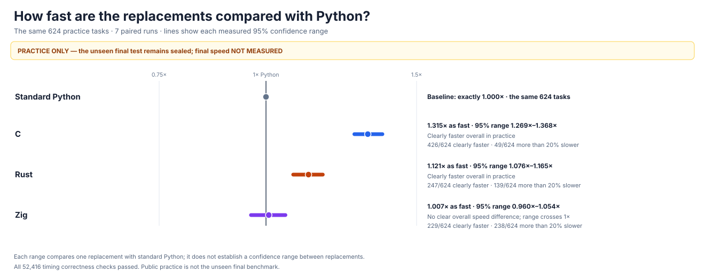
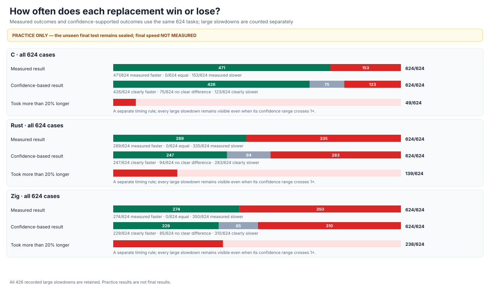
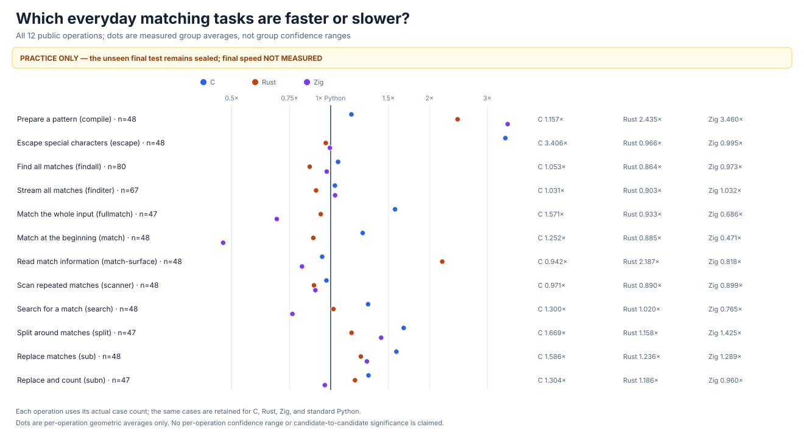
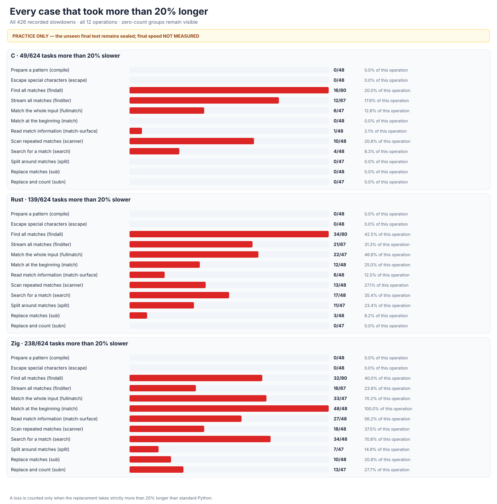
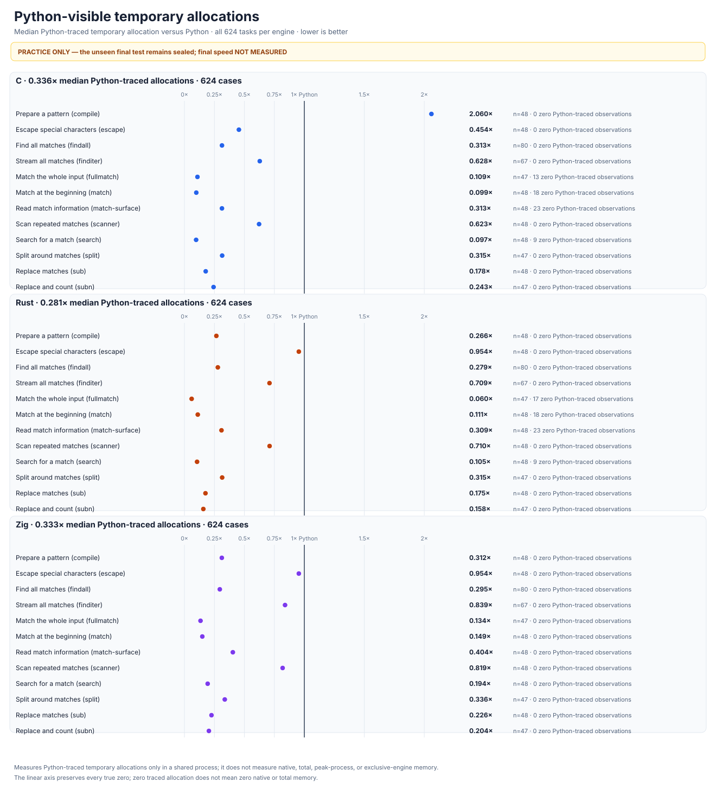
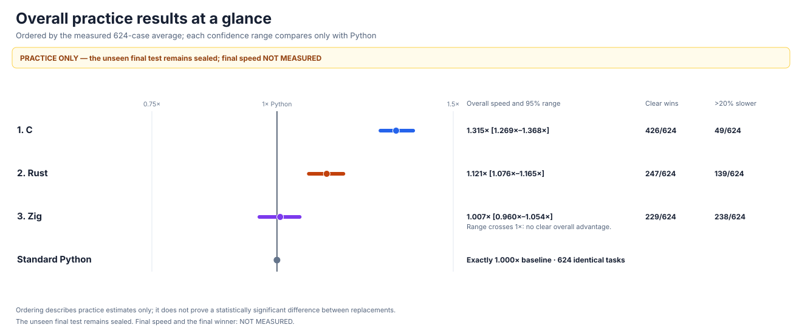

# rebar: a faster Python `re`

`rebar` is an experiment to build a faster, fully compatible replacement for Python’s regular-expression module. The intended public interface is `import rebar as re`. The comparison uses stable Python 3.14.6 and four separately written Rust, Zig, C, and Python implementations.

No implementation may call Python’s existing regex engine, wrap an external regex package, or delegate matching to another implementation.

## Headline results

The first graph shows whether each independently written engine gives Python's answers on the same **223,198** frozen matching checks. Matching correctness is not a claim of complete compatibility or speed.


The second graph compares all three fully checked engines against Python on the **same 624 public practice cases**. **1× is Python; higher is faster.** C measures **1.315×**, Rust **1.121×**, and Zig **1.007×**; the lines show each measured 95% uncertainty range. These are practice results, not the sealed final test.





**Rust, Zig, and C each independently pass all 22 complete compatibility and safety stages.** Each has its own matching engine; none wraps Python's `re`, an external package, or another candidate. The independent Python prototype remains incomplete.

The [**24,576-case final benchmark**](performance/v9/HOLDOUT-PROTOCOL.md) is now [prospectively sealed](performance/v9/holdout-manifest.json) and [independently verified](performance/v9/evidence/HOLDOUT-PROTOCOL-VERIFIED.json), but has not been opened. Final speed, memory use, and rankings for all three qualified engines are **NOT MEASURED**.

## Compatibility at a glance

Every result below uses the same frozen Python answers. “Differences” means observable behavior that does not match Python.

| Built-from-scratch engine | Matching checks | Parser checks | Object and lifetime checks | Tracing and unusual-argument checks |
| --- | ---: | ---: | ---: | ---: |
| Rust | [223,198/223,198](candidates/evidence/rust-v7-edge-oracle-rust-mandatory-prefix-inline-singleton.json.gz) | [20,480/20,480](candidates/evidence/rust-v8-rust-inline-singleton-sealed-campaign.json) | [0/393 differences](candidates/audits/RUST-V8-DEEP-CONTRACT-RUST-MANDATORY-PREFIX-INLINE-SINGLETON.json.gz) | [0/479 differences](candidates/evidence/rust-v8-observability-rust-qualified-mandatory-prefix-inline-singleton.json.gz) |
| Zig | [223,198/223,198](candidates/evidence/rust-v8-edge-oracle-zig-deep-stage-11.json.gz) | [20,480/20,480](candidates/evidence/rust-v7-grammar-zig-v8-deep-stage-11.json.gz) | [0/393 differences](candidates/audits/RUST-V8-DEEP-CONTRACT-ZIG-STAGE-11.json.gz) | [0/479 differences](candidates/evidence/rust-v8-observability-zig-qualified-stage-11.json.gz) |
| C | [223,198/223,198](candidates/evidence/rust-v8-edge-oracle-vm-deep-stage-19.json.gz) | [20,480/20,480](candidates/evidence/rust-v7-grammar-vm-v8-deep-stage-19.json.gz) | [0/393 public differences](candidates/audits/RUST-V8-DEEP-CONTRACT-C-STAGE-19.json.gz) | [0/479 differences](candidates/evidence/rust-v8-observability-vm-qualified-stage-19.json.gz) |
| Independent Python | [223,198/223,198](candidates/evidence/rust-v8-edge-oracle-ast-deep-stage-01.json.gz) | [20,480/20,480](candidates/evidence/rust-v7-grammar-ast-deep-stage-01.json.gz) | [93/393 differences](candidates/audits/RUST-V8-DEEP-CONTRACT-AST-STAGE-01.json.gz) | NOT MEASURED |

The larger frozen replacement-and-callback checks use the same Python baseline:

| Engine | Replacement and callback checks | Deep replacement and callback checks |
| --- | ---: | ---: |
| Rust | [0/8,862 differences](candidates/evidence/rust-v8-rust-mandatory-prefix-inline-singleton-replacement-adversarial.json.gz) | [0/11,266 differences](candidates/evidence/rust-v8-rust-mandatory-prefix-inline-singleton-replacement-adversarial-deep.json.gz) |
| Zig | [0/8,862 differences](candidates/evidence/rust-v8-replacement-zig-stage-11-from-scratch-failures.json.gz) | [0/11,266 differences](candidates/evidence/rust-v8-replacement-zig-stage-11-from-scratch-deep-failures.json.gz) |
| C | [0/8,862 differences](candidates/evidence/rust-v8-replacement-vm-stage-19.json.gz) | [0/11,266 differences](candidates/evidence/rust-v8-replacement-vm-deep-stage-19.json.gz) |

Each qualified engine independently passes the complete 22-stage campaign: [Rust](candidates/evidence/rust-v8-rust-inline-singleton-sealed-campaign.json), [Zig](candidates/evidence/rust-v8-zig-stage-11-sealed-campaign.json), and [C](candidates/evidence/rust-v8-vm-stage-19-sealed-campaign.json). The checks include Python's own tests, all **4,494,555** full-Unicode comparisons, **72,248** extended behavior checks, and both isolated crash and deep-recursion suites. The [complete Zig report](candidates/evidence/ZIG-STAGE-11-QUALIFIED.md), [C report](candidates/evidence/C-STAGE-19-QUALIFIED.md), and [experiment log](docs/EXPERIMENT-LOG.md) preserve the original failures and fixes.

The current [from-scratch audit](candidates/audits/FROM-SCRATCH-AUDIT.json) independently verifies all four implementations, all **five** actual loaded native libraries, and all **76** checks against external packages, Python's existing engine, hidden engine sharing, and substituted native code.

## Overall speed compared with Python

**Final, unseen speed: NOT MEASURED.** The following results are from one shared, correctness-checked public practice run. All candidates and Python received the same **624** cases and **seven** paired trials.

| Fully compatible engine | Overall practice speed | 95% uncertainty range | Clearly faster cases | More than 20% slower |
| --- | ---: | ---: | ---: | ---: |
| C | 1.315× | 1.269–1.368× | 426/624 | 49/624 |
| Rust | 1.121× | 1.076–1.165× | 247/624 | 139/624 |
| Zig | 1.007× | 0.960–1.054× | 229/624 | 238/624 |

The [complete practice report](performance/v7/evidence/THREE-QUALIFIED-ENGINES-PUBLIC-PRACTICE.md) retains all **17,472** timing rows, **52,416** correctness checks, and all **426** substantial slowdowns. The [independent verifier](performance/v7/evidence/three-qualified-engines-public-practice-v1-integrity.json) recomputes all **1,875** confidence intervals and verifies all five loaded native libraries. Zig's overall uncertainty overlaps Python, so its practice result does not establish an overall speed improvement. No practice result establishes the final **1.5×** target or selects a winner.

The sealed [24,576-case final benchmark](performance/v9/HOLDOUT-PROTOCOL.md) fixes **31** paired rounds, **9,999** confidence draws, hidden real patterns and inputs, genuinely precompiled patterns, and **16** real calls per timed sample. Its [75-check, manifest-bound verification](performance/v9/evidence/HOLDOUT-PROTOCOL-SELF-TEST.json) passes without importing a candidate, opening the secret, creating final cases, or measuring performance. The [one-time commitment and its honest same-user custody limitations](performance/v9/evidence/HOLDOUT-PROSPECTIVE-FREEZE.md) are recorded before optimization. The [earlier 12,288-case protocol](performance/v8/HOLDOUT-PROTOCOL.md) remains preserved and unopened.

The [final graph generator](tools/performance_v9_charts.py) and [independent results verifier](tools/performance_v9_results_audit.py) pass their respective [95](performance/v9/evidence/PERFORMANCE-CHARTS-PUBLIC-SYNTHETIC-SELF-TEST.json) and [93](performance/v9/evidence/PERFORMANCE-RESULTS-AUDIT-PUBLIC-SYNTHETIC-SELF-TEST.json) synthetic integrity checks. Neither has opened a final case or measured an engine. Final graphs will only be generated from genuine complete results.

## Detailed practice results

Each graph below is generated directly from the same [independently verified, four-way practice run](performance/v7/evidence/three-qualified-engines-public-practice-v1-integrity.json). No final-test case is used.







Memory results describe Python-visible temporary allocations in a shared benchmark process. They do **not** establish isolated native-engine or whole-process memory.



## Earlier Rust designs

The earlier [fully checked Rust report](performance/v7/evidence/RUST-INLINE-SINGLETON.md) preserves all eight previous independently measured Rust designs. Its separate graph retains all original results; its confidence ranges are not paired comparisons between designs.


This memory graph measures allocations visible to Python. It does not establish native Rust memory use or engine-specific process memory.

All older, incomplete-engine comparisons and their generated graphs remain in the [experiment log](docs/EXPERIMENT-LOG.md); they are not results for the three currently qualified engines or the sealed final benchmark.

## Reproduce and inspect the experiment

The [experiment log](docs/EXPERIMENT-LOG.md) contains intermediate designs, complete failed tests, rejected optimizations, previous measurements, and isolation incidents. The [expanded 24,576-case benchmark](performance/v9/HOLDOUT-PROTOCOL.md) prospectively fixes its genuinely hidden test inputs, real-operation timing, memory checks, confidence calculation, and passing rules before any final measurement.

The objective in [GOAL.md](GOAL.md) is immutable. Its SHA-256 is `e5935060b44fe5f6b4e19ac2d01f3ce63182cf6a1d3b416502a4441cde345b62`; later clarifications are kept in [AMENDMENTS.md](AMENDMENTS.md).

```sh
PY=/tmp/rebar-cpython/cpython-3.14.6-linux-x86_64-gnu/bin/python3.14

PYTHONDONTWRITEBYTECODE=1 PYTHONPATH=. "$PY" -B \
  -m tools.audit_from_scratch --self-test
PYTHONDONTWRITEBYTECODE=1 PYTHONPATH=. "$PY" -B \
  -m tools.audit_from_scratch
PYTHONDONTWRITEBYTECODE=1 PYTHONPATH=. "$PY" -B \
  tools/audit_rust_interned_attributes_from_scratch.py --self-test
PYTHONDONTWRITEBYTECODE=1 PYTHONPATH=. "$PY" -B \
  tools/rust_v8_multi_candidate_observability.py --self-test
PYTHONDONTWRITEBYTECODE=1 PYTHONPATH=. "$PY" -B \
  tools/rust_v8_multi_candidate_campaign.py --self-test
PYTHONDONTWRITEBYTECODE=1 PYTHONPATH=. "$PY" -B \
  -m tools.rust_v9_holdout_protocol self-test --public-synthetic-only
PYTHONDONTWRITEBYTECODE=1 PYTHONPATH=. "$PY" -B \
  -m tools.rust_v9_holdout_protocol verify \
  --manifest performance/v9/holdout-manifest.json --evidence
PYTHONDONTWRITEBYTECODE=1 PYTHONPATH=. "$PY" -B \
  -m tools.rust_v7_multi_candidate_practice_audit self-test
PYTHONDONTWRITEBYTECODE=1 PYTHONPATH=. "$PY" -B \
  -m tools.rust_v7_multi_candidate_practice_charts --self-test
PYTHONDONTWRITEBYTECODE=1 PYTHONPATH=. "$PY" -B \
  tools/performance_v9_charts.py --self-test
PYTHONDONTWRITEBYTECODE=1 PYTHONPATH=. "$PY" -B \
  tools/performance_v9_results_audit.py self-test --public-synthetic-only \
  --source-sha256 fc85ca331504c12ee012db8ebb02464ed49f22327c7e84ec36f612a2b8d6aa3d \
  --protocol-sha256 a699ce1e661ead447af0643584d69f080e72712059ad611fbd6b998f2ca19219 \
  --output performance/v9/evidence/PERFORMANCE-RESULTS-AUDIT-PUBLIC-SYNTHETIC-SELF-TEST-REPRODUCED.json
PYTHONDONTWRITEBYTECODE=1 PYTHONPATH=. "$PY" -B \
  -m tools.rust_v8_holdout_protocol verify --evidence
PYTHONDONTWRITEBYTECODE=1 PYTHONPATH=. "$PY" -B \
  tools/performance_v8_charts.py --self-test
```
