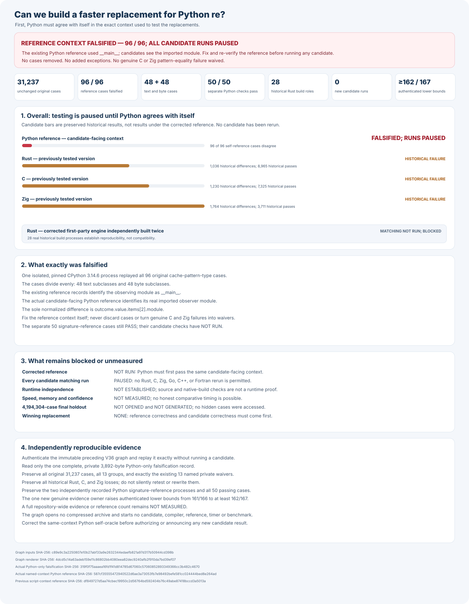

# rebar: a faster Python `re` experiment

Build a faster, fully compatible replacement for Python 3.14.6's
regular-expression module:

```python
import rebar as re
```

Every candidate must use its own matching engine built from scratch. Wrapping
Python, another regular-expression package, or another candidate does not count.

## Headline results

Python's original reference passed all **31,237** frozen compatibility
checks. A stricter replay has since exposed **96** original cases where
the test helper behaves differently when run as a script or imported.
Candidate testing is paused until Python agrees with itself in the exact
candidate execution context. No cases will be removed. There is no
compatible replacement, measured speedup, or winner.

The corrected, independently verified two-process Python reference is
frozen but **NOT RUN**. Existing replacement test runners still point at
the rejected reference and cannot run until they are corrected.



Each language below uses its own, independently written matching engine;
the source and build checks reject outside matching packages and shared
candidate engines. A complete execution-time proof that no candidate
delegates matching to Python remains **NOT ESTABLISHED**. The corrected
Zig engine reduced its differences from **2,172** to **1,764** across
all **13** original test groups, but still does not qualify.

The next corrected Rust engine now builds identically from scratch in
two independent offline source trees. Its full matching test has
**NOT RUN**, so the Rust result below is the previous actually tested build.

Overall speed relative to Python: **NOT MEASURED**. Fair speed and memory
measurements start only when three independent engines pass every check.

| Engine | Current build | Complete compatibility | Speed against Python |
| --- | --- | --- | --- |
| Python `re` | Candidate-context reference needs correction | Original: 31,237 / 31,237; replay: 96 context differences | Reference; not timed |
| Rust | Corrected build repeated twice; test paused | Previous tested build: 8,965 verified; 1,036 differences | NOT MEASURED |
| C | Independently written and built | 7,325 verified; 1,230 differences; all 13 groups completed | NOT MEASURED |
| Zig | Independently written and built | 3,711 verified; 1,764 differences; all 13 groups completed | NOT MEASURED |
| C++ | Independently written and built | 128 verified; 2,308 differences; five worker failures | NOT MEASURED |
| Go | New build paused; failure recorder needs correction | 128 verified; 4,518 differences; four worker failures | NOT MEASURED |
| Fortran | Independently written | NOT TESTED | NOT MEASURED |

Verified passes and reported differences do not always add up to 31,237:
a failed test group does not prove that its remaining cases pass. All
failures and worker errors remain in the published evidence.

An additional **50** checks of Python's public function and method
signatures are frozen separately. Two independently isolated Python
reference processes passed all **50** and produced identical results.
Candidate results for these additional checks remain **NOT MEASURED**;
the checks are not added to the original **31,237**.

## Detailed compatibility

These charts show preserved, earlier development builds and particular
categories of Python behavior. They are not current passing results.
Complete results, test-group histories, and rejected approaches remain
in the [experiment log](docs/EXPERIMENT-LOG.md).


## Final comparison

The final comparison is planned to use **4,194,304** unseen examples,
four times the preceding one-million-example proposal, and **24**
balanced measurement rounds. Its cases remain **NOT FROZEN**,
**NOT GENERATED**, and **NOT OPENED**. Current speed and memory are
**NOT MEASURED**.

First, three independently built engines must pass all **31,237**
compatibility checks. To win, an engine must be at least **1.5×** faster
overall, measurably faster in at least **60%** of cases, and explain every
slowdown greater than **20%**. There is no winner.

## Evidence and reproduction

- [Reproduce the results and verify every graph](docs/REPRODUCING.md).
- [Experiment log, original reports, failures, and rejected designs](docs/EXPERIMENT-LOG.md).
- [Frozen Python compatibility checks](oracle/phase1/P0-COMPLETENESS-V1.md).
- [Frozen correction for the Python reference](oracle/phase1/P0-PUBLIC-TYPE-REFERENCE-CONTEXT-V1.md).
- [Separately frozen public-signature checks](oracle/phase1/P0-CALLABLE-INTROSPECTION-V1.md).
- [Frozen two-process Python signature reference](oracle/phase1/CALLABLE-INTROSPECTION-REFERENCE-V2.md).
- [Independent, from-scratch engine and no-wrapping audit](oracle/phase2/CANDIDATE-INDEPENDENCE-V2.md).
- [Expanded, still-unopened final comparison](docs/EXPANDED-HOLDOUT-PROTOCOL-V1.md).
- [Original objective](GOAL.md), SHA-256
  `e5935060b44fe5f6b4e19ac2d01f3ce63182cf6a1d3b416502a4441cde345b62`;
  [later clarifications](AMENDMENTS.md).
