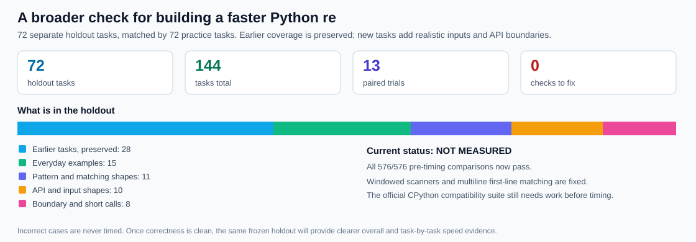
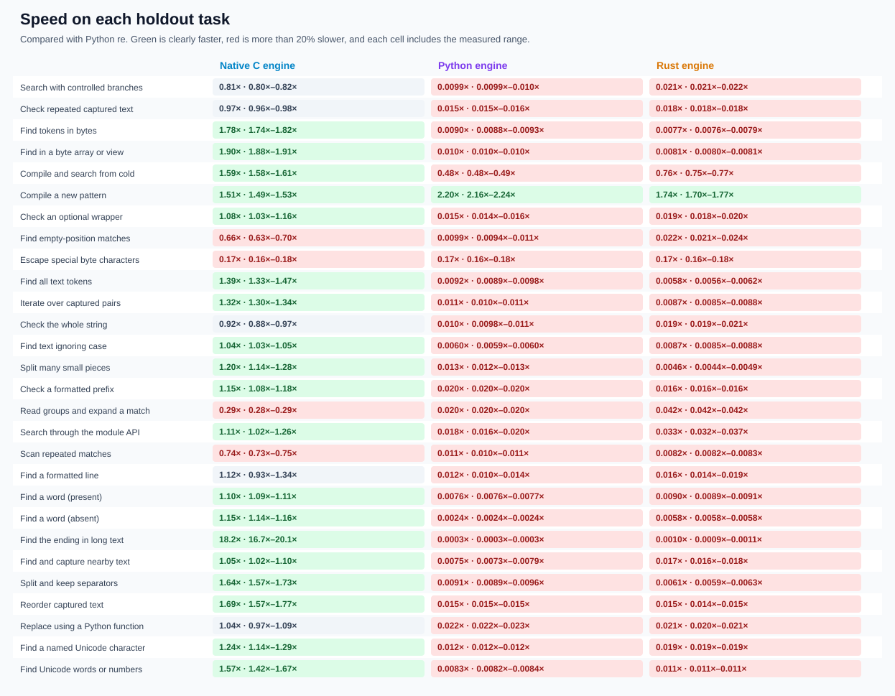
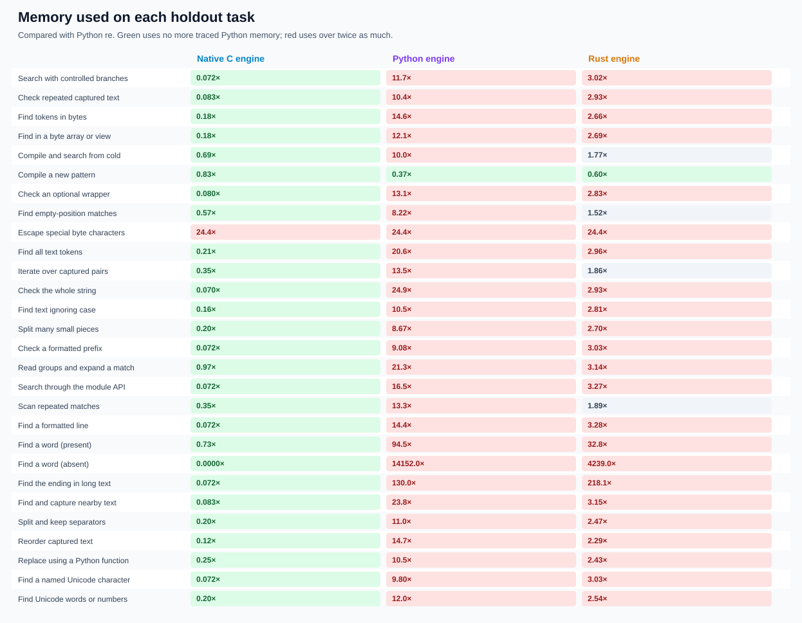
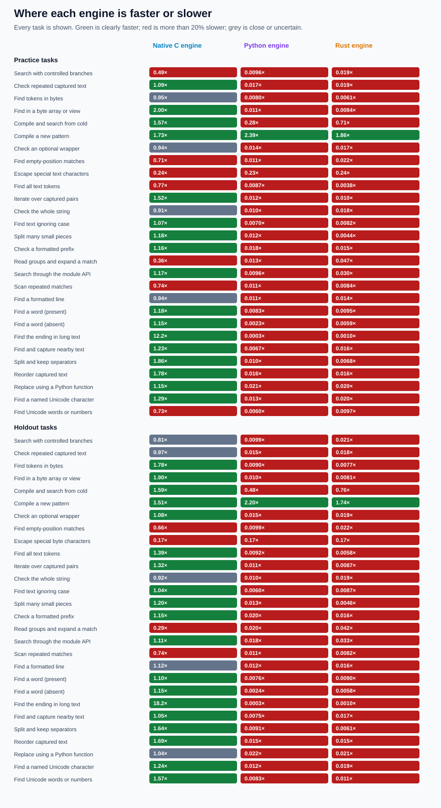
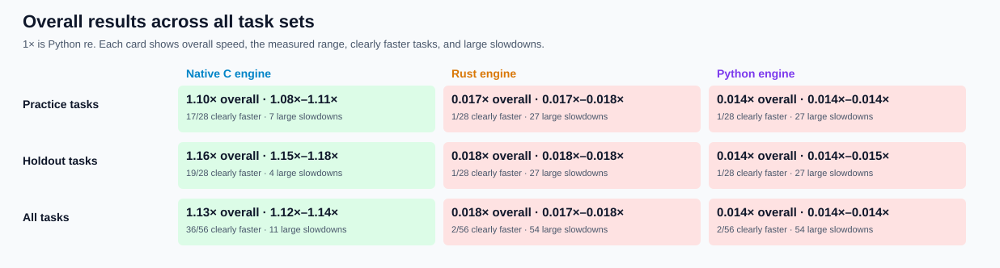
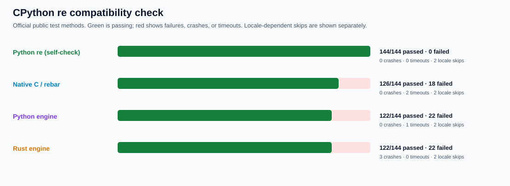

# rebar: building a faster Python `re`

`rebar` is an experiment to build a drop-in, faster replacement for Python's regular-expression module. The public import is `import rebar as re`. Independent engines are checked against the latest stable CPython and compared on the same tasks; incorrect results are never timed. A newly added official CPython test gate has exposed compatibility work still required before a general drop-in claim.

The immutable objective is [GOAL.md](GOAL.md), SHA-256 `e5935060b44fe5f6b4e19ac2d01f3ce63182cf6a1d3b416502a4441cde345b62`. Scope notes are in [AMENDMENTS.md](AMENDMENTS.md), and the complete chronological record is in the [experiment log](docs/EXPERIMENT-LOG.md).

## Headline results

The expanded holdout contains 28 tasks kept separate from tuning. **1× means the same speed as Python `re`; higher is faster.** The native C engine is **1.16× as fast overall** and clearly faster on **19/28** tasks, but four newly covered tasks are more than 20% slower. Python and Rust are much slower on short calls. These results identify what to optimize next.


| Engine | Overall speed | Clearly faster | Large slowdowns |
| --- | ---: | ---: | ---: |
| Native C | **1.16×** | **19/28** | **4/28** |
| Rust | 0.018× | 1/28 | 27/28 |
| Python | 0.014× | 1/28 | 27/28 |

The [full expanded report](performance/v2/evidence/INITIAL.md) retains all 2,464 timing rows, every task, memory observations, and every slowdown. The headline graph and compact task grids below show the same results in plain language.

The next, broader holdout is now frozen at **72 separate tasks** (144 including practice), adding realistic logs, URLs, configuration/text-cleanup work, byte inputs, API boundaries, and windowed calls. Its pre-timing check now passes **576/576** comparisons after fixing eight newly exposed gaps. It is **NOT MEASURED** yet because the official CPython compatibility gate still needs work.



## Detailed graphs

These show the expanded holdout task by task. Green means clearly faster, red means more than 20% slower, and grey means close or uncertain. Each speed cell includes the measured range.









## Correctness and current status

The baseline is [CPython 3.14.6](oracle/v1/BASELINE.md). All three original engines and stdlib pass the [expanded seeded matrix](oracle/v2/P0.md): **8,244/8,244 cases**, **45/45 obligations**. The newly vendored [official CPython `re` tests](oracle/cpython-3.14.6/README.md) are stricter: stdlib passes all 144 runnable methods, while the engines still have semantic gaps and native safety failures. Those gaps are preserved and will be fixed before new timings.



| Check | Status |
| --- | --- |
| Seeded correctness | **PASS** — stdlib, native C, Python, and Rust each pass all 8,244 expanded cases |
| Official CPython tests | **NOT QUALIFIED** — native passes 126/144 runnable methods; Python and Rust pass 122/144; failures are preserved |
| Original performance | **PASS** — native C reaches 1.56× on the original 16-task holdout |
| Expanded performance | **MEASURED / OPTIMIZATION NEEDED** — native C reaches 1.16× on 28 holdout tasks; all results are correctness-gated |
| Broader performance | **FROZEN / NOT MEASURED** — 72 holdout tasks; all 576 pre-timing comparisons pass, official-suite gaps remain |
| Public import | **AVAILABLE / NOT YET GENERAL-PURPOSE** — `import rebar as re` uses native C; official-suite gaps remain |

The [expanded performance protocol](performance/v2/PROTOCOL.md) explains exactly what is timed, how comparisons are made, and how slowdowns are reported. Full results, raw data, rejected experiments, and older charts are linked from the [experiment log](docs/EXPERIMENT-LOG.md).

## Try it or reproduce the checks

```sh
PY=/tmp/rebar-cpython/cpython-3.14.6-linux-x86_64-gnu/bin/python3.14
PYTHON="$PY" sh tools/build_vm.sh
RUSTFLAGS='-D warnings' sh tools/build_rust.sh

PYTHONPATH=. "$PY" -c 'import rebar as re; print(re.findall(r"[A-Za-z]+", "a faster python re"))'
PYTHONPATH=. "$PY" tools/oracle_v2.py verify --module rebar
PYTHONPATH=. "$PY" tools/cpython_re_oracle.py verify --module rebar
PYTHONPATH=. "$PY" tools/perf_v2.py verify
PYTHONPATH=. "$PY" tools/perf_v3.py verify
```
