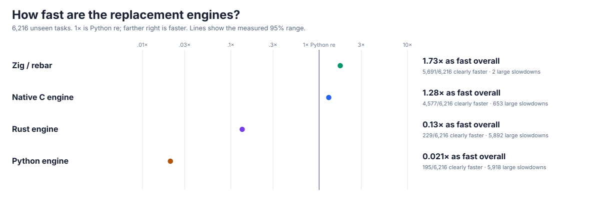
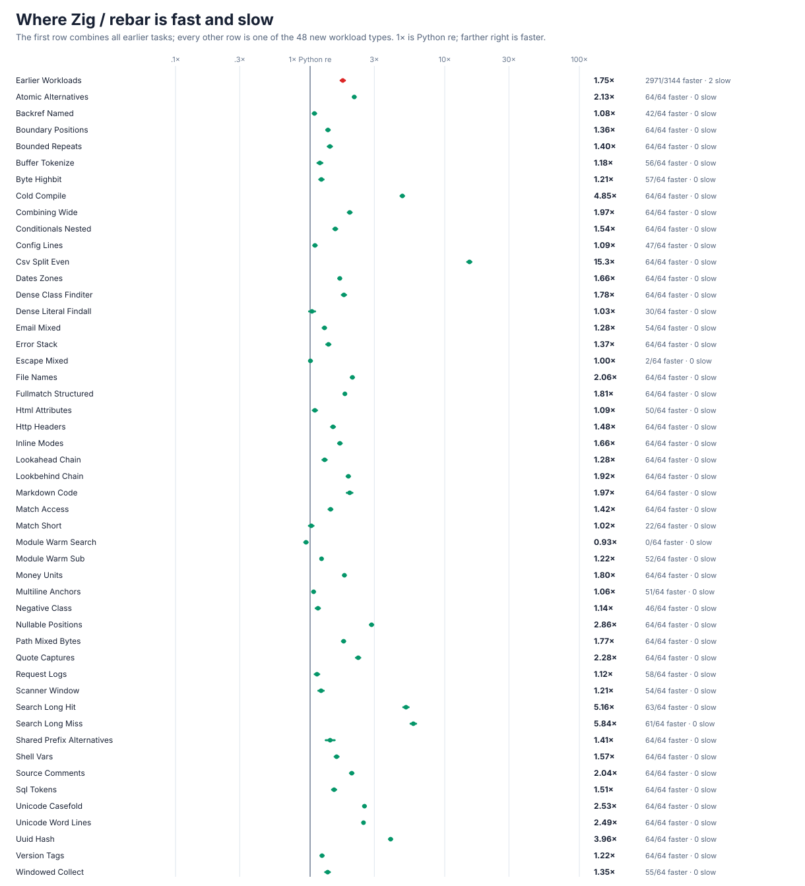
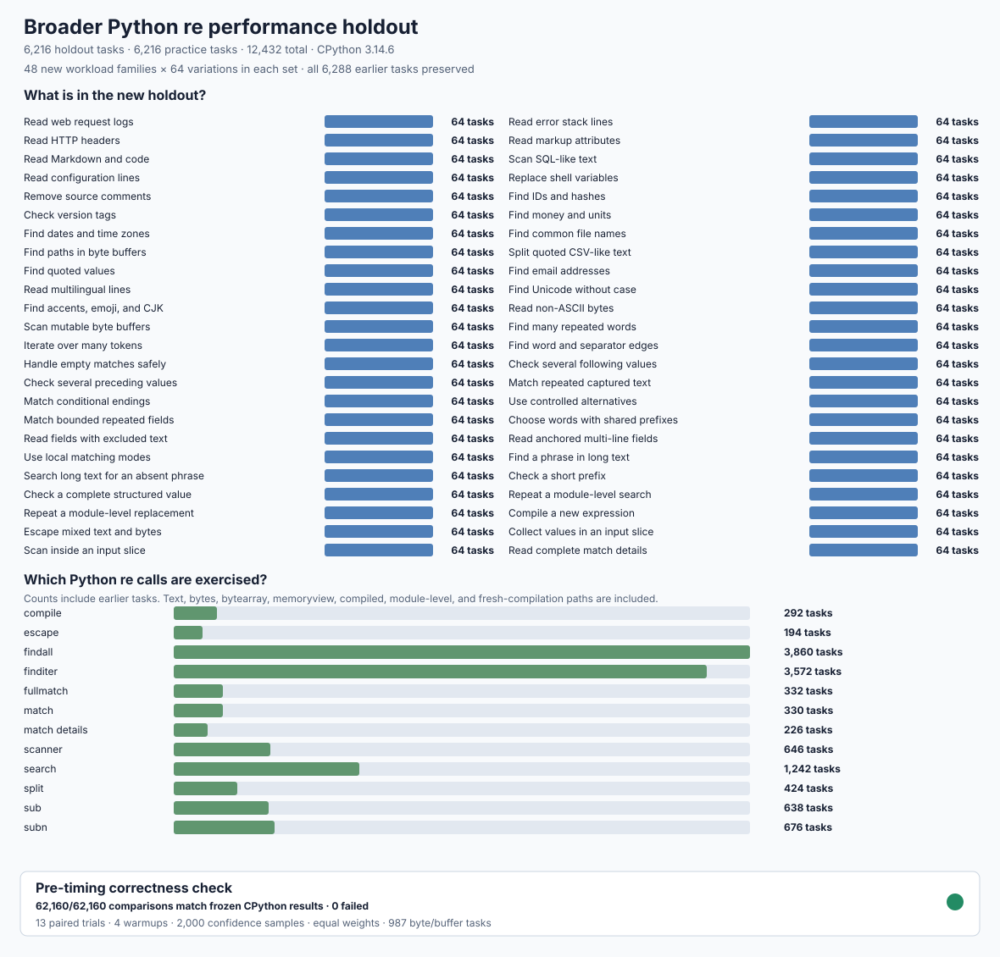
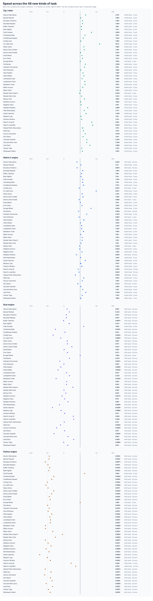
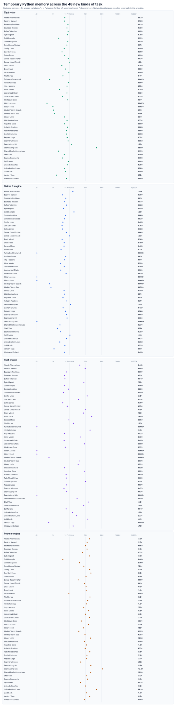
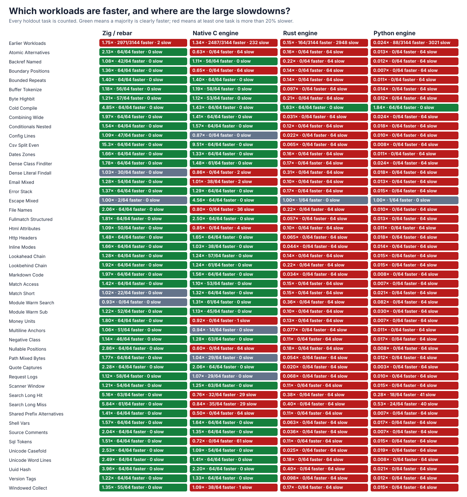
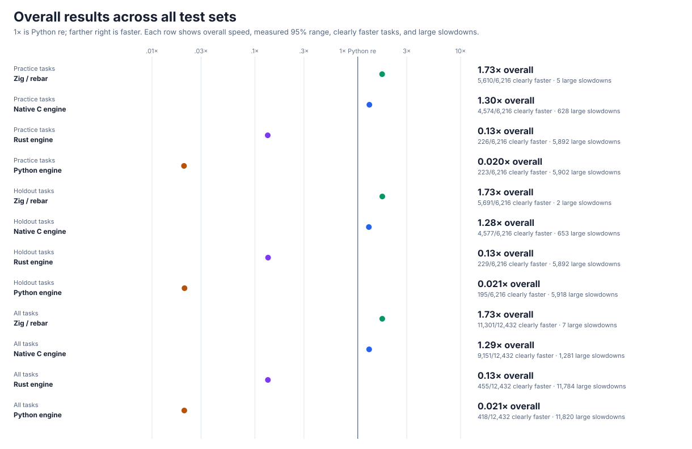

# rebar: a faster Python `re`

`rebar` is a from-scratch replacement for Python's regular-expression module. Use it with `import rebar as re`. Four independent engines were built and checked against stable CPython 3.14.6; matching never delegates to Python `re`, `_sre`, or an external regular-expression package.

## Current results

On **6,216 separate, unseen tasks**, Zig / `rebar` is **1.733× as fast overall** (95% range **1.732–1.735×**) and clearly faster on **5,691/6,216 tasks (91.6%)**. There are **two** tasks more than 20% slower: very short version strings that return four captures, where call and result-building cost outweigh matching. **1× means the same speed as Python `re`; higher is faster.**



| Engine | Overall speed | Clearly faster | Large slowdowns |
| --- | ---: | ---: | ---: |
| Zig / `rebar` | **1.733×** | **5,691/6,216** | **2/6,216** |
| Native C | 1.283× | 4,577/6,216 | 653/6,216 |
| Rust | 0.134× | 229/6,216 | 5,892/6,216 |
| Python | 0.021× | 195/6,216 | 5,918/6,216 |



The holdout covers everyday text and bytes, common calls, compilation, Unicode, captures, replacements, scanners, input slices, structured data, hits, misses, and short and long inputs. The initial five-engine comparison and the final paired Zig rerun retain **1,131,312** timing rows, memory observations, confidence ranges, individual results, and every slowdown. The [current Zig report](candidates/evidence/ZIG-V6-OPTIMIZED.md) explains the result and links the raw evidence.

The [Rust starting-point audit](candidates/evidence/RUST-V6-BASELINE.md) records the separate from-scratch Rust engine's complete frozen baseline, newly exposed Unicode compatibility gaps, and the ongoing work to improve its matching, memory use, and Python boundary.

## Compatibility

`rebar` passes the frozen **44,084-case** correctness suite, including **35,840** unseen text, bytes, Unicode, buffer, scanner, property, and invalid-input cases, all **144** runnable official CPython `re` tests, **109,848** established focused checks, **163,960** alternative/run/delimiter/API checks, **156,484** direct-scan checks, and **230,337** new literal, alternative, Unicode, line, buffer, and call-surface checks. Debug, address, and undefined-behavior checks and the zero-delegation audit are clean.




| Check | Current result |
| --- | --- |
| Frozen correctness | **PASS** — stdlib and all four engines pass all 44,084 cases |
| Official CPython tests | **PASS** — 144/144 runnable methods; zero failures, crashes, or timeouts |
| Focused Zig/API/safety | **PASS** — Unicode, large patterns, groups, repeats, flags, errors, spans, captures, buffers, and public calls |
| Performance holdout | **PASS** — 1.733× overall, 91.6% clearly faster; both large slowdowns are listed and explained |
| Public import | **AVAILABLE** — `import rebar as re` selects the independent Zig engine |

## Detailed current graphs

The following views keep the **48 new kinds of workload** separate so it is easy to see where each engine helps or hurts. Temporary Python memory for Zig is at or below Python `re` on **5,722/6,216** holdout tasks, with a **0.54×** median ratio. The raw data also retains process-memory observations.









The [complete workload and slowdown report](candidates/evidence/zig-v6-final-report.md) keeps every family and engine visible.

## Reproduce

The [broader performance protocol](performance/v6/PROTOCOL.md) records coverage, equal weights, seeds, timing rules, and correctness gates. The immutable objective is [GOAL.md](GOAL.md), SHA-256 `e5935060b44fe5f6b4e19ac2d01f3ce63182cf6a1d3b416502a4441cde345b62`; scope notes are in [AMENDMENTS.md](AMENDMENTS.md), and the chronological record is in the [experiment log](docs/EXPERIMENT-LOG.md).

```sh
PY=/tmp/rebar-cpython/cpython-3.14.6-linux-x86_64-gnu/bin/python3.14
PYTHON="$PY" sh tools/build_zig_probe.sh

PYTHONPATH=. "$PY" -c 'import rebar as re; print(re.findall(r"[A-Za-z]+", "a faster python re"))'
PYTHONPATH=. "$PY" tools/oracle_v3.py verify --module rebar --cohort holdout --output /tmp/rebar-correctness.json
PYTHONPATH=. "$PY" tools/cpython_re_oracle.py verify --module rebar --output /tmp/rebar-official.json
PYTHONPATH=. "$PY" tools/zig_v6_paths_probe.py --module rebar --seeded-cases 8192 --output /tmp/rebar-paths.json
PYTHONPATH=. "$PY" tools/perf_v6.py verify --module rebar --output /tmp/rebar-performance-check.json
PYTHONPATH=. "$PY" tools/zig_perf_v6.py self-test
gzip -dc candidates/evidence/zig-v6-final-raw.jsonl.gz > /tmp/rebar-raw.jsonl
PYTHONPATH=. "$PY" tools/zig_perf_v6.py analyze --input /tmp/rebar-raw.jsonl --output /tmp/rebar-summary.json
PYTHONPATH=. "$PY" tools/zig_merge_v6.py --initial performance/v6/evidence/initial-summary.json.gz --zig /tmp/rebar-summary.json --output /tmp/rebar-combined.json
PYTHONPATH=. "$PY" tools/performance_v6_charts.py --summary /tmp/rebar-combined.json --prefix /tmp/rebar
```
