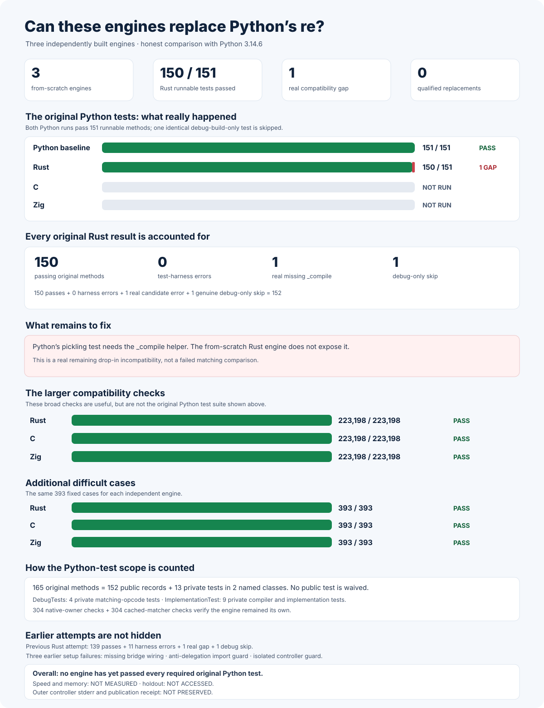

# rebar: a faster Python `re` experiment

Can a regular-expression engine built from scratch replace
[Python 3.14.6's](https://www.python.org/downloads/release/python-3146/)
`re` and run faster? The intended interface is `import rebar as re`.
Every candidate must use its own matching engine, not Python's engine,
an external regular-expression package, or another candidate.

**Current public development result:** The from-scratch Rust engine matches
Python on **864 of 864** general examples and **1,024 of 1,024**
separately frozen scanner examples. It has **zero** mismatches in either
comparison. These are genuine development checks, not the complete
original Python test suite or the unopened final speed test. In a first
**864-case**, **12-round** development comparison, Rust is **1.058×**
as fast as Python overall. This does not meet the **1.5×** target. Final
speed and native memory are **NOT MEASURED**. There is no winner.

## Current speed against Python


Python is **1.000×**. Rust is **1.058×**, with a measured **1.042× to
1.075×** confidence interval. Of **864** examples, **185** are clearly
faster, **231** are clearly slower, and **448** are inconclusive.


This is a development measurement of complete Python-visible operations,
not a hidden result or a prediction about the **1,048,576-example** final
test. The [complete original measurements](experiments/rust_public_practice_v1/rust-native-scanner-v1-public-practice.json)
contain all **10,368** paired observations.

## Current compatibility


The graph is generated from the
[complete recorded current result](experiments/rust_public_practice_v1/rust-module-v1-after-native-scanner.json),
its [independently verified receipt](experiments/rust_public_practice_v1/rust-module-v1-after-native-scanner-publication-receipt.json),
and the exact Rust source and native binaries. The
[separate 1,024-example scanner result](experiments/rust_public_practice_v1/rust-native-scanner-v1-independent-differential.json)
also passes every test. The original
[824-pass, 40-failure result](experiments/rust_public_practice_v1/rust-module-v1-before-native-scanner.json)
is preserved, not overwritten.

## Current speed by operation


Exactly **two** examples exceed a **20%** slowdown. Both are
`match.expand` with mutable or read-only memory-view inputs. Their exact
inputs and confidence intervals are retained in the
[complete measurements](experiments/rust_public_practice_v1/rust-native-scanner-v1-public-practice.json).
The cause is visible in the engine: both valid memory-view inputs miss
the existing native replacement path and use a slower Python template
fallback. The proposed native fix has **NOT BEEN MEASURED**. Native
memory use is **NOT MEASURED**.

## Earlier three-engine speed comparison

The archived C, Rust, and Zig builds each ran the same 8,192 public examples
as unmodified Python. In these graphs, **1× is Python's speed, higher is
faster, and 1.5× is the target**.


| Archived engine | Speed compared with Python | Clearly faster examples | More than 20% slower |
| --- | ---: | ---: | ---: |
| Python baseline | 1.000× | — | — |
| Zig | 1.214× | 4,680 / 8,192 (57.1%) | 1,401 / 8,192 |
| C | 1.124× | 4,511 / 8,192 (55.1%) | 1,433 / 8,192 |
| Previous Rust | 0.957× | 2,444 / 8,192 (29.8%) | 3,106 / 8,192 |

No archived engine achieved both the 1.5× speed target and a clear speed
improvement on at least 60% of examples. These are historical results,
not measurements of the current engines.


## More detail from the earlier comparison


The memory graph shows temporary allocations visible to Python; memory
allocated privately by the native engines remains **NOT MEASURED**.


The [published comparison](performance/postfinal-public-v6/RESULTS.md),
[preserved exact builds](performance/postfinal-public-v6/NATIVE-ARCHIVE-V1.md),
and [predeclared measurement rules](performance/postfinal-public-v6/PROTOCOL.md)
retain the complete results, uncertainty ranges, and all regressions.

## Last completed original Python tests



Python's original test file contains **165** tests. **152** cover the
public replacement interface; **13** test private CPython internals and
are excluded only under the named `DebugTests` and `ImplementationTest`
waivers. The real Python reference passes **151** public tests; the
remaining test requires a Python debug build.

The last full Rust run passed **150**, recorded the missing pickling
hook, and had the same debug-only skip. The hook now passes Python's
original isolated test for all six pickle formats. A fresh Rust
original-suite attempt has **NOT QUALIFIED**; fresh independent-engine
proofs are **NOT RUN**. C and Zig are **NOT RUN** against the original
suite. The chart is
[generated from preserved historical results](docs/evidence/current-native-correctness-v6.json);
it is not a qualification of the changed Rust engine.

A newly prepared original-suite run first exposed genuine problems in
Python's own test environment:
[148 passes, three skips, and one process-creation error](experiments/rust_public_practice_v1/rust-original-cpython-v1-first-reference-environment-failures.json).
The missing locale and restricted default process mode must be corrected
using CPython's real test setup before the suite can fairly judge Rust.
The first run's complete per-test results and full traceback were
**NOT CAPTURED**; the actual reported summary is preserved without
inventing them.

A separately frozen
[original CPython test runner](tools/rust_original_cpython_suite_v1.py)
now applies CPython's real locale and process setup. Two independent
Python runs each pass **151 of 152** public tests, with exactly one real
debug-build-only skip and no public-test waivers. The
[first changed-Rust run](experiments/rust_public_practice_v1/rust-original-v1-native-scanner-first-run.json)
stops before executing any original test: the anti-delegation check
mistakes Rust's correctly named `re.Match` object for Python's matcher.
The [complete independent receipt](experiments/rust_public_practice_v1/rust-original-v1-native-scanner-first-run-publication-receipt.json)
preserves the exact error. Rust is **NOT QUALIFIED** against the full
original suite until an independently reviewed test-harness correction
is frozen and all original tests genuinely run.
A separately verified
[full-result recorder](tools/record_rust_original_cpython_v1.py)
preserves every original Python and Rust test result, error, traceback,
and native-engine identity before reporting success or failure.

## Independent engines and compatibility

Each engine uses its own implementation. The frozen source and native-binary
[ownership check](candidates/audits/POSTFINAL-FROM-SCRATCH-AUDIT-V21.json)
and independent
[no-delegation check](candidates/audits/POSTFINAL-NO-DELEGATION-AUDIT-V21.json)
verify that none uses Python's matcher, an external regex package, or another
candidate. Those checks do not establish full compatibility or speed.

The recorded correctness figures below predate the latest Rust changes.
They do not qualify a changed engine.

A [stricter next engine-independence check](oracle/cpython-3.14.6/POSTFINAL-INDEPENDENT-ENGINE-AUDIT-V23.md)
has been frozen and independently verified before any engine changes.
Running that check against newly changed engines is **NOT RUN**.
A [matching correctness-proof protocol](oracle/cpython-3.14.6/POSTFINAL-EDGE-REFRESH-V26.md)
has also been frozen. Fresh proofs for changed engines are **NOT RUN**.

| From-scratch engine | Initial correctness cases | Harder correctness cases | 152 original public-test records |
| --- | --- | --- | --- |
| Rust | [223,198 / 223,198](candidates/evidence/rust-v7-edge-oracle-rust-postfinal-current-build-v24-qualified-pass-proof.json) | [393 / 393](candidates/audits/RUST-V8-DEEP-CONTRACT-RUST-POSTFINAL-CURRENT-BUILD-V24-PASS-PROOF.json) | [150 passes, 1 incompatibility, 1 debug skip](oracle/cpython-3.14.6/evidence/postfinal-locale-v16-rust-failures-production-summary.json) |
| C | [223,198 / 223,198](candidates/evidence/rust-v7-edge-oracle-vm-postfinal-current-build-v24-qualified-pass-proof.json) | [393 / 393](candidates/audits/RUST-V8-DEEP-CONTRACT-C-POSTFINAL-CURRENT-BUILD-V24-PASS-PROOF.json) | NOT RUN |
| Zig | [223,198 / 223,198](candidates/evidence/rust-v7-edge-oracle-zig-postfinal-current-build-v24-qualified-pass-proof.json) | [393 / 393](candidates/audits/RUST-V8-DEEP-CONTRACT-ZIG-POSTFINAL-CURRENT-BUILD-V24-PASS-PROOF.json) | NOT RUN |

An independently reviewed
[public development check](tools/rust_public_practice_benchmark_v1.py)
covers **864** fixed examples across **36** Python operations, equally
split between text and bytes. Two Python reference runs agree on all
**864**, and the
[current recorded Rust result](experiments/rust_public_practice_v1/rust-module-v1-after-native-scanner.json)
matches all **864**. The historical
[40 scanner failures](experiments/rust_public_practice_v1/rust-module-v1-before-native-scanner.json)
and [original durable receipt](experiments/rust_public_practice_v1/rust-module-v1-before-native-scanner-publication-receipt.json)
remain available. The separately
frozen [correctness graph generator](tools/render_rust_public_correctness_v1.py)
accepts only complete, independently authenticated recorded results; it
cannot invent a pass or measure speed.

A separately frozen [scanner compatibility check](tools/rust_scanner_differential_v1.py)
covers **1,024** new examples across **32** scanner features, including
text, bytes, callbacks, warnings, flags, captures, and changed inputs.
Two independent Python runs agree on all **1,024**, and the
[changed Rust scanner passes all 1,024](experiments/rust_public_practice_v1/rust-native-scanner-v1-independent-differential.json).
This is a public development check, not the unopened million-example
comparison.

The additional [1,376 public-interface checks](oracle/cpython-3.14.6/PUBLIC-SURFACE-V27.md),
[buffer-lifetime checks](oracle/cpython-3.14.6/PUBLIC-BUFFER-EXPORTER-V2.md),
and [128 interpreter-isolation checks](oracle/cpython-3.14.6/PUBLIC-SUBINTERPRETER-V1.md)
do not yet qualify the current engines. The original Rust pickling failure
and both actual Python references remain in the
[experiment log](docs/EXPERIMENT-LOG.md). C++ and Go are
[documented possibilities](experiments/FROM-SCRATCH-LANGUAGE-LANDSCAPE-V1.md),
not built or qualified candidates.

## Larger fair speed comparison

The planned public comparison and separately generated final test will
each cover **1,048,576 examples**: eight times the previous
**131,072-example** plan. Both will balance everyday matching, searching,
splitting, replacements, Unicode, bytes, compilation, cached patterns,
iterators, callbacks, unusual inputs, memory, and the cost of calling each
native engine from Python. Only combinations that are genuinely valid for
the operation and input count toward the total.

Freeze and open the final test only after all three genuinely separate,
from-scratch engines pass every required correctness and independence
check. Run Python and each qualifying engine on exactly the same cases,
with at least **11** paired rounds; report overall speed, uncertainty,
memory, and every slowdown. To satisfy the 60% faster-case requirement,
an engine must be statistically faster on at least **629,146** final
examples. The expanded test is **NOT FROZEN** and **NOT OPENED**. Final
speed, final uncertainty, final rankings, and native memory are
**NOT MEASURED**.

## Evidence and reproduction

The [experiment log](docs/EXPERIMENT-LOG.md) records the detailed
experiments, rejected designs, genuine failures, and their resolutions.
The original objective in [GOAL.md](GOAL.md) remains unchanged, with
SHA-256
`e5935060b44fe5f6b4e19ac2d01f3ce63182cf6a1d3b416502a4441cde345b62`.
[AMENDMENTS.md](AMENDMENTS.md) records later clarifications separately.

Recheck the frozen current-engine audits, original public-test runner,
expanded public tests, and the exact generated headline chart without
benchmarking a candidate:

```sh
PY=/tmp/rebar-cpython/cpython-3.14.6-linux-x86_64-gnu/bin/python3.14

"$PY" -I -B tools/postfinal_independent_engine_audit_v21.py --self-test
"$PY" -I -B tools/postfinal_independent_engine_audit_v23.py --self-test
"$PY" -I -B tools/postfinal_current_build_proofs_v24.py --self-test
"$PY" -I -B tools/postfinal_current_build_proofs_v26.py --self-test
"$PY" -I -B tools/postfinal_cpython_locale_oracle_v15.py --self-test
"$PY" -I -B tools/postfinal_cpython_locale_oracle_v16.py --self-test
"$PY" -I -B tools/python_re_public_surface_oracle_stage27.py --self-test
"$PY" -I -B tools/python_re_buffer_exporter_oracle_v1.py --self-test
"$PY" -I -B tools/python_re_buffer_exporter_oracle_v2.py --self-test
"$PY" -I -B tools/python_re_subinterpreter_oracle_v1.py --self-test
"$PY" -I -B tools/rust_public_practice_benchmark_v1.py --self-test
"$PY" -I -B tools/rust_scanner_differential_v1.py --self-test
"$PY" -I -B tools/rust_original_cpython_suite_v1.py --self-test
"$PY" -I -B tools/record_rust_original_cpython_v1.py --self-test
"$PY" -I -B tools/record_rust_public_correctness_v1.py --self-test
"$PY" -I -B tools/render_rust_public_correctness_v1.py --self-test
"$PY" -I -B tools/render_rust_public_speed_v1.py --self-test
"$PY" -I -B tools/render_current_correctness_v6.py --self-test
"$PY" -I -B tools/render_current_correctness_v6.py --check
```
