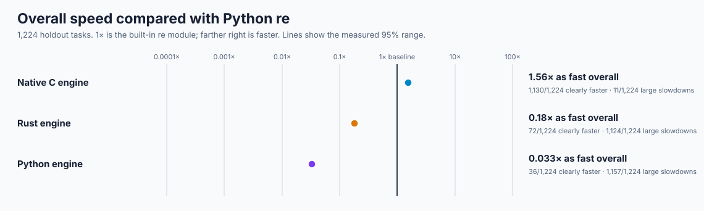
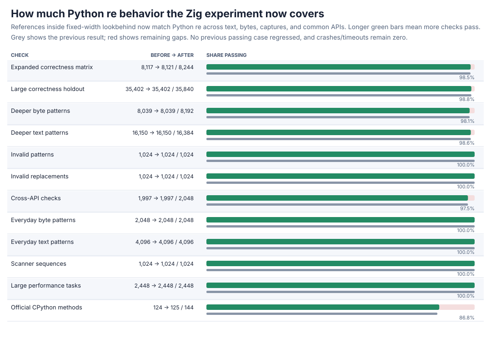
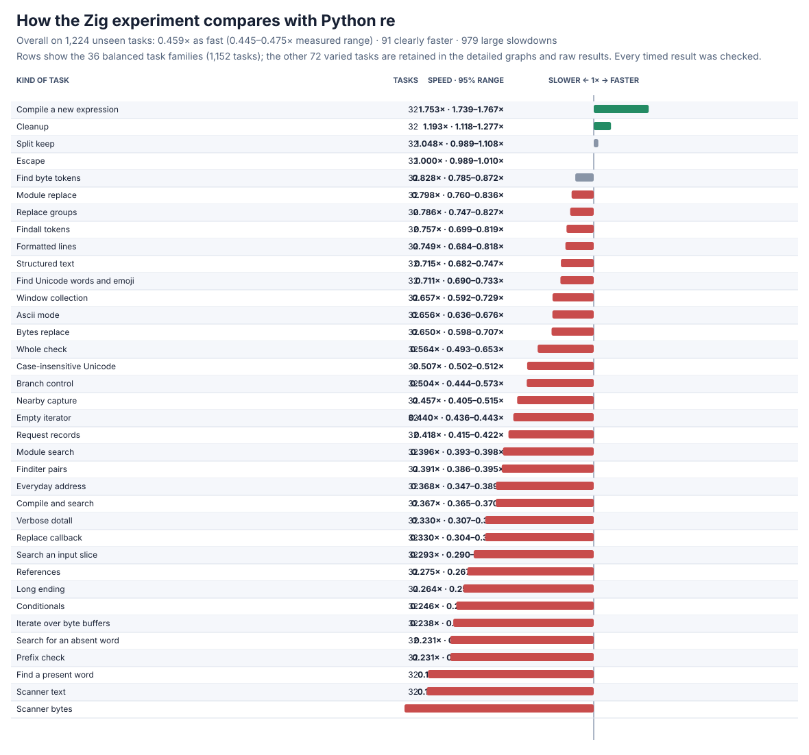
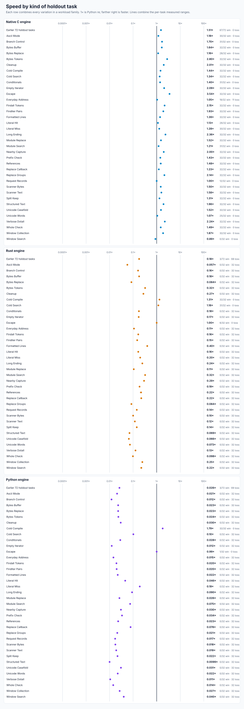
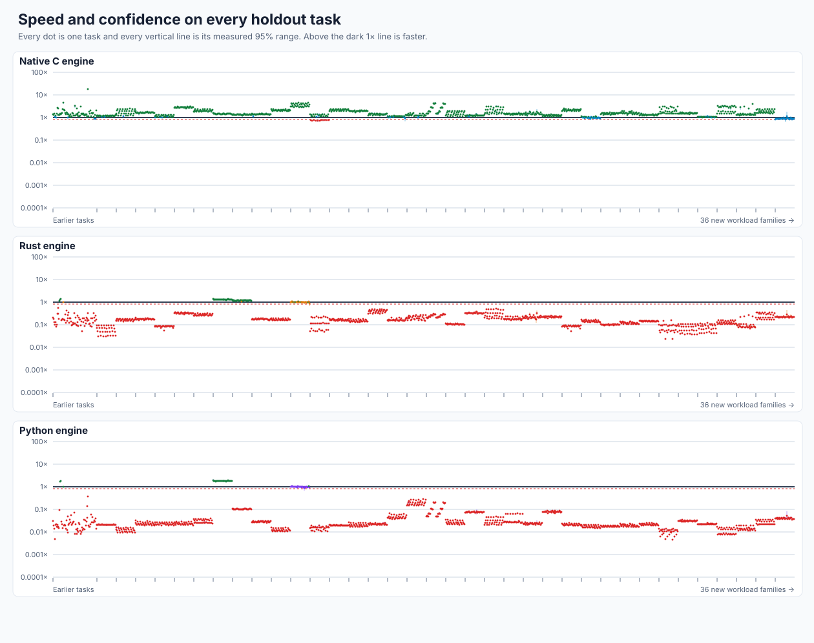
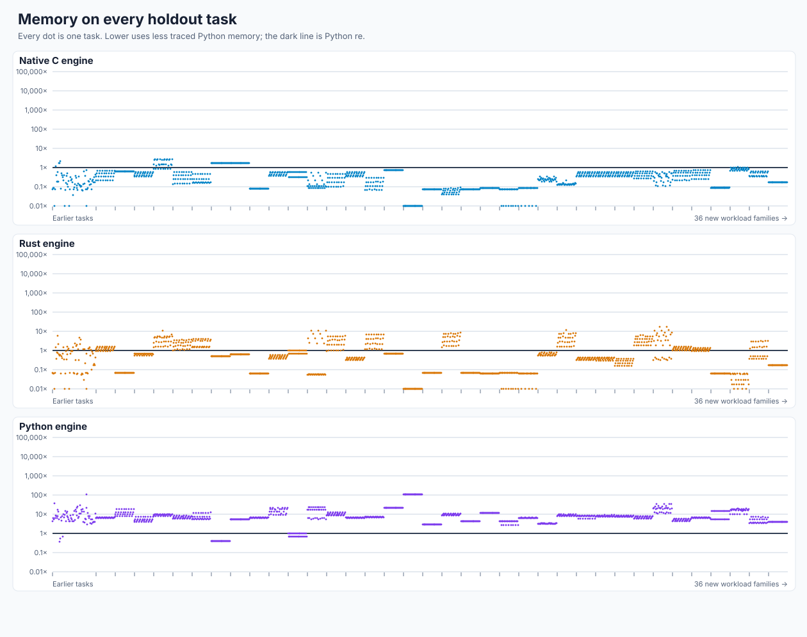
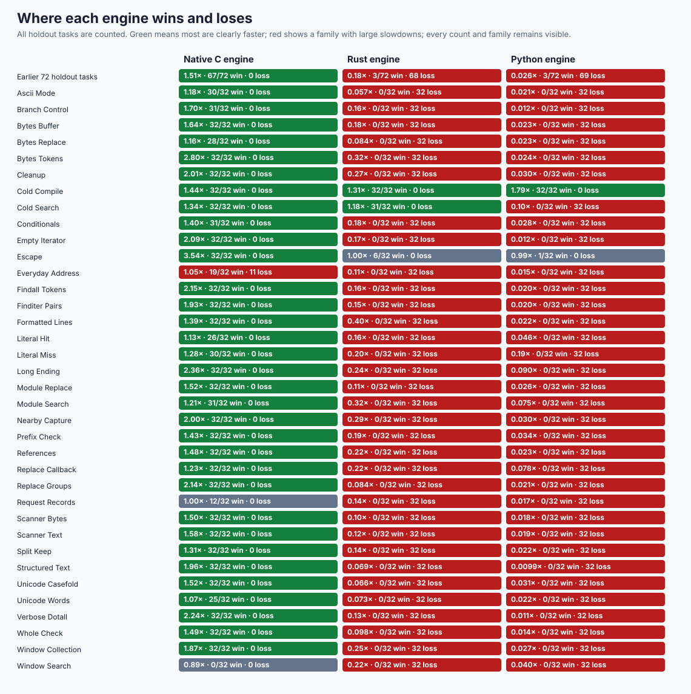
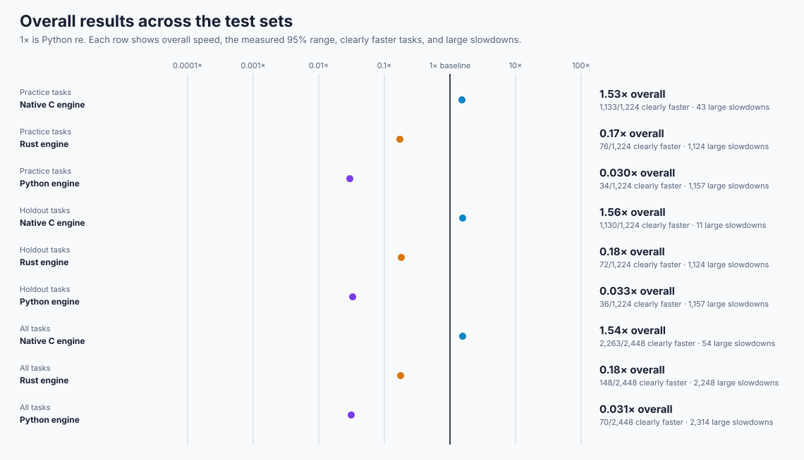
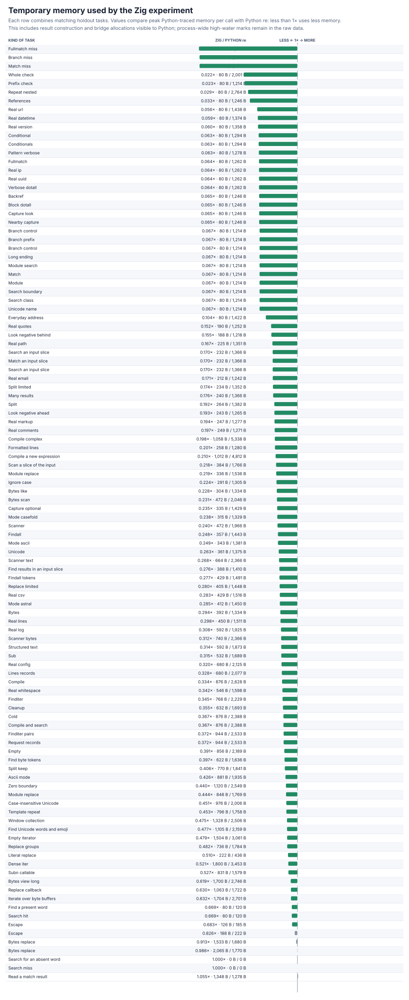
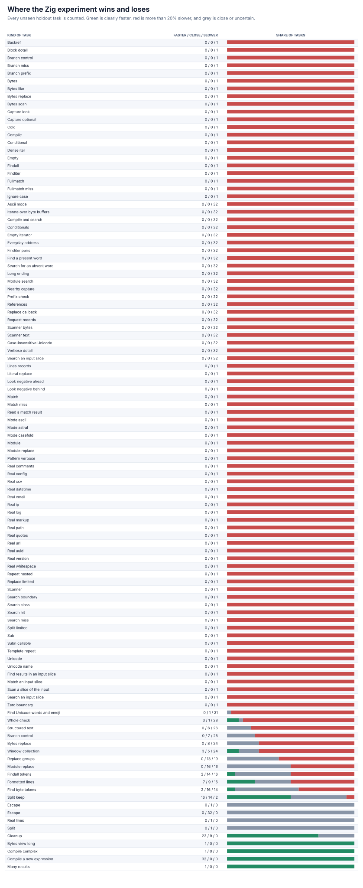

# rebar: building a faster Python `re`

`rebar` is an experiment to build a compatible, faster replacement for Python's regular-expression module. Use it with `import rebar as re`. Three independent engines were written from scratch and checked against the latest stable CPython; none wraps or delegates matching to an external package or Python's regex engine.

The immutable objective is [GOAL.md](GOAL.md), SHA-256 `e5935060b44fe5f6b4e19ac2d01f3ce63182cf6a1d3b416502a4441cde345b62`. Scope notes are in [AMENDMENTS.md](AMENDMENTS.md), and the complete chronological record is in the [experiment log](docs/EXPERIMENT-LOG.md).

## Headline results

The large holdout contains **1,224 separate, unseen tasks** spanning everyday text and byte processing, every common API, compilation, Unicode, captures, replacements, scanners, windows, hits, misses, and short/long inputs. **1× means the same speed as Python `re`; higher is faster.**

The native C engine is **1.56× as fast overall** (1.559–1.564× measured range) and clearly faster on **1,130/1,224** tasks (**92%**). It meets the experiment's speed and coverage targets. Its **11** large holdout slowdowns are all email-like multi-result searches; they are retained, profiled, and explained.



| Engine | Overall speed | Clearly faster | Large slowdowns |
| --- | ---: | ---: | ---: |
| Native C / `rebar` | **1.56×** | **1,130/1,224** | **11/1,224** |
| Rust | 0.181× | 72/1,224 | 1,124/1,224 |
| Python | 0.033× | 36/1,224 | 1,157/1,224 |

The [complete results](performance/v4/evidence/INITIAL.md) retain all **127,296** paired timing rows, every task, memory observation, measured range, and all **4,616** practice/holdout slowdowns. The [plain-language notes](performance/v4/evidence/INITIAL-NOTES.md) explain the native losses and the remaining Python/Rust costs. Every timed batch is checked against frozen CPython output both before and after timing.


All three engines pass the frozen **44,084-case** correctness matrix, including **35,840** previously unused cases across deeper patterns, everyday inputs, Unicode/bytes/buffers, scanner sequences, properties, and invalid inputs. They also pass **155,313** focused checks and all **144** runnable official CPython `re` tests, with zero unexplained failures, crashes, or release-build timeouts. The [qualification report](oracle/v3/evidence/QUALIFIED.md) preserves the compatibility gaps the larger suite found and their fixes.


The separate from-scratch Zig engine is under active development. It now passes **all 2,448 large performance tasks** and **35,402/35,840** large correctness cases, including every invalid pattern and replacement, with zero new failures or crashes. On the full **1,224-task** performance holdout it is **0.459x** as fast as Python `re`; cold compilation and some cleanup/splitting paths win, while scanners and short searches remain slow. The [Zig report](candidates/evidence/ZIG-LOOKBEHIND.md) keeps every result and explains the remaining gaps.





## Detailed graphs

The family view makes the larger benchmark readable: each row combines the matching variations of one kind of task. The all-case plots then show every individual holdout result and its measured range or memory use. Green indicates clearly faster, red indicates a slowdown greater than 20%, and grey indicates close or uncertain.











The Zig experiment's detailed memory and win/loss views retain every legacy and generated holdout task family:





## Current status

The baseline is [CPython 3.14.6](oracle/v1/BASELINE.md). The public import selects the correctness-qualified native C winner. The independently written [Zig experiment](candidates/evidence/ZIG-LOOKBEHIND.md) now supports Unicode, scoped flags, exact pattern errors, and fixed-width lookbehind references while avoiding large temporary allocations for long misses/sparse results; it is not ranked with the qualified engines because large repeats and some deeper behavior remain incomplete. Earlier language/FFI experiments, optimizations, rejections, and raw evidence are linked from the [experiment log](docs/EXPERIMENT-LOG.md).

| Check | Status |
| --- | --- |
| Large correctness matrix | **PASS** — stdlib, native C, Python, and Rust each pass all 44,084 cases |
| Focused checks | **PASS** — 155,313 replacement, buffer, long-input, lookaround, collection, separator, newline, and locale checks |
| Official CPython tests | **PASS** — all three engines pass 144/144 runnable methods; zero failures, crashes, or timeouts |
| Large performance holdout | **PASS** — native C reaches 1.56× on 1,224 tasks and is clearly faster on 92%; all 11 large holdout slowdowns are explained |
| Zig experiment | **IN PROGRESS** — 35,402/35,840 large correctness cases and all 2,448 performance tasks pass; 0.459x holdout speed; large repeats/deeper behavior remain |
| Public import | **AVAILABLE / WINNER** — `import rebar as re` uses the independent native C engine |

The [large performance protocol](performance/v4/PROTOCOL.md) explains exactly what is timed, how comparisons are made, and how slowdowns are reported.

## Try it or reproduce the checks

```sh
PY=/tmp/rebar-cpython/cpython-3.14.6-linux-x86_64-gnu/bin/python3.14
PYTHON="$PY" sh tools/build_vm.sh
PYTHON="$PY" RUSTFLAGS='-D warnings' sh tools/build_rust.sh

PYTHONPATH=. "$PY" -c 'import rebar as re; print(re.findall(r"[A-Za-z]+", "a faster python re"))'
PYTHONPATH=. "$PY" tools/oracle_v3.py verify --module rebar
PYTHONPATH=. "$PY" tools/cpython_re_oracle.py verify --module rebar
PYTHONPATH=. "$PY" tools/holdout_regression_controls.py --output /tmp/holdout-regression.json
PYTHONPATH=. "$PY" tools/perf_v4.py verify
PYTHONPATH=. "$PY" tools/perf_v4.py measure --output /tmp/rebar-performance.jsonl
PYTHONPATH=. "$PY" tools/perf_v4.py analyze --input /tmp/rebar-performance.jsonl --output /tmp/rebar-summary.json
```
