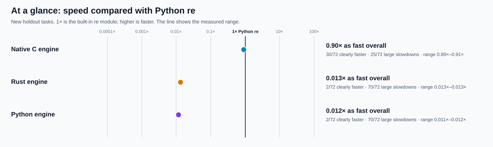
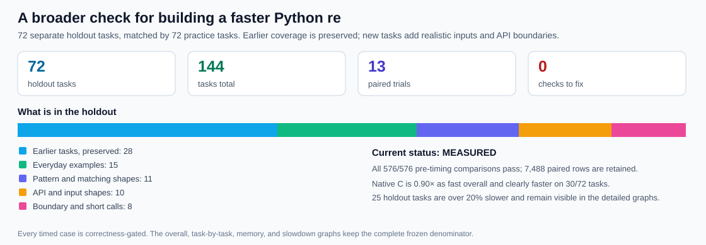
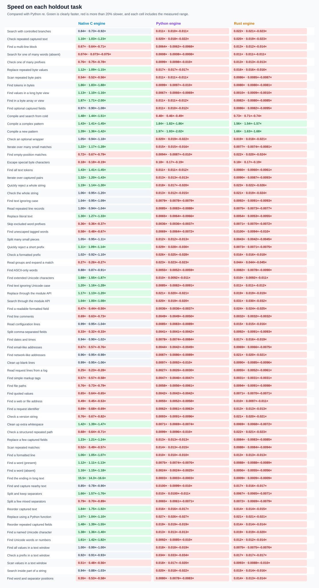
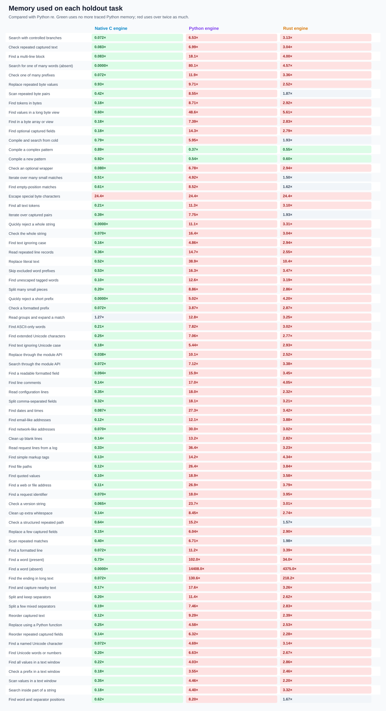
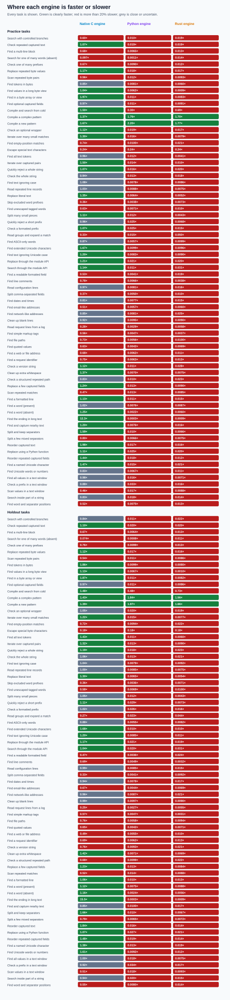
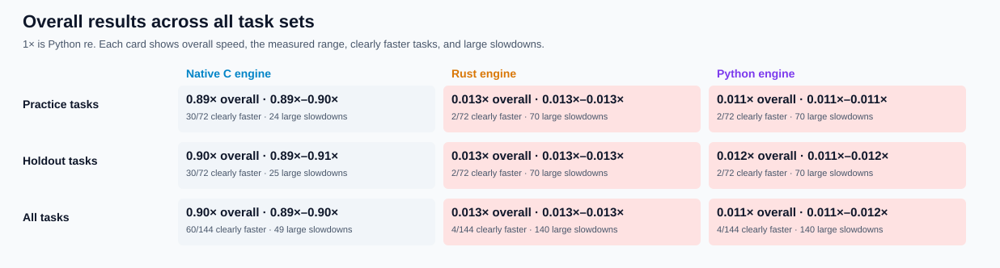

# rebar: building a faster Python `re`

`rebar` is an experiment to build a drop-in, faster replacement for Python's regular-expression module. The public import is `import rebar as re`. Three independent, from-scratch engines are checked against the latest stable CPython and compared on the same tasks; incorrect results are never timed.

The immutable objective is [GOAL.md](GOAL.md), SHA-256 `e5935060b44fe5f6b4e19ac2d01f3ce63182cf6a1d3b416502a4441cde345b62`. Scope notes are in [AMENDMENTS.md](AMENDMENTS.md), and the complete chronological record is in the [experiment log](docs/EXPERIMENT-LOG.md).

## Headline results

The broader holdout contains **72 separate tasks** kept apart from tuning, including logs, URLs, configuration/text cleanup, byte inputs, Unicode, replacements, scanners, and windowed calls. **1× means the same speed as Python `re`; higher is faster.** The native C engine is **0.90× as fast overall** and clearly faster on **30/72** tasks, with **25** tasks more than 20% slower. Python and Rust are much slower on short calls. This wider result shows exactly where optimization is needed.



| Engine | Overall speed | Clearly faster | Large slowdowns |
| --- | ---: | ---: | ---: |
| Native C | **0.90×** | **30/72** | **25/72** |
| Rust | 0.013× | 2/72 | 70/72 |
| Python | 0.012× | 2/72 | 70/72 |

The [full broader report](performance/v3/evidence/INITIAL.md) retains all **7,488** correctness-gated timing rows, every task, memory observations, confidence ranges, and every slowdown. The pre-timing check passes **576/576** comparisons. The headline graph and task grids below show the same results in plain language.



All three engines now pass every runnable official CPython `re` test, including long inputs, deep lookbehind, mutable buffers, Unicode behavior, and the 403-pattern historical corpus. There are no failures, crashes, or timeouts.


## Detailed graphs

These show the broader holdout task by task. Green means clearly faster, red means more than 20% slower, and grey means close or uncertain. Each speed cell includes the measured range.









## Correctness and current status

The baseline is [CPython 3.14.6](oracle/v1/BASELINE.md). Stdlib and all three engines pass the [expanded seeded matrix](oracle/v2/P0.md): **8,244/8,244 cases**, **45/45 obligations**. They also pass all **144** runnable [official CPython `re` methods](oracle/cpython-3.14.6/README.md), with two environment-dependent locale skips.

| Check | Status |
| --- | --- |
| Seeded correctness | **PASS** — stdlib, native C, Python, and Rust each pass all 8,244 expanded cases |
| Official CPython tests | **PASS** — all three engines pass 144/144 runnable methods; zero failures, crashes, or timeouts |
| Original performance | **PASS** — native C reaches 1.56× on the original 16-task holdout |
| Expanded performance | **MEASURED / OPTIMIZATION NEEDED** — native C reaches 1.16× on 28 holdout tasks; all results are correctness-gated |
| Broader performance | **MEASURED / OPTIMIZATION NEEDED** — native C reaches 0.90× on 72 holdout tasks; all 7,488 rows are correctness-gated |
| Public import | **AVAILABLE / CORRECTNESS-QUALIFIED** — `import rebar as re` uses the native C engine |

The [broader performance protocol](performance/v3/PROTOCOL.md) explains exactly what is timed, how comparisons are made, and how slowdowns are reported. Full results, raw data, rejected experiments, and older charts are linked from the [experiment log](docs/EXPERIMENT-LOG.md).

## Try it or reproduce the checks

```sh
PY=/tmp/rebar-cpython/cpython-3.14.6-linux-x86_64-gnu/bin/python3.14
PYTHON="$PY" sh tools/build_vm.sh
RUSTFLAGS='-D warnings' sh tools/build_rust.sh

PYTHONPATH=. "$PY" -c 'import rebar as re; print(re.findall(r"[A-Za-z]+", "a faster python re"))'
PYTHONPATH=. "$PY" tools/oracle_v2.py verify --module rebar
PYTHONPATH=. "$PY" tools/cpython_re_oracle.py verify --module rebar
PYTHONPATH=. "$PY" tools/perf_v2.py verify
PYTHONPATH=. "$PY" tools/perf_v3.py verify
```
