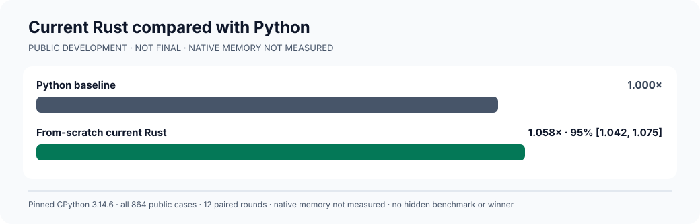
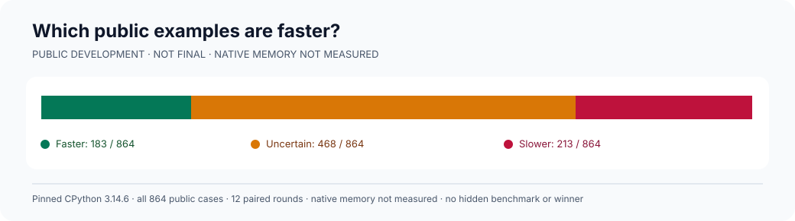
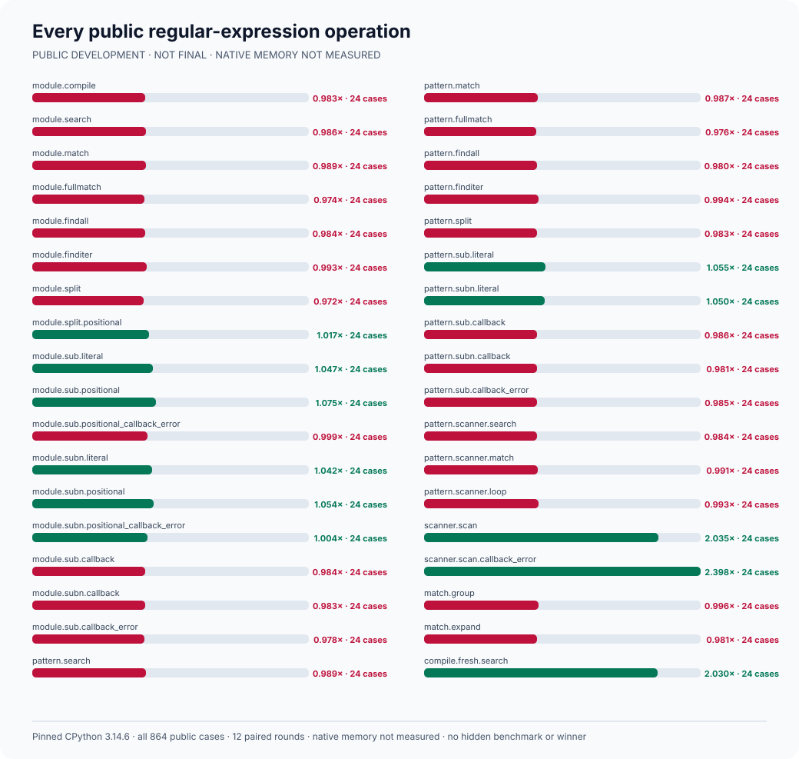
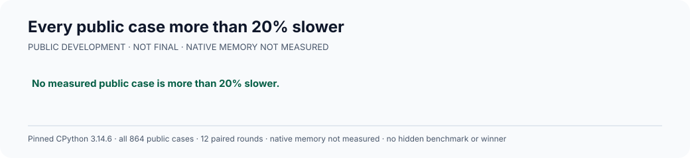

# rebar: a faster Python `re` experiment

Can a regular-expression engine built from scratch replace
[Python 3.14.6's](https://www.python.org/downloads/release/python-3146/)
`re` and run faster? The intended interface is `import rebar as re`.
Every candidate must use its own matching engine, not Python's engine,
an external regular-expression package, or another candidate.

**Current status:** The independently built Rust engine passes all
**151 runnable original Python tests**, **864 general examples**,
**1,024 scanner examples**, and **768 difficult memory-view examples**,
with **zero mismatches**. The Python-only debug test is skipped equally
for Python and Rust. An independent source, native-binary, and runtime
audit confirms **zero external regex packages or engine delegation**.

The last measured, earlier Rust build was **1.058×** as fast as Python;
the corrected build has **NOT BEEN MEASURED**. Three fully qualified
candidates, native memory use, the four-million-example final
comparison, and a winner remain **NOT ESTABLISHED**.

## Last measured speed against Python



Python is **1.000×**. The earlier Rust build is **1.058×**, with a
measured **1.042× to 1.075×** confidence interval. Of **864** examples,
**185** are clearly faster, **231** are clearly slower, and **448**
are inconclusive. The corrected Rust build is **NOT MEASURED**.



This is a development measurement, not a hidden result or a prediction
about a final test. The [complete original measurements](experiments/rust_public_practice_v1/rust-native-scanner-v1-public-practice.json)
contain all **10,368** paired observations.

## Current compatibility

| Python behavior | Current Rust result | Complete evidence |
| --- | ---: | --- |
| Original runnable Python tests | **151 / 151** | [Original Python suite](experiments/rust_public_practice_v1/rust-original-v3-memoryview-native-exporter-fix.json) |
| General public behavior | **864 / 864** | [General comparison](experiments/rust_public_practice_v1/rust-module-v1-after-native-memoryview-exporter-fix.json) |
| Scanners and callbacks | **1,024 / 1,024** | [Scanner comparison](experiments/rust_public_practice_v1/rust-native-scanner-v1-after-native-memoryview-exporter-fix.json) |
| Memory views and buffer errors | **768 / 768** | [Memory-view comparison](experiments/rust_public_practice_v1/rust-memoryview-expand-v1-after-native-exporter-fix.json) |

## Previously measured speed by operation





In the earlier build, exactly **two** examples exceed a **20%**
slowdown. Both are `match.expand` with writable or read-only memory
views. Their exact inputs and confidence intervals remain in the
[complete measurements](experiments/rust_public_practice_v1/rust-native-scanner-v1-public-practice.json).
The corrected engine now performs these operations directly in its
owned native implementation and passes all **768** separately frozen
buffer cases. The improvement in actual speed is **NOT MEASURED**;
every earlier failure and intermediate result remains in the
[experiment log](docs/EXPERIMENT-LOG.md).

## Original Python compatibility

Python's original test file contains **165** tests. **152** cover the
public replacement interface; **13** test private CPython internals and
are excluded only under the named `DebugTests` and `ImplementationTest`
waivers. Python and Rust both pass all **151** runnable public tests
and report the same genuine debug-build-only skip. The
[complete current original-test result](experiments/rust_public_practice_v1/rust-original-v3-memoryview-native-exporter-fix.json)
and its [independently verified receipt](experiments/rust_public_practice_v1/rust-original-v3-memoryview-native-exporter-fix-publication-receipt.json)
preserve both full test vectors, **zero** mismatches, all traceback
data, and the unchanged native engine.

The independently reviewed
[original-test controller](tools/rust_original_cpython_suite_v3.py)
performs **304** real matcher-ownership checks and **304**
warning-safety checks. It never delegates matching to Python. Earlier
test-environment and warning-guard failures remain unchanged in the
[experiment log](docs/EXPERIMENT-LOG.md). C and Zig have **NOT RUN**
against this complete original-test controller.

## Independent engines and compatibility

An independently reviewed
[from-scratch Rust audit](tools/rust_from_scratch_audit_v1.py) checks
the complete owned parser, compiler, matcher, Python binding, native
libraries, and **zero** external Rust dependencies. It rejects
Python's matcher, third-party regex packages, other candidates,
hidden fallbacks, and dynamic-loading escapes. The
[complete current-engine audit](experiments/rust_public_practice_v1/rust-from-scratch-audit-v1-memoryview-native-exporter-fix.json)
passes both source and runtime checks, including every loaded native
dependency.

The frozen [general Python comparison](tools/rust_public_practice_benchmark_v1.py),
[scanner comparison](tools/rust_scanner_differential_v1.py), and
[memory-view comparison](tools/rust_memoryview_expand_differential_v1.py)
are development and compatibility tests, not final speed results.
C and Zig have **NOT RUN** against the current original Python test
suite or this Rust-specific ownership audit. The additional full
public-interface, buffer-lifetime, and interpreter-isolation gates
for changed engines remain **NOT QUALIFIED**.

## Larger fair speed comparison

A previous final test was opened once, exposed a real Zig `split`
failure, and is **FALSIFIED**. It cannot be reused. The previously
proposed **1,048,576-example** replacement was never generated. The
[new independently reviewed proposal](docs/EXPANDED-HOLDOUT-PROTOCOL-V1.md)
expands it fourfold to **4,194,304** separately generated, valid
examples covering every public operation, ordinary and unusual
patterns, text and byte inputs, native-call overhead, and lifecycles.

Freeze and generate a new final test only after three genuinely
separate, from-scratch candidates pass all original Python tests and
the independent no-delegation audit. Measure Python and each
qualifying candidate on the same cases in **24** fairly ordered
rounds. Report complete results, uncertainty, memory, and every
slowdown. Success requires at least **1.5×** overall and statistically
faster results on **2,516,583 of 4,194,304** cases.

The newly proposed final test is **NOT FROZEN**, **NOT GENERATED**,
and **NOT OPENED**. Final speed, confidence, rankings, and native
memory remain **NOT MEASURED**.

## Evidence and reproduction

The [experiment log](docs/EXPERIMENT-LOG.md) records the detailed
experiments, rejected designs, genuine failures, and their resolutions.
The original objective in [GOAL.md](GOAL.md) remains unchanged, with
SHA-256
`e5935060b44fe5f6b4e19ac2d01f3ce63182cf6a1d3b416502a4441cde345b62`.
[AMENDMENTS.md](AMENDMENTS.md) records later clarifications separately.

Recheck the frozen current-engine audits, original public-test runner,
expanded public tests, and the exact generated headline chart without
benchmarking a candidate:

```sh
PY=/tmp/rebar-cpython/cpython-3.14.6-linux-x86_64-gnu/bin/python3.14

"$PY" -I -B tools/postfinal_independent_engine_audit_v21.py --self-test
"$PY" -I -B tools/postfinal_independent_engine_audit_v23.py --self-test
"$PY" -I -B tools/postfinal_current_build_proofs_v24.py --self-test
"$PY" -I -B tools/postfinal_current_build_proofs_v26.py --self-test
"$PY" -I -B tools/postfinal_cpython_locale_oracle_v15.py --self-test
"$PY" -I -B tools/postfinal_cpython_locale_oracle_v16.py --self-test
"$PY" -I -B tools/python_re_public_surface_oracle_stage27.py --self-test
"$PY" -I -B tools/python_re_buffer_exporter_oracle_v1.py --self-test
"$PY" -I -B tools/python_re_buffer_exporter_oracle_v2.py --self-test
"$PY" -I -B tools/python_re_subinterpreter_oracle_v1.py --self-test
"$PY" -I -B tools/rust_public_practice_benchmark_v1.py --self-test
"$PY" -I -B tools/rust_from_scratch_audit_v1.py --self-test
"$PY" -I -B tools/rust_scanner_differential_v1.py --self-test
"$PY" -I -B tools/rust_memoryview_expand_differential_v1.py --self-test
"$PY" -I -B tools/record_rust_memoryview_expand_v1.py --self-test
"$PY" -I -B tools/rust_original_cpython_suite_v1.py --self-test
"$PY" -I -B tools/rust_original_cpython_suite_v2.py --self-test
"$PY" -I -B tools/rust_original_cpython_suite_v3.py --self-test
"$PY" -I -B tools/record_rust_original_cpython_v1.py --self-test
"$PY" -I -B tools/record_rust_original_cpython_v2.py --self-test
"$PY" -I -B tools/record_rust_original_cpython_v3.py --self-test
"$PY" -I -B tools/record_rust_public_correctness_v1.py --self-test
"$PY" -I -B tools/render_rust_public_correctness_v1.py --self-test
"$PY" -I -B tools/render_rust_public_speed_v1.py --self-test
"$PY" -I -B tools/render_current_correctness_v6.py --self-test
"$PY" -I -B tools/render_current_correctness_v6.py --check
```
