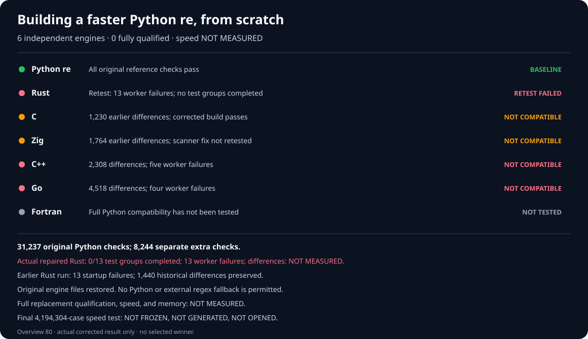

# rebar: a faster Python `re` experiment

Build a faster, fully compatible, from-scratch replacement for
[Python 3.14.6](https://www.python.org/downloads/release/python-3146/)'s
regular-expression module:

```python
import rebar as re
```

Each engine must be independently written. Wrapping Python, an external
regular-expression package, or another candidate does not count.

## Results

**Six** from-scratch engines. **Zero** fully compatible replacements.
Speed versus Python: **NOT MEASURED**. There is no winner.



| Engine | Compatibility with Python | Speed versus Python |
| --- | --- | --- |
| Python `re` | Baseline; reference checks pass | Not timed |
| Public `rebar` import | FAIL; still selects an unqualified Zig prototype | NOT MEASURED |
| Rust | FAIL; 13 startup failures; 1,440 earlier differences | NOT MEASURED |
| C | FAIL; 1,230 differences | NOT MEASURED |
| Zig | FAIL; 1,764 differences; scanner fix frozen, not built or tested | NOT MEASURED |
| C++ | FAIL; 2,308 differences and five worker failures | NOT MEASURED |
| Go | FAIL; 4,518 differences and four worker failures | NOT MEASURED |
| Fortran | NOT TESTED | NOT MEASURED |

The frozen original Python suite contains **31,237** checks in **13**
groups. A separate **8,244**-case collection covers additional real-world
behavior; two independent Python reference runs each pass all **8,244**.
These are separate test sets and are never combined or counted twice.

The corrected, independently written C engine already passed **14**
reproducible build checks. A separately traced Rust build passed **28**
checks and recorded its compiled engine's identity. Neither engine has
passed its full compatibility test. The old **13**-worker Rust test
targets a different build and remains **BLOCKED**. Both Rust attempts
lost all **13** workers before matching; runtime independence is
**NOT ESTABLISHED**.

## Detailed correctness

These historical charts show particular compatibility checks; none claims
a passing replacement or a speed measurement.


## Final speed comparison

The proposed final test contains **4,194,304** unseen cases and **24**
balanced rounds. Its cases are **NOT FROZEN**, **NOT GENERATED**, and
**NOT OPENED**. Speed, memory, and statistical confidence are
**NOT MEASURED**.

Do not start this test until three independent engines pass both test
sets, the original two-billion-character checks, public API checks,
and the no-delegation audit. A winner must be at least **1.5×** faster
overall, faster on at least **60%** of measured cases, and explain every
slowdown over **20%**.

## Evidence

- [Reproduce the current results and graphs](docs/REPRODUCING.md).
- [Full experiment log, build evidence, failures, and rejected designs](docs/EXPERIMENT-LOG.md).
- [Complete Python correctness reference](oracle/phase1/P0-COMPLETENESS-V4.md).
- [Independent reference for the 8,244 additional checks](oracle/phase1/P0-DIFFERENTIAL-FUZZ-REFERENCE-V3.md).
- [Six independently written engine families](oracle/phase2/SIX-FAMILY-P0-PRODUCER-V5.md) and [no-wrapping audit](oracle/phase2/CANDIDATE-INDEPENDENCE-V2.md).
- [Expanded, unopened final speed-test protocol](docs/EXPANDED-HOLDOUT-PROTOCOL-V1.md).
- [Original objective](GOAL.md), SHA-256
  `e5935060b44fe5f6b4e19ac2d01f3ce63182cf6a1d3b416502a4441cde345b62`;
  [later clarifications](AMENDMENTS.md).
