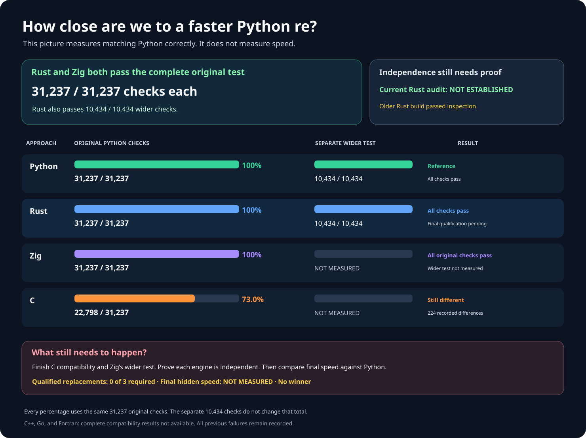
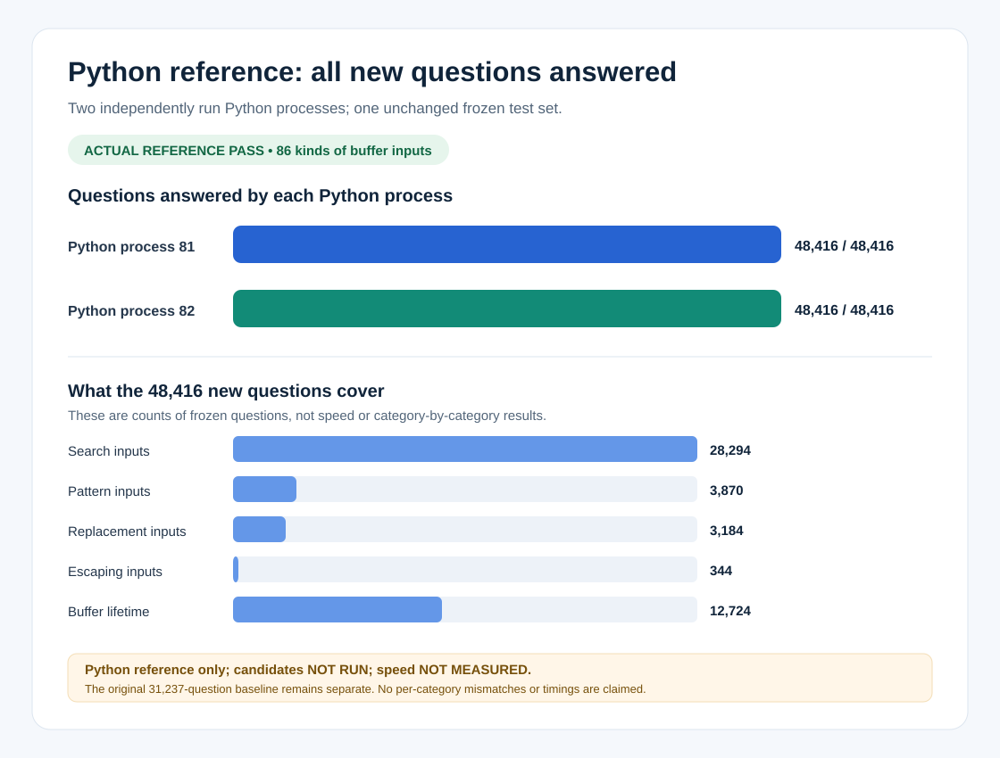
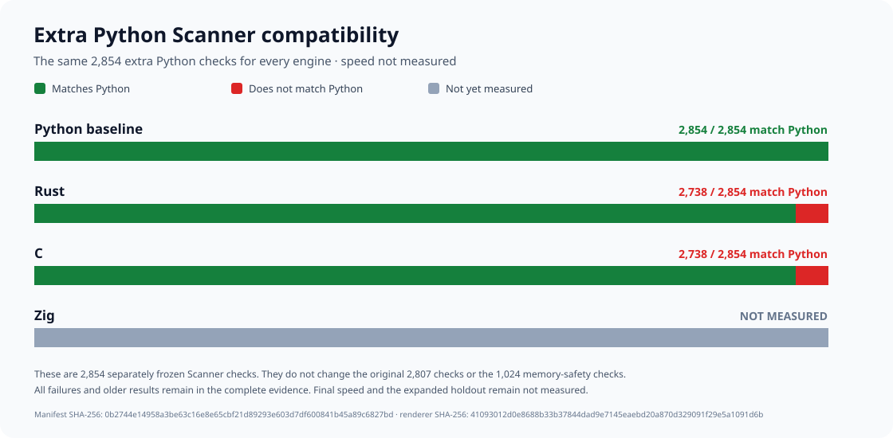
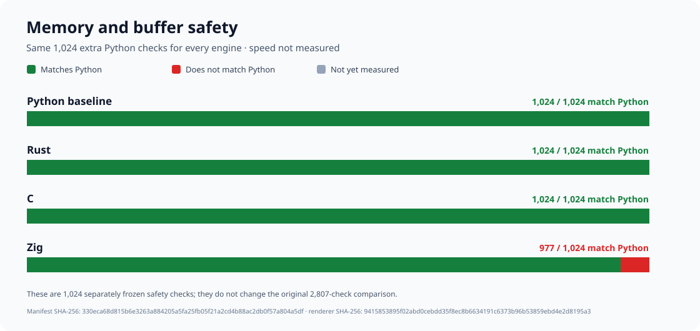

# rebar: a faster Python `re`

Build a faster, fully compatible replacement for Python 3.14.6's
regular-expression module:

```python
import rebar as re
```

Every contender must implement its own regular-expression engine from scratch.
Wrapping Python's `re`, another regex package, or another contender does not
count.

## Results at a glance

Two independently written engines, Rust and Zig, pass all **31,237** original
Python checks. Rust also passes **10,434** broader compatibility checks and is
**1.24× faster than Python** across **416** public workloads. C currently passes
**22,798** original checks and has **224** recorded differences; its corrected
implementation has been independently rebuilt twice and is awaiting a
complete retest.



| Implementation | Original Python checks | Broader checks | Public speed |
| --- | --- | --- | --- |
| Python `re` | 31,237 / 31,237 | 10,434 / 10,434 | 1.00× baseline |
| Rust | 31,237 / 31,237 | 10,434 / 10,434 | 1.24× |
| Zig | 31,237 / 31,237 | NOT MEASURED | NOT MEASURED |
| C | 22,798 / 31,237 | NOT MEASURED | NOT MEASURED |
| C++, Go, Fortran | NOT MEASURED | NOT MEASURED | NOT MEASURED |

The Rust speed estimate spans **1.19–1.30×** at 95% confidence. It is faster
on **252 of 416** workloads, slower on **164**, and more than 20% slower on
**14**. Every timing and slowdown is retained. Peak process memory is
**44,032 KiB** for both implementations; peak Python-tracked memory is
**111,026 bytes** for Rust and **181,952 bytes** for Python.

No replacement is qualified yet. The available external-engine audit covers
an older Rust build, not the build shown above: its complete static and live
independence are **NOT ESTABLISHED**. A Rust native-object lifetime correction
and the remaining C compatibility corrections have been implemented but not
fully retested. The public `rebar` import still selects an unqualified Zig
prototype and is **not ready for use**.

## Compatibility coverage

The fixed original suite contains **31,237** Python checks in **13** groups.
Another **10,434** broader cases cover **111** Python operations. A further
**48,416** input-buffer and memory-lifetime cases have been confirmed against
Python itself; contender results for those additional cases are **NOT
MEASURED**. These separate suites never change the original denominator.

The expanded final performance comparison covers **226,492,416** possible
cases and proposes two balanced **4,096-case** samples. Its secret seed has
not been created, and no final case has been opened. It may run only after at
least three independently implemented engines pass every correctness and
independence check.

A successful replacement must be at least **1.5× faster overall**, faster on
at least **60%** of cases, and explain every slowdown greater than **20%**.
Final hidden-test speed: **NOT MEASURED**. Winner: **NOT SELECTED**.

## More detailed graphs








## Evidence and reproduction

- [Complete experiment history and rejected approaches](docs/EXPERIMENT-LOG.md).
- [Reproduce generated charts and results](docs/REPRODUCING.md).
- [Frozen original Python compatibility suite](oracle/phase1/P0-COMPLETENESS-V4.md).
- [Rust: all 31,237 original checks](oracle/phase2/evidence/repaired-rust-original-campaign-v16-rust-phase2-v33-rust-full-public-semantic-source-root-provenance-original-p0-v28-publication-receipt.json).
- [Rust: all 10,434 broader checks](oracle/phase2/evidence/rust-full-public-correctness-v5-v33-full-public-v5-run-001-publication-receipt.json).
- [Rust: measured public speed and every slowdown](oracle/phase2/evidence/rust-corrected-public-performance-v4-v33-corrected-performance-run-001-publication-receipt.json).
- [Zig: all 31,237 original checks](oracle/phase2/evidence/repaired-zig-original-campaign-v18-phase2-v18-zig-final-original-p0-v18-success-publication-receipt.json).
- [C: complete run and all 224 recorded differences](oracle/phase2/evidence/repaired-c-original-campaign-v15-c-phase2-v23-c-complete-semantics-original-p0-v15-failures-publication-receipt.json).
- [Expanded, unopened final-test proposal](oracle/phase3/EXPANDED-SEALED-HOLDOUT-V3.md).
- [Immutable original objective](GOAL.md), SHA-256
  `e5935060b44fe5f6b4e19ac2d01f3ce63182cf6a1d3b416502a4441cde345b62`;
  [subsequent clarifications](AMENDMENTS.md).
