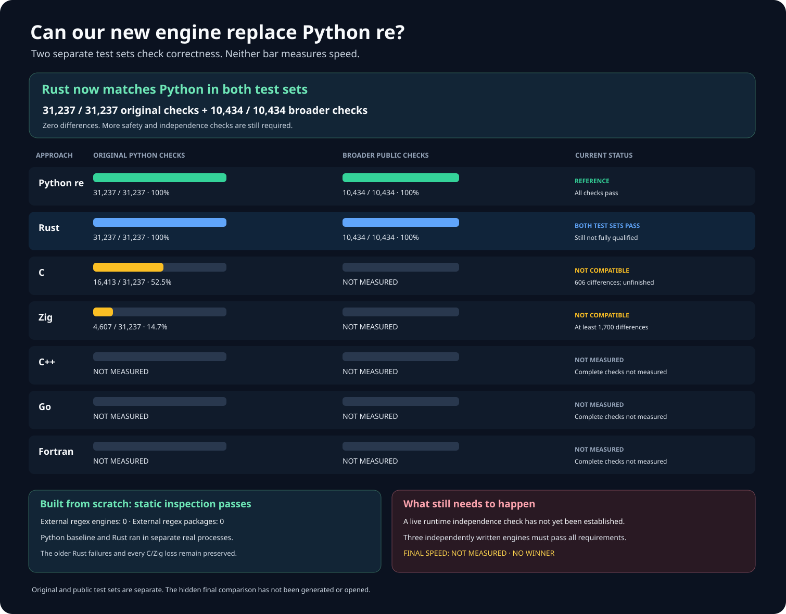
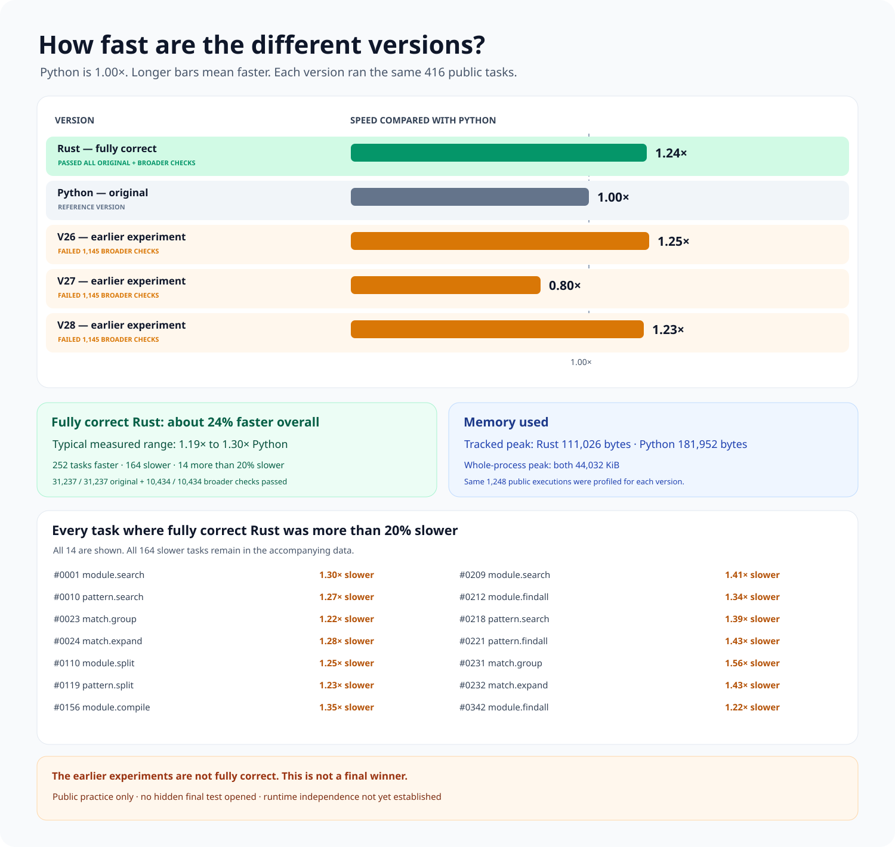
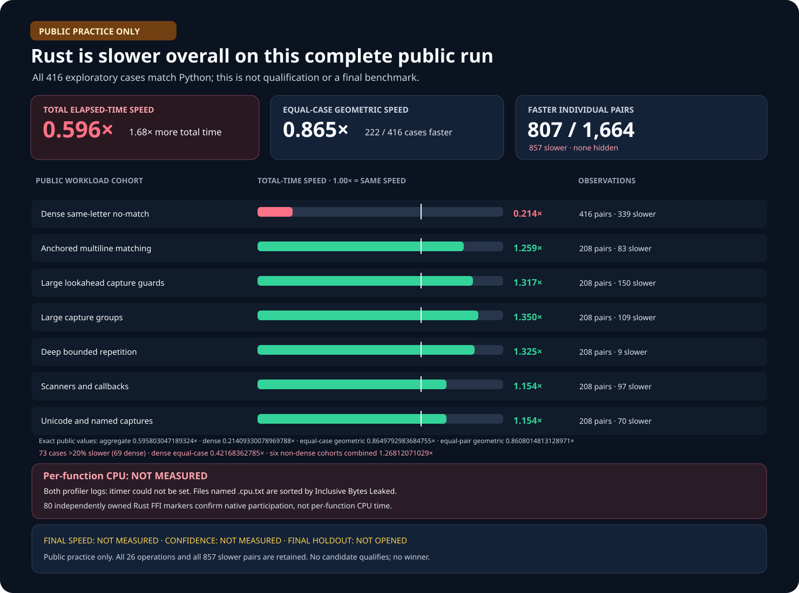
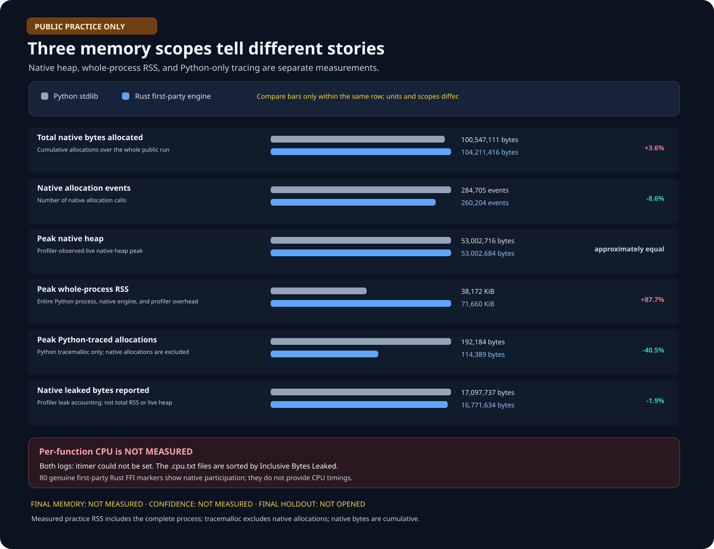

# rebar: a faster Python `re` experiment

Build a faster, fully compatible, from-scratch replacement for
[Python 3.14.6](https://www.python.org/downloads/release/python-3146/)'s
regular-expression module:

```python
import rebar as re
```

Wrapping Python, an existing regular-expression package, or another
project engine does not count. Each candidate must implement its own
regular-expression engine. Dependency files, native links, import
paths, and Python-facing wrappers are independently checked. The corrected
Rust engine, its Python bindings, all first-party sources, and both native
builds now pass an independent inspection with **zero external
regular-expression packages or engines**. Its older failed inspection is
preserved; runtime no-delegation still requires a separate live proof.

## Results at a glance

**Six independently written approaches. Independent Rust and Zig engines
both pass all 31,237 original Python checks; Rust also passes all 10,434
wider compatibility checks.
It is 1.24× faster than Python across 416 public workloads. Zero fully
qualified replacements. Hidden-test speed: NOT MEASURED. No winner.**



The newer complete C run verifies **22,798 of 31,237** checks and
records **224** differences. The independently rebuilt Zig engine now
passes **31,237 of 31,237** original checks with **zero** differences;
its wider compatibility, live independence, and speed remain
**NOT MEASURED**.

An independently written C correction now accounts for all **224**
remaining observed differences. Both corrected C sources now exist;
their rebuilt correctness is **NOT MEASURED**.

A new, independently written Rust/Python boundary optimization targets
**10 of 14** substantial measured slowdowns. Its corrected behavior and
speed are **NOT MEASURED**.

Every percentage uses the same **31,237** original Python checks.
These results measure compatibility, **not speed**. Checks in an
unfinished group are never counted as passing. The same Rust build now
passes both complete suites with zero differences.



The exact Rust build passing both complete compatibility suites is
**1.24× faster than Python** across **416** public workloads (**95%
interval: 1.19–1.30×**). It is faster in **252 of 416** cases
(**60.6%**), slower in **164**, and has **14** slowdowns greater than
20%. All **1,664** paired trials and every slower case are preserved.
Both processes peak at **44,032 KiB**; Python-traced allocations peak
at **111,026 bytes** for Rust and **181,952 bytes** for Python. This is
a public development result; the hidden final test is **NOT MEASURED**.



In this separate **416-case public practice test**, Rust matched Python's
answer every time. Its typical-case speed was **0.865× Python**; across all
recorded time it was **0.60× Python**. Six kinds of work were faster, but
one repeated-character search was much slower. All **1,664** paired
observations and every slower result are preserved. This is exploratory
practice, not the hidden final test; statistical confidence and final speed
are **NOT MEASURED**.

An independently optimized Rust search engine subsequently reached
**1.25× Python** on the same **416** public timing cases (**95% interval:
1.20–1.31×**), including **1.98×** on difficult repeated-character searches.
It was faster on **247 of 416** cases. However, the wider **10,434-case**
test found **1,145** compatibility differences; the engine remains
**unqualified**, and this improvement is not a final result.

The separate low-allocation compiler architecture scored only **0.80×
Python** (**95% interval: 0.75–0.85×**) and was faster on **138 of 416**
cases. Its difficult-search workload reached only **0.42×** Python and it
shared the same **1,145** wider compatibility differences. This unsuccessful
design and all **143** substantial slowdowns remain fully visible.

An earlier combination of the fast search and low-allocation compiler with
clean first-party bindings achieved **1.23× Python** (**95% interval:
1.18–1.28×**), with only **eight** substantial slowdowns. That historical
version had **1,145** wider compatibility differences. Its corrected
successor passes both complete suites and measures **1.24× Python** on
the public workload; live independence remains **NOT ESTABLISHED**.

A second complete practice run confirms **0.60× Python** across all recorded
time. Its native allocation totals were **104.2 MB** for Rust and **100.5 MB**
for Python. Whole-process memory and Python-only memory are recorded
separately; per-function CPU time is **NOT MEASURED** because the profiler
could not start its sampling timer.



| Engine | Verified Python checks | Current result |
| --- | --- | --- |
| Python `re` | 31,237 / 31,237; 100% | Reference baseline. |
| C | 22,798 / 31,237; 73.0% | FAIL; 224 differences remain across three groups; all 13 isolated workers finish. |
| Rust | 31,237 / 31,237; 100% | The identical build passes all original and wider checks; live independence and final speed remain unqualified. |
| Zig | 31,237 / 31,237; 100% | Passes every original check; wider compatibility, live independence, and speed remain unmeasured. |
| C++ | NOT MEASURED | FAIL; 2,308 observed differences and five worker failures. |
| Go | NOT MEASURED | FAIL; 4,518 observed differences and four worker failures. |
| Fortran | NOT MEASURED | FAIL; independent builds disagree; matching was not tested. |

The current public `rebar` import still selects an unqualified Zig
prototype; **it is not a working replacement**. Complete difference
counts are **NOT MEASURED** for unfinished runs. No failed candidate
has established the required runtime no-delegation. The current C
run preserves all **224** remaining failures and the earlier **606**
observed failing examples. Its older run
saved only **92**; those **514** missing historical examples remain
**NOT RECORDED**. Separate, independently written C source corrections
now cover all **606** earlier observed failures; the combined engine has
been compiled independently twice and its new complete run reveals
**224** remaining public-interface differences.

The latest C run completes all **13** groups without interpreter or
worker failures. Its remaining differences are **two** original Python
assertions, **144** public-type cases, and **78** public-interface cases.

The from-scratch Rust engine was independently built twice using
**28** verified offline processes and **zero external packages**. The same
exact build passed **31,237 of 31,237** original checks across all **13**
groups, with **zero differences** and **13** successful independent workers.
That identical engine, native binding, and Python interface also passed
**10,434 of 10,434** wider checks across **111** Python operations with
**zero differences**. Live runtime
no-delegation remains **NOT ESTABLISHED**. Its public speed is **1.24×
Python**; speed on the hidden final test is **NOT MEASURED**.
A newly frozen, entirely first-party Rust build combines the validated
original-suite engine with every known scanner, comment, replacement, and
Unicode correction from the **10,434-case** wider public suite. Its native
engine and bridge were independently built twice with **zero** external
packages before passing every wider-suite check. All individual Python and
Rust answers remain preserved.
A separate inspection of both independently built Rust engines, all **18**
first-party sources, and all **four** native binaries found **zero** external
regular-expression packages, external engine symbols, or matching delegation.
This is a source/native inspection; live runtime non-delegation remains
**NOT ESTABLISHED**.

A corrected interpreter-isolation guard now recognizes real Python
child interpreters while blocking borrowed regular-expression engines.
An isolated proof created and safely destroyed one real interpreter.

## What a replacement must pass

The frozen reference includes **31,237** original Python checks in
**13** groups. Another **8,244** independently verified cases cover
additional real-world behavior. They are a separate test set, not
extra points added to the original denominator. Candidates must also
pass large-input, public-interface, cleanup, interpreter-isolation,
and no-delegation checks.

A further **48,416** real-world cases cover memory-mapped inputs,
typed arrays, replacement callbacks, scanners, and buffer lifetimes.
Two independent Python processes each passed all **48,416** and
recorded exactly the same answers. This confirms the larger test,
not any replacement. The original **31,237**-case scores do not
change. Candidate results on the additional cases are **NOT MEASURED**.

## More detailed correctness graphs


These historical graphs show individual correctness checks. They do
not report speed or a qualified replacement.


## The larger speed test

The replacement final-test proposal covers **226,492,416** possible cases
across **128** Python operations, **64** kinds of regular expressions,
**12** input representations, and eight usage lifecycles. Its practical
comparison uses two balanced, separate **4,096-case** samples; a complete
stress sweep is available separately in bounded batches.

Its secret seed **does not exist yet**. It cannot be created until three
independently implemented candidates pass every compatibility and
no-delegation requirement. No final case has been generated, opened, or
run. The previous **141,557,760-case** proposal remains permanently
**INVALIDATED** after a delegated read-only search may have exposed its
configuration; all earlier proposals remain preserved as history.

No final test may run until at least three independently written engines
pass every required correctness and no-delegation test. A **14,155,776-case**
count appearing inside the latest Rust receipt is inherited historical
metadata, not the current final-test proposal.

A separate public development suite covers **10,434** equally weighted
cases across **111** Python operations, with **5,217** text and
**5,217** byte-oriented cases. It is not the hidden final test;
the corrected Rust candidate passes all **10,434** cases, while its speed
on that expanded suite remains **NOT MEASURED**.

A winner must be at least **1.5×** faster overall, faster on at least
**60%** of measured cases, and explain every slowdown over **20%**.

## Evidence and reproduction

- [Reproduce and audit the headline graph](docs/REPRODUCING.md).
- [Complete generated headline correctness results: Rust passes all 31,237 original checks and all 10,434 broader checks](docs/evidence/candidate-current-overview-v104.json).
- [Detailed experiment log, rejected designs, and full evidence](docs/EXPERIMENT-LOG.md).
- [Frozen original Python correctness checks](oracle/phase1/P0-COMPLETENESS-V4.md) and [8,244 independent additional checks](oracle/phase1/P0-DIFFERENTIAL-FUZZ-REFERENCE-V3.md).
- [48,416 additional real-world buffer and memory-mapping questions](oracle/phase1/P0-PUBLIC-BUFFER-CARRIERS-SUPPLEMENT-V1.md).
- [Frozen two-process Python reference for those 48,416 cases](oracle/phase1/P0-PUBLIC-BUFFER-CARRIERS-REFERENCE-V1.md).
- [Actual two-process Python results for all 48,416 cases](oracle/phase1/evidence/public-buffer-carriers-reference-v1-cpython-3.14.6-publication-receipt.json).
- [Six independently authored engines](oracle/phase2/SIX-FAMILY-P0-PRODUCER-V5.md) and the [no-wrapping audit](oracle/phase2/CANDIDATE-INDEPENDENCE-V2.md).
- [Strict first-party dependency, wrapper, and no-delegation policy](oracle/phase2/RUNTIME-NON-DELEGATION-V2.md).
- [Preserved strict-audit failure on valid Rust lifetime syntax](oracle/phase2/evidence/runtime-non-delegation-v2-actual-source-lexer-failure.json).
- [Corrected strict from-scratch and no-wrapping source audit](oracle/phase2/RUNTIME-NON-DELEGATION-V3.md).
- [Actual seven-finding audit result, including first-party binding policy errors](oracle/phase2/evidence/runtime-non-delegation-v3-actual-source-audit-failure.json).
- [Corrected from-scratch audit permitting verified first-party Zig bindings](oracle/phase2/RUNTIME-NON-DELEGATION-V4.md).
- [Actual corrected audit: one remaining Rust-only introspection finding](oracle/phase2/evidence/runtime-non-delegation-v4-actual-source-audit-failure.json).
- [Frozen first-party inspection of the corrected Rust candidate, its native binaries, and zero-external-package build](oracle/phase2/RUST-CLEAN-NON-DELEGATION-V5.md).
- [Actual clean Rust inspection: 18 first-party sources, four native binaries, zero external engines or packages](oracle/phase2/evidence/rust-clean-non-delegation-v5-actual-source-audit.json).
- [Frozen live Rust independence check across two separately built engines](oracle/phase2/RUST-LIVE-NON-DELEGATION-V6.md).
- [Preserved first live Rust audit failure: the strict import guard also rejected Python's own `_io` module](oracle/phase2/evidence/rust-live-non-delegation-v6-actual-runtime-failure.json).
- [Corrected frozen live Rust independence check](oracle/phase2/RUST-LIVE-NON-DELEGATION-V7.md).
- [Preserved corrected live-audit failure: the worker was killed before publishing any proof](oracle/phase2/evidence/rust-live-non-delegation-v7-actual-runtime-failure.json).
- [Frozen isolated-worker Rust independence audit: both complete correctness suites pass](oracle/phase2/RUST-LIVE-NON-DELEGATION-V8.md).
- [Preserved isolated-worker audit failure: process termination recurred, disproving the proposed fix](oracle/phase2/evidence/rust-live-non-delegation-v8-actual-runtime-failure.json).
- [Frozen independently written Rust literal-search acceleration](oracle/phase2/RUST-EXACT-LITERAL-FASTPATH-V1.md).
- [Actual from-scratch Rust literal-search source; not yet built, tested, or timed](oracle/phase2/evidence/rust-exact-literal-fastpath-v1-application.json).
- [Frozen independent build of the first-party literal-search Rust architecture; not yet built](oracle/phase2/RUST-EXACT-LITERAL-SOURCE-BUILD-V34.md).
- [Frozen 31,237-case original-suite retest of the exact Rust build that already passed all 10,434 broader checks](oracle/phase2/REPAIRED-RUST-ORIGINAL-CAMPAIGN-V27.md).
- [Preserved exact-build rerun failure: an inherited setup check rejected its newer build before matching](oracle/phase2/evidence/repaired-rust-original-campaign-v27-preactivation-failure.json).
- [Corrected frozen exact-build Rust retest](oracle/phase2/REPAIRED-RUST-ORIGINAL-CAMPAIGN-V28.md).
- [Preserved second exact-build rerun failure; detailed worker output was not recorded](oracle/phase2/evidence/repaired-rust-original-campaign-v28-unrecorded-worker-failure.json).
- [Exact reproduced setup failure: the unchanged test requires its pinned C locale and clean process environment](oracle/phase2/evidence/repaired-rust-original-campaign-v28-exact-reproduction-failure.json).
- [Actual same-build Rust pass on every original check: 31,237 of 31,237, zero differences, and 13 successful test workers](oracle/phase2/evidence/repaired-rust-original-campaign-v16-rust-phase2-v33-rust-full-public-semantic-source-root-provenance-original-p0-v28-publication-receipt.json).
- [Frozen reproducible same-build Rust visualization foundation; its older Zig snapshot is retained only as history](oracle/phase2/RUST-SAME-BUILD-CORRECTNESS-OVERVIEW-V105.md).
- [Frozen fair 416-case speed and memory comparison for the exact Rust build passing both complete suites](oracle/phase2/RUST-CORRECTED-PUBLIC-PERFORMANCE-V4.md).
- [Actual exact-build result: 1.24× Python, 95% confidence 1.19–1.30×, 252 faster cases, all 14 substantial slowdowns preserved](oracle/phase2/evidence/rust-corrected-public-performance-v4-v33-corrected-performance-run-001-publication-receipt.json).
- [Frozen first-party correction removing Rust's unused external-introspection path](oracle/phase2/RUST-NO-EXTERNAL-INTROSPECTION-V1.md).
- [Actual first-party bridge source with no indirect Python-regex import](oracle/phase2/evidence/rust-no-external-introspection-v1-application.json).
- [Earlier C run, 16,413 verified checks, and all 606 preserved failures](oracle/phase2/evidence/repaired-c-original-campaign-v12-c-phase2-v21-c-original-match-semantics-original-p0-v12-failures-publication-receipt.json).
- [Frozen first-party C adapter correction covering 330 witnessed Python-compatibility failures and complete flag aliases](oracle/phase2/C-PUBLIC-ADAPTER-SEMANTICS-V1.md).
- [Preserved C adapter source-control rejection before candidate access or source creation](oracle/phase2/evidence/c-public-adapter-semantics-v1-preapplication-failure.json).
- [Corrected C adapter source freeze preserving the failed predecessor and all 330 recorded Python behavior fixes](oracle/phase2/C-PUBLIC-ADAPTER-SEMANTICS-V2.md).
- [Actual independently written C adapter correcting all 330 recorded Python interface, cache, and flag differences](oracle/phase2/evidence/c-public-adapter-semantics-v2-application.json).
- [Frozen from-scratch C engine corrections targeting the other 276 observed failures](oracle/phase2/C-COMPLETE-NATIVE-SEMANTICS-V1.md).
- [Actual independently written C engine source covering buffer ownership, replacements, scanners, and legacy Match pickling](oracle/phase2/evidence/c-complete-native-semantics-v1-application.json).
- [Frozen independently reproduced C build combining all 606 first-party engine and Python-interface corrections](oracle/phase2/C-COMPLETE-SEMANTIC-SOURCE-BUILD-V22.md).
- [Preserved complete C build failure: its safety guard rejected an unticketed file access before compilation](oracle/phase2/evidence/c-complete-semantic-source-build-v22-actual-build-failure.json).
- [Corrected frozen C build: narrowly permits Python's required `/dev/urandom` access](oracle/phase2/C-COMPLETE-SEMANTIC-SOURCE-BUILD-V23.md).
- [Actual independent complete C build: two byte-identical native engines and 14 verified compiler and inspection processes](oracle/phase2/evidence/native-source-build-v23-c-phase2-v23-c-complete-semantics-publication-receipt.json).
- [Frozen complete 31,237-case original-suite test of the independently corrected C engine; not yet run](oracle/phase2/REPAIRED-C-ORIGINAL-CAMPAIGN-V13.md).
- [Corrected frozen C test installing the exact newly built native engine and Python interface](oracle/phase2/REPAIRED-C-ORIGINAL-CAMPAIGN-V14.md).
- [Preserved complete C run failure: results could not be published after Python hit its recursion limit](oracle/phase2/evidence/repaired-c-original-campaign-v14-publication-recursion-failure.json).
- [Corrected frozen C test fixing its evidence-publisher recursion](oracle/phase2/REPAIRED-C-ORIGINAL-CAMPAIGN-V15.md).
- [Actual complete corrected C result: 22,798 verified checks, 224 remaining differences, and all 13 groups completed](oracle/phase2/evidence/repaired-c-original-campaign-v15-c-phase2-v23-c-complete-semantics-original-p0-v15-failures-publication-receipt.json).
- [Frozen C test and complete failure-preservation rules](oracle/phase2/REPAIRED-C-ORIGINAL-CAMPAIGN-V11.md).
- [Corrected C test preserving all real records and the genuine skipped case](oracle/phase2/REPAIRED-C-ORIGINAL-CAMPAIGN-V12.md).
- [Previous C run and its original 606 preserved failures](oracle/phase2/evidence/repaired-c-original-campaign-v11-c-phase2-v21-c-original-match-semantics-original-p0-v11-failures-publication-receipt.json).
- [Historical C run with 514 missing individual examples](oracle/phase2/evidence/repaired-c-original-campaign-v10-c-phase2-v21-c-original-match-semantics-original-p0-v10-failures-publication-receipt.json).
- [Historical Rust run: 15,877 verified checks and all 1,352 preserved differences](oracle/phase2/evidence/repaired-rust-original-campaign-v16-rust-phase2-v24-rust-capture-shape-v2-root-provenance-original-p0-v24-failures-publication-receipt.json).
- [Previous Rust regression and its preserved failure](oracle/phase2/evidence/repaired-rust-original-campaign-v16-rust-phase2-v22-rust-capture-shape-root-provenance-original-p0-v22-failures-publication-receipt.json).
- [Latest real Zig run and complete observed failure](oracle/phase2/evidence/repaired-zig-original-campaign-v13-phase2-v13-zig-guard-clean-lifetime-v1-original-p0-v13-failures-publication-receipt.json).
- [Frozen independent Zig adapter correction covering 312 documented error, cache, and flag-compatibility failures](oracle/phase2/ZIG-PUBLIC-ADAPTER-SEMANTICS-V1.md).
- [Actual independently written Zig adapter correcting 312 recorded Python error, cache, and flag behaviors](oracle/phase2/evidence/zig-public-adapter-semantics-v1-application.json).
- [Frozen first-party Zig scanner bridge correction for all 620 documented scanner mismatches](oracle/phase2/ZIG-SCANNER-CAPTURE-SEMANTICS-V1.md).
- [Actual independently written Zig native bridge correcting all 620 recorded scanner differences](oracle/phase2/evidence/zig-scanner-capture-semantics-v1-application.json).
- [Frozen independent Zig correction preserving scanner fixes while restoring all 32 legacy Match-pickling cases](oracle/phase2/ZIG-MATCH-PICKLE-SEMANTICS-V1.md).
- [Actual composed Zig native bridge preserving all 620 scanner fixes and correcting 32 legacy Match-pickling cases](oracle/phase2/evidence/zig-match-pickle-semantics-v1-application.json).
- [Frozen fully composed Zig replacement bridge covering all 1,700 recorded scanner, pickling, and changing-buffer failures](oracle/phase2/ZIG-REPLACEMENT-EVENT-SEMANTICS-V1.md).
- [Actual fully composed independently written Zig bridge targeting all 1,700 recorded compatibility differences](oracle/phase2/evidence/zig-replacement-event-semantics-v1-application.json).
- [Frozen independent Zig build combining its complete first-party engine, corrected Python interface, and corrected native bridge](oracle/phase2/ZIG-FULL-SEMANTIC-SOURCE-BUILD-V16.md).
- [Actual two-build Zig result: 26 verified processes, identical native engines, and all 1,700 historical failures preserved](oracle/phase2/evidence/zig-full-semantic-source-build-v16-phase2-v16-zig-full-semantic-root-provenance-build-receipt.json).
- [Frozen 31,237-case original-suite test of the fully corrected, independently built Zig engine](oracle/phase2/REPAIRED-ZIG-ORIGINAL-CAMPAIGN-V16.md).
- [Actual complete corrected Zig run: 18,056 checks verified, 1,156 differences, 13 completed groups, and no worker crashes](oracle/phase2/evidence/repaired-zig-original-campaign-v16-phase2-v16-zig-full-semantic-original-p0-v16-failures-publication-receipt.json).
- [Frozen independent Zig corrections targeting all 1,156 remaining scanner and flag differences](oracle/phase2/ZIG-FINAL-ORIGINAL-SEMANTICS-V1.md).
- [Actual first-party Zig adapter and bridge corrections accounting for all 1,156 documented historical failures](oracle/phase2/evidence/zig-final-original-semantics-v1-application.json).
- [Complete corrected Zig original-suite result: all 31,237 checks pass, zero differences, and all 13 isolated workers complete](oracle/phase2/evidence/repaired-zig-original-campaign-v18-phase2-v18-zig-final-original-p0-v18-success-publication-receipt.json).
- [Frozen first-party Zig cleanup correction](oracle/phase2/ZIG-DEALLOCATOR-SETATTR-SOURCE-REPAIR-V2.md) and [preserved Zig rerun that stopped before matching](oracle/phase2/evidence/zig-original-campaign-v14-setter-safe-prepublication-controller-failure.json).
- [Next Zig test, correcting the stopped rerun; not yet run](oracle/phase2/REPAIRED-ZIG-ORIGINAL-CAMPAIGN-V15.md).
- [Frozen Rust correctness procedure](oracle/phase2/REPAIRED-RUST-ORIGINAL-CAMPAIGN-V22.md) and [next targeted Rust buffer correction; not yet run](oracle/phase2/RUST-CAPTURE-SHAPE-SEMANTICS-V2.md).
- [Next Rust test, preserving the previous regression; not yet run](oracle/phase2/REPAIRED-RUST-ORIGINAL-CAMPAIGN-V23.md).
- [Reproducible first-party Rust build with no external packages](oracle/phase2/RUST-CAPTURE-SHAPE-SEMANTICS-V2-SOURCE-BUILD-V24.md).
- [Frozen from-scratch Rust changing-buffer capture safety correction](oracle/phase2/RUST-CAPTURE-CLAMP-SEMANTICS-V1.md).
- [Actual immutable Rust changing-buffer source-variant creation](oracle/phase2/evidence/rust-capture-clamp-semantics-v1-application.json).
- [Frozen offline first-party build for the corrected Rust engine](oracle/phase2/RUST-CAPTURE-CLAMP-SOURCE-BUILD-V25.md).
- [Actual successful corrected Rust build: 28 offline processes and identical native binaries](oracle/phase2/evidence/native-source-build-v25-rust-phase2-v25-rust-capture-clamp-v1-root-provenance-publication-receipt.json).
- [Frozen full 31,237-case retest of the safety-corrected Rust candidate](oracle/phase2/REPAIRED-RUST-ORIGINAL-CAMPAIGN-V25.md).
- [Actual complete corrected Rust retest: all 13 workers, all 1,352 remaining failures](oracle/phase2/evidence/repaired-rust-original-campaign-v16-rust-phase2-v25-rust-capture-clamp-v1-root-provenance-original-p0-v25-failures-publication-receipt.json).
- [Frozen first-party correction targeting 1,264 observed Rust replacement and changing-buffer compatibility failures](oracle/phase2/RUST-SUBSTITUTION-EVENT-ORDER-V1.md).
- [Preserved first replacement-order correction rejection before any source variant or candidate was created](oracle/phase2/evidence/rust-substitution-event-order-v1-preapplication-failure.json).
- [Corrected first-party replacement-order experiment preserving the original rejected source freeze](oracle/phase2/RUST-SUBSTITUTION-EVENT-ORDER-V2.md).
- [Actual Rust bridge correction preserving input lifetimes and targeting 1,264 known compatibility differences](oracle/phase2/evidence/rust-substitution-event-order-v2-application.json).
- [Frozen first-party Rust scanner serialization correction targeting 470 public compatibility failures](oracle/phase2/RUST-SCANNER-PICKLE-SEMANTICS-V1.md).
- [Preserved Rust scanner-correction rejection before any bridge variant was created](oracle/phase2/evidence/rust-scanner-pickle-semantics-v1-preapplication-failure.json).
- [Corrected first-party Rust scanner source freeze preserving all 470 targeted cases](oracle/phase2/RUST-SCANNER-PICKLE-SEMANTICS-V2.md).
- [Actual independently written Rust scanner bridge correcting serialization protocol behavior](oracle/phase2/evidence/rust-scanner-pickle-semantics-v2-application.json).
- [Frozen combined Rust bridge preserving its complete original-suite fixes while correcting 470 wider scanner cases](oracle/phase2/RUST-COMPLETE-SCANNER-BRIDGE-V1.md).
- [Actual composed first-party Rust bridge preserving all original-suite fixes and independently correcting wider scanner behavior](oracle/phase2/evidence/rust-complete-scanner-bridge-v1-application.json).
- [Frozen first-party Rust Unicode-prefix correction for the final two known public matching differences](oracle/phase2/RUST-SCOPED-UNICODE-STARTSET-V1.md).
- [Actual independent Rust engine source preserving scoped Unicode matching in ASCII-pattern contexts](oracle/phase2/evidence/rust-scoped-unicode-startset-v1-application.json).
- [Frozen fully optimized Rust engine combining fast search, lower-allocation parsing, and the final two known Unicode matching corrections](oracle/phase2/RUST-COMBINED-SCOPED-UNICODE-ENGINE-V1.md).
- [Actual combined optimized Rust matching engine with independently implemented scoped Unicode corrections](oracle/phase2/evidence/rust-combined-scoped-unicode-engine-v1-application.json).
- [Frozen first-party Python adapter correction for 324 ignored-comment regular-expression cases](oracle/phase2/RUST-VERBOSE-NAMED-ESCAPE-SEMANTICS-V1.md).
- [Actual independently written Python adapter with correct inline and verbose regular-expression comments](oracle/phase2/evidence/rust-verbose-named-escape-semantics-v1-application.json).
- [Frozen corrected Rust adapter combining all existing compatibility fixes with 324 wider comment-handling cases](oracle/phase2/RUST-CORRECTED-COMMENT-ADAPTER-V1.md).
- [Preserved corrected Rust comment-adapter source-control rejection before any candidate variant was created](oracle/phase2/evidence/rust-corrected-comment-adapter-v1-preapplication-failure.json).
- [Corrected Rust comment-adapter source freeze, preserving the rejected attempt and all 324 wider cases](oracle/phase2/RUST-CORRECTED-COMMENT-ADAPTER-V2.md).
- [Actual corrected first-party Rust adapter preserving previous fixes and all 324 wider comment-handling cases](oracle/phase2/evidence/rust-corrected-comment-adapter-v2-application.json).
- [Frozen fully integrated Rust build combining every original and wider-public compatibility correction](oracle/phase2/RUST-FULL-PUBLIC-SEMANTIC-SOURCE-BUILD-V32.md).
- [Preserved integrated Rust build rejection before compilation, caused by an inherited stale adapter identity](oracle/phase2/evidence/native-source-build-v32-rust-full-public-preexecution-failure.json).
- [Corrected fully integrated Rust build freeze preserving the rejected predecessor and every wider-public compatibility correction](oracle/phase2/RUST-FULL-PUBLIC-SEMANTIC-SOURCE-BUILD-V33.md).
- [Actual fully integrated first-party Rust build: two identical native engines and bridges across 28 offline build and inspection steps](oracle/phase2/evidence/native-source-build-v33-rust-phase2-v33-rust-full-public-semantic-source-root-provenance-publication-receipt.json).
- [Frozen historical first 10,434-case wider Rust compatibility test covering 111 Python operations](oracle/phase2/RUST-FULL-PUBLIC-CORRECTNESS-V4.md).
- [Preserved first wider-suite Rust test rejection before either reference or candidate worker started](oracle/phase2/evidence/rust-full-public-correctness-v4-preworker-failure.json).
- [Corrected full 10,434-case Rust public compatibility procedure preserving the rejected predecessor](oracle/phase2/RUST-FULL-PUBLIC-CORRECTNESS-V5.md).
- [Actual full wider Rust result: all 10,434 checks across 111 Python operations pass with zero mismatches](oracle/phase2/evidence/rust-full-public-correctness-v5-v33-full-public-v5-run-001-publication-receipt.json).
- [Frozen independent first-party correction for 88 remaining Rust template-expansion and buffer-probe differences](oracle/phase2/RUST-EXPAND-PROBE-SEMANTICS-V1.md).
- [Actual isolated Rust bridge source correcting template expansion and outer buffer checks](oracle/phase2/evidence/rust-expand-probe-semantics-v1-application.json).
- [Frozen combined first-party Rust correction covering all 1,352 known original compatibility failures](oracle/phase2/RUST-COMPLETE-SEMANTIC-CORRECTION-V1.md).
- [Preserved complete-correction rejection before any candidate source or matching run](oracle/phase2/evidence/rust-complete-semantic-correction-v1-preapplication-failure.json).
- [Corrected complete Rust bridge freeze with deferred root-only access and all 1,352 known failures modeled](oracle/phase2/RUST-COMPLETE-SEMANTIC-CORRECTION-V2.md).
- [Actual complete first-party Rust bridge correction covering all 1,352 known original failures](oracle/phase2/evidence/rust-complete-semantic-correction-v2-application.json).
- [Frozen independent offline build combining the faster Rust engine with all 1,352 first-party compatibility corrections](oracle/phase2/RUST-COMPLETE-SEMANTIC-SOURCE-BUILD-V30.md).
- [Actual corrected fast Rust engine: two identical independent builds, 28 offline processes, and zero external dependencies](oracle/phase2/evidence/native-source-build-v30-rust-phase2-v30-rust-complete-semantic-source-root-provenance-publication-receipt.json).
- [Frozen full 31,237-case correctness test for the fully corrected, faster first-party Rust engine](oracle/phase2/REPAIRED-RUST-ORIGINAL-CAMPAIGN-V26.md).
- [Actual complete Rust result: 31,237 of 31,237 original Python checks pass, with zero mismatches and 13 independent workers](oracle/phase2/evidence/repaired-rust-original-campaign-v16-rust-phase2-v30-rust-complete-semantic-source-root-provenance-original-p0-v26-publication-receipt.json).
- [Preserved first corrected-Rust retest rejection before any candidate execution](oracle/phase2/evidence/rust-original-campaign-v25-preactivation-locale-failure.json).
- [Preserved second corrected-Rust retest rejection of excess authority](oracle/phase2/evidence/rust-original-campaign-v25-preactivation-authority-failure.json).
- [Frozen from-scratch Rust parsing and allocation improvements](oracle/phase2/RUST-COMPILER-ALLOCATION-FASTPATH-V1.md).
- [Actual isolated Rust source variant removing unnecessary compiler allocations](oracle/phase2/evidence/rust-compiler-allocation-fastpath-v1-application.json).
- [Frozen reproducible first-party native build of the allocation-optimized Rust parser](oracle/phase2/RUST-COMPILER-FASTPATH-SOURCE-BUILD-V27.md).
- [Actual successful allocation-optimized Rust build: two identical offline builds and 28 verified processes](oracle/phase2/evidence/native-source-build-v27-rust-phase2-v27-rust-compiler-fast-v1-root-provenance-publication-receipt.json).
- [Frozen first-party search improvement targeting the measured repeated-character slowdown](oracle/phase2/RUST-MANDATORY-ANCHOR-SEARCH-V1.md).
- [Actual isolated Rust search-engine and vectorized-filter source variants](oracle/phase2/evidence/rust-mandatory-anchor-search-v1-application.json).
- [Frozen reproducible native build of the first-party accelerated Rust search engine](oracle/phase2/RUST-ANCHOR-SOURCE-BUILD-V26.md).
- [Actual successful accelerated Rust search build: two identical offline builds and 28 verified processes](oracle/phase2/evidence/native-source-build-v26-rust-phase2-v26-rust-mandatory-anchor-root-provenance-publication-receipt.json).
- [Frozen identical 10,434-case correctness and 1,664-pair public timing comparison for both optimized Rust designs](oracle/phase2/RUST-NATIVE-ARCHITECTURE-PUBLIC-GATE-V2.md).
- [Preserved first architecture-comparison failure before any candidate or timing ran](oracle/phase2/evidence/rust-native-architecture-public-gate-v1-v26-anchor-public-run-001-preexecution-failure.json).
- [Actual accelerated Rust search result: 1.25× Python on 416 gated cases; 1,145 differences across 10,434 wider checks](oracle/phase2/evidence/rust-native-architecture-public-gate-v2-v26-anchor-public-run-001-publication-receipt.json).
- [Actual low-allocation Rust compiler result: 0.80× Python, all 143 substantial slowdowns preserved](oracle/phase2/evidence/rust-native-architecture-public-gate-v2-v27-compiler-public-run-001-publication-receipt.json).
- [Reproducible plain-language speed, confidence, correctness, and regression comparison across all measured Rust designs](docs/evidence/rust-architecture-comparison-v2.json).
- [Frozen combined first-party Rust search and compilation improvements](oracle/phase2/RUST-COMBINED-SEARCH-COMPILER-FASTPATH-V1.md).
- [Preserved combined-optimization source-creation failure before any candidate was built](oracle/phase2/evidence/rust-combined-search-compiler-fastpath-v1-application-failure.json).
- [Corrected combined Rust search and compilation experiment, independently verified against 111,552 modeled cases](oracle/phase2/RUST-COMBINED-SEARCH-COMPILER-FASTPATH-V2.md).
- [Actual isolated Rust source combining faster searching and lower-allocation compilation](oracle/phase2/evidence/rust-combined-search-compiler-fastpath-v2-application.json).
- [Frozen offline build combining accelerated Rust search, allocation improvements, and no-external-introspection bindings](oracle/phase2/RUST-COMBINED-SOURCE-BUILD-V28.md).
- [Actual combined Rust engine and clean bridge, each reproduced identically in two offline zero-dependency builds](oracle/phase2/evidence/native-source-build-v28-rust-phase2-v28-rust-combined-source-root-provenance-publication-receipt.json).
- [Frozen identical public correctness and timing comparison for the combined Rust engine with clean native bindings](oracle/phase2/RUST-NATIVE-ARCHITECTURE-PUBLIC-GATE-V3.md).
- [Actual combined Rust result: 1.23× Python with eight substantial regressions and all compatibility failures preserved](oracle/phase2/evidence/rust-native-architecture-public-gate-v3-v28-combined-public-run-001-publication-receipt.json).
- [Frozen independent Rust matching-workspace reuse experiment targeting 408 measured allocations](oracle/phase2/RUST-VM-WORKSPACE-REUSE-V1.md).
- [Actual independently written Rust matching engine with reusable matching workspace](oracle/phase2/evidence/rust-vm-workspace-reuse-v1-application.json).
- [Frozen reproducible offline build of the standalone Rust reusable-workspace architecture](oracle/phase2/RUST-WORKSPACE-SOURCE-BUILD-V29.md).
- [Preserved reusable-workspace native-build rejection during private artifact authentication](oracle/phase2/evidence/native-source-build-v29-rust-workspace-prepublication-failure.json).
- [Frozen combined Rust architecture joining fast search, lower-allocation parsing, and reusable matching workspace](oracle/phase2/RUST-COMBINED-VM-WORKSPACE-V1.md).
- [Actual independently written Rust source combining accelerated search with reusable matching allocations](oracle/phase2/evidence/rust-combined-vm-workspace-v1-application.json).
- [Actual successful first-party Rust build; matching not yet tested](oracle/phase2/evidence/native-source-build-v24-rust-phase2-v24-rust-capture-shape-v2-root-provenance-publication-receipt.json).
- [Corrected interpreter isolation and strict no-external-engine guard](oracle/phase2/CANDIDATE-RUNTIME-INDEPENDENCE-V4.md).
- [Actual successful child-interpreter proof; no candidate or external engine](oracle/phase2/evidence/candidate-runtime-independence-v4-explicit-provider-proof.json).
- [Executable full Rust compatibility procedure](oracle/phase2/REPAIRED-RUST-ORIGINAL-CAMPAIGN-V24.md).
- [Preserved Rust activation failure](oracle/phase2/evidence/rust-original-campaign-v21-v3-preactivation-contract-failure.json).
- [Permanently invalidated earlier 141,557,760-case final-speed-test proposal](oracle/phase3/EXPANDED-SEALED-HOLDOUT-V2.md).
- [Replacement 226,492,416-case rekeyed final-test proposal with two practical 4,096-case samples](oracle/phase3/EXPANDED-SEALED-HOLDOUT-V3.md).
- [Preserved previous 14,155,776-case speed-test proposal](oracle/phase3/EXPANDED-SEALED-HOLDOUT-V1.md).
- [10,434-case public development and correctness-gated timing suite](oracle/phase3/RUST-PUBLIC-PRACTICE-BENCHMARK-V2.md).
- [Lossless full public-case Rust correctness recorder](oracle/phase3/RUST-PUBLIC-CORRECTNESS-EVIDENCE-V2.md).
- [Public-only Rust CPU, allocation, memory, and Python-boundary profiling](oracle/phase3/RUST-PUBLIC-PROFILE-V1.md).
- [Complete first public-profile interruption and all 1,664 practice measurements](oracle/phase3/evidence/rust-public-profile-v1-run-001-prepublication-failure.json).
- [Corrected public profiler preserving the real profiler output and all raw measurements](oracle/phase3/RUST-PUBLIC-PROFILE-V2.md).
- [Actual complete public Rust/Python timing, native allocation, and memory result](oracle/phase3/evidence/rust-public-profile-v2-run-001-publication-receipt.json).
- [Complete verified practice comparisons, every slowdown, and exact memory categories](oracle/phase3/evidence/rust-public-profile-v2-complete-summary-v1.json).
- [Original objective](GOAL.md), SHA-256
  `e5935060b44fe5f6b4e19ac2d01f3ce63182cf6a1d3b416502a4441cde345b62`;
  [later clarifications](AMENDMENTS.md).
