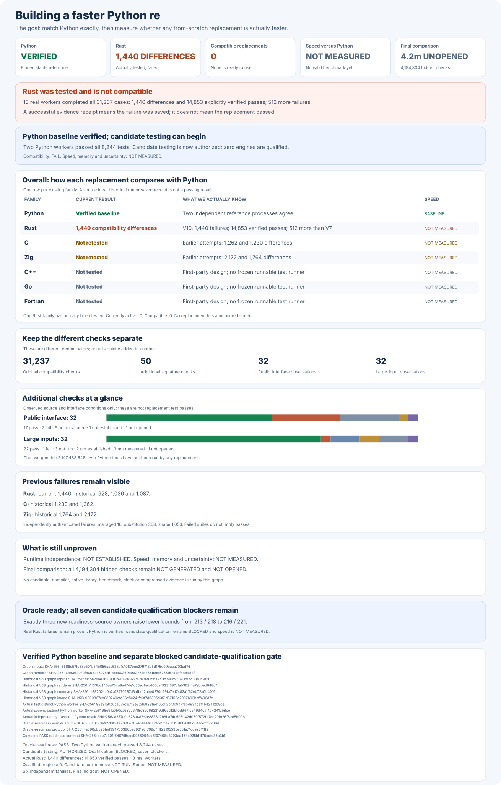

# rebar: a faster Python `re` experiment

Build a faster, fully compatible replacement for
[Python 3.14.6](https://www.python.org/downloads/release/python-3146/)'s
regular-expression module:

```python
import rebar as re
```

Every candidate must use its own matching engine built from scratch. Wrapping
Python, another regular-expression package, or another candidate does not count.

## Results at a glance

**Six** matching engines built from scratch. **Zero** fully compatible
replacements so far. Speed compared with Python: **NOT MEASURED**.



Python's corrected reference agrees on all **6,912** affected original
checks. The unchanged original suite contains **31,237** checks in
**13** groups. A separate **8,244**-case collection covers generated
patterns, invalid input, byte buffers, warnings, substitution, and other
real `re` behavior. Its reproducible two-Python-process reference is
now **PASS**: two genuinely separate Python processes each passed
**8,244/8,244** cases, for **16,488** real reference checks. The
complete Python-reference certificate now **PASSES** and permits
first-party engines to be built and tested. Replacement qualification
remains **BLOCKED**: the corresponding candidate runs are **NOT RUN**.

The latest complete Rust run recorded **1,440** genuine differences,
including a **512**-difference regression. Corrections that have not
been rebuilt or retested are not counted as passing. No engine may
wrap Python's matcher, an external regular-expression package, or
another candidate. Runtime proof of that rule is **NOT ESTABLISHED**.

| Engine | Current build | Complete compatibility | Speed against Python |
| --- | --- | --- | --- |
| Python `re` | Pinned Python 3.14.6 | Original reference agrees; both extra 8,244-case runs pass | Reference; not timed |
| Public `rebar` import | Still selects an unqualified Zig prototype | FAIL; `__version__` missing | NOT MEASURED |
| Rust | Latest engine tested; new buffer fix not yet built | FAIL; 1,440 differences, 512 more than its previous run | NOT MEASURED |
| C | First-party engine; corrected test prepared | Previous run: 1,230 differences | NOT MEASURED |
| Zig | First-party engine; corrected test prepared | Previous run: 1,764 differences | NOT MEASURED |
| C++ | First-party engine | Previous run: 2,308 differences; five worker failures | NOT MEASURED |
| Go | First-party engine | Previous run: 4,518 differences; four worker failures | NOT MEASURED |
| Fortran | First-party engine | NOT TESTED | NOT MEASURED |

Failed or interrupted checks are never counted as passes. Full results,
rejected approaches, and experiment-by-experiment notes are in the
[experiment log](docs/EXPERIMENT-LOG.md).

## Detailed compatibility

These graphs describe particular behaviors in earlier development
builds. They do not show a passing replacement or a speed result.


## Final comparison

The planned final comparison contains **4,194,304** unseen examples
and **24** balanced measurement rounds. Its examples are **NOT
FROZEN**, **NOT GENERATED**, and **NOT OPENED**. Speed, memory, and
confidence intervals are **NOT MEASURED**.

The reconciled Python reference now permits candidate correctness
tests. Require three independently built engines to pass the
**31,237** original checks, the **8,244** extra cases,
Python's two **2,147,483,648**-character requirements, and separate
public-import, signature, and no-delegation checks. The full-size
replacement tests are **NOT RUN**. A winner must be at least **1.5×**
faster overall, faster on at least **60%** of measured cases, and
explain every slowdown greater than **20%**. There is no winner.

## Evidence and reproduction

- [Reproduce the results and verify every graph](docs/REPRODUCING.md).
- [Experiment log, original reports, failures, and rejected designs](docs/EXPERIMENT-LOG.md).
- [Complete, reconciled Python correctness certificate](oracle/phase1/P0-COMPLETENESS-V4.md); reference readiness **PASS**, candidate qualification **BLOCKED**.
- [Historical corrected Python compatibility checklist](oracle/phase1/P0-COMPLETENESS-V2.md); preserved unchanged as the earlier **BLOCKED** certificate.
- [Frozen two-process reference for all 8,244 extra checks](oracle/phase1/P0-DIFFERENTIAL-FUZZ-REFERENCE-V3.md) and [complete independently recorded passing result](oracle/phase1/evidence/differential-fuzz-reference-v3-cpython-3146-two-worker-8244-v3/two-independent-reference-result.json); two actual Python processes, **8,244/8,244** each.
- [Original, preserved Python compatibility checklist](oracle/phase1/P0-COMPLETENESS-V1.md) and [separately frozen 8,244-case fuzz corpus](oracle/v2/expected.jsonl).
- [Python's original two-billion-character compatibility requirements](oracle/phase1/P0-LARGE-INPUT-INDEXING-V1.md).
- [Corrected, independently verified Python reference](oracle/phase1/P0-PUBLIC-TYPE-REFERENCE-CONTEXT-V1.md).
- [Six from-scratch engine families](oracle/phase2/SIX-FAMILY-P0-PRODUCER-V4.md) and [independent no-wrapping audit](oracle/phase2/CANDIDATE-INDEPENDENCE-V2.md).
- [First-party Rust build protocol](oracle/phase2/RUST-BUFFER-SHAPE-SOURCE-BUILD-V16.md), [actual build report](oracle/phase2/evidence/native-source-build-v16-rust-phase2-v16-rust-buffer-shape-pickle.json.gz), and [durable build receipt](oracle/phase2/evidence/native-source-build-v16-rust-phase2-v16-rust-buffer-shape-pickle-publication-receipt.json).
- [Complete latest Rust compatibility report](oracle/phase2/evidence/repaired-rust-original-campaign-v10-rust-phase2-v16-rust-buffer-shape-pickle-original-p0-v10-failures.json.gz), [durable result receipt](oracle/phase2/evidence/repaired-rust-original-campaign-v10-rust-phase2-v16-rust-buffer-shape-pickle-original-p0-v10-failures-publication-receipt.json), and [independent failure analysis](oracle/phase2/evidence/repaired-rust-original-campaign-v10-rust-phase2-v16-rust-buffer-shape-pickle-original-p0-v10-failures-forensic-summary.json).
- [Reproducible from-scratch Rust buffer correction](oracle/phase2/RUST-BUFFER-SHAPE-PICKLE-SOURCE-REPAIR-V2.md); its corrected source is frozen but not yet built or retested.
- [Historical first-party Rust build recipe](oracle/phase2/RUST-BUFFER-SHAPE-SOURCE-BUILD-V17.md); still **BLOCKED** because it binds the earlier certificate. Its corrected successor is **NOT FROZEN**.
- [Separate public-import checks](oracle/phase1/P0-PUBLIC-ENTRYPOINT-IMPORT-V1.md) and [function-signature checks](oracle/phase1/P0-CALLABLE-INTROSPECTION-V1.md).
- [Expanded, still-unopened final comparison](docs/EXPANDED-HOLDOUT-PROTOCOL-V1.md).
- [Original objective](GOAL.md), SHA-256
  `e5935060b44fe5f6b4e19ac2d01f3ce63182cf6a1d3b416502a4441cde345b62`;
  [later clarifications](AMENDMENTS.md).
