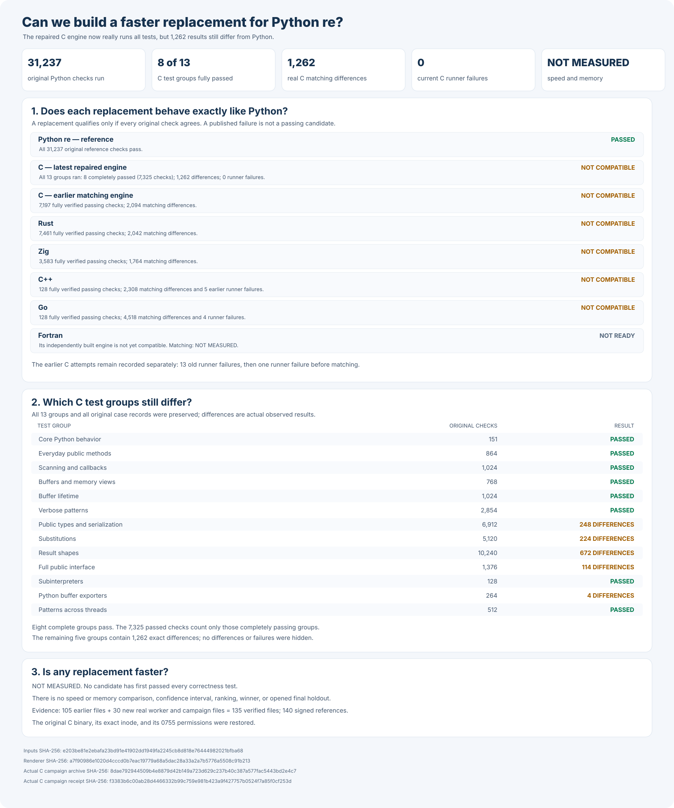

# rebar: a faster Python `re` experiment

Build a faster, fully compatible replacement for Python 3.14.6's
regular-expression module:

```python
import rebar as re
```

Every candidate must use its own matching engine built from scratch. Wrapping
Python, another regular-expression package, or another candidate does not count.

## Headline results

Python passes all **31,237** frozen compatibility checks. No replacement
has passed them. Five independently written engines—Rust, C, Zig, C++,
and Go—build reproducibly, but their previously tested versions remain
incompatible. Fortran has not yet produced matching repeat builds. None
of these engines wraps an external regular-expression package.

A repaired C engine has now completed all **13** original test groups.
It fully passes **8** groups containing **7,325** verified checks; the
other **5** groups contain **1,262** actual compatibility differences.
All test workers completed, with **0** test-runner failures. Earlier
failed attempts are preserved. C is not yet a drop-in replacement.
Speed and memory remain **NOT MEASURED**. The final comparison remains
**NOT OPENED**. Separate Rust and Zig repairs have not yet been built.



| Engine | Current build | Complete compatibility | Speed against Python |
| --- | --- | --- | --- |
| Python `re` | Reference | 31,237 / 31,237 | Reference; not timed |
| Rust | Two matching builds | 7,461 verified; five groups failed; not qualified | NOT MEASURED |
| C | Independently repeated repaired native build | 7,325 verified; 1,262 differences; five groups failed; not qualified | NOT MEASURED |
| Zig | Two matching original builds; capture repair not built | 3,583 verified; seven groups failed; not qualified | NOT MEASURED |
| C++ | Two matching source builds | 128 verified; 12 groups failed; not qualified | NOT MEASURED |
| Go | Two matching first-party builds | 128 verified; 4,518 differences; four worker failures | NOT MEASURED |
| Fortran | Three attempts; engines differ | NOT TESTED | NOT MEASURED |

## Detailed compatibility

The table shows the last completed matching results for each engine. The C
column uses the latest independently built repair; both earlier C runner
failures remain preserved in the experiment log.

| Python behavior | Cases | Rust | C | Zig | C++ | Go |
| --- | ---: | ---: | ---: | ---: | ---: | ---: |
| Python's original runnable public tests | 151 | 151 | 151 | 151 | 43 failures | 38 failures |
| General public behavior | 864 | 864 | 864 | 864 | 40 failures | 153 failures |
| Scanners and callbacks | 1,024 | 1,024 | 1,024 | 960; 64 failures | 992 failures | 960 failures |
| Memory views and buffers | 768 | 768 | 768 | 768 | 181 failures | 197 failures |
| Total initial matching checks | 2,807 | 2,807 | 2,807 | 2,743; 64 failures | 1,256 failures | 1,348 failures |
| Additional memory-lifetime safety, counted separately | 1,024 | 1,024 | 1,024 | 1,024 | 600 failures | 668 failures |
| Verbose scanners and pattern comments | 2,854 | 2,854 | 2,854 | 2,234; 620 failures | Test worker failed | Test worker failed |
| Additional public types, copying, and serialization | 6,912 | 248 failures | 248 failures | 248 failures | Test worker failed | Test worker failed |
| Replacement and buffer behavior | 5,120 | 336 failures | 224 failures | 64 failures | Test worker failed | 2,058 failures |
| Changing-size buffer behavior | 10,240 | 1,392 failures | 672 failures | 672 failures | Test worker failed | Test output exceeded worker limit |
| Broad public behavior and real locales | 1,376 | 66 failures | 114 failures | 96 failures | 336 failures | 324 failures |
| Python buffer exporters and retained scanners | 264 | 264 | 4 failures | 264 | 116 failures | 120 failures |
| Simultaneous isolated Python interpreters | 128 | Setup failed; matching not established | 128 | Cleanup and report verification failed; no complete suite | 128 | 128 |
| Patterns shared across simultaneous Python threads | 512 | 512 | 512 | 512 | Test worker failed | Test worker failed |
| Full frozen compatibility gate | 31,237 | Failed; 7,461 verified; five groups failed | Failed; 7,325 verified; 1,262 mismatches; five groups failed | Failed; 3,583 verified; seven groups failed | Failed; 128 verified; 2,308 mismatches; five worker failures | Failed; 128 verified; 4,518 mismatches; four worker failures |

A passed example inside a failed group does not qualify an engine. Python's
debug-only check is excluded equally for every candidate.

The detailed charts below are from earlier, clearly labeled development
builds. They are not passing results for the current implementations.


## Final comparison

The final comparison is planned to use **4,194,304** unseen examples and
**24** balanced measurement rounds. Its cases remain **NOT FROZEN**,
**NOT GENERATED**, and **NOT OPENED**. Current speed and memory are
**NOT MEASURED**.

First, three independently built engines must pass all **31,237**
compatibility checks. To win, an engine must be at least **1.5×** faster
overall, measurably faster in at least **60%** of cases, and explain every
slowdown greater than **20%**. There is no winner.

## Evidence and reproduction

- [Frozen Python compatibility tests](oracle/phase1/P0-COMPLETENESS-V1.md) and [all 31,237 cases](oracle/phase1/p0-completeness-v1.json).
- [Independent, from-scratch engine audit](oracle/phase2/CANDIDATE-INDEPENDENCE-V2.md).
- [Corrected original-test and ownership rules](oracle/phase2/SIX-FAMILY-P0-PRODUCER-V3.md), [exact frozen contract](oracle/phase2/six-family-p0-producer-v3.json), and [source-only test producer](tools/run_owned_six_family_original_p0_producer_v3.py); all original tests and both Python references are preserved.
- [Complete corrected-suite protocol](oracle/phase2/P0-CANDIDATE-PROTOCOL-V9.md), [frozen test contract](oracle/phase2/p0-candidate-protocol-v9.json), [isolated original-test worker](tools/run_frozen_p0_candidate_worker_v7.py), and [full-suite runner](tools/run_frozen_p0_candidate_v9.py); all 13 original C test workers have now run.
- [Frozen correction for the C test coordinator](oracle/phase2/P0-V9-LIVE-CONTEXT-ADAPTER-V1.md), [exact original-worker contract](oracle/phase2/p0-v9-live-context-adapter-v1.json), and [independent coordinator adapter](tools/run_owned_frozen_p0_v9_live_context_adapter_v1.py); the earlier coordinator failure is preserved.
- [Recovery-safe corrected C test rules](oracle/phase2/REPAIRED-C-ORIGINAL-CAMPAIGN-V2.md), [exact recovery contract](oracle/phase2/repaired-c-original-campaign-v2.json), and [complete safely recovered runner](tools/run_owned_repaired_c_original_campaign_v2.py); its one recorded test-runner failure is preserved.
- [Complete corrected C rerun](oracle/phase2/REPAIRED-C-ORIGINAL-CAMPAIGN-V3.md), [exact original-test and safe-restoration contract](oracle/phase2/repaired-c-original-campaign-v3.json), and [recovery-safe original-suite controller](tools/run_owned_repaired_c_original_campaign_v3.py); all 13 workers and all 1,262 mismatches are preserved.
- [Frozen first-party Zig capture repair](oracle/phase2/ZIG-SCANNER-CAPTURE-SOURCE-REPAIR-V1.md), [exact one-change contract](oracle/phase2/zig-scanner-capture-source-repair-v1.json), and [private-snapshot-only repair tool](tools/apply_owned_zig_scanner_capture_source_repair_v1.py); the repaired Zig engine has not been built or tested.
- [Reproducible from-scratch Zig build rules](oracle/phase2/ZIG-SCANNER-SOURCE-BUILD-V10.md), [exact independent two-build contract](oracle/phase2/zig-scanner-source-build-v10.json), and [source-only Zig build verifier](tools/reproduce_owned_zig_scanner_source_build_v10.py); the repaired Zig engine has not been built or tested.
- [Frozen first-party Rust public-compatibility repair](oracle/phase2/RUST-PUBLIC-CONTRACT-SOURCE-REPAIR-V1.md), [exact three-change contract](oracle/phase2/rust-public-contract-source-repair-v1.json), and [private-snapshot-only Rust repair](tools/apply_owned_rust_public_contract_source_repair_v1.py); the repaired Rust engine has not been built or tested.
- [Complete original C test-runner failure](oracle/phase2/evidence/frozen-p0-candidate-v8-c-phase2-v8-original-p0-failures.json.gz) and [independently recovered failure and original-file proof](oracle/phase2/evidence/repaired-c-original-campaign-v1-c-phase2-v8-original-p0-failures.json.gz).
- [Complete corrected C runner failure](oracle/phase2/evidence/repaired-c-original-campaign-v2-c-phase2-v9-original-p0-failures.json.gz) and [independent failure and exact-restoration receipt](oracle/phase2/evidence/repaired-c-original-campaign-v2-c-phase2-v9-original-p0-failures-publication-receipt.json).
- [Actual complete corrected C compatibility result](oracle/phase2/evidence/repaired-c-original-campaign-v3-c-phase2-v10-live-original-p0-failures.json.gz), [independent safe-restoration receipt](oracle/phase2/evidence/repaired-c-original-campaign-v3-c-phase2-v10-live-original-p0-failures-publication-receipt.json), and [all 13 original worker results](oracle/phase2/evidence/frozen-p0-candidate-v9-c-phase2-v10-live-original-p0-failures.json.gz).
- [Current graph inputs](docs/evidence/candidate-current-overview-v23.inputs.json), [machine-readable results](docs/evidence/candidate-current-overview-v23.json), and [graph generator](tools/render_candidate_current_overview_v23.py).
- [Full reproduction instructions and source-pinned checks](docs/REPRODUCING.md).
- [Experiment log, raw evidence, previous graphs, and rejected designs](docs/EXPERIMENT-LOG.md).
- [Expanded final-comparison plan](docs/EXPANDED-HOLDOUT-PROTOCOL-V1.md).
- [Original objective](GOAL.md), SHA-256 `e5935060b44fe5f6b4e19ac2d01f3ce63182cf6a1d3b416502a4441cde345b62`; [later clarifications](AMENDMENTS.md).

Verify the current graph without running a candidate or opening the holdout:

```sh
PY=/tmp/rebar-cpython/cpython-3.14.6-linux-x86_64-gnu/bin/python3.14

"$PY" -I -B tools/verify_p0_completeness_v1.py --self-test
"$PY" -I -B tools/audit_candidate_independence_v2.py --self-test
"$PY" -I -B tools/run_owned_six_family_original_p0_producer_v3.py --self-test
"$PY" -I -B tools/run_frozen_p0_candidate_worker_v7.py --self-test
"$PY" -I -B tools/run_frozen_p0_candidate_v9.py --self-test
"$PY" -I -B tools/run_owned_frozen_p0_v9_live_context_adapter_v1.py --self-test
"$PY" -I -B tools/run_owned_repaired_c_original_campaign_v2.py --self-test
"$PY" -I -B tools/run_owned_repaired_c_original_campaign_v3.py --self-test
"$PY" -I -B tools/render_candidate_current_overview_v23.py --self-test
"$PY" -I -B tools/render_candidate_current_overview_v23.py \
  --verify-frozen-context \
  --source-sha256 a7f90986e1020d4cccd0b7eac19779a68a5dac28a33a2a7b5776a5508c91b213 \
  --campaign-archive-sha256 8dae792944509b4e8879d42b149a723d629c237b40c387a577fac5443bd2e4c7 \
  --campaign-receipt-sha256 f3383b6c00ab28d4466332b99c759e981b423a9f427757b0524f7a85f0cf253d \
  --inputs-sha256 e203be81e2ebafa23bd91e41902dd1949fa2245cb8d818e76444982021bfba68 \
  --summary-sha256 6368a2c900e2ed656830ba773bd454a603f547f3f21f9eabac3490140d687098 \
  --svg-sha256 853d3084beb85df634437f3e9198f85c3d28f455c82c94550ae98cb453e561a4
```
