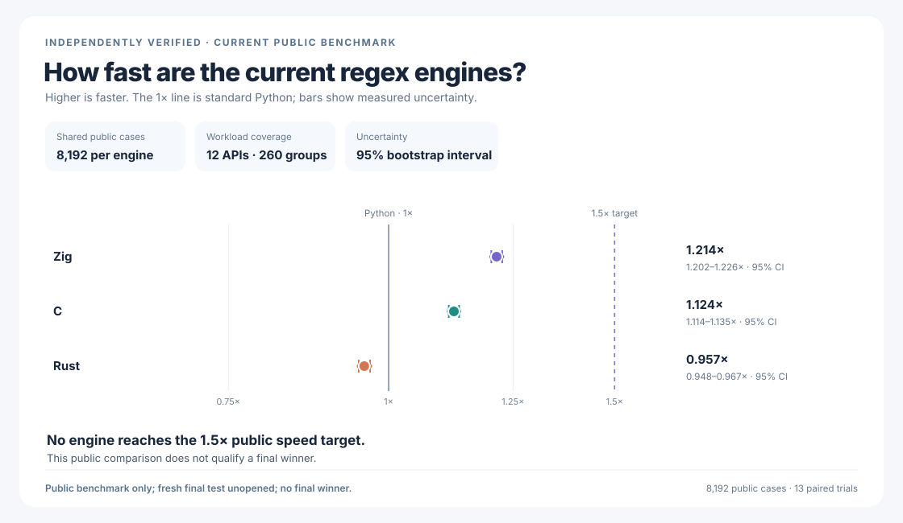
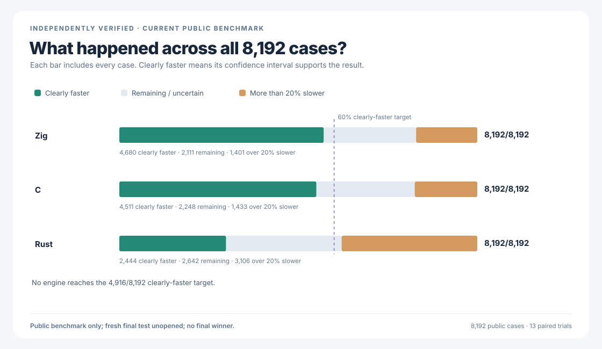
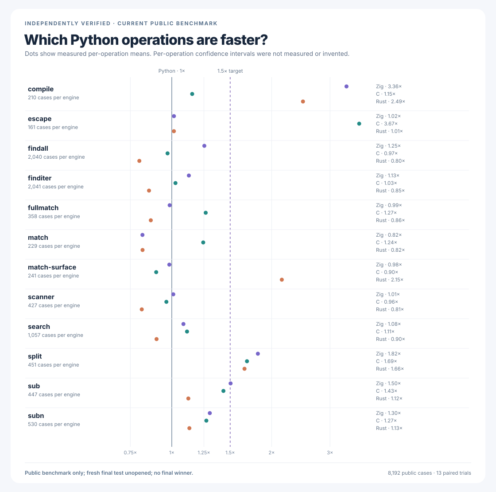
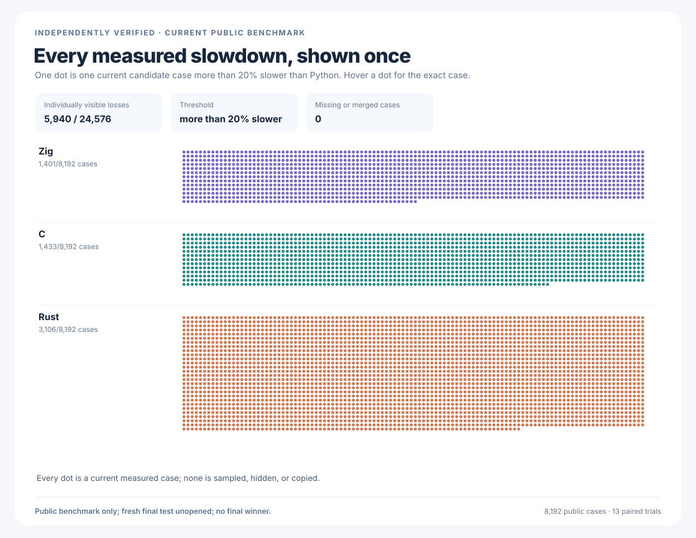
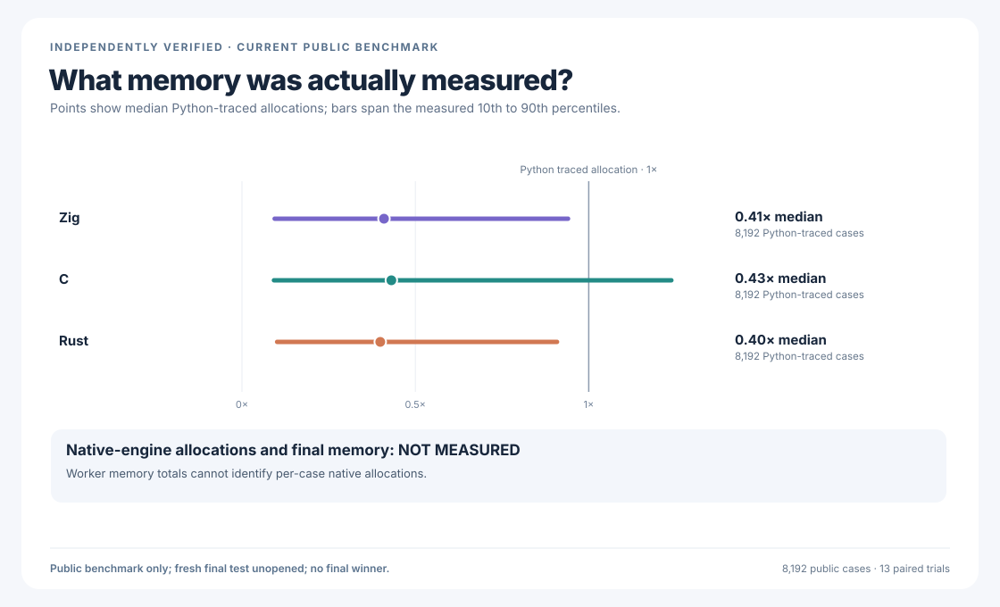
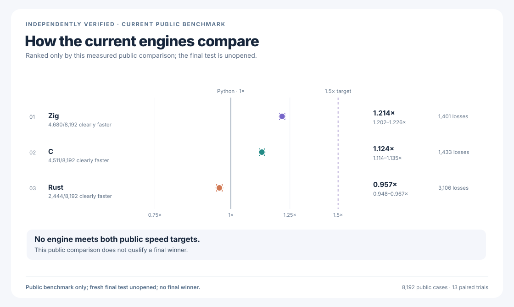

# rebar: a faster Python `re` experiment

`rebar` asks whether a regular-expression engine written from scratch can
replace Python 3.14.6's `re` module and run faster. The intended interface
is `import rebar as re`. Its C, Rust, and Zig candidates have independent
matching engines. None wraps an external regular-expression package, calls
Python's matching engine, or delegates to another candidate.

Python and all three currently installed candidates each pass all
**146/146** selected official regular-expression tests, with no failures
or skips. Each engine also passes all **22** required compatibility
stages. Together, they match Python in **1,190,400** fresh public
correctness checks. Their speed is **NOT MEASURED**. The independent
final test is **NOT OPENED**. **There is no proven winner.**

## Latest completed public comparison

All six charts show the same completed comparison of the
[archived C, Zig, and previous Rust engines](performance/postfinal-public-v6/NATIVE-ARCHIVE-V1.md).
They do **not** measure any of the rebuilt Rust, C, or Zig engines. Those
archived engines and unmodified Python 3.14.6 ran the same **8,192**
public workloads. The
[predeclared comparison](performance/postfinal-public-v6/PROTOCOL.md)
records **425,984** paired observations, **1,277,952** exact-answer checks,
and **24,579** independently replayed confidence intervals. **1× means
Python's speed; higher is faster. The target is 1.5×.**



| Engine | Public speed | 95% uncertainty range | Clearly faster cases | More than 20% slower |
| --- | ---: | ---: | ---: | ---: |
| Python baseline | 1.000× | Baseline | — | — |
| Zig | 1.214× | 1.2023–1.2260× | 4,680/8,192 (57.1%) | 1,401/8,192 |
| C | 1.124× | 1.1140–1.1347× | 4,511/8,192 (55.1%) | 1,433/8,192 |
| Previous Rust | 0.957× | 0.9476–0.9673× | 2,444/8,192 (29.8%) | 3,106/8,192 |

**No candidate reaches 1.5× or is clearly faster on 60% of cases.
There is no winner.** The previous Rust engine is slower than Python and
was rejected. All **5,940** slowdowns of more than 20% remain visible in
the [independently verified full results](performance/postfinal-public-v6/RESULTS.md).



## Details of that comparison







The memory chart reports Python-visible temporary allocations. Separate
whole-process worker readings cannot identify allocations inside a native
engine; exact native memory remains **NOT MEASURED**.



The [earlier comparison and its original graphs](performance/postfinal-public-v5/RESULTS.md)
retain all **5,173** historical slowdowns. Its
[five original native libraries](performance/postfinal-public-v5/NATIVE-ARCHIVE-V1.md)
are preserved separately from the
[five native libraries used in the latest completed comparison](performance/postfinal-public-v6/NATIVE-ARCHIVE-V1.md).
All three current engines have since been rebuilt. Neither archived
comparison measures their new speed, and separate runs do not prove a
paired change.

## What the current engines actually pass

The [complete official-test result](oracle/cpython-3.14.6/evidence/postfinal-locale-v1-all.json)
proves that Python, Rust, C, and Zig each pass all **146/146** selected
official Python `re` tests. There are **zero** failures, crashes, or
skips. Both previously skipped locale tests now run against real,
privately generated ISO-8859-1 and UTF-8 locales. The
[locale test record](oracle/cpython-3.14.6/POSTFINAL-LOCALE-V1.md)
explains how compiled expressions are checked across an actual locale
change without modifying Python's tests.

The [fresh all-engine correctness comparison](candidates/evidence/python-re-universal-public-oracle-v6-all.json)
checks the exact current Rust, C, and Zig engines against Python across
**8,192** patterns and **48** observations per engine and pattern:
**1,179,648** comparisons, **zero** mismatches, and no external
regular-expression package.

Fresh
[from-scratch](candidates/audits/POSTFINAL-FROM-SCRATCH-AUDIT-V5.json)
and
[independent-execution](candidates/audits/POSTFINAL-NO-DELEGATION-AUDIT-V5.json)
audits verify all **12** current source files and all **5** native
libraries. Their independent safety checks pass **198** and **676**
controls. Rust additionally passes **44** native tests. All three
engines independently pass the same deeper public checks:

| Engine | Matching and parsing | Python object behavior | Callbacks and scanners |
| --- | ---: | ---: | ---: |
| Rust | [223,198/223,198](candidates/evidence/rust-v7-edge-oracle-rust-postfinal-locale-v1.json.gz) | [393/393](candidates/audits/RUST-V8-DEEP-CONTRACT-RUST-POSTFINAL-LOCALE-V1.json.gz) | [479/479](candidates/evidence/rust-v8-observability-rust-qualified-postfinal-locale-v1.json.gz) |
| C | [223,198/223,198](candidates/evidence/rust-v7-edge-oracle-vm-postfinal-locale-v1.json.gz) | [393/393](candidates/audits/RUST-V8-DEEP-CONTRACT-C-POSTFINAL-LOCALE-V1.json.gz) | [479/479](candidates/evidence/rust-v8-observability-vm-qualified-postfinal-locale-v1.json.gz) |
| Zig | [223,198/223,198](candidates/evidence/rust-v7-edge-oracle-zig-postfinal-locale-v1.json.gz) | [393/393](candidates/audits/RUST-V8-DEEP-CONTRACT-ZIG-POSTFINAL-LOCALE-V1.json.gz) | [479/479](candidates/evidence/rust-v8-observability-zig-qualified-postfinal-locale-v1.json.gz) |

The fresh, source-bound full campaigns for
[Rust](candidates/evidence/rust-v8-rust-postfinal-locale-v5-sealed-campaign.json),
[C](candidates/evidence/rust-v8-vm-postfinal-locale-v5-sealed-campaign.json),
and
[Zig](candidates/evidence/rust-v8-zig-postfinal-locale-v5-sealed-campaign.json)
each pass **22/22** stages, **146/146** official Python tests, and
**4,494,555** Unicode comparisons. Each report is independently bound
to its actual engine; earlier reports never qualify a changed build.

The first expanded Python self-comparison
[failed on 32 of 3,584 checks](oracle/cpython-3.14.6/evidence/public-contract-v7-self-oracle-failures.json)
because independent Python processes produced different
compiled-pattern hash values. Every result remains preserved.

The [new frozen portable compatibility design](oracle/cpython-3.14.6/PUBLIC-CONTRACT-V8.md)
retains all **3,584** checks across the same **8** groups. It compares
genuine pattern-hash behavior without treating process-specific hash
numbers as portable and safely preserves Unicode surrogates. Its
candidate-free safety test passes **597/597** checks. The
[actual two-Python self-comparison](oracle/cpython-3.14.6/evidence/public-contract-v8-self-oracle.json)
now passes all **3,584** cases and preserves **7,168** independent
observations with **zero** mismatches. The first
[Rust candidate run](candidates/evidence/python-re-universal-public-oracle-v8-rust-failures.json)
then exposes **256** test-harness failures: public-surface
introspection attempts an import that Rust's independence guard
correctly blocks. This is not evidence that Rust delegated matching
or returned an incorrect regular-expression result. C and Zig did
not run that earlier stage. All three now run independently against
the corrected stage-ten suite.

The [new frozen, isolated-signature compatibility design](oracle/cpython-3.14.6/PUBLIC-CONTRACT-V10.md)
preserves all **3,584** original cases across **8** groups and all
**256** real public-signature checks. It inspects signatures in a
separate process, without weakening any engine's independence guard.
Its candidate-free safety test passes **793/793** checks. The
[actual isolated two-Python baseline](oracle/cpython-3.14.6/evidence/public-contract-v10-self-oracle.json)
also passes all **3,584** cases and preserves **7,168** observations
with **zero** mismatches. The
[completed three-engine comparison](candidates/evidence/python-re-universal-public-oracle-v10-all.json)
independently passes **3,584/3,584** cases for Rust, C, and Zig:
**10,752** new checks and **zero** mismatches. Every engine is
prevented from importing Python's matcher, another candidate, or
an external matching package.

The [published public benchmark](performance/postfinal-public-v7/PROTOCOL.md)
has a [frozen one-time manifest](performance/postfinal-public-v7/manifest.json)
covering **8,192** examples, **260** workload categories, **12** Python
operations, and **13** planned paired trials. Its speed is
**NOT MEASURED**.

The proposed [33,280-case public expansion](performance/postfinal-public-v8/PROTOCOL.md)
is **FALSIFIED**: its saved-answer check disagrees with previously
frozen public data before any engine starts. The
[preserved public failure](performance/postfinal-public-v8/evidence/postfinal-public-freeze-failure-v8.json)
is not an engine or speed result.

A [corrected 33,280-case public comparison](performance/postfinal-public-v10/PROTOCOL.md)
authenticates all **10,312** original public records, preserves all
**8,192** previous examples, and openly excludes **581** oversized
records from measurement. Its one-time manifest is **NOT CREATED** and
**NOT FROZEN**. The source and protocol must be committed and pushed
before the manifest may be frozen; the manifest must then be committed
and pushed before any engine is timed. This is a public comparison,
not the independent final test. New speed, memory, confidence
intervals, and rankings remain **NOT MEASURED**.

## Final-test status

An earlier one-time final test found a real Zig `split` mismatch. Its
[failure report](performance/v9/evidence/FINAL-HOLDOUT-FAILURE.md)
remains unchanged; that test cannot be rerun. The separate
[65,536-case final test](performance/postfinal-fresh-holdout-v1/PROTOCOL.md)
is **NOT OPENED**. Its
[audited adapter](performance/postfinal-fresh-holdout-v1/ADAPTER-AUDIT.md)
was checked against the archived original engines, not the current
rebuilt engines. The one-use executor is **NOT YET INTEGRATED**. Final speed,
final memory, and a qualified winner remain **NOT MEASURED**.

The [experiment log](docs/EXPERIMENT-LOG.md) preserves earlier results,
rejected designs, actual failures, and their resolutions.

## Reproduce and inspect

The objective in [GOAL.md](GOAL.md) has immutable SHA-256
`e5935060b44fe5f6b4e19ac2d01f3ce63182cf6a1d3b416502a4441cde345b62`.
[AMENDMENTS.md](AMENDMENTS.md) records later clarifications separately.

```sh
PY=/tmp/rebar-cpython/cpython-3.14.6-linux-x86_64-gnu/bin/python3.14

PYTHONDONTWRITEBYTECODE=1 "$PY" -I -B \
  tools/postfinal_from_scratch_audit_v5.py --self-test
PYTHONDONTWRITEBYTECODE=1 "$PY" -I -B \
  tools/postfinal_no_delegation_audit_v5.py --self-test
PYTHONDONTWRITEBYTECODE=1 "$PY" -I -B \
  tools/postfinal_cpython_locale_oracle_v1.py --self-test
PYTHONDONTWRITEBYTECODE=1 "$PY" -I -B \
  tools/python_re_universal_public_oracle_stage06.py --self-test
PYTHONDONTWRITEBYTECODE=1 "$PY" -I -B \
  tools/python_re_universal_public_oracle_stage07.py --self-test
PYTHONDONTWRITEBYTECODE=1 "$PY" -I -B \
  tools/python_re_universal_public_oracle_stage08.py --self-test
PYTHONDONTWRITEBYTECODE=1 "$PY" -I -B \
  tools/python_re_universal_public_oracle_stage10.py --self-test
PYTHONDONTWRITEBYTECODE=1 "$PY" -I -B \
  tools/postfinal_public_practice_v7.py --self-test
PYTHONDONTWRITEBYTECODE=1 "$PY" -I -B \
  tools/postfinal_public_expansion_v8_failure.py --self-test
PYTHONDONTWRITEBYTECODE=1 "$PY" -I -B \
  tools/postfinal_public_expansion_v10.py --self-test
PYTHONDONTWRITEBYTECODE=1 "$PY" -I -B \
  tools/postfinal_public_practice_v10.py --self-test
# Historical successful one-time freeze; the manifest now exists.
# Do not rerun: freezing exclusively creates the manifest once.
# PYTHONPATH=. is mandatory for the inherited contract.
# env PYTHONPATH=. PYTHONDONTWRITEBYTECODE=1 "$PY" -I -B \
#   tools/postfinal_public_practice_v7.py --freeze
# Historical one-shot baseline; never overwrites the preserved evidence.
PYTHONDONTWRITEBYTECODE=1 "$PY" -I -B \
  tools/python_re_universal_public_oracle_stage10.py --self-oracle
PYTHONDONTWRITEBYTECODE=1 "$PY" -I -B \
  tools/rust_v8_multi_candidate_campaign_postfinal_v5.py --self-test
PYTHONDONTWRITEBYTECODE=1 PYTHONPATH=. "$PY" -I -B -c \
  'import sys;sys.path.insert(0,".");from tools.postfinal_public_practice_v6 import main;main(["--self-test"])'
PYTHONDONTWRITEBYTECODE=1 PYTHONPATH=. "$PY" -B \
  tools/postfinal_public_practice_charts_v6.py --self-test
PYTHONDONTWRITEBYTECODE=1 PYTHONPATH=. "$PY" -B \
  tools/postfinal_public_practice_presentation_v2.py --self-test
PYTHONDONTWRITEBYTECODE=1 "$PY" -I -B \
  tools/postfinal_public_native_archive_v2.py --self-test
PYTHONDONTWRITEBYTECODE=1 "$PY" -I -B \
  tools/postfinal_public_native_archive_v2.py --verify
PYTHONDONTWRITEBYTECODE=1 "$PY" -I -B \
  tools/postfinal_public_native_archive_v1.py --verify

jq '{status, cases, observations_per_case, observations_per_candidate,
     total_comparisons, mismatches, completed_candidates}' \
  candidates/evidence/python-re-universal-public-oracle-v6-all.json

jq '{status, result, python,
     roles: (.roles | with_entries(.value |=
       {methods, passed, failed, skipped}))}' \
  oracle/cpython-3.14.6/evidence/postfinal-locale-v1-all.json

jq '{status, cases, stdlib_checks, mismatches,
     candidate_imports, candidate_processes,
     benchmark_or_timing_executed, holdout_cases_read}' \
  oracle/cpython-3.14.6/evidence/public-contract-v8-self-oracle.json

jq '{result, cases_per_candidate, raw_rows, correctness_checks,
     confidence_intervals_recomputed, strict_regressions, rankings}' \
  performance/postfinal-public-v6/evidence/postfinal-public-practice-v6-integrity.json

sha256sum \
  performance/postfinal-public-v6/manifest.json \
  tools/postfinal_public_practice_v6.py \
  performance/postfinal-public-v6/evidence/postfinal-public-practice-v6-summary.json \
  performance/postfinal-public-v6/evidence/postfinal-public-practice-v6-integrity.json \
  performance/postfinal-public-v6/evidence/postfinal-public-practice-v6-raw.jsonl.gz
gzip -dc \
  performance/postfinal-public-v6/evidence/postfinal-public-practice-v6-raw.jsonl.gz \
  | sha256sum
```
