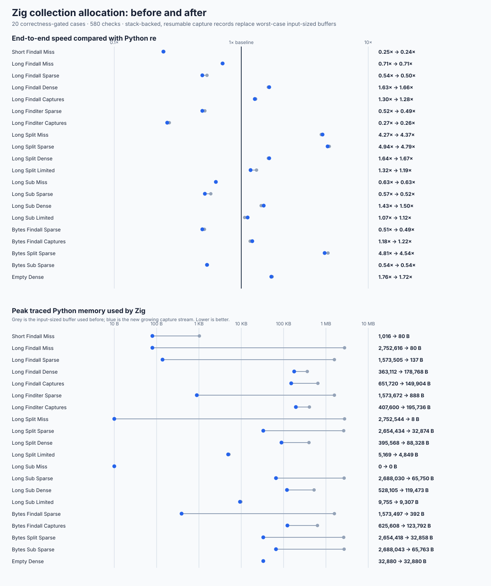
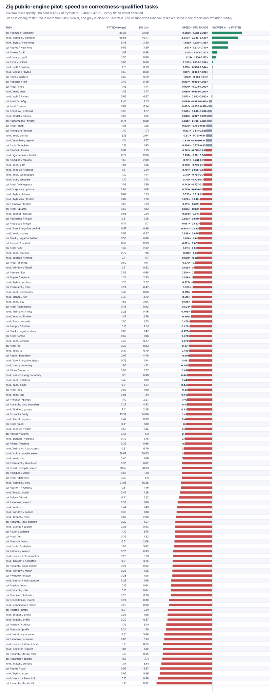

# Zig allocation follow-up

The from-scratch Zig engine now grows its capture-result buffer only when it is needed. Long misses and sparse results no longer allocate space for every possible match. The change preserves the existing compatibility results, passes the safety and no-delegation checks, and keeps all timing and memory observations.

## Result

The focused check covers 20 ordinary `findall`, `finditer`, `split`, and replacement tasks across text, bytes, captures, limits, misses, sparse results, dense results, and empty matches. The final run uses 13 paired trials and 48 calls per timing, with 580 correctness comparisons and zero failures. `1x` means the same speed as Python `re`.

| Task | Speed before | Speed after | Zig peak before | Zig peak after |
| --- | ---: | ---: | ---: | ---: |
| Long `findall`, no result | 0.709x | 0.713x | 2,752,616 B | **80 B** |
| Long `findall`, sparse | 0.536x | 0.495x | 1,573,505 B | **137 B** |
| Long `findall`, captures | 1.298x | 1.283x | 651,720 B | **149,904 B** |
| Long `finditer`, sparse | 0.518x | 0.492x | 1,573,672 B | **888 B** |
| Long `split`, no result | 4.273x | 4.373x | 2,752,544 B | **8 B** |
| Long `split`, sparse | 4.940x | 4.790x | 2,654,434 B | **32,874 B** |
| Long replacement, sparse | 0.575x | 0.519x | 2,688,030 B | **65,750 B** |
| Bytes `findall`, sparse | 0.514x | 0.493x | 1,573,497 B | **392 B** |
| Bytes `split`, sparse | 4.811x | 4.541x | 2,654,418 B | **32,858 B** |
| Bytes replacement, sparse | 0.540x | 0.536x | 2,688,043 B | **65,763 B** |

The overall focused speed is 1.034x before and 1.015x after. Timing is therefore essentially unchanged; some individual losses remain and are visible in the chart and raw results. Dense outputs still require memory for the results themselves and are also shown rather than omitted.

The unchanged 144-task Zig pilot qualifies 134 tasks and rejects the same ten Unicode tasks. Its 13-trial, 3,484-row run is **0.468x** overall on the 67 qualified holdout tasks (0.466--0.470x measured range), clearly faster on 3/67, with 57 large slowdowns. Calibration is 0.473x, 4/67 clearly faster, with 53 large slowdowns. Every one of the 3,752 correctness checks passes. This is a small improvement over the earlier 0.460x result, but Zig remains much slower than the baseline on general calls and is not correctness-qualified.

## Design

The installed Zig 0.16.0 standard library does not contain a native regular-expression engine. Its bundled C library includes TRE; that code was inspected only to learn allocation patterns, not linked or called. TRE uses an arena for compile-time nodes, one overflow-checked contiguous block for per-match states/tags, and a reusable growing backtracking stack. Zig's standard `StackFallbackAllocator` similarly keeps small work in a fixed local buffer before using an allocator.

The bridge adopts the same general idea without copying or wrapping an external matcher:

- The first 64 capture records use a small stack-backed buffer.
- A full buffer grows by four, with checked sizes and append-only records.
- Matching resumes from the exact cursor and empty-match retry state, so growing never repeats work on the already-scanned prefix.
- `findall`, `finditer`, `split`, `sub`, and `subn` share this path. Limited operations stop allocating once their requested result count is reached.

An intermediate version restarted matching whenever the buffer grew. It reduced memory but slowed dense results and was replaced. A retry-state mistake found during development created 29 new expanded-matrix and 136 new large-holdout failures; restoring the exact empty-match progression removes all of them. The final failure-ID sets are identical to the pre-change sets.

The compiled Zig program still reserves 283,544 B per pattern and the executor still uses large fixed stacks. Those are separate allocation targets; this change addresses result collection only.

## Gates and raw evidence

- Focused span checks: **8,874/8,874** pass in an instrumented build.
- Capture/reference checks: **5,214/5,214** pass in an instrumented build.
- Allocation checks: **180/180** pass with address/undefined-behavior checks; **580/580** pass in the optimized measurement.
- Expanded correctness matrix: **2,651/8,244** pass, with the same 5,593 known failures and zero new failure IDs.
- Large correctness holdout: **12,912/35,840** pass, with the same 22,928 known failures and zero new failure IDs.
- Large performance fixture: **2,246/2,448** tasks qualify; the same 202 Unicode-related failures remain.
- Official CPython tests: **85/144** runnable methods pass, 59 known failures, zero crashes/timeouts, unchanged.
- The native libraries link only the local Zig engine and the C runtime. Static/import audits report zero forbidden markers or blocked attempts.

Reproduction tools are [the allocation probe](../../tools/zig_allocation_probe.py) and [chart generator](../../tools/zig_allocation_chart.py). Raw evidence is preserved in [before](zig-allocation-before.json), [after](zig-allocation-after.json), [full pilot](zig-allocation-holdout.json), [instrumented span](zig-allocation-sanitized-span.json), [instrumented capture](zig-allocation-sanitized-capture.json), [instrumented allocation](zig-allocation-sanitized.json), and the unchanged [large performance qualification](zig-allocation-perf-v4-after.json).
