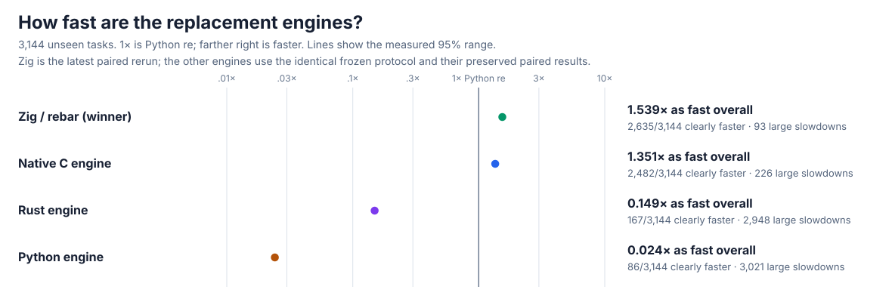
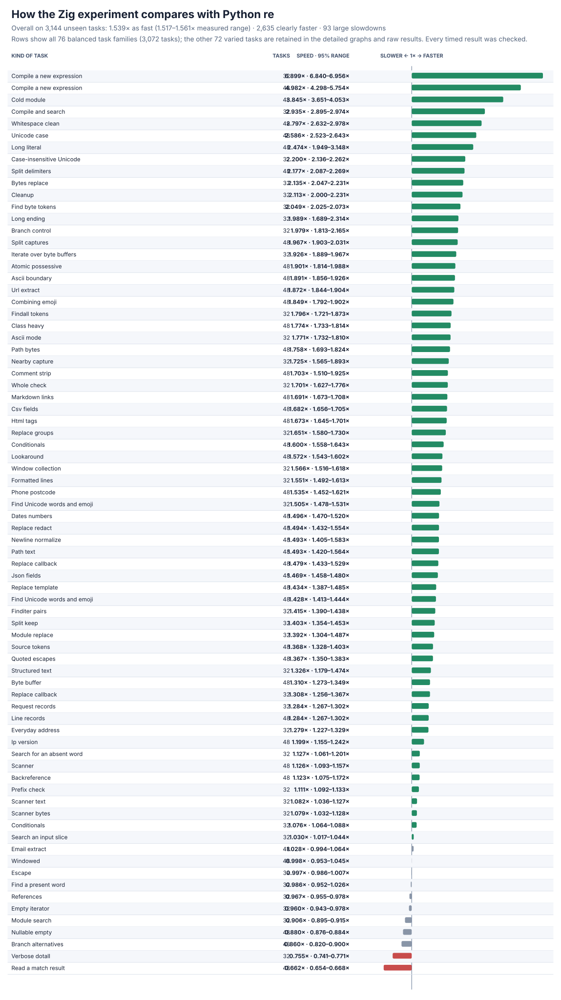
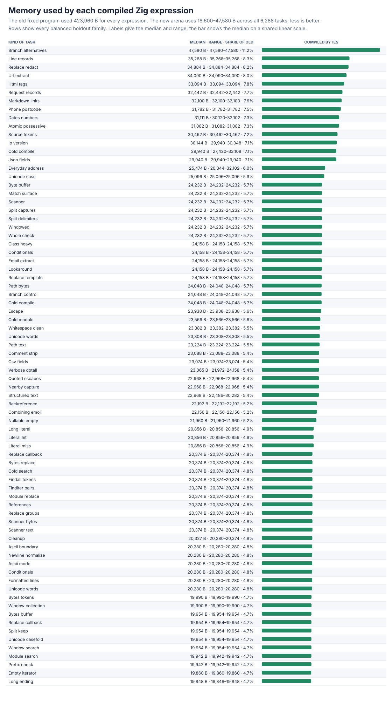
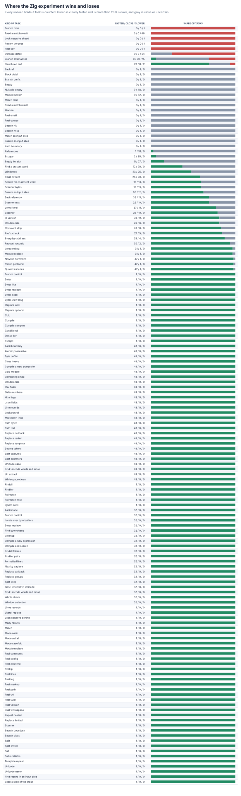

# Zig becomes the public, faster `rebar` engine

The from-scratch Zig engine now clears the expanded performance target while retaining the complete compatibility surface. It is the public engine selected by `import rebar as re`. This follow-up removes repeated Python-call overhead, makes pattern and match behavior closer to CPython, reduces matcher workspace, and preserves every slower experiment and loss.





## Headline result

The final paired run covers **3,144 practice + 3,144 unseen holdout tasks**, the frozen operation counts, 13 trials, 2,000 bootstrap samples, memory, and **163,488** raw timing rows. All **176,064** pre/post timing comparisons pass.

| Task set | Speed vs Python `re` | Clearly faster | Large slowdowns |
| --- | ---: | ---: | ---: |
| Practice | 1.499× (1.477–1.524×) | 2,594/3,144 | 146/3,144 |
| Holdout | **1.539× (1.517–1.561×)** | **2,635/3,144 (83.8%)** | **93/3,144** |
| All | 1.519× (1.503–1.535×) | 5,229/6,288 | 239/6,288 |

This meets the experiment's **1.5×** holdout target and its **60%** clearly-faster requirement. Cold compilation reaches **4.98–6.90×**, byte replacement **2.14×**, splitting **1.97–2.18×**, generated replacements **1.43–1.49×**, comment cleanup **1.70×**, and scanners **1.13×**. [Every one of the 93 large holdout slowdowns](zig-bound-regressions.md) is listed with its measured range, median time, and cause. Nothing is removed or reclassified.

## What changed

- Common compiled-pattern calls now bind directly to native entry points and reuse pattern metadata, removing the measured Python frame on `search`, `match`, `fullmatch`, `findall`, `finditer`, `split`, `sub`, `subn`, and `scanner`. Binding is lazy, so unused methods do not add cold-compilation work. Replacement templates stay cached after their first validation.
- The iterator keeps a compact 64-word inline record buffer and safely allocates one larger record only for patterns with many captures. The first compact experiment exposed **561** large-group failures; the preserved [before result](zig-bound-groups-before.json.gz) and the final **8,953/8,953** group/class gate show the fix. Writable buffers still observe changes between results.
- Matcher backtracking, undo, and nullable-guard workspaces now start at **32/64/32** entries and grow safely. The normal capture frame falls from about **19.9 KB to 9.9 KB**. A smaller 16-entry design forces heap work on nullable expressions and is rejected; larger frames add call cost.
- Pattern initialization moves eight slot assignments into one native call while keeping public fields and methods read-only. Native `Match` group/span calls avoid tuple argument parsing, cache `regs` like CPython, preserve exact errors, and speed actual result access. Bound and class-level methods expose the same signatures, positional-only rules, `__self__`, copying, pickling, weak references, and bytes/text behavior as CPython.

Production remains independent: the parser, compiler, executor, Unicode rules, result types, and bridge are local source. Static/import/linkage audits report **zero** delegation or forbidden markers; no external regular-expression package or Python regex engine is used.



Compiled programs remain **18,600–47,580 bytes**, median **23,308 bytes** across all 6,288 tasks, compared with the earlier fixed **423,960 bytes**. The separate capture control is **2.91×** overall; its one clear loss is alternatives (**0.666×**), consistent with the full-holdout branch results.

## Correctness and safety

The public engine passes **8,244/8,244** expanded cases, **35,840/35,840** unseen correctness cases, **6,288/6,288** performance tasks, **144/144** runnable official CPython methods, and **109,848/109,848** focused checks for large programs/sets/groups, syntax, nullable/long repeats, lookbehind/references, exact errors, flags, every Unicode code point, spans, and captures. The new public-surface differential adds **190/190** text/bytes comparisons and a clean stdlib-vs-stdlib self-check. Its preserved [initial signature finding](zig-bound-surface-before.json.gz) contains the 18 wrong-`self` error-order differences caught while adding exact signatures; the final wrapper closes them. Debug, address, and undefined-behavior checks pass **23,396/23,396** additional comparisons. There are zero unexplained mismatches, crashes, timeouts, or sanitizer findings.

The frozen performance fixture's generated “match-surface” cases all miss because a digit interrupts the leading text run before the dash. To ensure result construction is genuinely covered, the separate [actual-hit control](zig-bound-match-hit-summary.json) changes only that separator and adds **48 practice + 48 unseen** successful searches with 13 paired trials and **1,248** raw rows. It passes all **192** correctness checks and reaches **0.894×** on the unseen half (0.886–0.901×), with no slowdown greater than 20%. This control is deliberately reported separately and does not change the frozen denominator.

## Experiments, repeats, and rejections

The correctness-gated pilot sequence uses all **6,288** tasks, five paired trials, and **75,456** checks per run. Its complete raw rows and summaries are in [zig-bound-pilots.tar.gz](zig-bound-pilots.tar.gz).

| Experiment | Holdout speed | Clearly faster | Large slowdowns |
| --- | ---: | ---: | ---: |
| Bind search | 1.403× | 2,309 | 178 |
| Bind find-all | 1.421× | 2,353 | 149 |
| Bind iterator | 1.431× | 2,385 | 170 |
| Bind remaining calls | 1.460× | 2,472 | 142 |
| Bind replacement/scanner | 1.484× | 2,528 | 125 |
| Prefix-run shortcut — rejected | 1.463× | 2,491 | 91 |
| Prefix dispatch — rejected | 1.465× | 2,536 | 83 |
| Smaller iterator | 1.497× | 2,569 | 123 |
| Tiny iterator | 1.520× | 2,619 | 95 |
| 64-word iterator | 1.539× | 2,625 | 102 |
| 32-word iterator | 1.532× | 2,610 | 105 |
| 16-word iterator | 1.538× | 2,591 | 97 |
| Lazy method binding | 1.535× | 2,626 | 109 |
| Warm template cache | 1.545× | 2,626 | 104 |
| Public-surface compatibility | 1.517× | 2,588 | 112 |
| Faster pattern initialization | 1.531× | 2,625 | 101 |
| Native pattern initialization | 1.531× | 2,611 | 92 |
| Native match methods | 1.521× | 2,545 | 112 |
| 64-state matcher frame | 1.534× | 2,587 | 118 |
| 32-state matcher frame | 1.545× | 2,639 | 99 |
| 16-state matcher frame — rejected | 1.520× | 2,622 | 147 |
| 16-state with more guards — rejected | 1.530× | 2,580 | 95 |
| Smaller collection buffer — rejected | 1.520× | 2,569 | 108 |
| Smaller single-match buffer | 1.551× | 2,597 | 96 |
| Cached match modes — rejected | 1.524× | 2,563 | 102 |

The smaller single-match buffer removed a stack probe in a pilot but made the full workload less consistent, so the simpler fixed buffer is retained. Full paired repeats are preserved: the [pre-surface run](zig-bound-v5-pre-surface-summary.json) is **1.544×**, the [first compatible confirmation](zig-bound-v5-confirmation-summary.json) **1.548×**, the [compact-buffer rejection](zig-bound-v5-compact-rejected-summary.json) **1.517×**, and the final confirmation **1.539×**. Their raw rows are the matching `zig-bound-v5-*-raw.jsonl.gz` files; no run is hidden.

## Detailed graphs and evidence




The final raw rows are [zig-bound-v5-raw.jsonl.gz](zig-bound-v5-raw.jsonl.gz), uncompressed SHA-256 `ccbd97b86cee7b8c4aed6f4a31c6328bd4c97606f2c3a8c6ed0c4da07e18c6bd`, with the complete summary in [zig-bound-v5-summary.json](zig-bound-v5-summary.json). Actual-hit rows are [zig-bound-match-hit-raw.jsonl.gz](zig-bound-match-hit-raw.jsonl.gz), SHA-256 `1e651790c38c9d7f4fda49ba4688ae90424b1365c5b578af2ec77e99ae19041f`. Compiled-memory rows, capture results, correctness, safety, and audits are the `zig-bound-*` files in this directory.

Reproduce with:

```sh
PY=/tmp/rebar-cpython/cpython-3.14.6-linux-x86_64-gnu/bin/python3.14
PYTHON="$PY" sh tools/build_zig_probe.sh
PYTHONPATH=. "$PY" tools/oracle_v3.py verify --module rebar --cohort holdout --output /tmp/rebar-correctness.json
PYTHONPATH=. "$PY" tools/cpython_re_oracle.py verify --module rebar --output /tmp/rebar-official.json
PYTHONPATH=. "$PY" tools/zig_public_surface_probe.py --module rebar --output /tmp/rebar-surface.json
PYTHONPATH=. "$PY" tools/perf_v5.py verify --module rebar --output /tmp/rebar-performance-check.json
PYTHONPATH=. "$PY" tools/zig_perf_v5_pilot.py --raw /tmp/rebar-performance.jsonl --output /tmp/rebar-performance.json --chart /tmp/rebar-speed.svg --memory-chart /tmp/rebar-memory.svg --regression-chart /tmp/rebar-regressions.svg --trials 13 --bootstraps 2000
PYTHONPATH=. "$PY" tools/zig_match_surface_perf.py --raw /tmp/rebar-match-hit.jsonl --output /tmp/rebar-match-hit.json --trials 13 --bootstraps 2000
PYTHONPATH=. "$PY" tools/zig_regressions_report.py --summary /tmp/rebar-performance.json --output /tmp/rebar-losses.md
```
