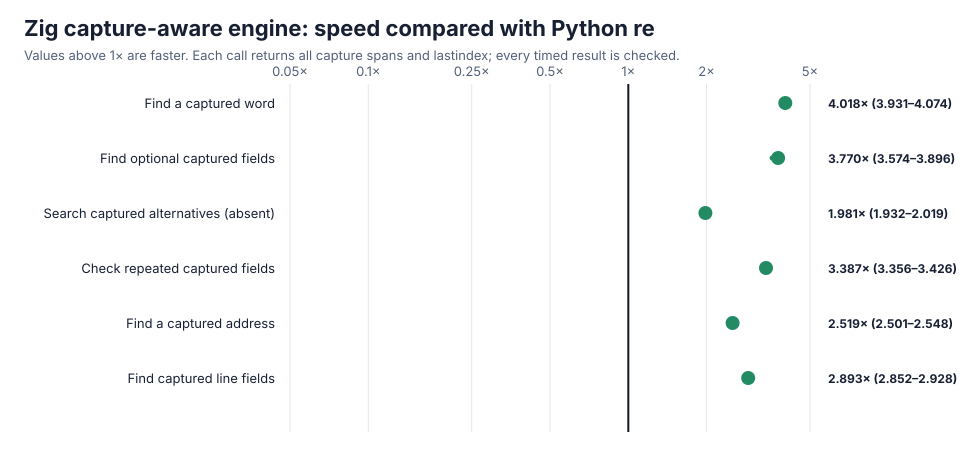

# Zig captures and word-boundary result

The independent Zig bytecode engine now implements numbered capturing groups, nested/repeated/optional captures, correct backtracking restoration, `lastindex`, and ASCII word/non-word boundaries. Capture state uses a compact undo log instead of copying every group at each branch. Both the matcher and its CPython bridge are implemented locally; no external regex package is involved.

On six fixed tasks that return **every capture span and `lastindex`**, Zig is **3.008×** as fast as CPython `re` overall and clearly faster on **6/6**. This measures equivalent result extraction on each side, not just a successful boolean match.



| Task | Zig speed relative to Python `re` | Measured range |
| --- | ---: | ---: |
| Find a captured word | **4.018×** | 3.931–4.074× |
| Find optional captured fields | **3.770×** | 3.574–3.896× |
| Search captured alternatives (absent) | **1.981×** | 1.932–2.019× |
| Check repeated captured fields | **3.387×** | 3.356–3.426× |
| Find a captured address | **2.519×** | 2.501–2.548× |
| Find captured line fields | **2.893×** | 2.852–2.928× |
| **Overall** | **3.008×** | — |

The new capture suite passes **3,660/3,660** seeded comparisons (1,220 patterns/inputs × search/match/fullmatch), seed `20260728`, checking full span tuples, absent groups, nested/repeated/optional groups, alternatives, byte inputs, windows, flags, boundaries, and exact `lastindex`. The expanded span suite also passes **8,820/8,820** comparisons. Optimized and Zig safety-checked builds with an AddressSanitizer/UndefinedBehaviorSanitizer bridge pass both suites; forbidden-engine markers are zero.

The complete paired result uses 13 alternating trials and 8,000 operations per trial. Raw rows and confidence ranges are [zig-capture.json](zig-capture.json), SHA-256 `55fe5e0c3ad94b2b71ab4aa2ff8ed06a053c082fe78de991afdeb1c9c8750316`; chart SHA-256 is `b0a71c793e8e21aaa9748039f2e85dd94a667d49a13c649ac4086e1d1a993fc4`.

Zig is still **not correctness-qualified as a replacement**. Named groups, Unicode semantics, references/conditionals/lookarounds, atomic/possessive behavior, large/nullable repeats, exact errors, iteration/replacement/splitting, and the complete public object surface remain to be built independently. The result shows that retaining captures need not erase the bytecode/native-boundary advantage.

Reproduce:

```sh
PY=/tmp/rebar-cpython/cpython-3.14.6-linux-x86_64-gnu/bin/python3.14
PYTHON="$PY" sh tools/build_zig_probe.sh
PYTHONPATH=. "$PY" tools/zig_probe.py --output /tmp/zig-span-check.json --verify-only
PYTHONPATH=. "$PY" tools/zig_capture_probe.py --output /tmp/zig-capture.json --chart /tmp/zig-capture.svg --trials 13 --operations 8000
```
