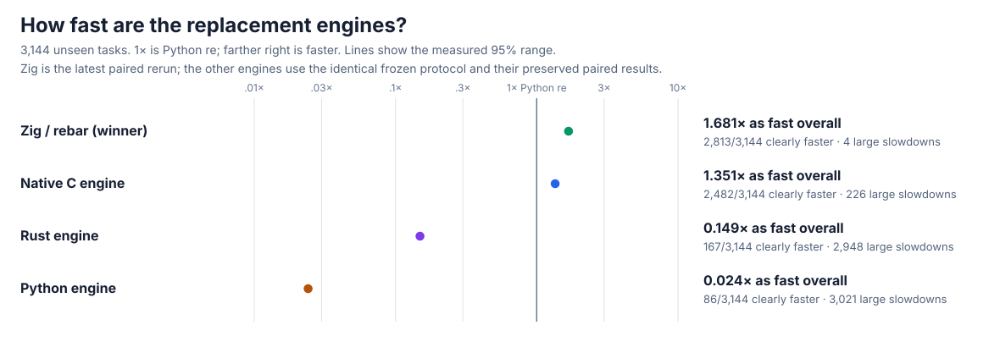
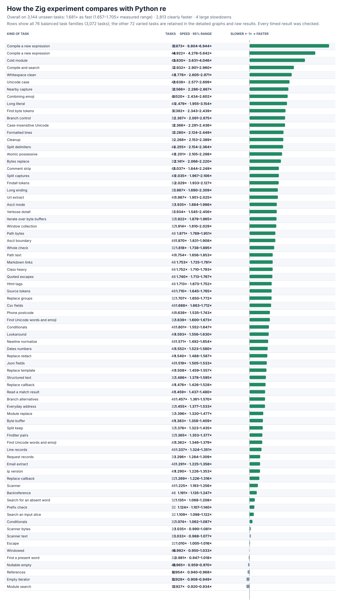
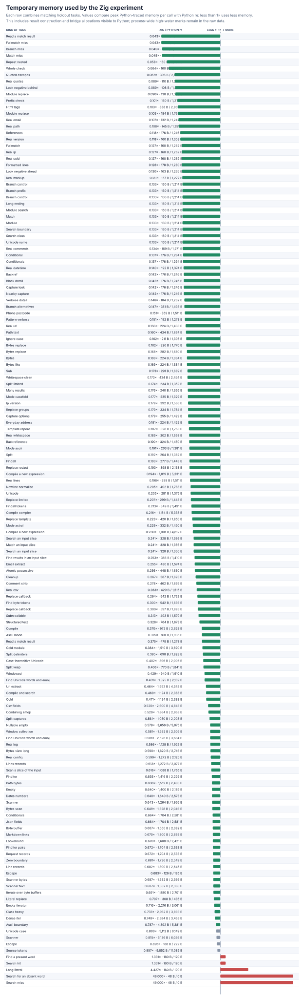
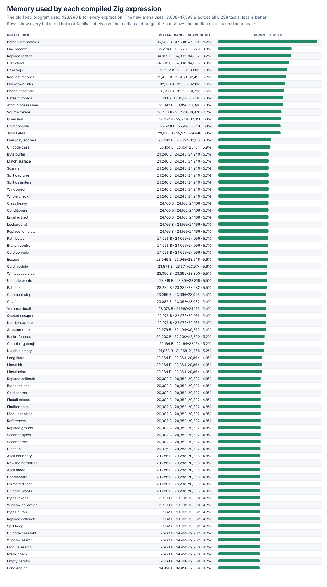
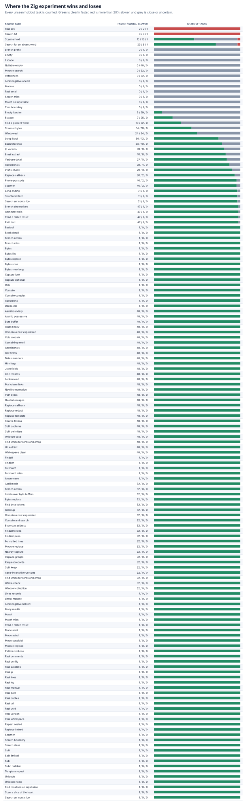

# Zig alternative and delimiter follow-up

The independent Zig engine now reaches **1.681×** the speed of Python `re` on the **3,144-task** expanded holdout (95% range **1.657–1.705×**), is clearly faster on **2,813/3,144 (89.5%)**, and has **4** large slowdowns. The previous complete result was **1.539×**, 2,635 clearly faster, with 93 large slowdowns. The new result is a further **1.092×** improvement on the same frozen tasks.

Every final timing row, check, interval, memory measurement, pilot, rejection, and remaining loss is preserved. No external regular-expression engine or package is used.



## What changed

Three measured matcher costs are removed without weakening behavior:

- **Choose alternatives using their possible first characters.** The Zig compiler builds a conservative 32-bit start mask for safe literals, positive character sets/ranges, sequences, groups, repeats, nested alternatives, scoped flags, and ASCII case-folding. It includes Python's four special Unicode folds for ASCII `I`, `S`, and `K`. A dedicated instruction can take either branch immediately when the next character rules the other out; overlapping or uncertain starts use ordinary backtracking. Wider masks and one-sided dispatch were measured and rejected.
- **Skip repeated failed starts inside a leading run.** For capture-producing searches without references, a safe leading, unbounded, one-character run—or an ASCII head set proven to be a subset of the following run—cannot begin a new match in its own interior. Zig skips those starts while preserving the earliest possible result. References and unsafe sets stay on the general path.
- **Jump lazy multi-line runs to the next literal delimiter.** A lazy, one-character DOTALL run immediately followed by case-sensitive literal text can safely jump to the next occurrence of its first delimiter character. Captures, limits, and later suffix failures still backtrack correctly. This removes a suffix attempt at every character without adding work to ordinary repeats. A more complicated backreference jump and a full-delimiter scan were correctness-clean but slower overall and are rejected.

These are parser/compiler/executor changes implemented in [mini_regex.zig](../zig/mini_regex.zig), not wrappers or special answers. The new [focused differential probe](../../tools/zig_dispatch_probe.py) exercises alternatives, sets/ranges, Unicode folds, leading captures, lazy delimiters, text/bytes/buffers, windows, metadata, search/match/fullmatch, collection, splitting, replacement, and scanners with stable seed `2026080101`.

## Final performance

The frozen fixture remains SHA-256 `67a4d07ee260bc58456290d76e040b78ba769d1b63cd3b21f0879daa063c2f92`. The full run uses all **6,288** practice/holdout tasks, 13 paired trials, 2,000 bootstrap samples, and **163,488** raw rows. All **176,064** before/after correctness checks pass.

| Task set | Overall speed | 95% range | Clearly faster | Large slowdowns |
| --- | ---: | ---: | ---: | ---: |
| Practice (3,144) | 1.661× | 1.638–1.686× | 2,900 | 24 |
| Holdout (3,144) | **1.681×** | **1.657–1.705×** | **2,813** | **4** |
| All (6,288) | 1.671× | 1.654–1.687× | 5,713 | 28 |

The targeted holdout improvements are clear:

| Kind of task | Previous | Current | Clearly faster | Large slowdowns |
| --- | ---: | ---: | ---: | ---: |
| Search absent alternatives | 0.473× | **1.476×** | 1/1 | 0 |
| Generated alternatives | 0.860× | **1.457×** | 47/48 | 0 |
| Generated match details | 0.662× | **1.459×** | 47/48 | 0 |
| Multi-line block | 0.815× | **2.542×** | 1/1 | 0 |
| Verbose/multi-line patterns | 0.755× | **1.934×** | 27/32 | 0 |
| Structured text | 1.326× | **1.486×** | 31/32 | 0 |
| Source tokens | 1.368× | **1.710×** | 48/48 | 0 |
| Comment removal | 1.703× | **2.037×** | 47/48 | 0 |



The separate successful-match control passes all **192** correctness checks and reaches **1.063×** on its 48 unseen hits (1.053–1.074×), clearly faster on 40, with zero large slowdowns. Its **1,248** raw rows and summary are [here](zig-dispatch-match-hit-summary.json). The capture-returning core passes **5,214** checks and reaches **3.645×** overall across eight paired tasks; absent alternatives improve to **1.579×**, and every task is faster. The complete result is [zig-dispatch-capture-perf.json](zig-dispatch-capture-perf.json).

Temporary memory is at or below Python `re` on **3,014/3,144** unseen tasks; medians are **864 B** for Zig and **2,046 B** for stdlib. Compiled programs use **18,608–47,588 B**, median **23,316 B**, across all 6,288 tasks.







The four holdout tasks below 0.8× are one very short successful literal search, one quoted-field CSV lookahead, one short text-scanner case, and one absent literal. Their exact intervals, median times, and workload-specific causes are in [every large slowdown](zig-dispatch-regressions.md). No result is hidden or reclassified.

## Correctness and safety

The release build passes **8,244/8,244** expanded cases, **35,840/35,840** unseen correctness cases, **6,288/6,288** expanded performance tasks, all **144/144** runnable official CPython methods, **109,848/109,848** established focused checks, **190/190** public-surface comparisons, and **163,960/163,960** new dispatch comparisons. The new probe's stdlib-vs-stdlib control passes **82,040/82,040** checks. There are zero unexplained mismatches, crashes, or timeouts.

Zig Debug plus AddressSanitizer/UndefinedBehaviorSanitizer passes the frozen 8,244 and 6,288 suites, public surface, **8,710** established focused checks, and another **82,040** dispatch checks. Both production-source audits report zero forbidden markers or blocked calls. The initial delimiter experiment correctly caught **82** frozen-task failures: the compiler accidentally copied the following instruction's unused `left` field instead of its literal `value`. The reproducible [finding](zig-dispatch-lazydot-finding.json.gz) and the restored passing gates are preserved.

## Pilots and rejected designs

Each pilot uses all **6,288** tasks, five paired trials, **62,880** rows, and **75,456** correctness checks. The complete raw rows and summaries are in [zig-dispatch-pilots.tar.gz](zig-dispatch-pilots.tar.gz). Short pilots vary; the 13-trial final run above is the headline result.

| Experiment | Holdout speed | 95% range | Clearly faster | Large slowdowns |
| --- | ---: | ---: | ---: | ---: |
| One-sided 32-bit start mask | 1.575× | 1.551–1.598× | 2,660 | 93 |
| One-sided 64-bit mask — rejected | 1.554× | 1.530–1.576× | 2,671 | 93 |
| Two-sided start mask | 1.579× | 1.555–1.602× | 2,650 | 88 |
| All leading runs — rejected | 1.568× | 1.545–1.590× | 2,644 | 48 |
| Capture-only leading runs | 1.577× | 1.554–1.599× | 2,674 | 45 |
| Positive-set start masks | 1.605× | 1.582–1.627× | 2,704 | 39 |
| Unicode-safe ASCII folds | 1.614× | 1.592–1.636× | 2,709 | 37 |
| Safe set-head/run filter | 1.609× | 1.586–1.632× | 2,730 | 32 |
| Lazy delimiter jump | 1.722× | 1.696–1.747× | 2,805 | 24 |
| Lazy backreference jump — rejected | 1.607× | 1.584–1.627× | 2,736 | 23 |
| Full-delimiter scan — rejected | 1.601× | 1.578–1.623× | 2,713 | 35 |
| Simple delimiter confirmation | 1.603× | 1.580–1.624× | 2,729 | 34 |

The final raw timing rows are [zig-dispatch-v5-raw.jsonl.gz](zig-dispatch-v5-raw.jsonl.gz) (uncompressed SHA-256 `645db5b1762cd68ac1773da55732d891a5402e8f3aaf9ac77c7622c7f85be547`), with the complete [summary](zig-dispatch-v5-summary.json), [compiled-memory rows](zig-dispatch-program-memory.json.gz), and successful-match [raw rows](zig-dispatch-match-hit-raw.jsonl.gz). Correctness, safety, audit, and finding results are the `zig-dispatch-*` files in this directory.

Reproduce with:

```sh
PY=/tmp/rebar-cpython/cpython-3.14.6-linux-x86_64-gnu/bin/python3.14
PYTHON="$PY" sh tools/build_zig_probe.sh
PYTHONPATH=. "$PY" tools/oracle_v3.py verify --module rebar --cohort holdout --output /tmp/zig-correctness.json
PYTHONPATH=. "$PY" tools/cpython_re_oracle.py verify --module rebar --output /tmp/zig-official.json
PYTHONPATH=. "$PY" tools/zig_dispatch_probe.py --module rebar --seeded-cases 16384 --output /tmp/zig-dispatch.json
PYTHONPATH=. "$PY" tools/perf_v5.py verify --module rebar --output /tmp/zig-performance-check.json
PYTHONPATH=. "$PY" tools/zig_perf_v5_pilot.py --raw /tmp/zig-performance.jsonl --output /tmp/zig-performance.json --chart /tmp/zig-speed.svg --memory-chart /tmp/zig-memory.svg --regression-chart /tmp/zig-regressions.svg --trials 13 --bootstraps 2000
PYTHONPATH=. "$PY" tools/zig_regressions_report.py --summary /tmp/zig-performance.json --output /tmp/zig-losses.md
```
