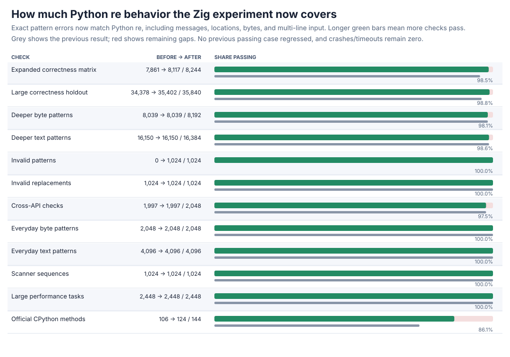
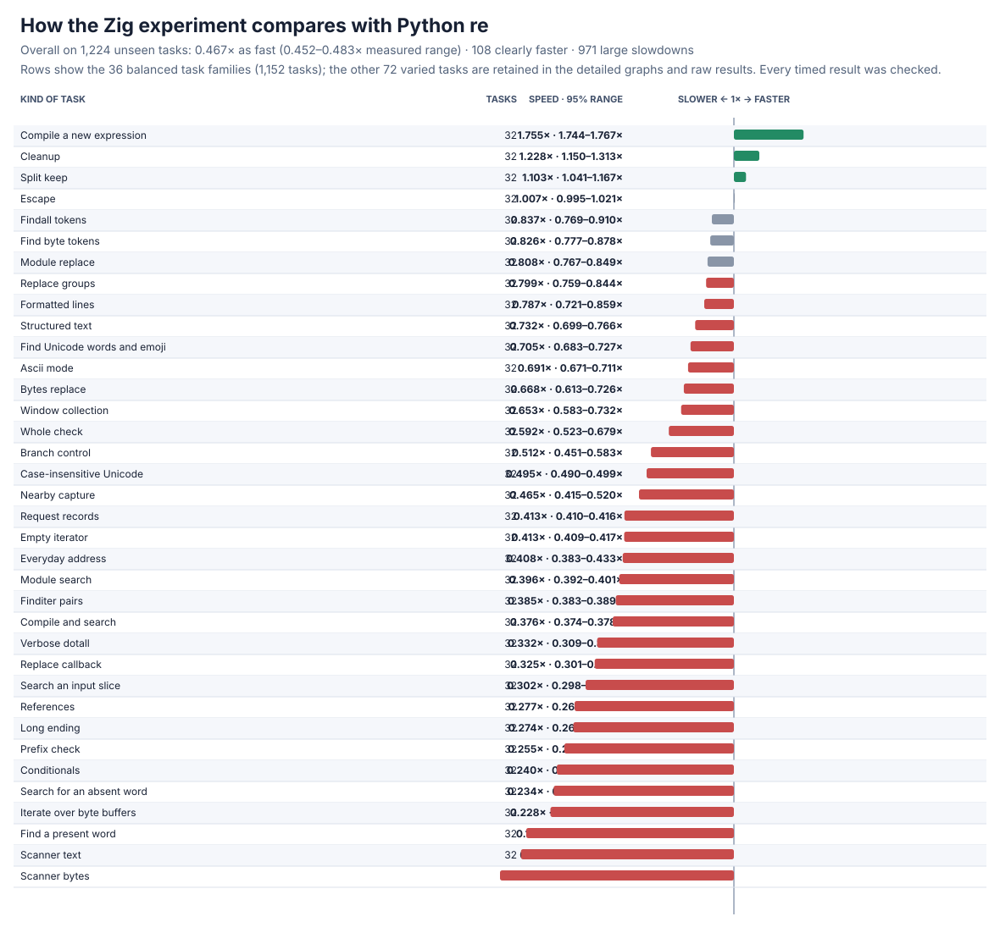
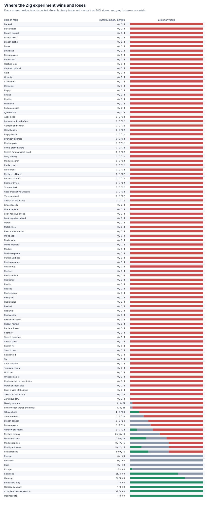

# Zig pattern-error compatibility follow-up

The from-scratch Zig candidate now reports Python-compatible invalid-pattern errors, including the error type, message, offending expression, character position, line, column, and displayed text. This closes every frozen invalid-pattern case without changing any previously passing result. The implementation remains independent: production matching and compilation use the local Zig engine, and the small Python-side validator imports no regex package.





## Headline result

| Frozen check | Before | After | New failures |
| --- | ---: | ---: | ---: |
| Expanded correctness matrix | 7,861/8,244 | **8,117/8,244** | 0 |
| Large correctness holdout | 34,378/35,840 | **35,402/35,840** | 0 |
| Large performance tasks | 2,448/2,448 | **2,448/2,448** | 0 |
| Official CPython methods | 106/144 | **124/144** | 0 |

The feature fixes **256** expanded-matrix and **1,024** large-holdout cases. Every invalid pattern and replacement now passes; deeper text remains **16,150/16,384**, deeper bytes **8,039/8,192**, and cross-API properties **1,997/2,048**. The **438** remaining holdout failures are valid, deeper expressions that exhaust bounded executor storage. Three remaining expanded cases use a previously defined capture inside fixed-width lookbehind.

The final paired performance run covers **1,224 practice + 1,224 unseen holdout tasks**, the frozen operation counts, 13 trials, memory, and **63,648** raw timing rows. Every result is checked before and after timing.

| Task set | Overall speed vs Python `re` | Clearly faster | Large slowdowns |
| --- | ---: | ---: | ---: |
| Practice | 0.440x (0.425--0.456x) | 101/1,224 | 982/1,224 |
| Holdout | **0.467x (0.452--0.483x)** | **108/1,224** | **971/1,224** |
| All | 0.453x (0.442--0.464x) | 209/2,448 | 1,953/2,448 |

Overall speed and memory are effectively unchanged from the preceding scoped-flags run. The slowest family remains byte scanning (roughly 0.12--0.19x); short searches, result construction, and general backtracking remain the main costs. All losses and their confidence ranges are retained.

## Error control and design

The new differential probe passes **34,682/34,682** checks: **1,272** frozen invalid patterns, **596** official/historical/repeat text/bytes edge cases, **32,768** seeded mutations with prefixes, suffixes, and newlines, plus **46** valid controls. It checks malformed escapes and sets, ranges, groups and names, references and conditionals, repeats, lookbehind width, local/global flags, bytes restrictions, and exact multi-line formatting. The existing full-plane Unicode, scoped-flag, span, and capture controls pass **8,781**, **16,552**, **8,874**, and **5,214** checks respectively. Debug plus address/undefined-behavior runs pass **10,106** error, **4,264** scoped, **1,437** Unicode, and every focused span/capture check with zero findings; official methods have zero crashes/timeouts.

The validator is a single independent syntax walk used to reconstruct CPython-compatible errors. The Zig parser now directly rejects unknown escapes, repeated assertions/multiple repeats, and open or malformed references; ordinary compilation uses only an allocation-light screen for the remaining misplaced-global/conflicting-mode edges. Detailed validation runs only for those forms or when Zig rejects an expression. This keeps common compilation in the native parser, avoids allocating validator state on ordinary successful compilation, and preserves exact errors.

An eager-validation experiment was correctness-clean but measurably slower: the 32-task holdout compilation family fell **1.792x -> 1.367x** and the complex compile case **1.933x -> 1.481x**. Five correctness-gated five-trial pilots and an intermediate full run guided the smaller screen and native rejection path; the final full run restores those results to **1.755x** and **1.888x**. The three **63,648-row** runs, all five **24,480-row** pilots, summaries, and all regressions are retained.

## Detailed graphs




All legacy and generated task families appear in the detailed graphs. Process high-water marks, every confidence range, and every regression remain in the raw data; denominators are unchanged.

## Evidence and reproduction

Final rows are [zig-errors-v4-raw.jsonl.gz](zig-errors-v4-raw.jsonl.gz), with the complete summary in [zig-errors-v4-summary.json](zig-errors-v4-summary.json). The rejected eager run is [rows](zig-errors-eager-v4-raw.jsonl.gz) and [summary](zig-errors-eager-v4-summary.json); the intermediate lazy run is [rows](zig-errors-lazy-v4-raw.jsonl.gz) and [summary](zig-errors-lazy-v4-summary.json). The five pilots are [first rows](zig-errors-lazy-pilot1-raw.jsonl.gz), [first summary](zig-errors-lazy-pilot1-summary.json), [second rows](zig-errors-lazy-pilot2-raw.jsonl.gz), [second summary](zig-errors-lazy-pilot2-summary.json), [third rows](zig-errors-lazy-pilot3-raw.jsonl.gz), [third summary](zig-errors-lazy-pilot3-summary.json), [fourth rows](zig-errors-lazy-pilot4-raw.jsonl.gz), [fourth summary](zig-errors-lazy-pilot4-summary.json), [native rows](zig-errors-native-pilot-raw.jsonl.gz), and [native summary](zig-errors-native-pilot-summary.json).

Correctness after results are [expanded](zig-errors-v2-after.json.gz), [large holdout](zig-errors-v3-after.json.gz), [performance qualification](zig-errors-perf-v4-after.json), and [official](zig-errors-upstream-after.json). Focused/safety evidence is [errors](zig-errors-focused.json), [scoped](zig-errors-flags.json), [Unicode](zig-errors-unicode.json), [span](zig-errors-span.json), [capture](zig-errors-capture.json), [instrumented errors](zig-errors-sanitized-patterns.json), [instrumented scoped](zig-errors-sanitized-flags.json), [instrumented Unicode](zig-errors-sanitized-unicode.json), [instrumented span](zig-errors-sanitized-span.json), and [instrumented capture](zig-errors-sanitized-capture.json).

Reproduce with:

```sh
PY=/tmp/rebar-cpython/cpython-3.14.6-linux-x86_64-gnu/bin/python3.14
PYTHON="$PY" sh tools/build_zig_probe.sh
PYTHONPATH=. "$PY" tools/zig_pattern_errors_probe.py --output /tmp/zig-errors.json --seeded-cases 32768
PYTHONPATH=. "$PY" tools/perf_v4.py verify --module candidates.zig_candidate --output /tmp/zig-performance-check.json
PYTHONPATH=. "$PY" tools/zig_perf_v4_pilot.py --raw /tmp/zig-performance.jsonl --output /tmp/zig-performance.json --chart /tmp/zig-speed.svg --memory-chart /tmp/zig-memory.svg --regression-chart /tmp/zig-regressions.svg --trials 13 --bootstraps 5000
```

The new probe is [tools/zig_pattern_errors_probe.py](../../tools/zig_pattern_errors_probe.py). Static/import and linkage audits report zero forbidden markers or blocked attempts; the production libraries link only the local Zig engine and the C runtime.
