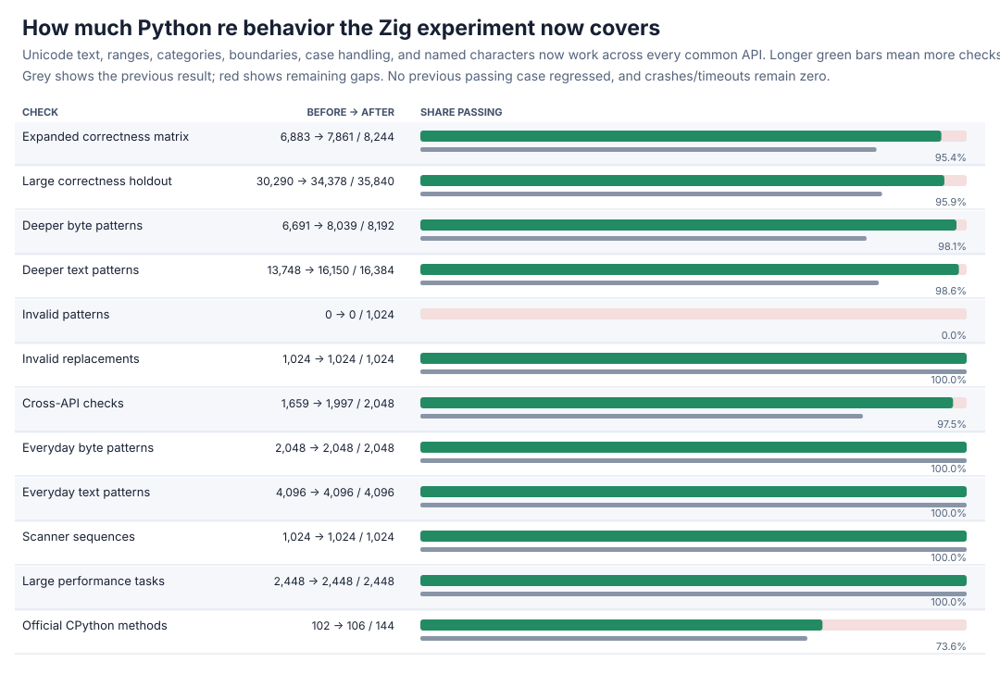
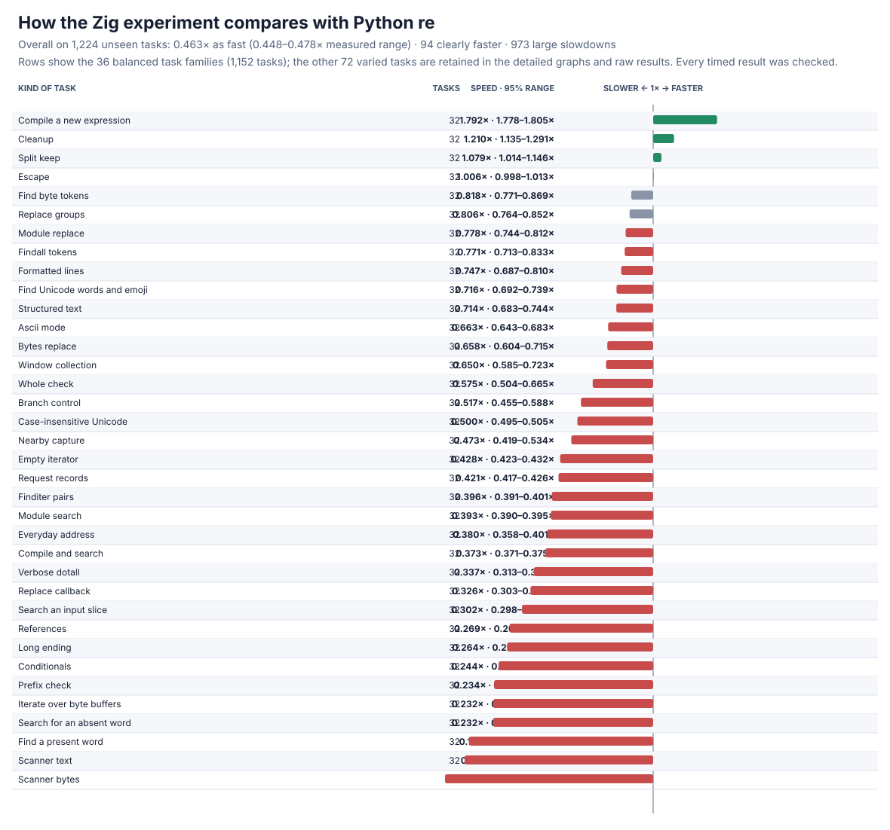
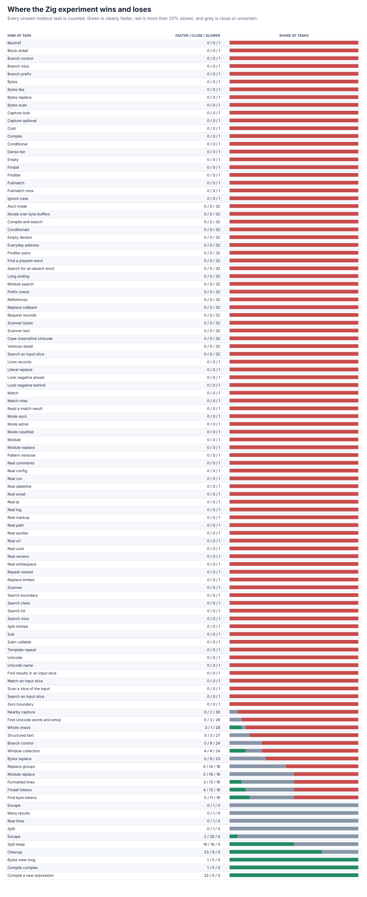

# Zig scoped-flags follow-up

The from-scratch Zig parser/compiler/executor now supports local flag scopes such as `(?i:...)`, `(?-i:...)`, `(?s:...)`, `(?m:...)`, `(?x:...)`, `(?a:...)`, and `(?u:...)`, including nesting, captures, references, bytes, and verbose comments. This closes nearly every remaining unsupported valid pattern in the frozen suites without changing previous passing results.





## Headline result

| Frozen check | Before | After | New failures |
| --- | ---: | ---: | ---: |
| Expanded correctness matrix | 6,883/8,244 | **7,861/8,244** | 0 |
| Large correctness holdout | 30,290/35,840 | **34,378/35,840** | 0 |
| Large performance tasks | 2,448/2,448 | **2,448/2,448** | 0 |
| Official CPython methods | 102/144 | **106/144** | 0 |

The feature fixes **978** expanded-matrix and **4,088** large-holdout cases. Deeper text now passes **16,150/16,384**, deeper bytes **8,039/8,192**, and cross-API properties **1,997/2,048**; every everyday text/byte case, scanner sequence, and invalid replacement still passes. The only three still-unsupported valid expanded cases are references inside fixed-width lookbehind. Invalid-pattern error compatibility remains **0/1,024**, and the other remaining valid failures are bounded-executor/resource cases.

The full paired performance rerun covers **1,224 practice + 1,224 unseen holdout tasks**, all frozen operation counts, 13 trials, memory, and **63,648** raw timing rows. Every result is checked before and after timing.

| Task set | Overall speed vs Python `re` | Clearly faster | Large slowdowns |
| --- | ---: | ---: | ---: |
| Practice | 0.439x (0.423--0.454x) | 87/1,224 | 982/1,224 |
| Holdout | **0.463x (0.448--0.478x)** | **94/1,224** | **973/1,224** |
| All | 0.450x (0.440--0.461x) | 181/2,448 | 1,955/2,448 |

Overall holdout speed is unchanged from the previous 0.463x run. Family movement is small and mixed: case-insensitive Unicode, window searches, and grouped replacement improve about 4--6%, while byte/text token collection falls about 5--6%. All losses and memory observations are retained. The capture-returning core remains **2.15x** overall on eight tasks, with seven clearly faster and alternative search the sole loss.

## Correctness control

The focused differential probe checks valid scopes across search, match, fullmatch, findall, finditer, split, replacement, scanner, public metadata, text/bytes, captures/backreferences, Unicode/ASCII mode changes, nested scopes, and every useful flag combination. It passes **16,552/16,552** comparisons from 21 fixed examples and 16,384 deterministic seeded cases. The existing full-plane Unicode, span, and capture/reference controls pass **8,781/8,781**, **8,874/8,874**, and **5,214/5,214**. Debug plus address/undefined-behavior checks pass **4,264** scoped, **1,437** Unicode, and all focused span/capture checks with zero findings. Official methods have zero crashes/timeouts.

The probe exposed an important CPython compatibility edge. With a Unicode outer pattern, `(?a:\\W)` can match a non-ASCII character at the current position, but CPython's search-prefix filter can skip that same character during `search`/`findall`; the inverse occurs for an ASCII outer pattern and `(?u:\\w)`. Zig now reproduces that observable behavior exactly. The special prefix decision is identified once during compilation and stored in the program, so ordinary matching does not repeatedly walk the syntax tree.

## Design

Scopes are represented in the independently written syntax tree and compiled into the existing bytecode. Character-sensitive instructions carry their effective local mode in an otherwise unused compact field; literals, classes, dots, anchors, boundaries, and references therefore use the correct flags without a runtime push/pop or extra allocation. Verbose whitespace/comments are parsed under the active local mode, which is restored after each nested group. Start and pair filters use the same local modes as execution, except for the explicitly measured CPython search-prefix edge above.

The program allocation remains **415,000 B**; scoped flags add no new fixed allocation. The remaining executor failures are primarily nullable/nested repeats that exhaust its fixed backtracking/undo limits. Exact errors and positions, large repeats, long patterns/classes, and iterative/growing executor storage remain separate compatibility targets.

## Detailed graphs




All legacy and generated task families appear in the detailed graphs. Process high-water marks, every confidence range, and all regressions remain in the raw data; denominators are unchanged.

## Evidence and reproduction

Performance rows are [zig-flags-v4-raw.jsonl.gz](zig-flags-v4-raw.jsonl.gz), with the complete summary in [zig-flags-v4-summary.json](zig-flags-v4-summary.json). Correctness after results are [expanded](zig-flags-v2-after.json.gz), [large holdout](zig-flags-v3-after.json.gz), [performance qualification](zig-flags-perf-v4-after.json), and [official](zig-flags-upstream-after.json); the corresponding before results remain in the [Unicode follow-up](ZIG-UNICODE.md). Focused/safety evidence is [scoped](zig-flags-focused.json), [Unicode](zig-flags-unicode.json), [span](zig-flags-span.json), [capture](zig-flags-capture.json), [instrumented scoped](zig-flags-sanitized.json), [instrumented Unicode](zig-flags-sanitized-unicode.json), [instrumented span](zig-flags-sanitized-span.json), and [instrumented capture](zig-flags-sanitized-capture.json).

Reproduce with:

```sh
PY=/tmp/rebar-cpython/cpython-3.14.6-linux-x86_64-gnu/bin/python3.14
PYTHON="$PY" sh tools/build_zig_probe.sh
PYTHONPATH=. "$PY" tools/zig_flags_probe.py --output /tmp/zig-flags.json --seeded-cases 16384
PYTHONPATH=. "$PY" tools/perf_v4.py verify --module candidates.zig_candidate --output /tmp/zig-performance-check.json
PYTHONPATH=. "$PY" tools/zig_perf_v4_pilot.py --raw /tmp/zig-performance.jsonl --output /tmp/zig-performance.json --chart /tmp/zig-speed.svg --memory-chart /tmp/zig-memory.svg --regression-chart /tmp/zig-regressions.svg --trials 13 --bootstraps 5000
```

The new probe is [tools/zig_flags_probe.py](../../tools/zig_flags_probe.py). Static/import and linkage audits report zero forbidden markers or blocked attempts; the production libraries link only the local Zig engine and the C runtime.
