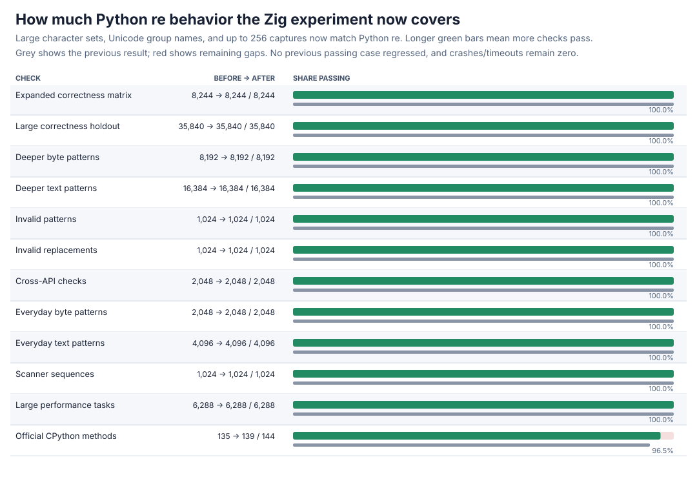
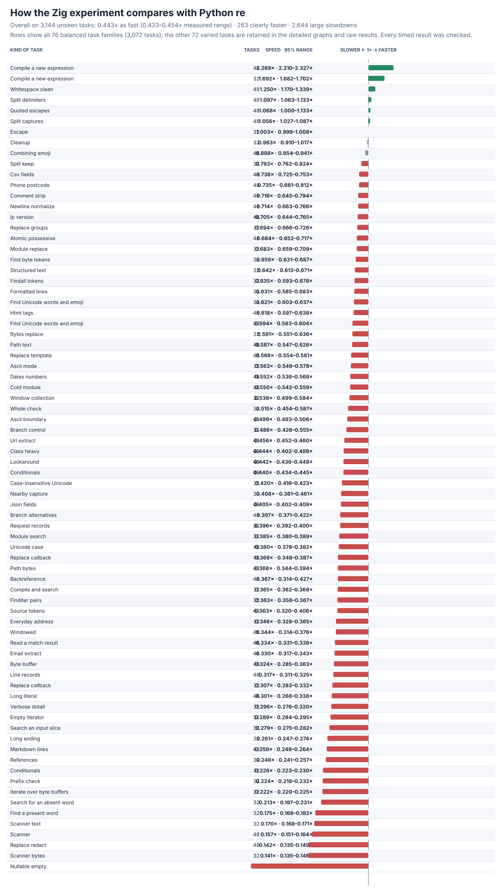
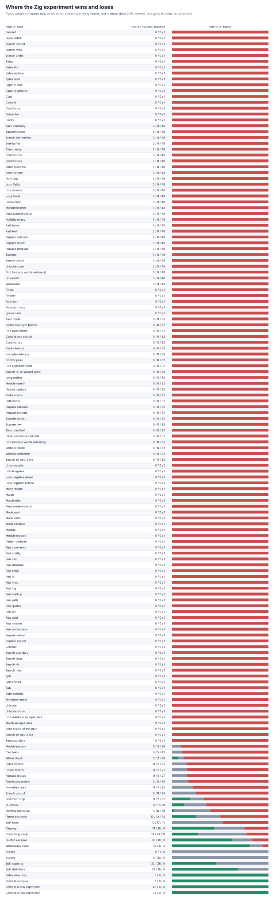

# Zig large sets and capture groups

The from-scratch Zig engine now accepts large Unicode character sets, Unicode group names, and up to 256 captures across every common API. It passes every frozen correctness and expanded performance case, removes four more official CPython failures, and keeps the complete expanded timing result and all losses visible.





## Headline result

| Check | Before | After | New failures |
| --- | ---: | ---: | ---: |
| Expanded correctness matrix | 8,244/8,244 | **8,244/8,244** | 0 |
| Large correctness holdout | 35,840/35,840 | **35,840/35,840** | 0 |
| Expanded performance tasks | 6,288/6,288 | **6,288/6,288** | 0 |
| Official CPython methods | 135/144 | **139/144** | 0 |

The four newly passing official methods are `test_bigcharset`, `test_re_groupref_exists`, `test_symbolic_groups`, and `test_symbolic_refs`. The remaining five are valid very-large-pattern or repeat cases: `test_long_pattern`, `test_big_codesize`, `test_bug_2537`, `test_look_behind_overflow`, and `test_repeat_minmax_overflow`. There are zero crashes and timeouts.

The full paired rerun covers **3,144 practice + 3,144 unseen holdout tasks**, frozen operation counts, 13 trials, memory, and **163,488** raw rows. Every result is checked before and after timing.

| Task set | Speed vs Python `re` | Clearly faster | Large slowdowns |
| --- | ---: | ---: | ---: |
| Practice | 0.430× (0.420–0.441×) | 260/3,144 | 2,645/3,144 |
| Holdout | **0.443× (0.433–0.454×)** | **263/3,144** | **2,644/3,144** |
| All | 0.437× (0.429–0.445×) | 523/6,288 | 5,289/6,288 |

Fresh compilation is the clearest win (**2.27×** on the new cases and **1.69×** on the preserved cases). Whitespace cleanup (**1.25×**) and delimiter/capture splitting (**1.06–1.10×**) also win. The largest losses are empty/nullable matching (**0.021×**), byte/text scanners (**0.14–0.17×**), redaction (**0.14×**), short literal searches (**0.18–0.21×**), references (**0.25–0.37×**), and result-heavy collection. These are general boundary/executor costs, not omitted cases. A separate native capture-returning check reaches **1.88×** overall on eight tasks, with seven faster and alternative search the sole loss (**0.44×**).

## Correctness control and design

The new differential probe contains 39 fixed patterns across eight APIs, 449 exhaustive set-membership checks, and 8,192 seeded cases. It initially records **6,164** failures in **8,953** comparisons. Packing character ranges and widening captures reduces that to 471; the remaining failures expose an incorrect search-prefix assumption for backreferences and the native bridge's old 128-group return limit. The final engine passes **8,953/8,953**. Existing syntax, nullable/long-repeat, lookbehind, error, scoped-flag, full-plane Unicode, span, and capture controls bring the focused total to **101,573/101,573**; Debug plus address/undefined-behavior checks pass **53,269/53,269** with zero findings.

Character ranges now live in one packed, contiguous program arena instead of reserving 64 wide ranges for each set. Each set stores a start and count, allowing **8,192** shared ranges and large positive/negative sets while keeping the fixed program allocation at **423,960 B** (previously 415,000 B). Capture storage and the direct C bridge now support 256 groups without a per-call heap allocation. Text group names are decoded as UTF-8; invalid identifiers still receive CPython's exact error. Backreferences can consume unknown text, so the start filter now treats them conservatively instead of skipping valid search positions. All parsing, compilation, matching, and collection remain in-repo; neither Python's matcher nor an external regex package performs production work.

## Detailed graphs




All 76 balanced families and 72 varied legacy tasks appear in the detailed graphs. Process high-water marks, every measured range, and every regression remain in the raw data; denominators are unchanged.

## Evidence and reproduction

Performance rows are [zig-groups-v5-raw.jsonl.gz](zig-groups-v5-raw.jsonl.gz), with the full summary in [zig-groups-v5-summary.json](zig-groups-v5-summary.json) and the direct capture result in [zig-groups-capture-perf.json](zig-groups-capture-perf.json). Correctness results are [expanded](zig-groups-v2-after.json.gz), [large holdout](zig-groups-v3-after.json.gz), [performance qualification](zig-groups-perf-v5-after.json), and [official](zig-groups-upstream-after.json). Initial/intermediate failures are [initial](zig-groups-focused-before.json.gz) and [intermediate](zig-groups-focused-intermediate.json.gz); final focused and safety evidence is linked by the `zig-groups-*` files in this directory, including both zero-delegation audits.

Reproduce with:

```sh
PY=/tmp/rebar-cpython/cpython-3.14.6-linux-x86_64-gnu/bin/python3.14
PYTHON="$PY" sh tools/build_zig_probe.sh
PYTHONPATH=. "$PY" tools/zig_groups_classes_probe.py --output /tmp/zig-groups.json --seeded-cases 8192
PYTHONPATH=. "$PY" tools/perf_v5.py verify --module candidates.zig_candidate --output /tmp/zig-performance-check.json
PYTHONPATH=. "$PY" tools/zig_perf_v5_pilot.py --raw /tmp/zig-performance.jsonl --output /tmp/zig-performance.json --chart /tmp/zig-speed.svg --memory-chart /tmp/zig-memory.svg --regression-chart /tmp/zig-regressions.svg --trials 13 --bootstraps 2000
```

The new differential probe is [tools/zig_groups_classes_probe.py](../../tools/zig_groups_classes_probe.py); the expanded paired runner and chart regenerator are [tools/zig_perf_v5_pilot.py](../../tools/zig_perf_v5_pilot.py) and [tools/zig_perf_v5_charts.py](../../tools/zig_perf_v5_charts.py). Static/import and linkage audits report zero forbidden markers or blocked attempts; production links only the local Zig engine and the C runtime.
