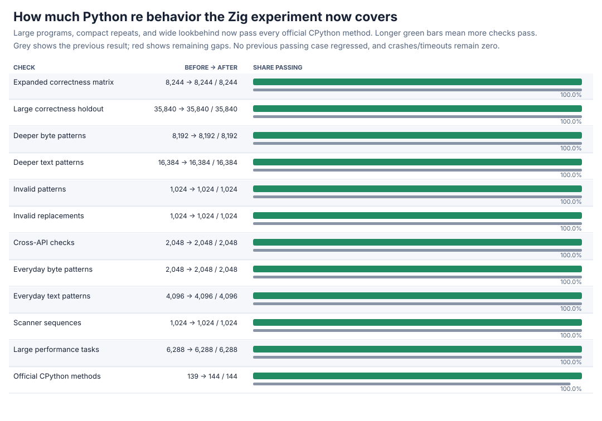
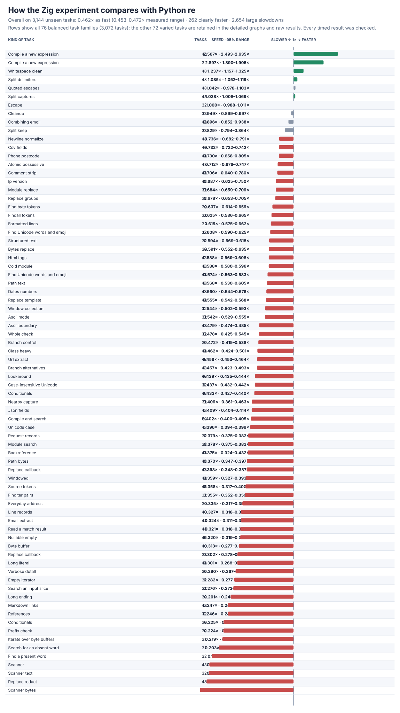
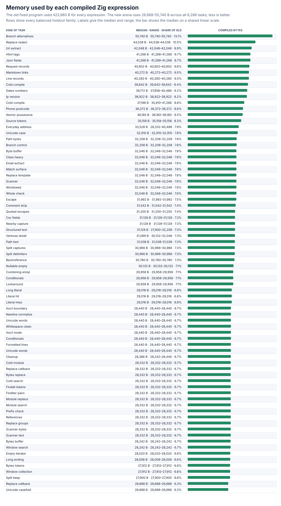
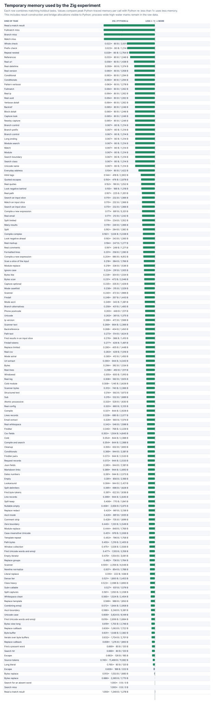
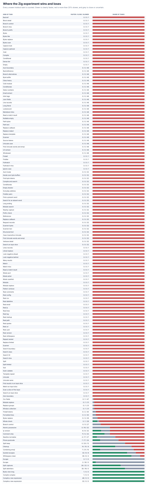

# Zig large programs, compact repeats, and full compatibility

The from-scratch Zig engine now passes every runnable official CPython `re` method. Growable arena-backed program storage, balanced syntax trees, a compact repeat instruction, wide lookbehind, and exact overflow handling remove the final five gaps while cutting compiled-program memory sharply. The complete expanded timing result and every remaining slowdown are retained.





## Headline result

| Check | Before | After | New failures |
| --- | ---: | ---: | ---: |
| Expanded correctness matrix | 8,244/8,244 | **8,244/8,244** | 0 |
| Large correctness holdout | 35,840/35,840 | **35,840/35,840** | 0 |
| Expanded performance tasks | 6,288/6,288 | **6,288/6,288** | 0 |
| Official CPython methods | 139/144 | **144/144** | 0 |

The five newly passing methods cover long expressions, 10,000 alternatives, empty nested submatches, 65,536+ repeats, 2,097,152-character lookbehind, and oversized-count errors. There are zero unexplained failures, crashes, release timeouts, sanitizer findings, or delegation findings.

The full paired rerun covers **3,144 practice + 3,144 unseen holdout tasks**, frozen operation counts, 13 trials, memory, and **163,488** raw rows. Every result is checked before and after timing.

| Task set | Speed vs Python `re` | Clearly faster | Large slowdowns |
| --- | ---: | ---: | ---: |
| Practice | 0.446× (0.436–0.456×) | 232/3,144 | 2,675/3,144 |
| Holdout | **0.462× (0.453–0.472×)** | **262/3,144** | **2,654/3,144** |
| All | 0.454× (0.448–0.461×) | 494/6,288 | 5,329/6,288 |

Holdout speed improves from **0.443× to 0.462×**. Empty/nullable work improves **15×** (0.021→0.320×), and fresh compilation improves to **2.57×** on the new cases and **1.90×** on preserved cases. Cleanup and splitting remain the other clear wins. The largest remaining losses are scanners (**0.14–0.17×**), redaction (**0.16×**), short literal searches (**0.17–0.20×**), references (**0.25×**), long scans, and result-heavy collection. Small regressions are retained: structured text and whole checks move about 7–8% slower, and the capture-returning core moves **1.88→1.76×** overall; alternative search remains its sole clear loss (**0.41×**).

## Correctness and allocation design

The new differential control contains 83 exact large-pattern/repeat/lookbehind cases and 8,192 seeded cases across every common API. It initially records **4,559** failures in **8,275** comparisons; the final engine passes **8,275/8,275**. Together with existing groups/classes, syntax, nullable/long-repeat, lookbehind, error, scoped-flag, full-plane Unicode, span, and capture controls, Zig now passes **109,848/109,848** focused checks. Debug plus address/undefined-behavior checks pass **54,376/54,376**, including all five official large methods.

The compiler no longer reserves a large fixed node/instruction/range array for each expression. Nodes, instructions, classes, ranges, compact runs, and capture layouts grow in one Zig arena and are released together. The program header falls **423,960→25,800 B**. Measuring all **6,288** frozen tasks shows real compiled memory of **26,688–55,740 B**, median **30,966 B** (about **7%** of the former fixed allocation). Long expressions and 10,000 alternatives can still grow safely when needed.



Sequences and alternatives now form balanced trees while preserving their original order, removing the Debug-build stack overflow found by the sanitizer. Large single-character and fixed-layout repeats compile to one compact instruction: it scans once, retries suffixes without storing one state per character, respects greedy/lazy/possessive behavior, and restores the final nested captures correctly. Small complex repeats still use the general backtracking path. Program counters and lookbehind widths are widened, and oversized counts now produce CPython's exact `OverflowError` or `looks too much behind` error. All parsing, compilation, matching, and collection remain in-repo; neither Python's matcher nor an external regex package performs production work.

## Detailed graphs





All 76 balanced families and 72 varied legacy tasks appear in the detailed graphs. Process high-water marks, every measured range, and every regression remain in the raw data; denominators are unchanged.

## Evidence and reproduction

Performance rows are [zig-large-v5-raw.jsonl.gz](zig-large-v5-raw.jsonl.gz), with the full summary in [zig-large-v5-summary.json](zig-large-v5-summary.json), real compiled-memory rows in [zig-large-program-memory.json.gz](zig-large-program-memory.json.gz), and the capture result in [zig-large-capture-perf.json](zig-large-capture-perf.json). Correctness results are [expanded](zig-large-v2-after.json.gz), [large holdout](zig-large-v3-after.json.gz), [performance qualification](zig-large-perf-v5-after.json), and [official](zig-large-upstream-after.json). Initial failures and the sanitizer finding are preserved in [initial differential results](zig-large-focused-before.json.gz) and [safety finding](zig-large-safety-finding.json); final focused/safety/audit results are the `zig-large-*` files in this directory.

Reproduce with:

```sh
PY=/tmp/rebar-cpython/cpython-3.14.6-linux-x86_64-gnu/bin/python3.14
PYTHON="$PY" sh tools/build_zig_probe.sh
PYTHONPATH=. "$PY" tools/zig_large_pattern_probe.py --output /tmp/zig-large.json --seeded-cases 8192 --case-timeout 1.5
PYTHONPATH=. "$PY" tools/cpython_re_oracle.py verify --module candidates.zig_candidate --output /tmp/zig-official.json
PYTHONPATH=. "$PY" tools/perf_v5.py verify --module candidates.zig_candidate --output /tmp/zig-performance-check.json
PYTHONPATH=. "$PY" tools/zig_program_memory_probe.py --output /tmp/zig-program-memory.json
PYTHONPATH=. "$PY" tools/zig_perf_v5_pilot.py --raw /tmp/zig-performance.jsonl --output /tmp/zig-performance.json --chart /tmp/zig-speed.svg --memory-chart /tmp/zig-memory.svg --regression-chart /tmp/zig-regressions.svg --trials 13 --bootstraps 2000
```

The new tools are [tools/zig_large_pattern_probe.py](../../tools/zig_large_pattern_probe.py), [tools/zig_program_memory_probe.py](../../tools/zig_program_memory_probe.py), and [tools/zig_program_memory_chart.py](../../tools/zig_program_memory_chart.py). Static/import and linkage audits report zero forbidden markers or blocked attempts; production links only the local Zig engine and the C runtime.
