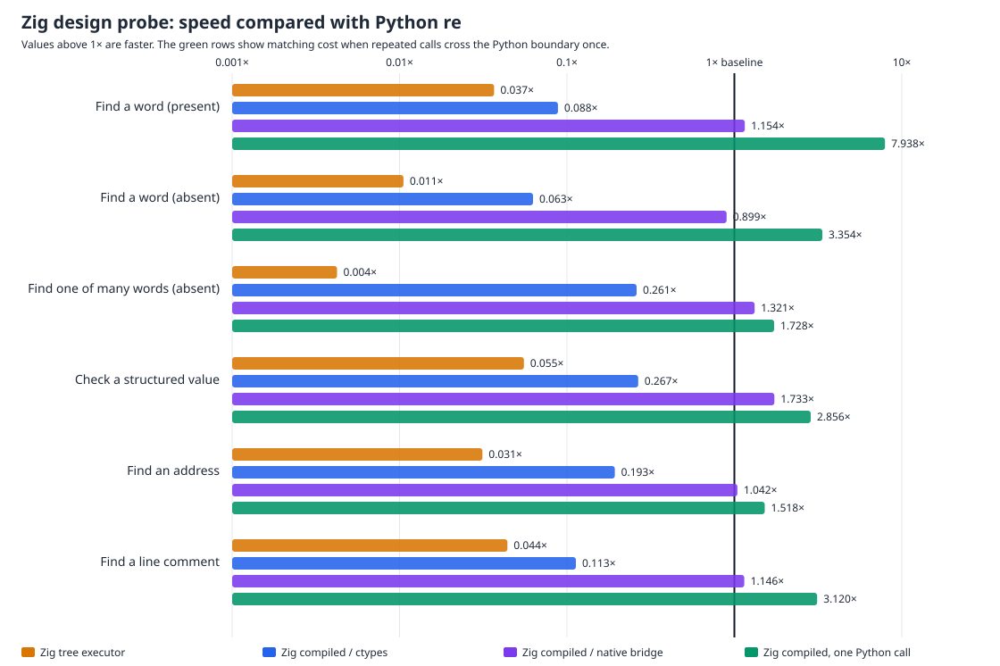

# Zig native-boundary result

The from-scratch Zig bytecode matcher can now cross the Python boundary through a small, dependency-free CPython bridge. On the six fixed tasks it reaches **1.190×** of Python `re` overall and is clearly faster on **5/6** tasks. The previous `ctypes` path reaches **0.143×**: the bridge makes individual Zig calls about **8.35× faster overall** without batching. The one remaining loss is an absent literal (**0.899×**, measured range 0.892–0.905×); it is under the 20% slowdown threshold and is shown, not hidden.



| Task | Zig / ctypes | Zig / native bridge | Zig / one Python call |
| --- | ---: | ---: | ---: |
| Find a word (present) | 0.088× | **1.154×** (1.097–1.270×) | **7.938×** |
| Find a word (absent) | 0.063× | 0.899× (0.892–0.905×) | **3.354×** |
| Find one of many words (absent) | 0.261× | **1.321×** (1.301–1.349×) | **1.728×** |
| Check a structured value | 0.267× | **1.733×** (1.637–1.795×) | **2.856×** |
| Find an address | 0.193× | **1.042×** (1.022–1.061×) | **1.518×** |
| Find a line comment | 0.113× | **1.146×** (1.134–1.159×) | **3.120×** |
| **Overall** | **0.143×** | **1.190×** | **2.922×** |

The bridge accepts ASCII text and contiguous byte buffers directly and returns a normal Python span without allocating `ctypes` objects. It links only the local Zig matcher and the system library, sets a portable `$ORIGIN` runtime path/SONAME, and imports correctly outside the repository. The Zig matcher remains independently implemented; no external regex package is wrapped.

All **8,784/8,784** seeded differential comparisons pass (976 patterns/inputs × search/match/fullmatch × tree/bytecode/native-boundary paths), seed `20260724`. The complete paired run uses 13 alternating trials and 8,000 operations per trial; every timed result is checked. A Zig safety-checked debug build with an AddressSanitizer/UndefinedBehaviorSanitizer bridge passes the same comparisons. Forbidden-engine source markers are zero.

The raw rows and confidence ranges are [zig-native-bridge.json](zig-native-bridge.json), SHA-256 `8c4738ba0a49735129358022dd2fb9f7da63efa6644d3064bf2280dfc6855e7e`; generated chart SHA-256 is `83561699c1908a1cd605aa835a0cb3b5f20c3548b9f4321703f6f5d331ef2c66`. The earlier [Zig probe](ZIG-PROBE.md) and all prior losses remain preserved.

This is an architecture result, **not a correctness-qualified replacement**: capture values, full Unicode, lookarounds/references, replacement/iteration/splitting, and the complete `Pattern`/`Match` surface still need an independent Zig implementation before it can enter the frozen 72-task benchmark.

Reproduce:

```sh
PY=/tmp/rebar-cpython/cpython-3.14.6-linux-x86_64-gnu/bin/python3.14
PYTHON="$PY" sh tools/build_zig_probe.sh
PYTHONPATH=. "$PY" tools/zig_probe.py --output /tmp/zig-native-bridge.json --chart /tmp/zig-native-bridge.svg --trials 13 --operations 8000
```
