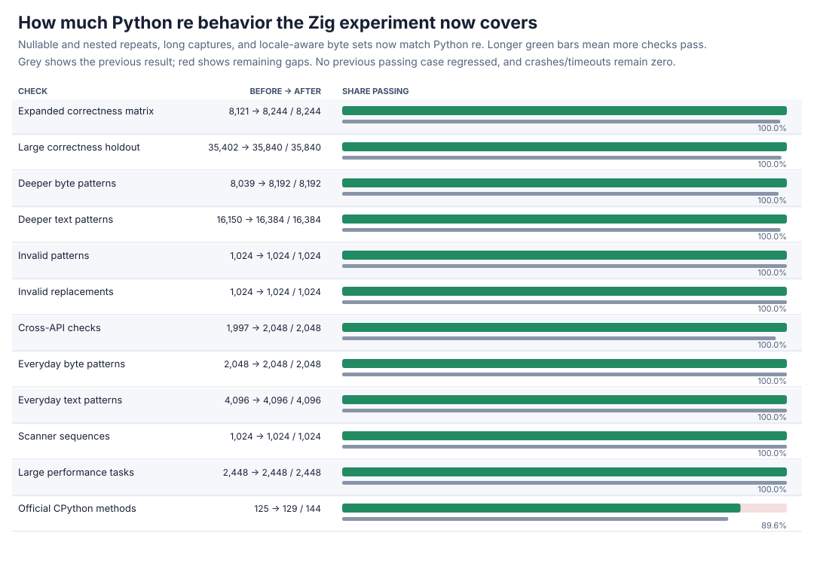
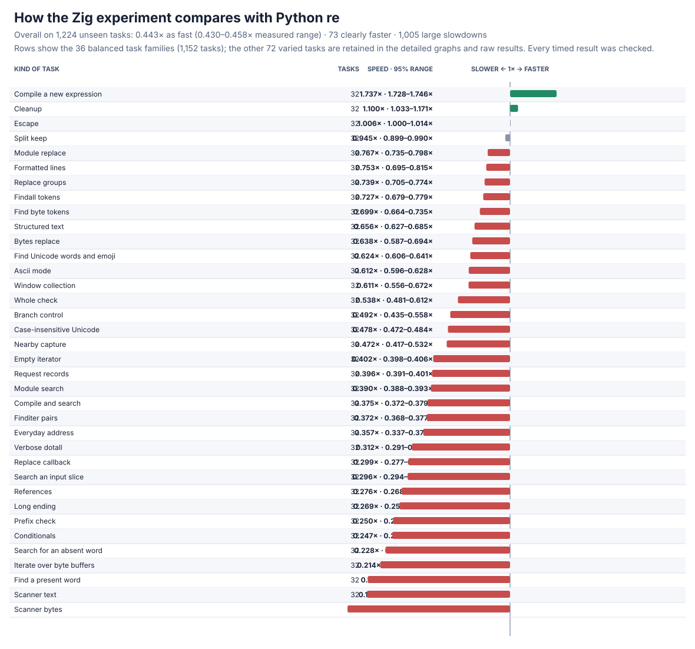
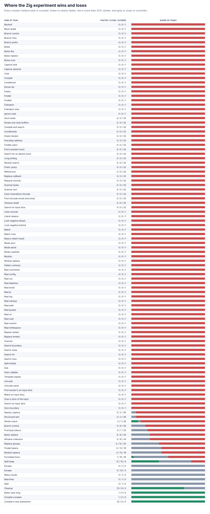

# Zig nullable and long-repeat follow-up

The from-scratch Zig engine now handles empty-capable and nested repeats without looping forever, and long repeated captures without exhausting a fixed work buffer. It also matches Python's locale-aware byte-set behavior. Zig now passes every frozen correctness case and all performance tasks; no previously passing case regressed.





## Headline result

| Frozen check | Before | After | New failures |
| --- | ---: | ---: | ---: |
| Expanded correctness matrix | 8,121/8,244 | **8,244/8,244** | 0 |
| Large correctness holdout | 35,402/35,840 | **35,840/35,840** | 0 |
| Large performance tasks | 2,448/2,448 | **2,448/2,448** | 0 |
| Official CPython methods | 125/144 | **129/144** | 0 |

This fixes all **123** expanded and **438** large-holdout failures, reaching **44,084/44,084** frozen cases. Four official repeat/stack methods newly pass. The remaining **15** official failures are valid patterns that exceed the current parser/compiler limits or use still-unsupported valid syntax; none is a crash or timeout.

The full paired performance rerun covers **1,224 practice + 1,224 unseen holdout tasks**, frozen operation counts, 13 trials, memory, and **63,648** raw rows. Every result is checked before and after timing.

| Task set | Overall speed vs Python `re` | Clearly faster | Large slowdowns |
| --- | ---: | ---: | ---: |
| Practice | 0.418x (0.404--0.432x) | 75/1,224 | 1,026/1,224 |
| Holdout | **0.443x (0.430--0.458x)** | **73/1,224** | **1,005/1,224** |
| All | 0.430x (0.420--0.441x) | 148/2,448 | 2,031/2,448 |

The complete engine is slower than the previous **0.459x** holdout result while gaining full frozen correctness. Cold compilation remains a win (**1.88x** for complex patterns, **1.74x** for long patterns); long-byte token collection, negative-lookahead searches, references, scanners, and short searches remain costly. The capture-returning core is **2.07x** overall on eight tasks, with seven faster and alternative search the sole loss. Every loss remains visible below and in the raw results.

## Correctness control and design

The new differential probe passes **16,589/16,589** comparisons across 25 fixed examples, five 50,000-character cases, and **16,384** seeded cases. It covers greedy/lazy/possessive and bounded repeats, nested empty alternatives, captures, lookaround, text, bytes, Unicode, locale mode, and search, match, fullmatch, findall, finditer, split, replacement, and scanners. Before the change, four of five long cases exhaust the fixed executor buffers. Existing lookbehind, error, scoped-flag, full-plane Unicode, span, and capture controls pass **16,528**, **18,298**, **16,552**, **8,781**, **8,874**, and **5,214** checks. Debug plus address/undefined-behavior checks pass all focused controls with zero findings.

The compiler marks an unbounded repeat when its body can match an empty string. During execution, a small progress record prevents a repeat from taking the same empty step twice, and an undo record restores that progress when the matcher backtracks. This restoration is essential: a lazy captured repeat can otherwise lose a valid earlier choice or hang. The ordinary backtracking state stays compact; progress checkpoints live in a parallel stack used only by nullable loops. Backtracking, capture-undo, and progress storage start in stack-backed buffers and grow by doubling only when necessary, safely handling long captures without a fixed ceiling.

The final large-holdout mismatch exposed a CPython-specific byte/locale rule: with case-insensitive locale matching, a negated set containing multiple items tests the negation before the upper/lower alternatives, unlike a single negated literal. Zig records whether a set has multiple items and reproduces that behavior directly. It does not call or wrap Python's matcher or any external regular-expression package.

Three correctness-gated full runs and three shorter pilots are retained. An inline progress-state layout reaches **0.442x** holdout speed, a compile-time-specialized normal/guarded executor reaches **0.439x**, and the simpler parallel-checkpoint layout reaches **0.443x** and is kept. Specialization adds complexity without a measured benefit. Each full run contains **63,648** rows; each pilot contains **24,480** rows.

## Detailed graphs




All legacy and generated task families appear in the detailed graphs. Process high-water marks, every confidence range, and every regression remain in the raw data; denominators are unchanged.

## Evidence and reproduction

The chosen full result is [raw rows](zig-nullable-v4-raw.jsonl.gz) and [summary](zig-nullable-v4-summary.json). The two rejected full runs are [inline-state rows](zig-nullable-first-v4-raw.jsonl.gz), [inline-state summary](zig-nullable-first-v4-summary.json), [specialized rows](zig-nullable-specialized-v4-raw.jsonl.gz), and [specialized summary](zig-nullable-specialized-v4-summary.json). The shorter runs are [parallel-checkpoint rows](zig-nullable-marks-pilot-raw.jsonl.gz), [parallel-checkpoint summary](zig-nullable-marks-pilot-summary.json), [guarded rows](zig-nullable-guarded-pilot-raw.jsonl.gz), [guarded summary](zig-nullable-guarded-pilot-summary.json), [specialized rows](zig-nullable-specialized-pilot-raw.jsonl.gz), and [specialized summary](zig-nullable-specialized-pilot-summary.json).

Correctness results are [expanded](zig-nullable-v2-after.json.gz), [large holdout](zig-nullable-v3-after.json.gz), [intermediate locale failure](zig-nullable-v3-intermediate.json.gz), [performance qualification](zig-nullable-perf-v4-after.json), and [official](zig-nullable-upstream-after.json). Focused/safety evidence is [long cases before](zig-nullable-long-before.json), [focused](zig-nullable-focused.json), [lookbehind](zig-nullable-lookbehind.json), [errors](zig-nullable-errors.json), [scoped](zig-nullable-flags.json), [Unicode](zig-nullable-unicode.json), [span](zig-nullable-span.json), [capture](zig-nullable-capture.json), [instrumented focused](zig-nullable-sanitized-focused.json), [instrumented lookbehind](zig-nullable-sanitized-lookbehind.json), [instrumented errors](zig-nullable-sanitized-errors.json), [instrumented scoped](zig-nullable-sanitized-flags.json), [instrumented Unicode](zig-nullable-sanitized-unicode.json), [instrumented span](zig-nullable-sanitized-span.json), and [instrumented capture](zig-nullable-sanitized-capture.json).

Reproduce with:

```sh
PY=/tmp/rebar-cpython/cpython-3.14.6-linux-x86_64-gnu/bin/python3.14
PYTHON="$PY" sh tools/build_zig_probe.sh
PYTHONPATH=. "$PY" tools/zig_nullable_repeat_probe.py --output /tmp/zig-nullable.json --seeded-cases 16384 --long-length 50000
PYTHONPATH=. "$PY" tools/perf_v4.py verify --module candidates.zig_candidate --output /tmp/zig-performance-check.json
PYTHONPATH=. "$PY" tools/zig_perf_v4_pilot.py --raw /tmp/zig-performance.jsonl --output /tmp/zig-performance.json --chart /tmp/zig-speed.svg --memory-chart /tmp/zig-memory.svg --regression-chart /tmp/zig-regressions.svg --trials 13 --bootstraps 5000
```

The new probe is [tools/zig_nullable_repeat_probe.py](../../tools/zig_nullable_repeat_probe.py). Static/import and linkage audits report zero forbidden markers or blocked attempts; production links only the local Zig engine and the C runtime.
