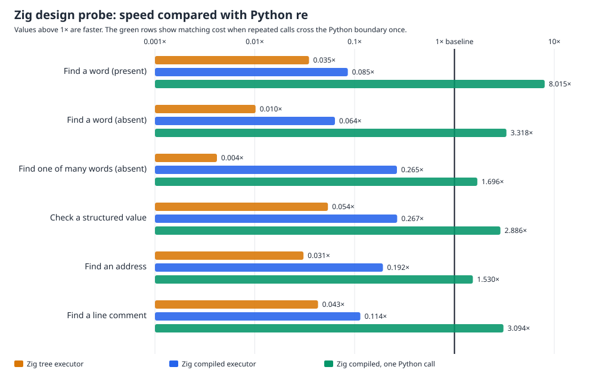

# From-scratch Zig architecture probe

This is a bounded experiment in building a faster Python `re`. It does **not** wrap an existing regex package: the Zig source implements its own parser, character sets, alternatives, anchors, greedy/lazy repeats, executors, and C-callable boundary. The resulting library links only `malloc`, `free`, `memcpy`, and `memset` from the system library.

Two executors were compared on the same patterns:

- **Tree executor:** walks the parsed expression and collects every possible ending position. This is simple, but repeatedly creates and scans large temporary lists.
- **Compiled executor:** turns the expression into small instructions, uses an explicit backtracking stack, and skips impossible starts using general one- and two-character tables. This is much cheaper and avoids recursive matching.

The six paired tasks use 13 alternating trials and 8,000 operations per trial. “One Python call” runs the same compiled matcher repeatedly after crossing the boundary once; it isolates matching cost and is not an end-to-end API claim.



| Task | Tree executor | Compiled, one call per match | Compiled, one Python call |
| --- | ---: | ---: | ---: |
| Find a word (present) | 0.035× | 0.085× | **8.01×** (7.80–8.20×) |
| Find a word (absent) | 0.010× | 0.064× | **3.32×** (3.31–3.33×) |
| Find one of many words (absent) | 0.004× | 0.265× | **1.70×** (1.66–1.75×) |
| Check a structured value | 0.054× | 0.267× | **2.89×** (2.87–2.90×) |
| Find an address | 0.031× | 0.192× | **1.53×** (1.51–1.57×) |
| Find a line comment | 0.043× | 0.114× | **3.09×** (3.07–3.12×) |
| **Overall** | **0.022×** | **0.143×** | **2.92×** |

Individual compiled calls take roughly **1.9–2.3 µs** even when matching itself takes tens or hundreds of nanoseconds. The Python/FFI boundary therefore overwhelms these short calls. The general two-character filter is useful: on the difficult absent-alternatives task it reduces compiled matching from roughly **957 ns to 274–354 ns**, making that workload faster than stdlib when batched. The tree executor is rejected.

The fixed-capacity prototype allocates **242,320 bytes per compiled pattern**, including both executors and their tables. This is intentionally simple and is not representative of a production-sized compiled object.

## Correctness and scope

Both executors pass **5,856/5,856** deterministic span comparisons (976 patterns/inputs × search, match, and fullmatch × two executors), seed `20260724`. Checks cover text and bytes, start/end windows, ASCII classes/categories, case/multiline/dot modes, groups, alternatives, bounded and unbounded repeats, greedy/lazy behavior, anchors, empty alternatives, and newline escapes. An optimized build and a Zig safety-checked debug build both pass. Every timed result is checked against the pinned CPython baseline.

This is **NOT a qualified replacement candidate**. Captured groups are parsed but discarded; full Unicode semantics, word boundaries, lookarounds, backreferences/conditionals, atomic/possessive behavior, large or nullable repeats, replacements/splitting/iteration, error compatibility, and the public `Pattern`/`Match` API are not implemented. No drop-in claim is made.

The final paired rows and confidence intervals are in [zig-probe.json](zig-probe.json), SHA-256 `6466b9902a2195a705f1dc3b71b0cedb941575858a13d846a17100871c7e57c8`. Intermediate results are preserved in [tree initial](zig-tree-initial.json), [compiled pilot](zig-bytecode-pilot.json), [tree/compiled comparison](zig-compiled-pilot.json), and [two-character pilot](zig-two-character-pilot.json).

Reproduce with the pinned interpreter and the downloaded Zig 0.16 toolchain:

```sh
PY=/tmp/rebar-cpython/cpython-3.14.6-linux-x86_64-gnu/bin/python3.14
sh tools/build_zig_probe.sh
PYTHONPATH=. "$PY" tools/zig_probe.py \
  --output /tmp/zig-probe.json --chart /tmp/zig-probe-speed.svg
```
