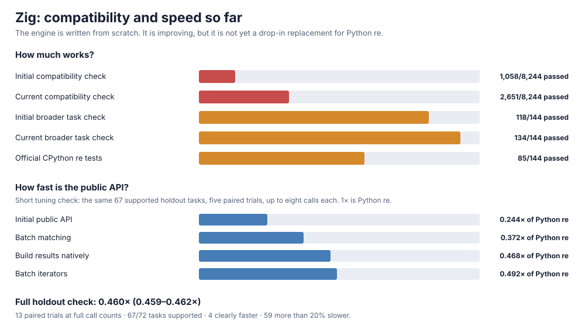
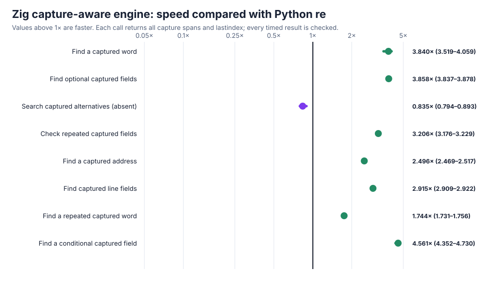
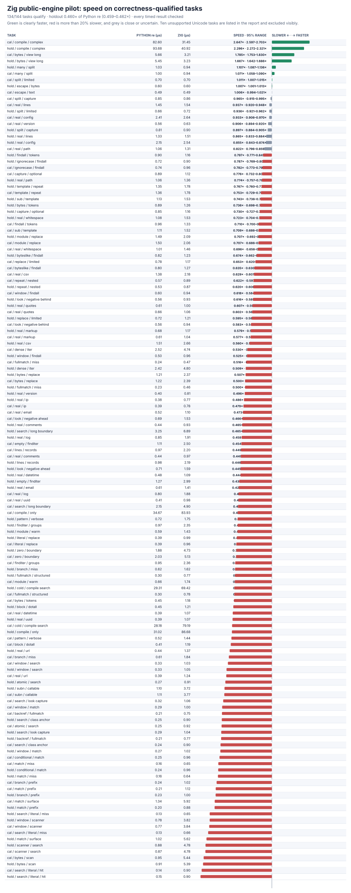

# From-scratch Zig engine: references, public API, and broader holdout

Zig now has its own parser, compiler, and backtracking executor, including captures, named and numbered references, conditionals, lookaround, atomic groups, possessive repeats, common escapes, and ASCII matching. A small CPython bridge returns complete results without repeatedly crossing the language boundary. It does not use CPython's regex engine or wrap another regex package.

This is an architecture result, **not a drop-in claim**. Full Unicode, scoped flags, exact pattern errors, and difficult repeat/resource cases remain incomplete.



## Compatibility

The frozen **8,244-case** compatibility check improves from **1,058** to **2,651** passes (**+1,593**), with all failures retained in [initial](zig-p0-initial.json) and [current](zig-p0-current.json). The broader frozen performance-fixture check improves from **118/144** to **134/144**, with the [initial](zig-performance-initial.json) and [current](zig-performance-current.json) records preserved. The ten remaining performance cases all exercise Unicode.

The official vendored CPython `re` suite passes **85/144** runnable methods, with **59** failures, **zero** crashes, and **zero** timeouts; [the complete record](zig-upstream-current.json) retains every result. The run found a real stack overflow while compiling a 256-byte escaped literal. Large recursive two-character-prefix analysis is now disabled safely, the exact upstream test passes, and Debug plus address/undefined-behavior checks complete cleanly.

Focused seeded checks compare every span, group, and reference against pinned CPython:

- **8,874/8,874** span checks and **5,214/5,214** capture/reference checks pass in both optimized and instrumented builds;
- empty-match retry, optional/repeated captures, named/numbered references, group conditionals, lookaround, word boundaries, mutable buffers, `findall`, `split`, replacement, iterators, and scanners have direct controls;
- static/import-time delegation checks are clean and the bridge links only the local Zig library and libc.

The matching-core benchmark returns every capture span and checks the result before timing. On eight paired tasks it reaches **2.631×** overall, is clearly faster on **7/8**, and exposes one slower alternative-heavy case. All rows and ranges are in [zig-references.json](zig-references.json).



## Broader end-to-end holdout

The public API is much more demanding than returning spans. The correctness-gated run covers **134/144** tasks, uses the full frozen call counts, **13** paired trials and **5,000** resamples, checks all **3,752** results around timing, and preserves **3,484** raw rows. Unsupported cases are listed explicitly and are never timed.

| Task set | Overall speed vs Python `re` | 95% range | Clearly faster | Large slowdowns |
| --- | ---: | ---: | ---: | ---: |
| Tuning | 0.463× | 0.461–0.465× | 4/67 | 57/67 |
| Holdout | **0.460×** | **0.459–0.462×** | **4/67** | **59/67** |
| All supported | 0.462× | 0.460–0.463× | 8/134 | 116/134 |

The detailed chart shows every task, time, and measured range. Green is clearly faster, red is more than 20% slower, and grey is close or uncertain.



Batching matching, constructing `findall`/`split`/replacement output natively, reusing validated templates, and batching immutable iterators roughly doubles the short-pilot holdout result from **0.244×** to **0.492×**. The raw [initial](zig-holdout-initial.json), [batched-match](zig-holdout-batched.json), [native-output](zig-holdout-output.json), and [iterator](zig-holdout-iterator.json) controls are retained. Collection-heavy cases improve **4–12×**. The full final run is [zig-holdout-pilot.json](zig-holdout-pilot.json).

The largest remaining losses are short public calls and APIs that construct many Python `Match` objects: literal search, scanners, and match-surface access. This explains why the small native matching core can be faster while the full API remains slower. Zig is preserved for further work and excluded from the correctness-qualified headline ranking.

## Reproduce

```sh
PY=/tmp/rebar-cpython/cpython-3.14.6-linux-x86_64-gnu/bin/python3.14
PYTHON="$PY" sh tools/build_zig_probe.sh
PYTHONPATH=. "$PY" tools/zig_probe.py --output /tmp/zig-span.json --verify-only
PYTHONPATH=. "$PY" tools/zig_capture_probe.py --output /tmp/zig-reference.json --chart /tmp/zig-reference.svg --trials 13 --operations 8000
PYTHONPATH=. "$PY" tools/oracle_v2.py verify --module candidates.zig_candidate --output /tmp/zig-p0.json
PYTHONPATH=. "$PY" tools/perf_v3.py verify --module candidates.zig_candidate --output /tmp/zig-performance.json
PYTHONPATH=. "$PY" tools/zig_holdout_pilot.py --output /tmp/zig-holdout.json --chart /tmp/zig-holdout.svg --trials 13 --max-ops 320 --bootstraps 5000
PYTHONPATH=. "$PY" tools/cpython_re_oracle.py verify --module candidates.zig_candidate --output /tmp/zig-upstream.json
```
